# sklearn 教学

## 一、Anaconda 下载&安装

### 卸载 python

_在安装 Anaconda 之前，需要先卸载已有的 python_

1. **验证安装**

   在命令提示窗口中输入 `python --version`，若出现版本号，则说明已经安装了 python，需要先卸载

2. **卸载 Python**

   在开始菜单中搜索 **控制面板**，然后点击 **程序**，然后点击 **卸载或更改程序**。找到（可以直接**搜索 python**）并点击 Python 3.x，然后点击 **卸载**

3. **删除环境变量**

   将安装 python 的变量全部删除，如图中两个值，都选中，然后点击删除，再确定（如果卸载完 python 的时候环境变量自动删掉了就不用管）

   在退出时，**一路点击"确定"按钮**，不要直接叉掉，否则并没有保存设置。

   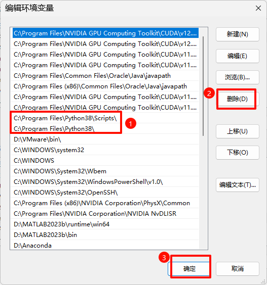

### 下载 Anaconda

https://repo.anaconda.com/archive/

下载 **Anaconda3-2022.10-Windows-x86_64.exe** 即可，下载后点击 exe 文件，进入安装界面

### 安装 Anaconda

一路点击 Next，安装位置自定义

请选择 Register Anaconda as my default Python 3.x，不要选 Add Anaconda to my PATH environment variable，我们需要后期手动添加环境变量。

点击 Install，安装需要等待一会儿。

最后一直 Next，直到安装完成。


### 配置环境变量

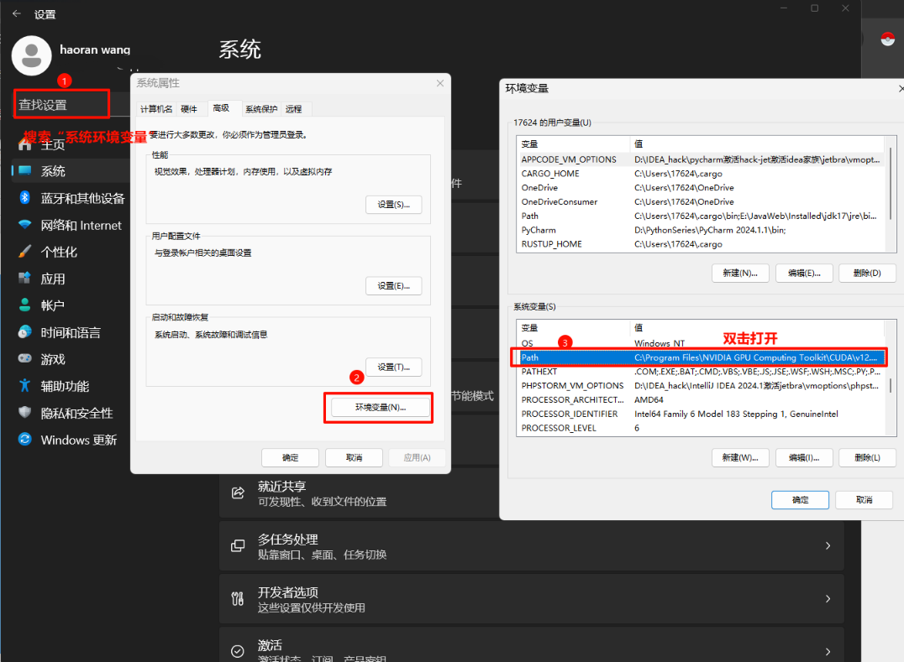
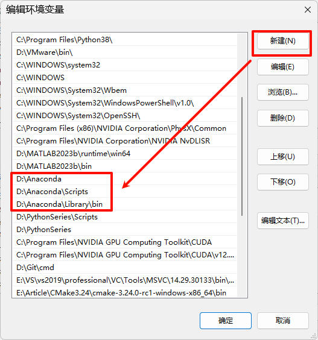

### 验证 Anaconda 和 python 安装

_win+R 输入 cmd，打开命令行工具_

```bash
conda --version
python --version
```

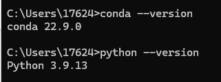

## 二、配置镜像源

### 方法一

- 配置清华镜像源

```bash
conda config --add channels https://mirrors.tuna.tsinghua.edu.cn/anaconda/pkgs/main/
conda config --add channels https://mirrors.tuna.tsinghua.edu.cn/anaconda/pkgs/free/
conda config --set show_channel_urls yes
```

_Conda 会从上到下搜索包_

- 移除镜像源

```bash
conda config --remove channels https://mirrors.tuna.tsinghua.edu.cn/anaconda/cloud/msys2/
```

- 验证配置

```bash
conda config --show channels
```

### 方法二 （推荐）

https://pypi.tuna.tsinghua.edu.cn/simple/

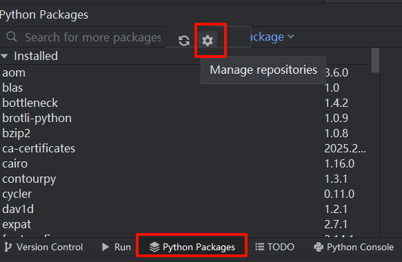
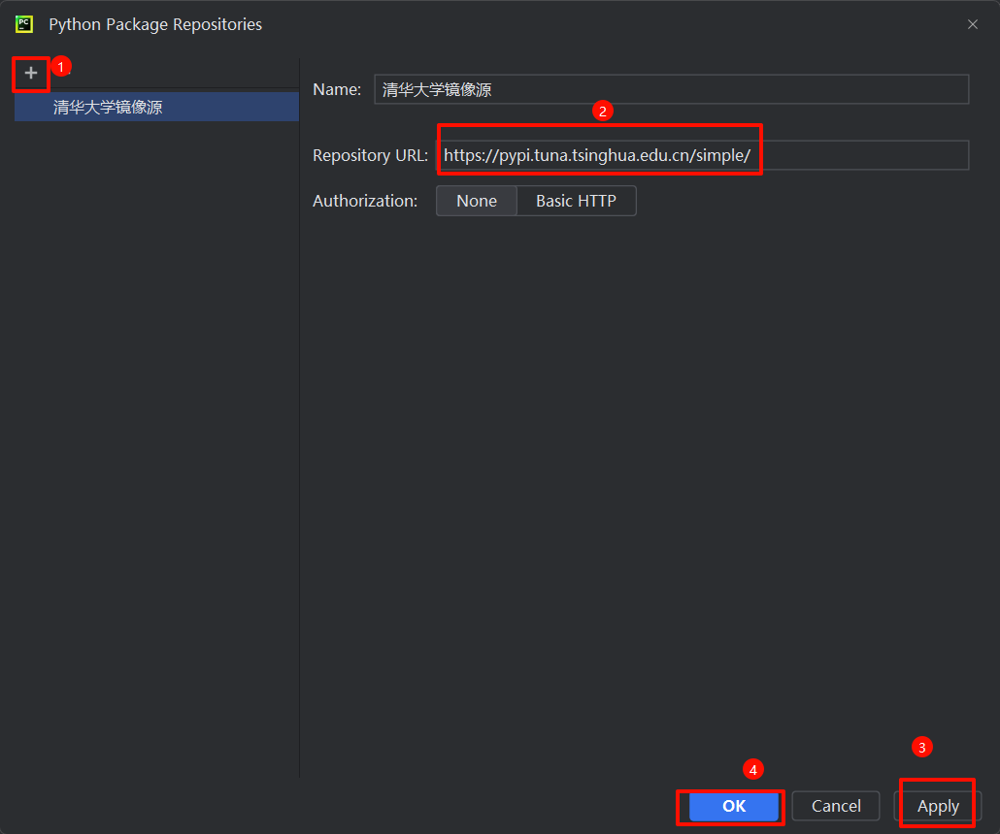

## 三、虚拟环境

- **创建虚拟环境**

  python=3.10

  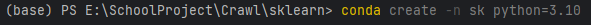

- **查看所有虚拟环境及其路径**

```bash
conda info --envs
```

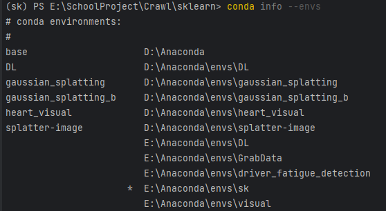

_记住自己的环境路径_

- **激活虚拟环境**

```bash
conda activate xxx
```

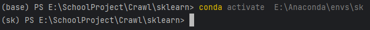

## 四、下载 sk-learn

**使用 Conda 指令**

```bash
conda install scikit-learn
```

### 验证安装

**查看当前环境下的所有包**

```bash
conda list
```

**查看当前环境下的特定包**

```bash
conda list | findstr xx
```

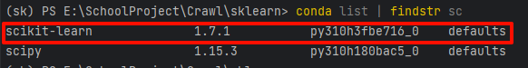

## 五、加载环境

### 选择添加本地环境

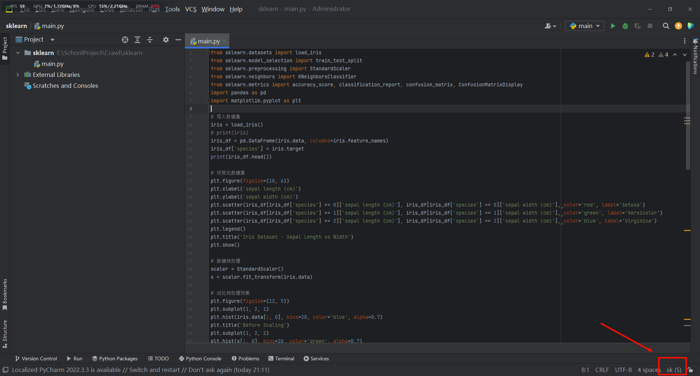
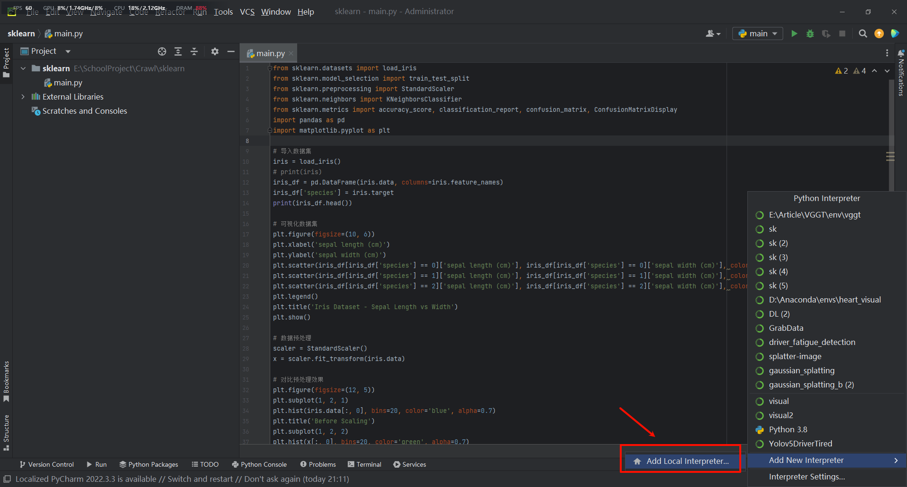
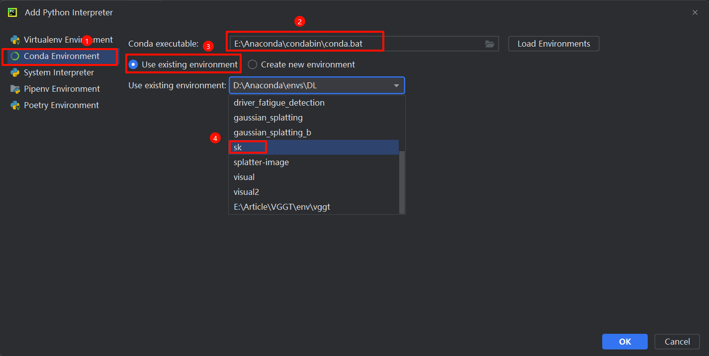

## Conda 常用命令

### 虚拟环境

- 创建虚拟环境

```bash
conda create -n <环境名> python=<py版本>
--prefix=<路径名>
```

- 激活虚拟环境

```bash
conda activate <环境名>
```

- 退出虚拟环境

```bash
conda deactivate
```

- 删除虚拟环境

```bash
conda remove -n <环境名> --all
conda remove -p <路径名> --all
```

- 查看虚拟环境

```bash
conda info --envs
```

### 镜像源

- 添加镜像源

```bash
conda config --add channels <镜像源URL>
```

- 删除镜像源

```bash
# 删除单个
conda config --remove <镜像源URL>
```

```bash
# 删除所有
conda config --remove-key channels
```

- 查看镜像源

```bash
conda config --show channels
```

### 第三方库

- 下载第三方库

```bash
conda install <包名>[=版本号]
```

- 删除第三方库

```bash
conda uninstall <包名>
```

- 查看第三方库

```bash
conda list
```

### 版本控制

- 查看所有历史版本

```bash
conda list --revisions
```

- 回滚

```bash
conda install --revision <版本号>
```

### 环境迁移

- 环境导出

```bash
conda env export > environment.yaml
```

- 环境导入

```bash
conda env create -f environment.yaml
```

## sklearn 简介

_官方说明文档 https://scikit-learn.org/stable/index.html_

### 补充知识

#### 1. 监督学习 vs 无监督学习

- **监督学习(Supervised Learning)**：数据集的样本都有对应的标签，模型通过学习样本和标签之间的对应关系，进而对未知数据进行预测。
- **无监督学习 (Unsupervised Learning)**：从没有标签的数据中发现隐藏的模式或结构

#### 2. 参数 vs 超参数

- **参数（Parameters）**：模型中可被学习和调整的参数，通过通过训练数据来自动学习。
- **超参数（Hyperparameters）**：手动设置的参数，用于控制模型的行为和性能，超参数的选择和优化对模型性能有重要影响。例如损失函数、优化器、学习率等。

#### 3. 训练集、测试集和验证集

- **训练集（train）**：用于训练模型，确定模型参数
- **测试集（test）**：用于评估模型，测试模型在新数据上的表现 _（注：不可在训练时使用测试集，否则会使评价虚高）_
- **验证集（validation）**：用于确定模型的超参数，从一些超参数中，找到最优的超参数组合，这里的最优指的是在验证集上表现最优的超参数。比如在 KNN 算法中，k 值就是一个超参数，可以使用验证集来求出误差率最小的 k。

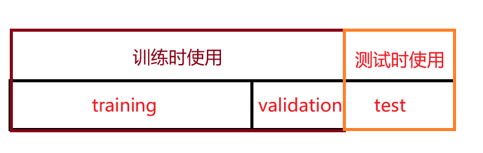

train：validation：test = 6：2：2 或 8：1：1 或 其他

#### 4. 交叉验证

- 在训练集和验证集上交叉验证。把训练集均分成 k 份，每次取其中一份作为验证集，其余为训练集。运行 k 次后，当每一份数据都作为验证集评估过该超参数后，交叉验证停止，总误差等于所有 k 次运行的误差之和（或取平均），选取最小误差对应的一组超参数组合。这种方法称为 K 折交叉验证，保证了所有的数据都参与了训练和验证。
- 留一交叉验证：当样本数量很小(比如小于 50)时，可令 K=N，N 为训练样本总数。

#### 5. 网格搜索

- 遍历所有超参数组合，选择最优的一组超参数

#### 6. 过拟合 vs 欠拟合

- **过拟合（overfitting）**：模型在训练集上表现很好，但在测试集上却表现很差，模型复杂度过高
- **欠拟合（underfitting）**：模型在训练集上表现较差，模型复杂度过低

_泛化能力：模型在没见过的数据集上的表现能力_

**如何防止过拟合：**

1. **从数据和模型本身入手**：降低模型复杂度 or 增加数据的量（在原有数据上创造新数据 or 收集数据）

2. **从训练过程入手，抑制参数过分调整**：提前终止训练 or 正则化。

   正则化的意义：参数调整带来的效果微小时，则过滤

   正则化公式：$Loss_{new}=Loss_{old}+\lambda\sum_{i=1}^n f(w_i)$， 其中$\sum_{i=1}^n f(w_i)$称为"惩罚项",$\lambda$称为"正则化系数"，是控制惩罚项力度的超参数。

   - 当$f(w_i)=|w_i|时，称为L1正则化$
   - 当$f(w_i)=w_i^2时，称为L2正则化$

3. **Dropout**：在训练过程中每次随机丢掉一部分参数，让少量影响力强的参数偶尔"缺席"，使得模型学会依赖其他的普通参数，防止"我和马云的平均收入大于 100 万"的现象。

#### 7. 特征数据 & 标签数据

- 用元组（X,y）表示，X 是特征数据，y 是标签数据，体现了 X 到 y 的映射关系。
- **样本矩阵 X**：X 的大小通常为(n_samples, n_features)，这意味着样本表示为行，特征表示为列。

  ```
  X = [[1,  2,  3],
       [11, 12, 13]]
  ```

- **目标值 y**：是用于回归任务的真实数字，或者是用于分类的整数（或任何其他离散值）。对于无监督学习，y 无需指定。y 通常是 1d 数组，其中 i 对应于目标 X 的 第 i 个样本（行）。

  ```
  y = [0, 1]
  ```

- 对于分类任务来说，y 必须是离散的；对于回归，y 是连续的。

#### 8. 特征提取

由原始数据创建新的特征集。

#### 9. 规范化

又称为"标准化"，消除量纲影响，避免较大值域较大的变量左右计算结果

### sklearn 的主要功能

#### 1. 分类（Classification）

识别数据类别并预测新的数据点属于哪个类别。

- **应用**：垃圾邮件检测、图像识别。
- **算法**：决策树、神经网络、支持向量机、朴素贝叶斯、随机森林、逻辑回归等。

#### 2. 回归（Regression）

预测目标变量的值。

- **应用**：预测房价、药物反应、股票价格。
- **算法**：梯度提升、最近邻、随机森林、岭回归等。

#### 3. 聚类（Clustering）

自动将相似数据分组。

- **应用**：客户群体划分。
- **算法**：k-Means、HDBSCAN、层次聚类等。

#### 4. 降维（Dimensionality reduction）

降低数据维度以便于可视化或减少计算量

- **应用**：可视化，提高效率。
- **算法**：PCA、特征选择、非负矩阵分解等

#### 5. 模型选择（Model selection）

比较、验证和选择参数和模型。

- **应用**：通过参数调整提高准确性。
- **算法**：网格搜索、交叉验证、指标等。

#### 6. 预处理（Preprocessing）

数据特征提取和归一化。

- **应用**：将文本等输入数据转换为机器学习算法可使用的形式。
- **算法**：预处理、特征提取等。

_分类和聚类的区别：_

- **分类**是有监督的机器学习算法，已知划分类别的规则
- **聚类**是无监督的机器学习算法，类是未知的

**举例：**

- 根据性别将学生分为男生和女生，在划分前已知"男"、"女"这两个类别 → 分类
- 根据学生经常去的场所划分 n 个类别，事先不知道，只有当算法运行后我们才能把类别分出来：图书馆、教室、体育场等 → 聚类

### sklearn 的公共数据集

通过 sklearn 的 API 调用数据集

```python
from sklearn.datasets import load_数据集名称
```

#### 1. 分类数据集

_分类数据集中包含 data 和 target，分别是特征数据和标签数据_

- 鸢尾花数据集 (load_iris)
- 手写数字数据集 (load_digits)

#### 2. 回归数据集

- 波士顿房价数据集 (load_boston)
- 糖尿病数据集 (load_diabetes)

#### 3. 其他数据集

- 葡萄酒数据集 (load_wine)

## 使用 sklearn

### KNN 算法思想

_算法性质：K-近邻算法是一种有监督学习、分类（也可用于回归）算法_

KNN 算法是 k-Nearest Neighbor Classification 的简称，也就是 k 近邻分类算法。基本思路是把每个样例看作 n 维空间中的一个点，其中 n 时样本特征数，在 n 维空间中查找 k 个最相似或者距离最近的样本，然后根据 k 个最相似的样本对未知样本进行分类。基本步骤为：

1. 计算已知样本空间(训练集)中所有点与未知样本的距离；
2. 对所有距离按升序排列；
3. 确定并选取与未知样本距离最小的 k 个样本或点；
4. 统计选取的 k 个点所属类别的出现频率；
5. 把出现频率最高的类别作为预测结果，即未知样本所属类别。

#### 补充说明

**1. 距离如何计算？**

距离计算的专业术语叫"邻近性度量"，度量前需保证特征值域相同。KNN 的距离计算依赖于闵可夫斯基距离，调用 API 时默认 p=2，即使用欧几里得距离（Euclidean distance）度量邻近性。

闵氏距离不是一种距离，而是一组距离的定义，是对多个距离度量公式的概括性的表述。

两个 n 维变量 **$a=(x_1,x_2,……,x_n)$,$b=(y_1,y_2,……,y_n)$** 间的闵可夫斯基距离定义为：

$$d(\mathbf{x}, \mathbf{y}) = \left( \sum_{i=1}^n |x_i - y_i|^p \right)^{1/p}$$

其中 p 是一个变参数：

- 当 p=1 时，就是曼哈顿距离；
- 当 p=2 时，就是欧氏距离；
- 当 p→∞ 时，就是切比雪夫距离。

根据 p 的不同，闵氏距离可以表示某一类/种的距离。

_关于距离度量，详见https://docs.codax.site/ml/sklearn/knn/distance.html_

**2. 目标范围内类别数相等怎么办？**

随机选取一个类标号来分类该点

**举例：** 当 k=5 时，则 KNN 算法会取距离目标最近的 5 个样本，若这 5 个样本中属于 A 类别的占比最大，则目标属于类别 A

### 示例

_以鸢尾花数据集为例_

#### 鸢尾花数据集

1. **样本数量**：150 个（3 类各 50 个）
2. **特征数量**：4 个数值特征
3. **目标类别**：3 种鸢尾花品种
4. **特征单位**：厘米(cm)

#### 数据集内容

**四个特征：**

- 花萼长度 (sepal length)
- 花萼宽度 (sepal width)
- 花瓣长度 (petal length)
- 花瓣宽度 (petal width)

**三个目标类别：**

- 山鸢尾(Iris setosa)
- 变色鸢尾 (Iris versicolor)
- 维吉尼亚鸢尾 (Iris virginica)

### 数据预处理

#### 1. 数据分割

调用 sklearn 自带的方法 `train_test_split(X,y)` 将原始数据集分割为训练集和测试集

- **X**：特征数据 → 样本矩阵 X。X 的大小通常为(n_samples, n_features)，这意味着样本表示为行，特征表示为列。
- **y**：标签数据 → 通常是一维数组，每一个标签对应一个样本，表示该样本所属类别，（_注：不接收字符串，需要将类别映射为数字_）对于无监督学习，y 无需指定。
- **train**：训练集 → 用于训练 model
- **test**：测试集 → 用于测试 model

#### 2. 特征预处理

通常我们获得的数据都是不完美的，需要进行数据预处理，一般使用以下方法：

- **特征工程（Feature Engineering）**：特征工程是指从原始数据中提取有用的特征，并将其转换为适合机器学习算法的形式。
- **数据清洗（Data Cleaning）**：数据清洗是指对数据进行检查、修复、过滤、转换等操作，以确保数据质量。
- **数据转换（Data Transformation）**：数据转换是指对数据进行变换，以便更好地适应机器学习算法。
- **数据集成（Data Integration）**：数据集成是指将不同来源的数据进行整合，以便更好地训练模型。

### 模型选取与模型调参

_模型调参依据经验或实验_

#### 1. 选取 KNN 作为分类模型

```python
sklearn.neighbors.KNeighborsClassifier()
```

具体参考官方 API 手册 https://scikit-learn.org.cn/view/695.html

- **n_neighbors**：用于分类时考虑的邻居数量（默认值=5）
- **weights**：邻居投票权重策略，可选 'uniform'、'distance' 或可调用函数（默认值='uniform'）
- **algorithm**：近邻搜索算法，可选 'auto'、'ball_tree'、'kd_tree'、'brute'（默认值='auto'）
- **leaf_size**：构建 BallTree/KDTree 时的叶子大小，影响构建与查询速度（默认值=30）
- **p**：Minkowski 距离的幂指数，p=1 为曼哈顿距离，p=2 为欧氏距离（默认值=2）
- **metric**：距离度量方式，常用 'minkowski'、'euclidean'、'manhattan'、'chebyshev'、'hamming' 等（默认值='minkowski'）
- **metric_params**：传给距离度量的附加参数字典（默认值=None）
- **n_jobs**：并行任务数，None 表示 1，-1 表示使用所有 CPU（默认值=None）

#### 2. 采用交叉验证+网格搜索的方式选取最优超参数组合

### 模型训练

调用 API 在训练集上完成模型训练

### 模型评估

我们可以通过一些指标来评估模型的性能，常用的指标有：

- **准确率（Accuracy）**：正确分类的样本数与总样本数的比值。
- **精确率（Precision）**：正确分类为正的样本数与所有正样本数的比值。
- **召回率（Recall）**：正确分类为正的样本数与所有样本中正样本的比值。
- **F1 值（F1 Score）**：精确率和召回率的调和平均值。
- **混淆矩阵（Confusion Matrix）**：用于描述分类结果的矩阵。

## KNN 鸢尾花代码

### 基础数据加载和分割

```python
from sklearn.datasets import load_iris
from sklearn.model_selection import train_test_split, GridSearchCV

# 1.加载数据集 - 获取数据
iris = load_iris()
X, y = iris.data, iris.target
# 2.数据基本处理
x_train, x_test, y_train, y_test = train_test_split(X, y, test_size=0.2, random_state=22)

print(len(iris.data),len(iris.target))
print(f"特征数据：\n{iris.data}\n标签数据：\n{iris.target}")
```

输出结果：

```
150 150
特征数据：
[[5.1 3.5 1.4 0.2]
 [4.9 3.  1.4 0.2]
 [4.7 3.2 1.3 0.2]
 [4.6 3.1 1.5 0.2]
 [5.  3.6 1.4 0.2]
 [5.4 3.9 1.7 0.4]
 [4.6 3.4 1.4 0.3]
 [5.  3.4 1.5 0.2]
 [4.4 2.9 1.4 0.2]
 [4.9 3.1 1.5 0.1]
 [5.4 3.7 1.5 0.2]
 [4.8 3.4 1.6 0.2]
 [4.8 3.  1.4 0.1]
 [4.3 3.  1.1 0.1]
 [5.8 4.  1.2 0.2]
 [5.7 4.4 1.5 0.4]
 [5.4 3.9 1.3 0.4]
 [5.1 3.5 1.4 0.3]
 [5.7 3.8 1.7 0.3]
 [5.1 3.8 1.5 0.3]
 [5.4 3.4 1.7 0.2]
 [5.1 3.7 1.5 0.4]
 [4.6 3.6 1.  0.2]
 [5.1 3.3 1.7 0.5]
 [4.8 3.4 1.9 0.2]
 [5.  3.  1.6 0.2]
 [5.  3.4 1.6 0.4]
 [5.2 3.5 1.5 0.2]
 [5.2 3.4 1.4 0.2]
 [4.7 3.2 1.6 0.2]
 [4.8 3.1 1.6 0.2]
 [5.4 3.4 1.5 0.4]
 [5.2 4.1 1.5 0.1]
 [5.5 4.2 1.4 0.2]
 [4.9 3.1 1.5 0.2]
 [5.  3.2 1.2 0.2]
 [5.5 3.5 1.3 0.2]
 [4.9 3.6 1.4 0.1]
 [4.4 3.  1.3 0.2]
 [5.1 3.4 1.5 0.2]
 [5.  3.5 1.3 0.3]
 [4.5 2.3 1.3 0.3]
 [4.4 3.2 1.3 0.2]
 [5.  3.5 1.6 0.6]
 [5.1 3.8 1.9 0.4]
 [4.8 3.  1.4 0.3]
 [5.1 3.8 1.6 0.2]
 [4.6 3.2 1.4 0.2]
 [5.3 3.7 1.5 0.2]
 [5.  3.3 1.4 0.2]
 [7.  3.2 4.7 1.4]
 [6.4 3.2 4.5 1.5]
 [6.9 3.1 4.9 1.5]
 [5.5 2.3 4.  1.3]
 [6.5 2.8 4.6 1.5]
 [5.7 2.8 4.5 1.3]
 [6.3 3.3 4.7 1.6]
 [4.9 2.4 3.3 1. ]
 [6.6 2.9 4.6 1.3]
 [5.2 2.7 3.9 1.4]
 [5.  2.  3.5 1. ]
 [5.9 3.  4.2 1.5]
 [6.  2.2 4.  1. ]
 [6.1 2.9 4.7 1.4]
 [5.6 2.9 3.6 1.3]
 [6.7 3.1 4.4 1.4]
 [5.6 3.  4.5 1.5]
 [5.8 2.7 4.1 1. ]
 [6.2 2.2 4.5 1.5]
 [5.6 2.5 3.9 1.1]
 [5.9 3.2 4.8 1.8]
 [6.1 2.8 4.  1.3]
 [6.3 2.5 4.9 1.5]
 [6.1 2.8 4.7 1.2]
 [6.4 2.9 4.3 1.3]
 [6.6 3.  4.4 1.4]
 [6.8 2.8 4.8 1.4]
 [6.7 3.  5.  1.7]
 [6.  2.9 4.5 1.5]
 [5.7 2.6 3.5 1. ]
 [5.5 2.4 3.8 1.1]
 [5.5 2.4 3.7 1. ]
 [5.8 2.7 3.9 1.2]
 [6.  2.7 5.1 1.6]
 [5.4 3.  4.5 1.5]
 [6.  3.4 4.5 1.6]
 [6.7 3.1 4.7 1.5]
 [6.3 2.3 4.4 1.3]
 [5.6 3.  4.1 1.3]
 [5.5 2.5 4.  1.3]
 [5.5 2.6 4.4 1.2]
 [6.1 3.  4.6 1.4]
 [5.8 2.6 4.  1.2]
 [5.  2.3 3.3 1. ]
 [5.6 2.7 4.2 1.3]
 [5.7 3.  4.2 1.2]
 [5.7 2.9 4.2 1.3]
 [6.2 2.9 4.3 1.3]
 [5.1 2.5 3.  1.1]
 [5.7 2.8 4.1 1.3]
 [6.3 3.3 6.  2.5]
 [5.8 2.7 5.1 1.9]
 [7.1 3.  5.9 2.1]
 [6.3 2.9 5.6 1.8]
 [6.5 3.  5.8 2.2]
 [7.6 3.  6.6 2.1]
 [4.9 2.5 4.5 1.7]
 [7.3 2.9 6.3 1.8]
 [6.7 2.5 5.8 1.8]
 [7.2 3.6 6.1 2.5]
 [6.5 3.2 5.1 2. ]
 [6.4 2.7 5.3 1.9]
 [6.8 3.  5.5 2.1]
 [5.7 2.5 5.  2. ]
 [5.8 2.8 5.1 2.4]
 [6.4 3.2 5.3 2.3]
 [6.5 3.  5.5 1.8]
 [7.7 3.8 6.7 2.2]
 [7.7 2.6 6.9 2.3]
 [6.  2.2 5.  1.5]
 [6.9 3.2 5.7 2.3]
 [5.6 2.8 4.9 2. ]
 [7.7 2.8 6.7 2. ]
 [6.3 2.7 4.9 1.8]
 [6.7 3.3 5.7 2.1]
 [7.2 3.2 6.  1.8]
 [6.2 2.8 4.8 1.8]
 [6.1 3.  4.9 1.8]
 [6.4 2.8 5.6 2.1]
 [7.2 3.  5.8 1.6]
 [7.4 2.8 6.1 1.9]
 [7.9 3.8 6.4 2. ]
 [6.4 2.8 5.6 2.2]
 [6.3 2.8 5.1 1.5]
 [6.1 2.6 5.6 1.4]
 [7.7 3.  6.1 2.3]
 [6.3 3.4 5.6 2.4]
 [6.4 3.1 5.5 1.8]
 [6.  3.  4.8 1.8]
 [6.9 3.1 5.4 2.1]
 [6.7 3.1 5.6 2.4]
 [6.9 3.1 5.1 2.3]
 [5.8 2.7 5.1 1.9]
 [6.8 3.2 5.9 2.3]
 [6.7 3.3 5.7 2.5]
 [6.7 3.  5.2 2.3]
 [6.3 2.5 5.  1.9]
 [6.5 3.  5.2 2. ]
 [6.2 3.4 5.4 2.3]
 [5.9 3.  5.1 1.8]]
标签数据：
[0 0 0 0 0 0 0 0 0 0 0 0 0 0 0 0 0 0 0 0 0 0 0 0 0 0 0 0 0 0 0 0 0 0 0 0 0
 0 0 0 0 0 0 0 0 0 0 0 0 0 1 1 1 1 1 1 1 1 1 1 1 1 1 1 1 1 1 1 1 1 1 1 1 1
 1 1 1 1 1 1 1 1 1 1 1 1 1 1 1 1 1 1 1 1 1 1 1 1 1 1 2 2 2 2 2 2 2 2 2 2 2
 2 2 2 2 2 2 2 2 2 2 2 2 2 2 2 2 2 2 2 2 2 2 2 2 2 2 2 2 2 2 2 2 2 2 2 2 2
 2 2]
```

### 完整的 KNN 分类实现

```python
from sklearn.datasets import load_iris
from sklearn.model_selection import train_test_split, GridSearchCV
from sklearn.preprocessing import StandardScaler
from sklearn.neighbors import KNeighborsClassifier

# 1.加载数据集 - 获取数据
iris = load_iris()
# 2.数据基本处理 - 数据分割
x_train, x_test, y_train, y_test = train_test_split(iris.data, iris.target, test_size=0.2, random_state=22)

# 3.特征工程 - 特征预处理
# StandardScaler 是 scikit-learn 提供的标准化工具，它会将数据转换为均值为0，标准差为1的分布。
# 标准化后的数据符合标准正态分布，能消除特征之间的量纲差异
transfer = StandardScaler()
x_train = transfer.fit_transform(x_train) # x_train = transfer.fit(x_train).transform(x_train)
x_test = transfer.transform(x_test)

# 4.机器学习-KNN
# 4.1 选择估计器（模型） - KNN
model = KNeighborsClassifier() # 创建KNN模型实例
# 4.2 模型调优 -- 在参数网格上进行交叉验证的网格搜索 -》 超参数调优，共2*4=8种组合
param_grid = {"n_neighbors": [1, 3, 5, 7],
              "weights":["uniform","distance"]}
model = GridSearchCV(model, param_grid=param_grid, cv=5)
# 4.3 模型训练
model.fit(x_train, y_train)

# 5.模型评估
# 5.1 预测值结果输出
y_pre = model.predict(x_test)
print("预测值是:\n", y_pre)
print("预测值和真实值的对比是:\n", y_pre == y_test)
# 5.2 准确率计算
score = model.score(x_test, y_test)
print("准确率为:\n", score)
# 5.3 查看交叉验证,网格搜索的一些属性
print("在交叉验证中,得到的最佳平均得分是:\n", model.best_score_) # 所有 n_neighbors 参数中表现最好的模型的平均得分
print("在交叉验证中,得到的最好的超参数组合是:\n", model.best_params_)
print("在交叉验证中,得到的最好超参数对应的模型是:\n", model.best_estimator_) # KNeighborsClassifier()即为默认模型
print("在交叉验证中,得到的模型结果是:\n", model.cv_results_)

print("Hello, sklearn!")
```

输出结果：

```
预测值是:
 [0 2 1 2 1 1 1 1 1 0 2 1 2 2 0 2 1 1 1 1 0 2 0 1 2 0 2 2 2 2]
预测值和真实值的对比是:
 [ True  True  True  True  True  True  True False  True  True  True  True
  True  True  True  True  True  True False  True  True  True  True  True
  True  True  True  True  True  True]
准确率为:
 0.9333333333333333
在交叉验证中,得到的最佳平均得分是:
 0.9583333333333333
在交叉验证中,得到的最好的超参数组合是:
 {'n_neighbors': 5, 'weights': 'uniform'}
在交叉验证中,得到的最好超参数对应的模型是:
 KNeighborsClassifier()
在交叉验证中,得到的模型结果是:
 {'mean_fit_time': array([0.00020156, 0.00020428, 0.00041389, 0.00040836, 0.0002018 ,
           0.00041695, 0.0004221 , 0.00040994]), 'std_fit_time': array([0.00040312, 0.00040855, 0.00050713, 0.00050014, 0.00040359,
           0.00051127, 0.00051731, 0.00050207]), 'mean_score_time': array([0.00304117, 0.00110903, 0.00208402, 0.00065241, 0.00220947,
           0.00040965, 0.00212069, 0.00083194]), 'std_score_time': array([4.43042196e-04, 7.69101510e-04, 7.19224726e-05, 5.35221590e-04,
           4.01379003e-04, 5.01717771e-04, 7.23623601e-05, 4.16522883e-04]), 'param_n_neighbors': masked_array(data=[1, 1, 3, 3, 5, 5, 7, 7],
                 mask=[False, False, False, False, False, False, False, False],
           fill_value='?',
                dtype=object), 'param_weights': masked_array(data=['uniform', 'distance', 'uniform', 'distance',
                       'uniform', 'distance', 'uniform', 'distance'],
                 mask=[False, False, False, False, False, False, False, False],
           fill_value='?',
                dtype=object), 'params': [{'n_neighbors': 1, 'weights': 'uniform'}, {'n_neighbors': 1, 'weights': 'distance'}, {'n_neighbors': 3, 'weights': 'uniform'}, {'n_neighbors': 3, 'weights': 'distance'}, {'n_neighbors': 5, 'weights': 'uniform'}, {'n_neighbors': 5, 'weights': 'distance'}, {'n_neighbors': 7, 'weights': 'uniform'}, {'n_neighbors': 7, 'weights': 'distance'}], 'split0_test_score': array([0.95833333, 0.95833333, 0.95833333, 0.95833333, 1.        ,
           1.        , 1.        , 1.        ]), 'split1_test_score': array([0.95833333, 0.95833333, 0.91666667, 0.91666667, 0.91666667,
           0.91666667, 0.91666667, 0.91666667]), 'split2_test_score': array([0.95833333, 0.95833333, 0.95833333, 0.95833333, 1.        ,
           1.        , 1.        , 1.        ]), 'split3_test_score': array([0.875     , 0.875     , 0.875     , 0.875     , 0.91666667,
           0.91666667, 0.91666667, 0.91666667]), 'split4_test_score': array([0.95833333, 0.95833333, 0.95833333, 0.95833333, 0.95833333,
           0.95833333, 0.95833333, 0.95833333]), 'mean_test_score': array([0.94166667, 0.94166667, 0.93333333, 0.93333333, 0.95833333,
           0.95833333, 0.95833333, 0.95833333]), 'std_test_score': array([0.03333333, 0.03333333, 0.03333333, 0.03333333, 0.0372678 ,
           0.0372678 , 0.0372678 , 0.0372678 ]), 'rank_test_score': array([5, 5, 7, 7, 1, 1, 1, 1])}
Hello, sklearn!
```

### 结果分析

```python
import pandas as pd
pd.DataFrame(model.cv_results_)[
    ['params','mean_test_score','std_test_score','rank_test_score']
].sort_values('rank_test_score').head()
```

| id  |        params        | mean_test_score | std_test_score | rank_test_score |
| --- | :------------------: | :-------------: | :------------: | :-------------: |
| 0   | `{'n_neighbors': 1}` |    0.941667     |    0.033333    |        3        |
| 1   | `{'n_neighbors': 3}` |    0.933333     |    0.033333    |        4        |
| 2   | `{'n_neighbors': 5}` |    0.958333     |    0.037268    |        1        |
| 3   | `{'n_neighbors': 7}` |    0.958333     |    0.037268    |        1        |
