# AutoDL 云平台使用

> 介绍云平台并以 AutoDL 为例介绍使用步骤

## 关于云平台

### 云平台是什么？

云平台（Cloud Platform）也称云计算平台，是基于云计算技术的一种服务平台，为用户提供各种各样的计算资源与远程服务。

深度学习云平台是一个通过互联网提供一站式AI模型开发、训练与部署服务的在线环境。用户无需购买昂贵的实体硬件（如高端GPU显卡），也无需耗费大量时间配置复杂的底层软件环境（如CUDA、cuDNN等）。只需通过浏览器登录云平台账户，就可以直接使用平台提供的：

- **强大的计算资源**：按需取用需要的NVIDIA GPU（如H100, A100, V100等），进行大规模并行计算。。
- **预配置的开发环境**：内置了主流的深度学习框架（如PyTorch, TensorFlow, JAX）及其依赖，开箱即用。
- **海量的公共数据集**：平台通常集成或提供便捷的渠道访问公开数据集（如ImageNet, COCO）。
- **模型管理与部署工具**：提供从模型版本管理、一键部署到API服务、自动化监控的全套MLOps工具链。

云平台将复杂的IT基础设施和运维工作抽象化，让研究者和开发者能够专注于核心的算法设计和模型调优，极大降低了门槛和成本，同时获得了更强大的计算能力和资源。

### 为什么使用云平台？

对于深度学习的初学者、研究者乃至企业团队，使用云平台都带来了革命性的便利。

**经济性：按需付费，零硬件投入**

- **避免巨额资本支出**：一块顶级GPU卡价格昂贵，而云平台允许按小时或按秒计费。用户只需为实际使用的计算时间付费，在项目初期或进行实验时，成本极低。
- **零维护成本**：硬件故障、驱动更新、机房运维等所有事都由云服务商负责。

**弹性与可扩展性**

- **灵活调配资源**：今天需要用1块GPU调试代码，明天需要8块GPU并行训练大模型。在云平台上，只需在控制台点击几下或通过API调用，几分钟内即可完成资源的扩容或缩容。
- **应对峰值需求**：在面对紧急项目或数据量激增时，云平台可以提供海量计算资源，确保项目按时完成。

**效率提升：聚焦核心创新**

- **环境配置自动化**：云平台提供了预装好所有环境和框架的镜像，快速启动一个可用的开发机。
- **集成化的工具链**：从数据标注、版本控制、自动化训练到模型部署和监控，平台提供了一套完整的工具，形成了高效的AI开发流水线，减少了在不同工具间切换的摩擦。

**访问顶级硬件与新技术**

- 云服务商会第一时间部署最新的GPU和AI加速芯片（如Google的TPU），让个人开发者和小团队也能用上顶级的计算资源，紧跟技术前沿。

**促进协作与复现**

- 团队成员可以共享开发环境、数据集、模型和实验记录，确保大家在一个统一、可复现的环境中工作，极大提升了团队协作的效率与质量。

### 主流云平台推荐

市场上有诸多优秀的云平台，例如国际的 Google Colab（适合初学者）、AWS SageMaker 和 Azure ML（功能全面，面向企业），以及国内的 百度AI Studio（飞桨生态核心）和本文的重心 AutoDL。

AutoDL 性价比高、对国内网络环境优化、对初学者友好，是个人开发者、学生和研究人员进行深度学习研究和实践的绝佳选择。

本文将以 AutoDL 作为核心教学平台，介绍如何使用 AutoDL 云平台。 

## 云平台使用

### 使用简介

云服务器是用来训练模型的平台，使用云服务器可以高效的获取运行结果。

在浏览器中打开 [AutoDL](https://www.autodl.com/) 官网，注册并登录个人账户，进入控制台。

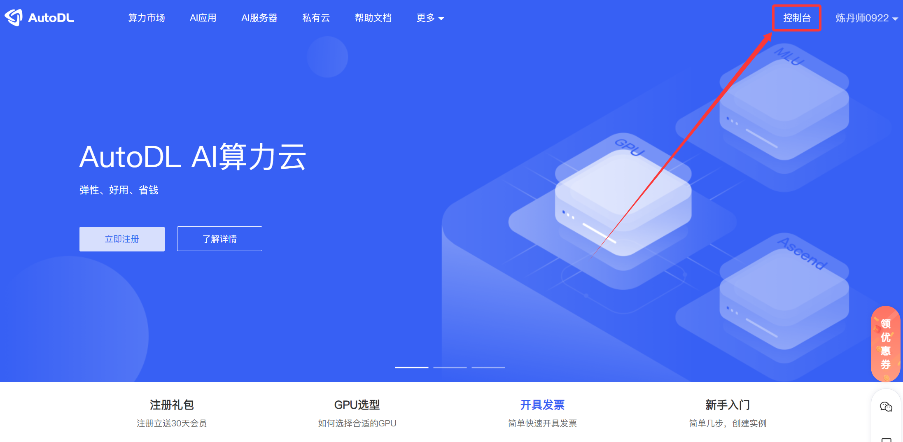

进入控制台后，在 `容器实例` 页面，点击 `租用新实例` 按钮，选择实例类型和规格。

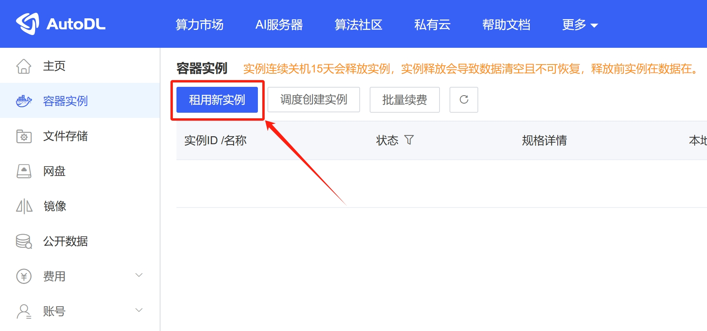

可租用的实例信息如下图所示，选择一个显卡，关键配置如下图：

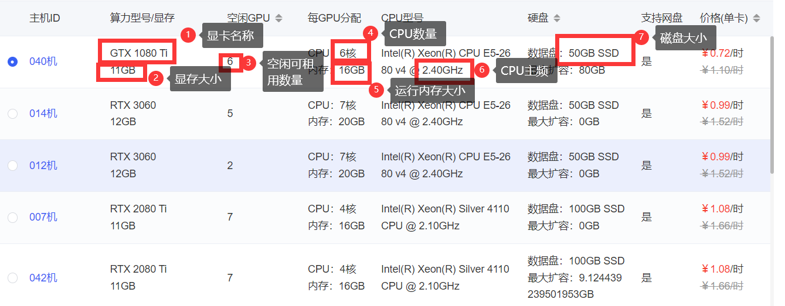

选择合适的实例配置，如图所示，以 PyTorch 为例选择深度学习平台，之后点击 `创建并开机` 按钮。

大部分云平台为按分钟计费，不用时可以关闭计费，因此无特殊需求通常越高越好，训练更快。

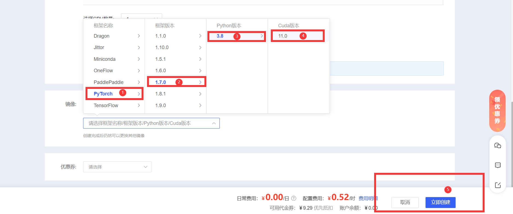

之后，我们将在控制台看到我们的云服务器实例，可以训练深度学习模型。

刚创建好的实例若处于开机状态，先关机，再选择 `无卡模式开机`。

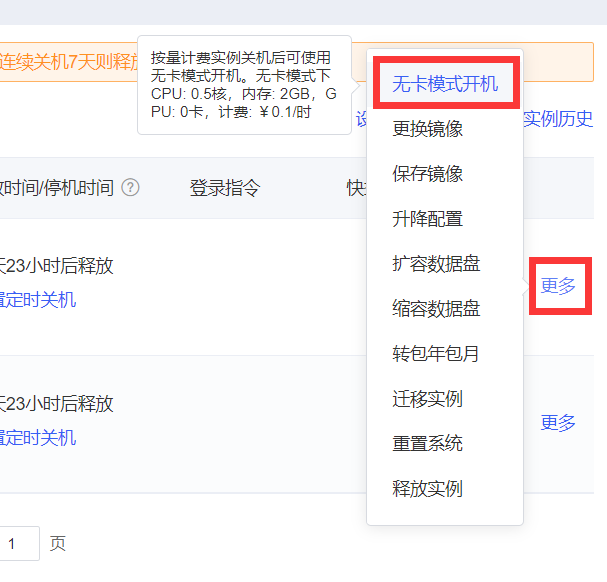

### 数据上传

数据上传包括两部分数据，分别是数据集和代码，云平台没有我们本地的数据集与代码，因此需要我们远程上传。

先开机，开机之后打开 `JupyterLab`。

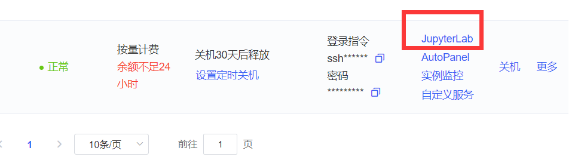

选择上传的数据集、代码文件等，受服务器系统权限限制，无法安装其他的解压命令，只能用系统自带的 zip 命令，因此上传的文件尽量压缩为 zip 文件（需要原本就是 zip 文件，不能改后缀为 zip 文件）。

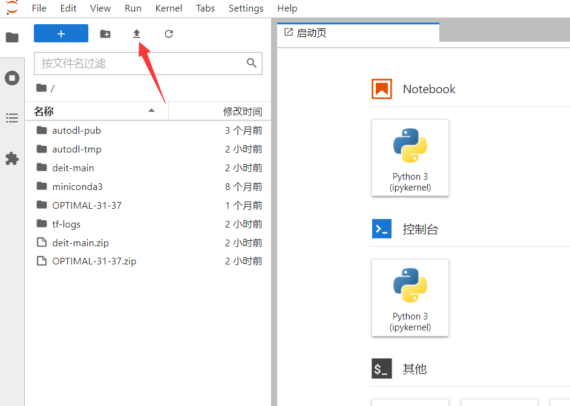

上传完成后打开终端进行环境配置。


使用 `unzip [文件名.zip]` 命令解压代码文件和数据集：

```shell
unzip deit-main.zip
unzip OPTIMAL-31-37.zip
unzip CK+.zip
```

注意需要先 **进入到解压后的目录下**，再进行解压命令。

### 数据导出

训练后我们可能需要将模型、日志、图片等内容导出，可以直接打包成zip文件，然后下载到本地。

使用 `zip -r [压缩后文件名.zip] [需压缩文件夹]` 命令打包文件，例如：

```shell
# 将test_directory文件夹压缩为dir.zip文件
zip -r dir.zip test_directory/
```

右键文件列表，选择“复制下载连接”：


将下载连接粘贴到浏览器网址栏，即可下载 zip 文件。

注意服务器需 **等待下载完毕后再关机**。

## 案例说明

### 案例简介

**案例一：基于卷积神经网络的遥感图像分类**

本案例展示了如何利用PyTorch框架下的卷积神经网络（CNN）实现遥感图像的自动分类，适用于卫星影像、航拍图片等遥感数据。

所使用的数据集已划分为训练集与测试集，分别存放于以类别命名的文件夹中。本示例中训练集与测试集的目录名分别为 **train** 与 **val** ，其后的数字 **37** 表示数据按约 **7:3** 的比例划分（即训练集占70%，测试集占30%）。在实际应用中，测试集占比通常建议在10%至30%之间。数据集划分可通过Python脚本自动完成，也可手动进行处理。

**案例二：基于CK+数据集的人脸识别**

在使用不同数据集时需注意其文件结构差异。例如，本案例采用的CK+数据集中，训练集与测试集对应的目录名分别为 **training** 与 **text** ，划分比例为 **4:1**。若使用统一代码进行模型训练，需注意将数据路径调整为与实际目录结构一致，避免因路径错误导致程序运行失败。

### 环境配置

环境指的是程序运行的环境，主要包含一些python库。某些厂商为了开发方便而建造的专门用于深度学习的库，开放给大家学习使用。

安装 `timm` 库和 `matplotlib` 库。

```shell
pip install timm==0.3.2
pip install matplotlib
```

检验是否安装成功，控制台输入命令 `python`。

打开 `python shell`，输入 `import` 命令导入库。不报错视为安装成功。

```shell
import timm
import matplotlib
```

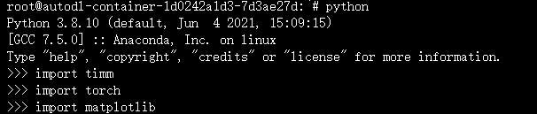

环境配置完成之后关闭此网页，回到控制台，先关机，直接点开机即可切换回显卡。

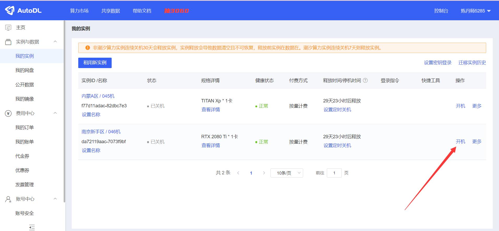

此时可以看到显卡已经切换到之前租用的版本了，打开jupyterlab运行代码。


接下来打开之前提到的终端，然后使用 `cd 文件夹名称` 命令进入程序文件下。

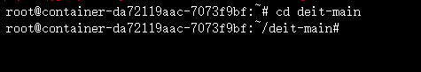

使用ls命令可以查看当前目录下的所有文件，使用 `python main.py` 命令运行即可。

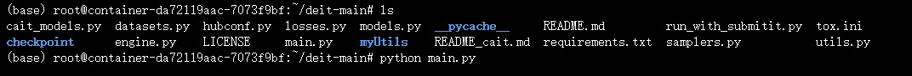

查看gpu占用情况命令：`nvidia-smi`。

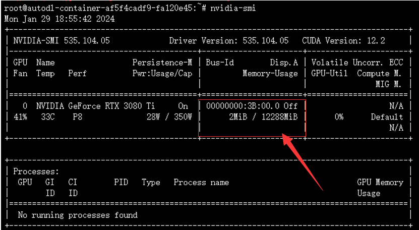

### 参数调整

在运行不同的数据时，需要对代码的参数进行修改，以获得最佳的模型。

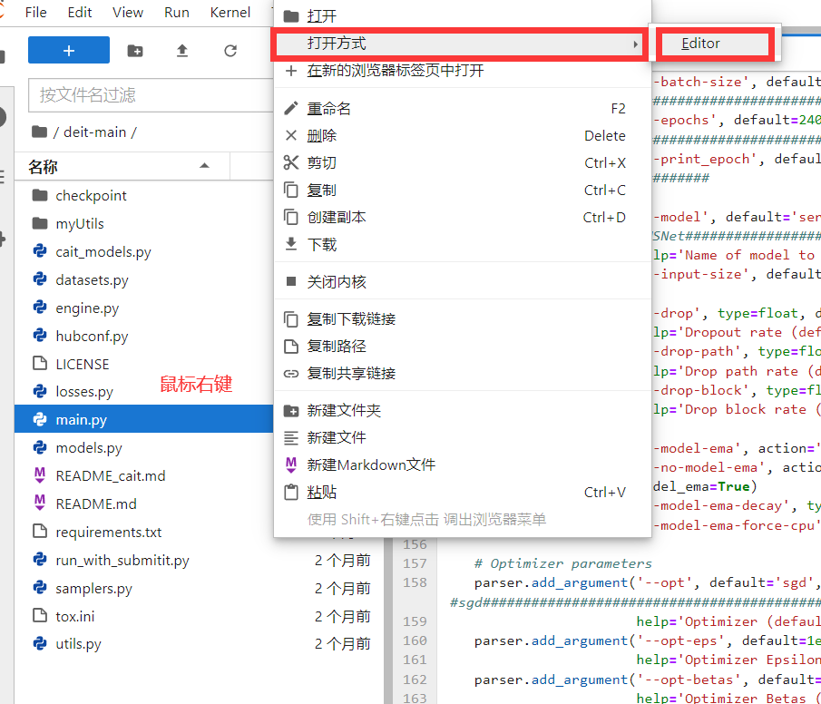

主要调整的训练参数有三个：
- batch-size取值示例： 32 64 128
- epochs取值示例： 100  50 
- lr取值示例： 0.0001 0.001 0.1 0.2 0.3 0.65

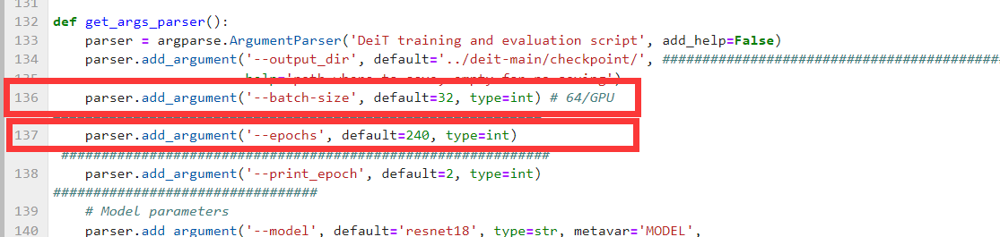

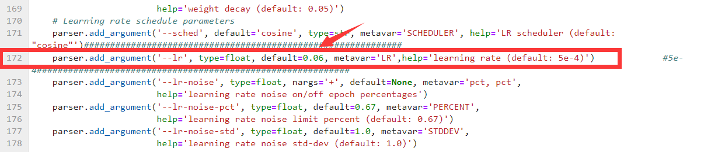

切换模型修改。

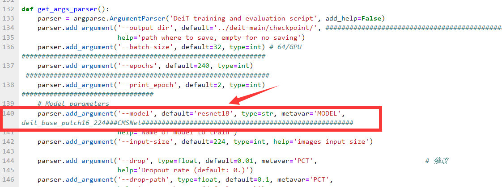

切换数据集修改两个地方，注意这里是相对路径，改一下数据集名称即可。

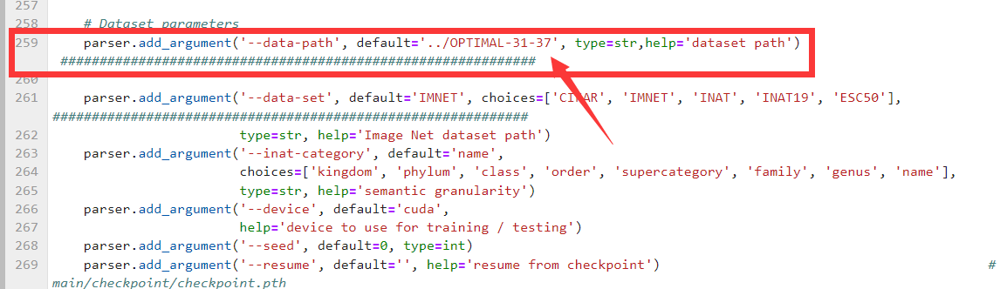

另外改一下数据集类别。

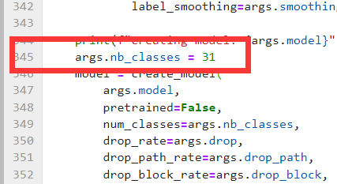

修改完之后保存，回到终端运行程序。

## 常用命令

- 列出当前目录下的所有文件 `ls`
- 切换目录路径 `cd`
- 压缩文件 `zip -r [压缩后文件名.zip] [需压缩文件夹]`
- 解压文件 `unzip [文件名.zip]`
- 更改 pip 镜像源（以阿里镜像源为例） `pip config set global.index-url https://mirrors.aliyun.com/pypi/simple/`
- 安装 python 库或包 `pip install [名字]`
- 运行 python 文件 `python main.py`
- 查看gpu占用情况 `nvidia-smi`
