# sklearn 环境搭建

> 介绍 sklearn 的环境搭建

## 关于 Anaconda

Anaconda 指的是一个开源的 Python 发行版本，其中包含了 conda（包管理和环境管理）、Python 等 180 多个科学包及其依赖项。

接下来我们开始安装 Anaconda

## Anaconda 的下载及安装

### 卸载 Python

Anaconda 安装之前，应该先检查一下电脑是否安装 Python：

- **情况一**：电脑没有安装 Python，或者安装的 Python 可以卸载；
- **情况二**：电脑已经安装 Python，并且想要保留它；

_此文档仅就情况一进行，情况二的方法较为复杂，最好改为情况一_

#### 验证是否安装 Python

打开命令提示窗口（按下 `Win+R` 打开运行框，输入 `cmd`），在窗口中输入

```shell
python --version
```

若出现了版本号，则说明已经安装了 Python，需要先卸载它。

#### 卸载 Python

在开始菜单中搜索 `控制面板`，然后点击 `程序`，然后点击 `卸载程序`。找到并点击 `Python`，然后点击 `卸载`。

#### 检查删除环境变量

在开始菜单中搜索 `环境变量`来查看，点击 `编辑系统环境变量`。

从 `用户变量`（注意是 **用户变量**）中找到 `path`，选中并点击`编辑`，进入查看自己设置过的环境变量。

将 python 的相关变量全部`删除`，如图中两个值，都选中然后删除，再点击`确定`（若卸载完 python 环境变量自动删掉就不用管了）

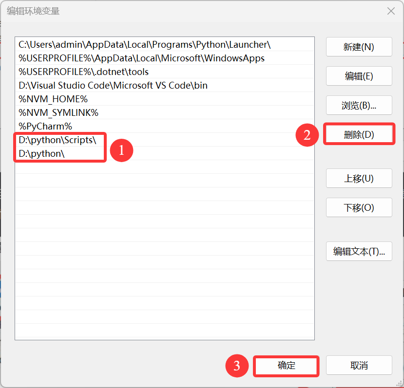

在退出时，不要忘记 **点击所有的确认按钮，不要直接叉掉**，否则并没有保存设置。

### 下载 Anaconda 安装包

可以进入 [Anaconda 官网](https://www.anaconda.com/) 进行注册登录后下载，不过因为网络无法访问或者下载速度太慢的问题，更推荐从 [清华大学开源软件镜像站](https://repo.anaconda.com/archive/) 进行下载。

选择 22 版 `Anaconda3-2022.10-Windows-x86_64.exe` 进行下载，下载后点击 exe 文件，便能够进入安装界面。

### 安装 Anaconda

双击下载好的安装包，点击 `Next`，点击 `I Agree`，选择 `Just Me`，自定义安装位置然后 `Next`（ **注意不能有中文路径！** ）。

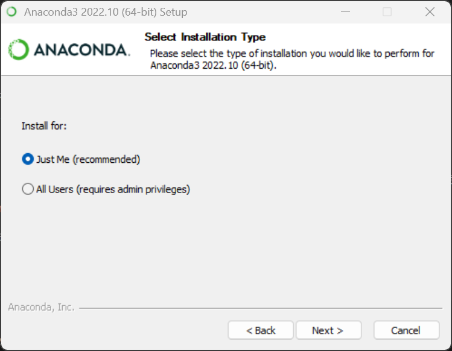

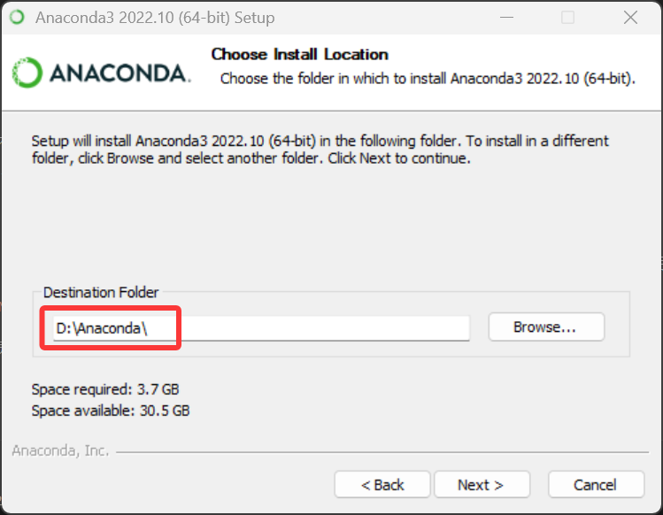

这个页面中要选择 `Register Anaconda as my default Python 3.x`，**不要**选择 `Add Anaconda to my PATH environment variable`，我们需要后期手动添加环境变量。

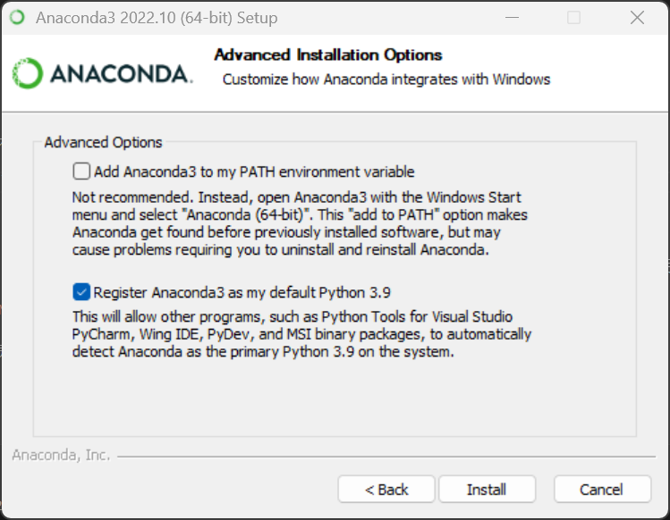

点击 `Install`，安装需要等待一会儿，再继续 `Next`。最后页面要将 **两个选项都取消打勾**，点击 `Finish` 完成安装。

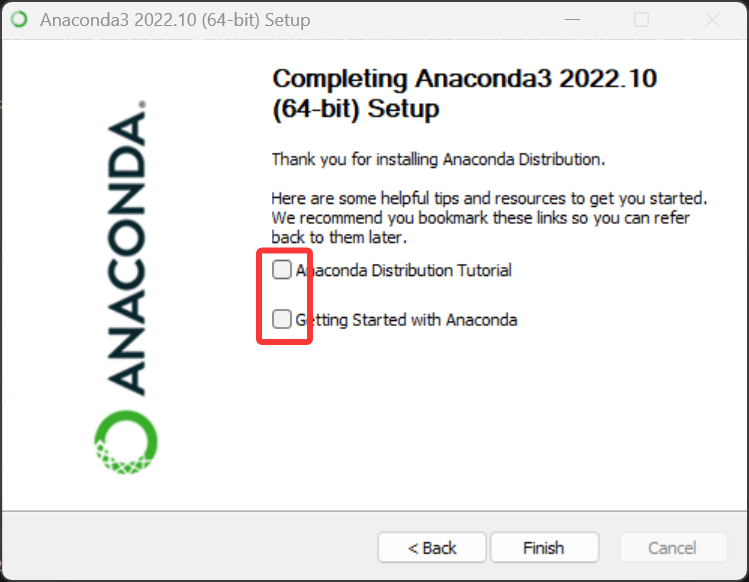

安装好后我们需要手动配置环境变量。

### 配置环境变量

> Anaconda 安装的过程中比较容易出错的环节就是环境变量的配置，所以在配置环境变量的时候要细心一些。

`计算机`（右键）→ `属性` → `高级系统设置` →（点击）`环境变量`

在 `系统变量`（注意是 **系统变量**）里，找到并点击 `Path`。

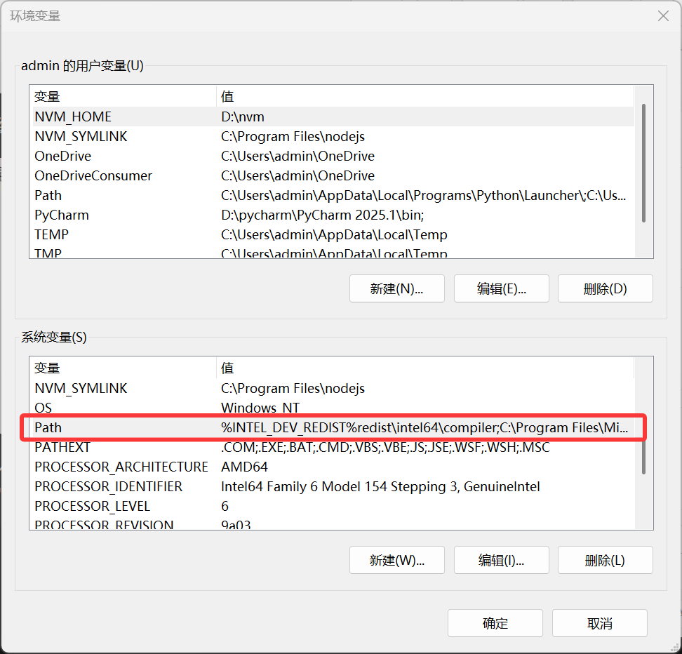

在编辑环境变量里，点击 `新建`，输入下面的五个环境变量。

（**这里需要将以下五条环境变量中涉及的到的"C:\ProgramData\Anaconda3"都修改为你的 Anaconda 的安装路径**）

```shell
C:\ProgramData\Anaconda3
C:\ProgramData\Anaconda3\Scripts
C:\ProgramData\Anaconda3\Library\bin
C:\ProgramData\Anaconda3\Library\mingw-w64\bin
C:\ProgramData\Anaconda3\Library\usr\bin
```

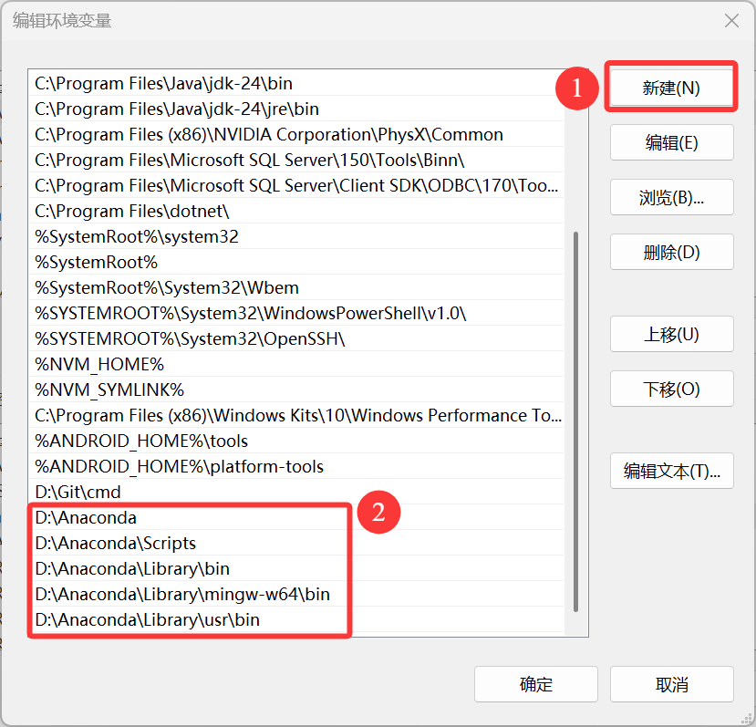

> 简要说明五条路径的用途：这五个环境变量中，1 是 Python 需要，2 是 conda 自带脚本，3 是 jupyter notebook 动态库, 4 是使用 C with python 的时候

新建完成后**一路点击确定**。

### 验证安装

验证 Anaconda 和 python 是否安装成功，win+R 输入 cmd，在弹出的命令行中依次输入 ：

```shell
conda --version
python --version
```

若各自出现版本号，即代表配置成功。

在开始菜单或桌面找到 `Anaconda Navifator` 将其打开（若桌面没有可以发一份到桌面方便后续使用），出现 GUI 界面即为安装成功。

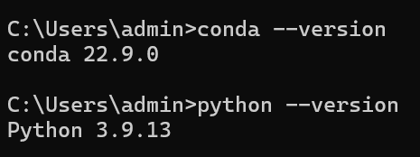

## 更改 Conda 源

如果没有 VPN 工具，建议更改 Conda 源来加快下载包的速度。清华大学提供了 Anaconda 的镜像仓库，我们把源改为清华大学镜像源。

找到 Anaconda prompt，打开 shell 面板。

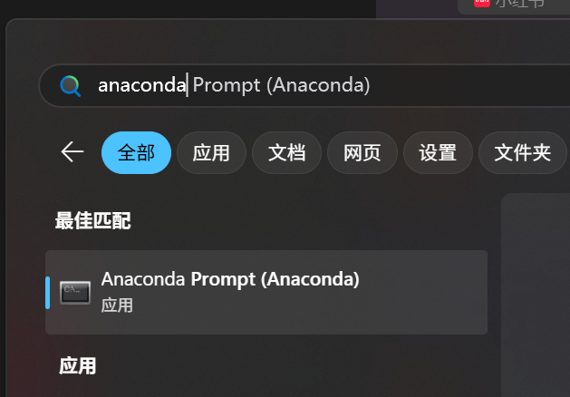

在命令行输入以下命令：

```shell
conda config --add channels https://mirrors.tuna.tsinghua.edu.cn/anaconda/pkgs/free/
conda config --add channels https://mirrors.tuna.tsinghua.edu.cn/anaconda/cloud/conda-forge
conda config --add channels https://mirrors.tuna.tsinghua.edu.cn/anaconda/cloud/msys2/
conda config --set show_channel_urls yes
```

验证是否修改好：

```shell
conda config --show channels
```

## 安装 Python 库

Anaconda 自带了一些常用的库，如 numpy、pandas、jupyter、matplotlib、seaborn、scikit-learn 等。

如果需要安装其他库，可以直接在 Anaconda Navigator 里搜索安装。

## VSCode 中指定 Conda 环境

使用 VSCode 进行代码编写，VSCode 支持 conda 环境的切换。

下载 Python 插件并安装，然后在 VSCode 的左下角找到环境选择框，点击右边的设置按钮，选择 conda 环境。

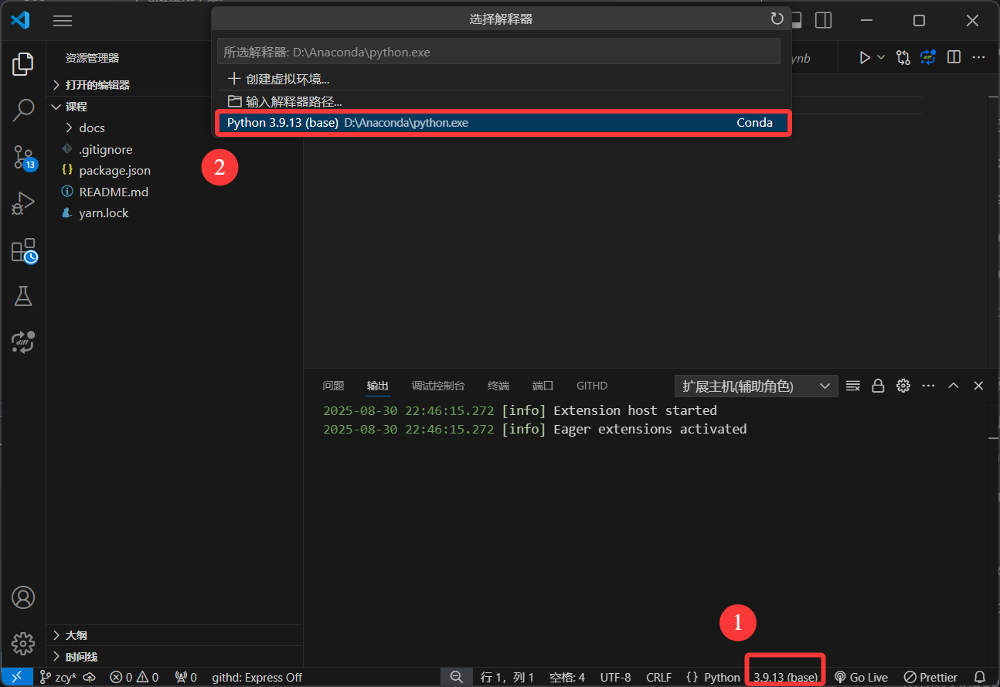

也可以在终端中执行：

```shell
conda activate 环境名称
```

## VSCode 中激活 Conda 环境报错

**问题**：在 VSCode 中使用 conda activate 激活虚拟环境时报错，提示如下内容：

```shell
CommandNotFoundError: Your shell has not been properly configured to use 'conda activate'.
To initialize your shell, run

    $ conda init <SHELL_NAME>

Currently supported shells are:
  - bash
  - fish
  - tcsh
  - xonsh
  - zsh
  - powershell

See 'conda init --help' for more information and options.

IMPORTANT: You may need to close and restart your shell after running 'conda init'.
```

**原因**：提示内容已经给出原因，当前使用的 shell 没有配置好 conda activate，需要运行 conda init 初始化 shell

### 查看虚拟环境

在本地 cmd 中输入以下命令查看有哪些虚拟环境：

```shell
conda env list
```

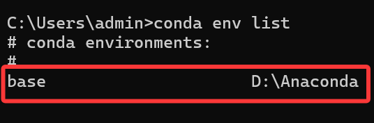

我们也可以自己创建虚拟环境，通过 cmd 输入以下命令：

```shell
conda create -n [虚拟环境名称] python=[python版本]
```

例：conda create -n python3.9 python=3.9

回车之后便可以创建成功，同时也可用上面的查看命令查看自己新创建的虚拟环境。

### VSCode 终端初始化 Conda

在 VSCode 终端 `powershell` 中执行 `conda init` 命令后 **重启** VSCode。

```shell
conda init
```

此时若有标红的错误信息出现，不用管，直接忽略错误信息进行下一步。

### Windows PowerShell 配置

打开开始界面，直接搜索关键字 `powershell` ，打开第一个 `Windows PowerShell` ，注意要 **以管理员身份运行** 打开。

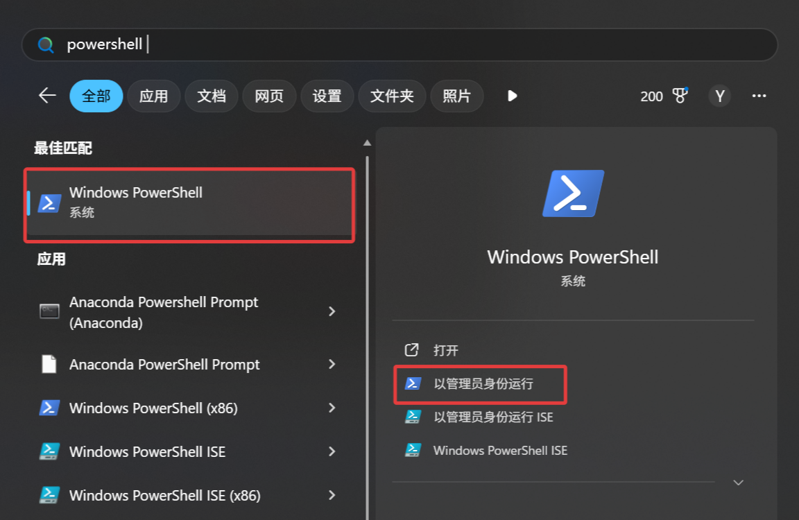

打开后输入以下命令，中途要输入 y，回车确定执行命令。

```shell
set-ExecutionPolicy RemoteSigned
```

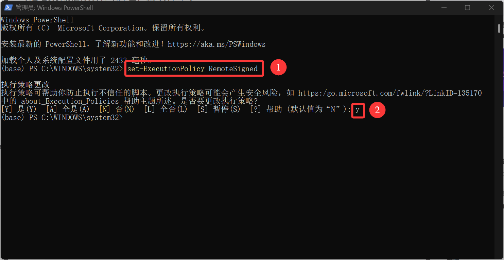

### 新建 powershell 重新激活

重启 VSCode，点击 **删除** 按钮，删除当前这个 `powershell` 。

然后在上方工具栏中点击 **终端** → 点击 **新建终端** ，重新再新建一个 `Vscode terminal powershell` 。

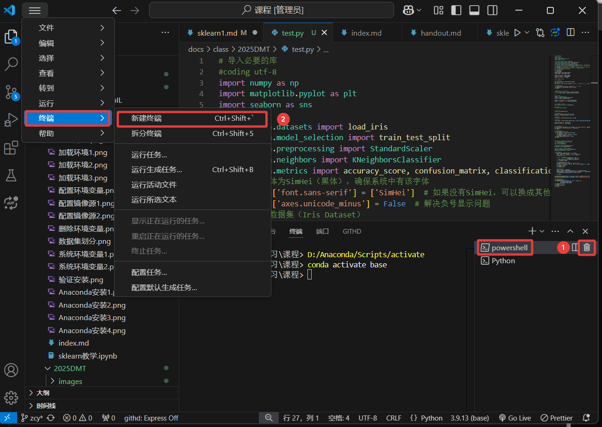

在新建的 `powershell` 终端中输入激活命令（虚拟环境名称是在 Anaconda 安装目录文件夹下的环境名称）。

```shell
conda activate [虚拟环境名称]
```

例：我的虚拟环境名称是 base，则命令为 `conda activate base` 。

出现以下结果，说明此时虚拟环境打开了，此时就能发现终于在 VSCode 上正确切换到了 Conda 创建的虚拟环境了。

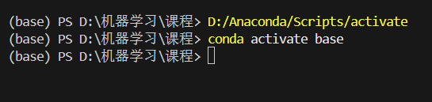

## sklearn 运行环境

至此，我们已经在本地配置好了 sklearn 的运行环境，可以用一个简单的例子来测试一下。

新建 Python 文件，输入以下代码并运行：

```python
# 导入必要的库
#coding utf-8
import numpy as np
import matplotlib.pyplot as plt
import seaborn as sns
import pandas as pd

from sklearn.datasets import load_iris
from sklearn.model_selection import train_test_split
from sklearn.preprocessing import StandardScaler
from sklearn.neighbors import KNeighborsClassifier
from sklearn.metrics import accuracy_score, confusion_matrix, classification_report
# 设置中文字体为SimHei（黑体），确保系统中有该字体
plt.rcParams['font.sans-serif'] = ['Microsoft YaHei']  # 如果没有SimHei，可以换成其他中文字体，如'Microsoft YaHei'
plt.rcParams['axes.unicode_minus'] = False  # 解决负号显示问题
# 解决sklearn中K近邻算法与未来SciPy版本兼容性的问题，忽略警告
import warnings
warnings.filterwarnings("ignore", category=FutureWarning, module="sklearn.neighbors._classification")

# 加载鸢尾花数据集（Iris Dataset）
data = load_iris()
X = data.data
y = data.target
feature_names = data.feature_names
target_names = data.target_names

print("特征名称：", feature_names)
print("目标类别：", target_names)
print("数据集大小：", X.shape)

# 创建DataFrame
df = pd.DataFrame(X, columns=feature_names)
df['species'] = y
df['species'] = df['species'].map({0: 'setosa', 1: 'versicolor', 2: 'virginica'})
print(df.head())

# 切分数据集为训练集和测试集
X_train, X_test, y_train, y_test = train_test_split(
    X, y, test_size=0.3, random_state=42, stratify=y
)

# 特征标准化
scaler = StandardScaler()
X_train = scaler.fit_transform(X_train)
X_test = scaler.transform(X_test)

print("训练集特征均值：", X_train.mean(axis=0))
print("训练集特征标准差：", X_train.std(axis=0))


# 创建KNN模型，选择K=3
knn = KNeighborsClassifier(n_neighbors=3)

# 训练模型
knn.fit(X_train, y_train)


# 进行预测
y_pred = knn.predict(X_test)

# 计算准确率
accuracy = accuracy_score(y_test, y_pred)
print(f"模型准确率：{accuracy * 100:.2f}%")

# 混淆矩阵
conf_matrix = confusion_matrix(y_test, y_pred)

# 分类报告
class_report = classification_report(y_test, y_pred, target_names=target_names)

print("混淆矩阵：\n", conf_matrix)
print("分类报告：\n", class_report)


# 绘制特征的直方图
df.hist(bins=15, figsize=(15, 10), layout=(2, 2), color='steelblue', edgecolor='black')
plt.suptitle("鸢尾花数据集特征直方图", fontsize=16)
plt.show()

# 绘制特征的箱线图
plt.figure(figsize=(15, 10))
for idx, feature in enumerate(feature_names):
    plt.subplot(2, 2, idx + 1)
    sns.boxplot(x='species', y=feature, data=df)
    plt.title(f"{feature} 的箱线图")
plt.tight_layout(rect=[0, 0.03, 1, 0.95])
plt.show()


from sklearn.decomposition import PCA
from matplotlib.patches import Patch
# 使用PCA将数据降到二维
pca = PCA(n_components=2)

X_train_pca = pca.fit_transform(X_train)
X_test_pca = pca.transform(X_test)

# 重新训练KNN模型在PCA降维后的数据上
knn_pca = KNeighborsClassifier(n_neighbors=3)
knn_pca.fit(X_train_pca, y_train)

# # 绘制决策边界
def plot_decision_boundary(model, X, y, title):
    x_min, x_max = X[:, 0].min() - 1, X[:, 0].max() + 1
    y_min, y_max = X[:, 1].min() - 1, X[:, 1].max() + 1
    h = 0.02  # 网格步长

    xx, yy = np.meshgrid(np.arange(x_min, x_max, h),
                         np.arange(y_min, y_max, h))
    Z = model.predict(np.c_[xx.ravel(), yy.ravel()])
    Z = Z.reshape(xx.shape)

    plt.figure(figsize=(10, 6))
    plt.contourf(xx, yy, Z, alpha=0.4, cmap='viridis')
    scatter = plt.scatter(X[:, 0], X[:, 1], c=y, s=40, edgecolor='k', cmap='viridis')
    plt.xlabel('主成分1')
    plt.ylabel('主成分2')
    plt.title(title)

    # 手动创建图例
    unique_classes = np.unique(y)
    colors = [scatter.cmap(scatter.norm(i)) for i in unique_classes]
    legend_elements = [Patch(facecolor=colors[i], edgecolor='k', label=target_names[i]) for i in unique_classes]
    plt.legend(handles=legend_elements, title="Species")

    plt.show()

plot_decision_boundary(knn_pca, X_train_pca, y_train, "KNN决策边界（训练集）")
plot_decision_boundary(knn_pca, X_test_pca, y_test, "KNN决策边界（测试集）")

# 绘制混淆矩阵热图
plt.figure(figsize=(8, 6))
sns.heatmap(conf_matrix, annot=True, fmt='d', cmap='Blues',
            xticklabels=target_names,
            yticklabels=target_names)
plt.xlabel('预测类别')
plt.ylabel('真实类别')
plt.title('混淆矩阵')
plt.show()
```

运行后便可以看到相应的结果，具体的使用方法在后续的学习中会掌握。

## 使用 Jupyter

### 使用 Anaconda 启动 Jupyter

Anaconda 中自带了 Jupyter notebook 与 Jupyterlab，可以方便地编写和运行 Python 代码。

使用较新的 Jupyterlab 作为例子，打开 Anaconda Navigator，点击 Jupyterlab 下面的 `launch` 按钮（如果没有请先点击 install），Anaconda 会自动在浏览器中打开 Jupyter 界面，关闭页面便会退出环境。

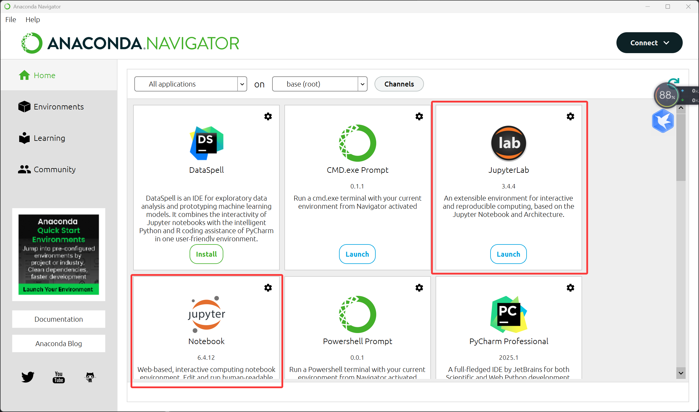

关于 Jupyterlab 的使用，可参考[官方文档](https://jupyterlab.readthedocs.io/en/stable/)。

### 使用 VSCode 运行 Jupyter 文件

许多 VSCode 插件对 Jupyter 的运行都进行了支持，例如 Jupyter Extension for Visual Studio Code。

下载并安装插件，新建 `.ipynb` 文件，然后点击右上角的运行按钮，选择运行环境，选择 Anaconda 环境后使用即可。

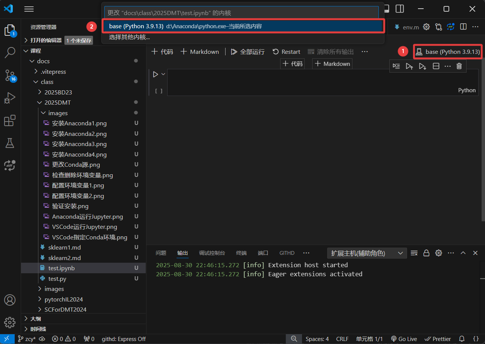

### 使用 kaggle 在线使用 Jupyter

kaggle 是一个提供数据集和竞赛的平台，我们可以直接在线使用 Jupyter 进行数据分析。

kaggle[官网地址](https://www.kaggle.com/)

首先注册一个 kaggle 账号，然后点击左侧的 `Competitions` 进入竞赛页面，选择一个竞赛，点击 `Join Competition` 进入竞赛页面，点击 `Rules` 进入竞赛规则页面，点击 `Data` 进入数据页面，点击 `Download All` 下载数据集。

点击左侧的 `Notebooks` 进入笔记页面，点击 `New Notebook` 新建笔记，即可使用在线的仿真环境进行数据分析。

## \[附录\] Anaconda 常用命令

在没有 GUI 的情况下，有以下的常用命令：

1.查看当前环境下安装的库：

```shell
conda list
```

2.查看所有环境：

```shell
conda info --envs
```

3.创建新的环境：

```shell
conda create -n 环境名称 python=版本号
```

4.激活环境：

```shell
conda activate 环境名称
```

5.退出环境：

```shell
conda deactivate
```

6.删除环境：

```shell
conda remove -n 环境名称 --all
```

7.导出环境：

```shell
conda env export > environment.yaml
```

8.导入环境：

```shell
conda env create -f environment.yaml
```

9.列出所有可用的包：

```shell
conda search 包名
```

10.安装包：

```shell
conda install 包名
```

11.更新包：

```shell
conda update 包名
```

12.卸载包：

```shell
conda uninstall 包名
```
