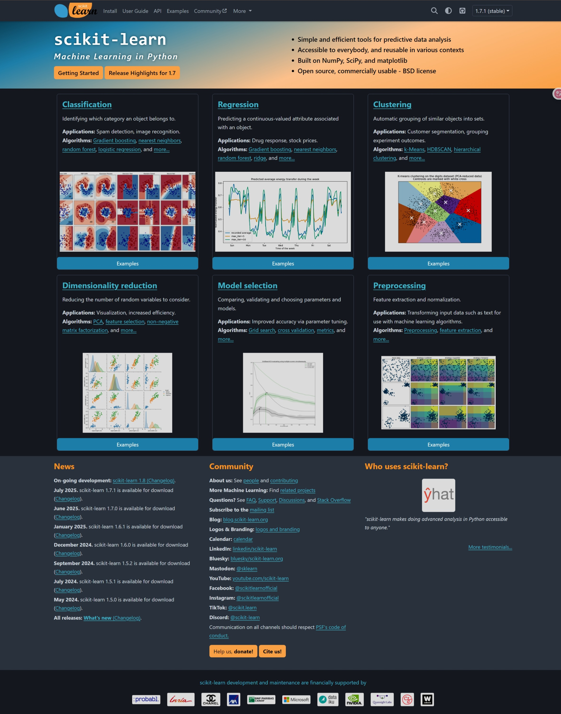
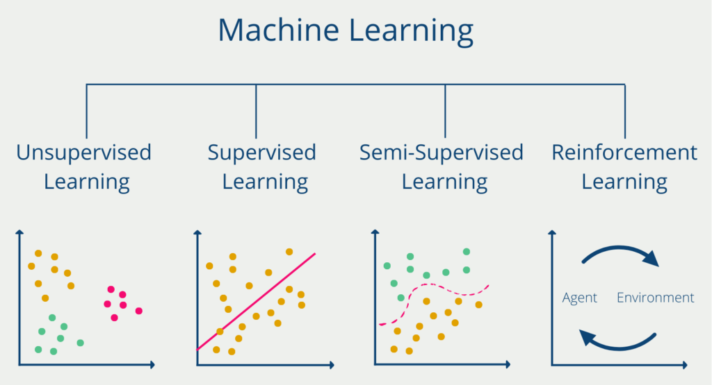
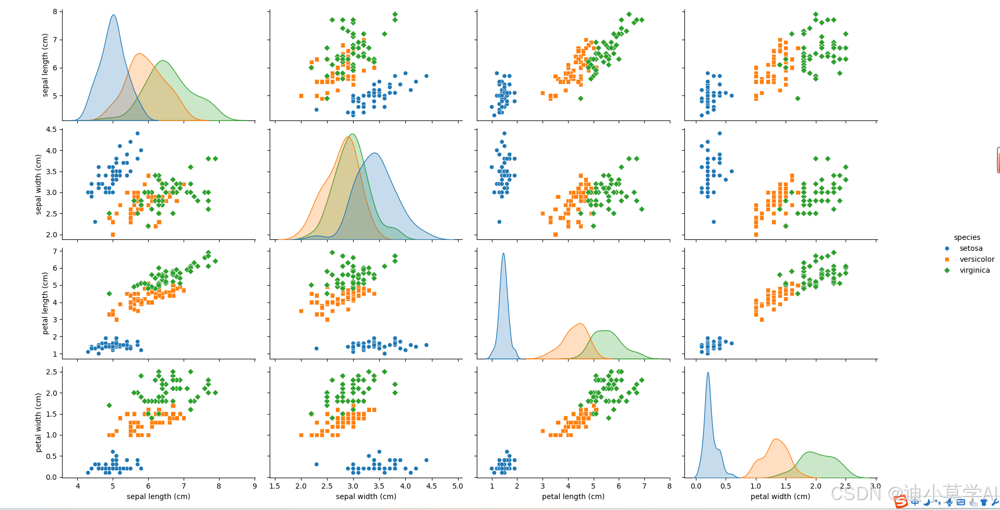
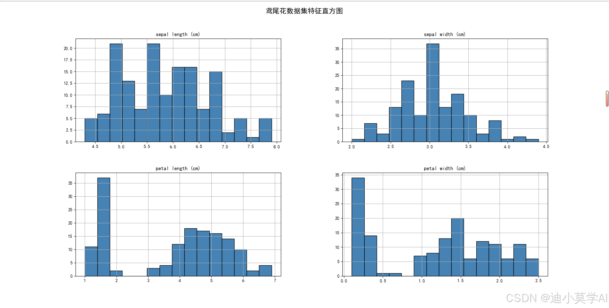
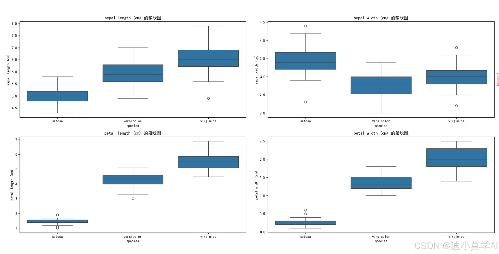
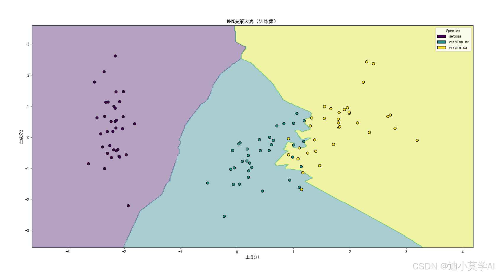
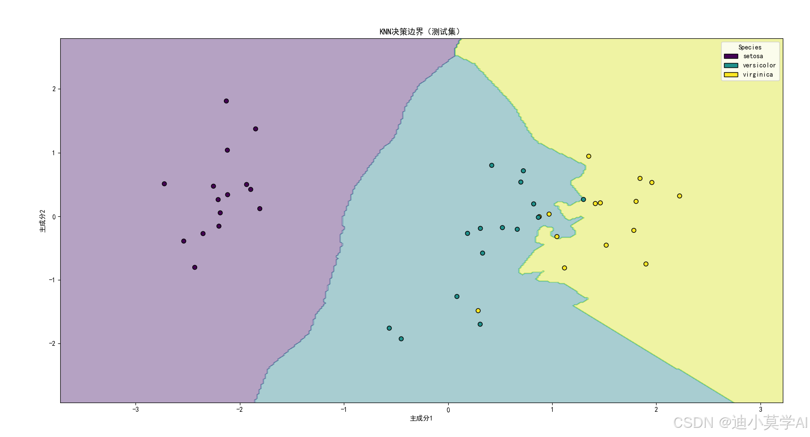
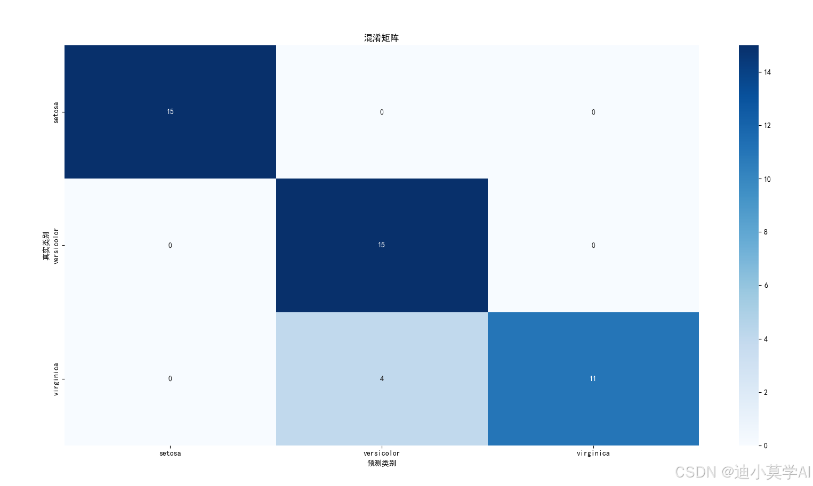

# sklearn教学

> sklearn[官方文档](https://scikit-learn.org/stable/index.html)参考

## 简介

### 什么是 sklearn？

Scikit-learn（通常简称为 sklearn）是一个开源的 **机器学习库**，它构建在 NumPy 和 SciPy 基础之上，因此它能够高效地处理数值计算和数组操作，特别适合进行 **小规模**和 **中等规模**的 **机器学习**项目。它还提供了用于 **模型拟合、数据预处理、模型选择和评估**以及许多其他实用程序的各种工具。

官方将 sklearn 描述为：

- **简单高效**的数据挖掘和数据分析工具
- 可供大家在**各种环境**中**重复使用**
- 建立在 NumPy ，SciPy 和 matplotlib 上
- 开源，**可商业使用** - BSD 许可证



### sklearn 的主要功能

- **分类**: 识别对象所属的类别。应用：垃圾邮件检测、图像识别。
- **回归**: 预测与对象相关的连续值属性。应用：药物响应、股票价格。
- **聚类**: 将相似对象自动分组到集合中。应用：客户细分、实验结果分组。
- **降维**: 减少要考虑的随机变量数量。应用：可视化、提高效率。
- **模型选择**: 比较、验证和选择参数及模型。应用：通过参数调优提高准确性。
- **预处理**:特征提取和标准化。应用：转换输入数据，例如文本，以用于机器学习算法。



### sklearn 的特点？

- **易用性**: Sklearn 的 API 设计简洁且一致，使得学习曲线较为平缓。通过简单的 fit、predict、score 等方法，可以快速实现机器学习任务。
- **高效性**: 虽然 Sklearn 是纯 Python 编写，但它的底层大多数实现依赖于 Cython 和 NumPy，这使得它在执行机器学习算法时速度非常快。
- **丰富的功能**: Sklearn 提供了大量经典的机器学习算法，包括分类、回归、聚类等。
- **兼容性好**: 可以与其他 Python 库（如 Pandas、NumPy、matplotlib）无缝集成。


### Sklearn 与其他库的关系

- **与 NumPy 和 SciPy 的关系**: Sklearn 构建在 NumPy 和 SciPy 基础之上，因此它能够高效地处理数值计算和数组操作。
- **与 Pandas 的关系**: Pandas 提供了强大的数据处理能力，而 Sklearn 支持从 Pandas 的 DataFrame 中直接提取数据进行模型训练和预测。
- **与 TensorFlow 和 PyTorch 的关系**: Sklearn 主要关注传统的机器学习方法，而 TensorFlow 和 PyTorch 则更侧重于深度学习模型。尽管如此，Sklearn 与这些库可以结合使用，处理一些前期的特征工程任务，或作为基础模型与深度学习进行比较。

## 实践

### 机器学习方法

对于任何一个问题，如果我们希望通过机器学习的方式解决，我们一般遵循以下步骤：

1. **问题分析**：我们需要清楚问题的类型、输入、输出、数据集、目标、评估指标等。
2. **数据预处理**：我们需要对数据进行清洗、转换、归一化等操作，确保数据质量。
3. **训练模型**：我们需要选择合适的机器学习算法，并训练模型。
4. **预测与评估**：我们需要使用测试集对模型进行测试，并评估模型的性能。

如果我们决定好了用哪些方法进行机器学习，我们可以在官方文档中找到相应的 API，按照接口一步步实现。

- [官方文档](https://scikit-learn.org/stable/user_guide.html)
- [中文文档（非官方）](https://sklearn.apachecn.org/)

接下来，我们从简单的 **KNN 模型**入手，配合经典的 **Iris 数据集**，来熟悉 sklearn 的使用。

### KNN 算法简介

> K-近邻算法是一种有监督学习、分类（也可用于回归）算法。

KNN 算法是 k-Nearest Neighbor Classification 的简称，也就是 k 近邻分类算法。它假设如果一个样本在特征空间中的 k 个最相似(即特征空间中最邻近)的样本中的大多数属于某一个类别，则该样本也属于这个类别。

KNN 算法的流程如下：

1. 计算已知类别数据集中的点与当前点之间的欧式距离
2. 按距离递增次序排序
3. 选取与当前点距离最小的 k 个点
4. 统计前 k 个点所在的类别出现的频率
5. 返回前 k 个点出现频率最高的类别作为当前点的预测分类

sklearn 中 KNN 算法的 API 如下：

```python
sklearn.neighbors.KNeighborsClassifier(n_neighbors=3, weights='uniform', algorithm='auto', leaf_size=30, p=2, metric='minkowski', metric_params=None, n_jobs=None)
```

其中：

- `n_neighbors`：选择最近邻的数目，默认为 `3`。
- `weights`：选择样本权重的方法，默认为 `uniform`，即所有样本权重相同。
- `algorithm`：选择计算最近邻的方法，默认为 `auto`，即自动选择。
- `leaf_size`：设置叶子节点的大小，默认为 `30`。
- `p`：选择距离度量的指数，默认为 `2`。
- `metric`：选择距离度量的方法，默认为 `minkowski`，即闵可夫斯基距离。
- `metric_params`：设置距离度量的参数，默认为 `None`。
- `n_jobs`：设置并行计算的线程数，默认为 `None`，即自动选择。

### 问题分析

鸢尾花数据集（Iris Dataset）是机器学习中最经典的入门数据集之一。

鸢尾花数据集包含了三种鸢尾花（Setosa、Versicolor、Virginica）每种花的 4 个特征：花萼长度、花萼宽度、花瓣长度和花瓣宽度。

接下来我们的任务是基于这些特征来预测鸢尾花的种类。

#### 导入必要的库

首先，我们需要导入进行数据处理、模型训练和可视化所需的Python库。

```python
# 导入必要的库
import numpy as np
import matplotlib.pyplot as plt
import seaborn as sns

from sklearn.datasets import load_iris
from sklearn.model_selection import train_test_split
from sklearn.preprocessing import StandardScaler
from sklearn.neighbors import KNeighborsClassifier
from sklearn.metrics import accuracy_score, confusion_matrix, classification_report

# 设置绘图风格
sns.set(style="whitegrid")
```

#### 加载和探索数据集

我们将使用Scikit-learn自带的鸢尾花数据集。首先，我们加载数据并了解其基本结构。

```python
# 加载鸢尾花数据集（Iris Dataset）
data = load_iris()
X = data.data
y = data.target
feature_names = data.feature_names
target_names = data.target_names

print("特征名称：", feature_names)
print("目标类别：", target_names)
print("数据集大小：", X.shape)
```

输出结果：

```shell:line-numbers
特征名称： ['sepal length (cm)', 'sepal width (cm)', 'petal length (cm)', 'petal width (cm)']
目标类别： ['setosa' 'versicolor' 'virginica']
数据集大小： (150, 4)
```

分析：

- **输入**：鸢尾花的特征数据，包括花萼长度、花萼宽度、花瓣长度、花瓣宽度。
- **输出**：鸢尾花的类别，包括山鸢尾、变色鸢尾、维吉尼亚鸢尾。
- **目标**：预测新数据属于哪个类别。
- **评估指标**：准确率。

#### 数据分布概览

我们通过绘制散点图矩阵（Pair Plot）来初步了解各个特征之间的关系。

```python
import pandas as pd

# 创建DataFrame
df = pd.DataFrame(X, columns=feature_names)
df['species'] = y
df['species'] = df['species'].map({0: 'setosa', 1: 'versicolor', 2: 'virginica'})

# 绘制散点图矩阵
sns.pairplot(df, hue='species', markers=["o", "s", "D"])
plt.suptitle("鸢尾花数据集散点图矩阵", y=1.02)
plt.show()
```



从图中我们可以看出，**相同种类的鸢尾花其特征数据之间的距离较近**，而不同种类的鸢尾花，其特征数据之间的距离较远。因此，KNN 算法是一种可能解决此问题的有效方案。

### 数据预处理

通常我们获得的数据都是不完美的，需要进行数据预处理，一般使用以下方法：

- **特征工程**（Feature Engineering）：特征工程是指从原始数据中提取有用的特征，并将其转换为适合机器学习算法的形式。
- **数据清洗**（Data Cleaning）：数据清洗是指对数据进行检查、修复、过滤、转换等操作，以确保数据质量。
- **数据转换**（Data Transformation）：数据转换是指对数据进行变换，以便更好地适应机器学习算法。
- **数据集成**（Data Integration）：数据集成是指将不同来源的数据进行整合，以便更好地训练模型。

在进行机器学习模型训练之前，通常需要对数据进行预处理。KNN算法对特征的尺度非常敏感，因此标准化（Standardization）是必不可少的步骤。

```python
# 切分数据集为训练集和测试集
X_train, X_test, y_train, y_test = train_test_split(
    X, y, test_size=0.3, random_state=42, stratify=y
)

# 特征标准化
scaler = StandardScaler()
X_train = scaler.fit_transform(X_train)
X_test = scaler.transform(X_test)

print("训练集特征均值：", X_train.mean(axis=0))
print("训练集特征标准差：", X_train.std(axis=0))
```

输出结果：

```shell:line-numbers
训练集特征均值： [ 0.10243606 -0.02340002  0.11493369  0.01386166]
训练集特征标准差： [1.         1.         1.         1.        ]
```

**数据标准化** 使得数据分布变得更加均匀，更容易被模型识别。

### 训练KNN模型

我们将使用KNN分类器进行模型训练。K值的选择对模型性能有重要影响，常用的方法是通过交叉验证选择最佳的K值。

```python
# 创建KNN模型，选择K=3
knn = KNeighborsClassifier(n_neighbors=3)

# 训练模型
knn.fit(X_train, y_train)
```

### 模型评估

我们可以通过一些指标来评估模型的性能，常用的指标有：

- **准确率**（Accuracy）：正确分类的样本数与总样本数的比值。
- **精确率**（Precision）：正确分类为正的样本数与所有正样本数的比值。
- **召回率**（Recall）：正确分类为正的样本数与所有样本中正样本的比值。
- **F1 值**（F1 Score）：精确率和召回率的调和平均值。
- **混淆矩阵**（Confusion Matrix）：用于描述分类结果的矩阵。
- **分类报告**（Classification Report）：用于描述分类结果的报告。

```python
# 进行预测
y_pred = knn.predict(X_test)

# 计算准确率
accuracy = accuracy_score(y_test, y_pred)
print(f"模型准确率：{accuracy * 100:.2f}%")

# 混淆矩阵
conf_matrix = confusion_matrix(y_test, y_pred)

# 分类报告
class_report = classification_report(y_test, y_pred, target_names=target_names)

print("混淆矩阵：\n", conf_matrix)
print("分类报告：\n", class_report)
```

输出结果：

```shell:line-numbers
模型准确率：97.78%
混淆矩阵：
 [[16  0  0]
 [ 0 13  0]
 [ 0  0  10]]
分类报告：
               precision    recall  f1-score   support

      setosa       1.00      1.00      1.00        16
  versicolor       1.00      1.00      1.00        13
   virginica       1.00      1.00      1.00        10

    accuracy                           1.00        39
   macro avg       1.00      1.00      1.00        39
weighted avg       1.00      1.00      1.00        39
```

从结果可以看出，KNN模型在测试集上的表现非常优异，达到了 97.78% 的准确率。

### 模型可视化

为了更直观地理解KNN模型的表现，我们将进行以下几种可视化：

- **特征分布可视化**
- **决策边界可视化**
- **混淆矩阵可视化**

#### 特征分布可视化

通过绘制特征的直方图和箱线图，进一步了解各类别在各个特征上的分布。

```python
# 绘制特征的直方图
df.hist(bins=15, figsize=(15, 10), layout=(2, 2), color='steelblue', edgecolor='black')
plt.suptitle("鸢尾花数据集特征直方图", fontsize=16)
plt.show()

# 绘制特征的箱线图
plt.figure(figsize=(15, 10))
for idx, feature in enumerate(feature_names):
    plt.subplot(2, 2, idx + 1)
    sns.boxplot(x='species', y=feature, data=df)
    plt.title(f"{feature} 的箱线图")
plt.tight_layout(rect=[0, 0.03, 1, 0.95])
plt.show()
```





#### 决策边界可视化

由于鸢尾花数据集有四个特征，我们将使用 **主成分分析（PCA）** 将数据降维到二维，以便绘制决策边界。

```python
from sklearn.decomposition import PCA
from matplotlib.patches import Patch
# 使用PCA将数据降到二维
pca = PCA(n_components=2)

X_train_pca = pca.fit_transform(X_train)
X_test_pca = pca.transform(X_test)

# 重新训练KNN模型在PCA降维后的数据上
knn_pca = KNeighborsClassifier(n_neighbors=3)
knn_pca.fit(X_train_pca, y_train)

# 绘制决策边界
def plot_decision_boundary(model, X, y, title):
    x_min, x_max = X[:, 0].min() - 1, X[:, 0].max() + 1
    y_min, y_max = X[:, 1].min() - 1, X[:, 1].max() + 1
    h = 0.02  # 网格步长

    xx, yy = np.meshgrid(np.arange(x_min, x_max, h),
                         np.arange(y_min, y_max, h))
    Z = model.predict(np.c_[xx.ravel(), yy.ravel()])
    Z = Z.reshape(xx.shape)

    plt.figure(figsize=(10, 6))
    plt.contourf(xx, yy, Z, alpha=0.4, cmap='viridis')
    scatter = plt.scatter(X[:, 0], X[:, 1], c=y, s=40, edgecolor='k', cmap='viridis')
    plt.xlabel('主成分1')
    plt.ylabel('主成分2')
    plt.title(title)
    
    # 手动创建图例
    unique_classes = np.unique(y)
    colors = [scatter.cmap(scatter.norm(i)) for i in unique_classes]
    legend_elements = [Patch(facecolor=colors[i], edgecolor='k', label=target_names[i]) for i in unique_classes]
    plt.legend(handles=legend_elements, title="Species")
    
    plt.show()

plot_decision_boundary(knn_pca, X_train_pca, y_train, "KNN决策边界（训练集）")
plot_decision_boundary(knn_pca, X_test_pca, y_test, "KNN决策边界（测试集）")
```





**解释**：图中展示了KNN模型在降维后的训练集和测试集上的决策边界。不同颜色区域代表不同的分类类别，散点则是实际的数据点。可以看到，模型成功地区分了三类鸢尾花，决策边界清晰。

#### 混淆矩阵可视化

混淆矩阵能够直观地展示模型在各个类别上的预测表现。

```python
# 绘制混淆矩阵热图
plt.figure(figsize=(8, 6))
sns.heatmap(conf_matrix, annot=True, fmt='d', cmap='Blues',
            xticklabels=target_names,
            yticklabels=target_names)
plt.xlabel('预测类别')
plt.ylabel('真实类别')
plt.title('混淆矩阵')
plt.show()
```



**解释**：图中显示了模型在各个类别上的预测情况。对角线上的数值表示正确预测的样本数量，而非对角线上的数值表示误分类的样本数量。在本例中，所有类别的预测都达到了100%的准确率。

### 完整代码

为了方便参考和复现，以下是完整的代码，包括数据加载、预处理、模型训练、评估和可视化部分。

```python
# 导入必要的库
#coding utf-8
import numpy as np
import matplotlib.pyplot as plt
import seaborn as sns

from sklearn.datasets import load_iris
from sklearn.model_selection import train_test_split
from sklearn.preprocessing import StandardScaler
from sklearn.neighbors import KNeighborsClassifier
from sklearn.metrics import accuracy_score, confusion_matrix, classification_report
# 设置中文字体为SimHei（黑体），确保系统中有该字体
plt.rcParams['font.sans-serif'] = ['SimHei']  # 如果没有SimHei，可以换成其他中文字体，如'Microsoft YaHei'
plt.rcParams['axes.unicode_minus'] = False  # 解决负号显示问题
# 加载鸢尾花数据集（Iris Dataset）
data = load_iris()
X = data.data
y = data.target
feature_names = data.feature_names
target_names = data.target_names

print("特征名称：", feature_names)
print("目标类别：", target_names)
print("数据集大小：", X.shape)

import pandas as pd

# 创建DataFrame
df = pd.DataFrame(X, columns=feature_names)
df['species'] = y
df['species'] = df['species'].map({0: 'setosa', 1: 'versicolor', 2: 'virginica'})

# 绘制散点图矩阵
sns.pairplot(df, hue='species', markers=["o", "s", "D"])
plt.suptitle("鸢尾花数据集散点图矩阵", y=1.02)
plt.show()


# 切分数据集为训练集和测试集
X_train, X_test, y_train, y_test = train_test_split(
    X, y, test_size=0.3, random_state=42, stratify=y
)

# 特征标准化
scaler = StandardScaler()
X_train = scaler.fit_transform(X_train)
X_test = scaler.transform(X_test)

print("训练集特征均值：", X_train.mean(axis=0))
print("训练集特征标准差：", X_train.std(axis=0))


# 创建KNN模型，选择K=3
knn = KNeighborsClassifier(n_neighbors=3)

# 训练模型
knn.fit(X_train, y_train)


# 进行预测
y_pred = knn.predict(X_test)

# 计算准确率
accuracy = accuracy_score(y_test, y_pred)
print(f"模型准确率：{accuracy * 100:.2f}%")

# 混淆矩阵
conf_matrix = confusion_matrix(y_test, y_pred)

# 分类报告
class_report = classification_report(y_test, y_pred, target_names=target_names)

print("混淆矩阵：\n", conf_matrix)
print("分类报告：\n", class_report)


# 绘制特征的直方图
df.hist(bins=15, figsize=(15, 10), layout=(2, 2), color='steelblue', edgecolor='black')
plt.suptitle("鸢尾花数据集特征直方图", fontsize=16)
plt.show()

# 绘制特征的箱线图
plt.figure(figsize=(15, 10))
for idx, feature in enumerate(feature_names):
    plt.subplot(2, 2, idx + 1)
    sns.boxplot(x='species', y=feature, data=df)
    plt.title(f"{feature} 的箱线图")
plt.tight_layout(rect=[0, 0.03, 1, 0.95])
plt.show()


from sklearn.decomposition import PCA
from matplotlib.patches import Patch
# 使用PCA将数据降到二维
pca = PCA(n_components=2)

X_train_pca = pca.fit_transform(X_train)
X_test_pca = pca.transform(X_test)

# 重新训练KNN模型在PCA降维后的数据上
knn_pca = KNeighborsClassifier(n_neighbors=3)
knn_pca.fit(X_train_pca, y_train)

# 绘制决策边界
def plot_decision_boundary(model, X, y, title):
    x_min, x_max = X[:, 0].min() - 1, X[:, 0].max() + 1
    y_min, y_max = X[:, 1].min() - 1, X[:, 1].max() + 1
    h = 0.02  # 网格步长

    xx, yy = np.meshgrid(np.arange(x_min, x_max, h),
                         np.arange(y_min, y_max, h))
    Z = model.predict(np.c_[xx.ravel(), yy.ravel()])
    Z = Z.reshape(xx.shape)

    plt.figure(figsize=(10, 6))
    plt.contourf(xx, yy, Z, alpha=0.4, cmap='viridis')
    scatter = plt.scatter(X[:, 0], X[:, 1], c=y, s=40, edgecolor='k', cmap='viridis')
    plt.xlabel('主成分1')
    plt.ylabel('主成分2')
    plt.title(title)
    
    # 手动创建图例
    unique_classes = np.unique(y)
    colors = [scatter.cmap(scatter.norm(i)) for i in unique_classes]
    legend_elements = [Patch(facecolor=colors[i], edgecolor='k', label=target_names[i]) for i in unique_classes]
    plt.legend(handles=legend_elements, title="Species")
    
    plt.show()

plot_decision_boundary(knn_pca, X_train_pca, y_train, "KNN决策边界（训练集）")
plot_decision_boundary(knn_pca, X_test_pca, y_test, "KNN决策边界（测试集）")

# 绘制混淆矩阵热图
plt.figure(figsize=(8, 6))
sns.heatmap(conf_matrix, annot=True, fmt='d', cmap='Blues',
            xticklabels=target_names,
            yticklabels=target_names)
plt.xlabel('预测类别')
plt.ylabel('真实类别')
plt.title('混淆矩阵')
plt.show()
```

使用 sklearn 可以帮助我们极大的减小代码量，提高效率。

> 如果有兴趣，可以自己尝试实现封装一个 KNN 算法，以加深对于 sklearn 的理解。

## 总结

- **数据加载与探索**：使用散点图矩阵和箱线图对鸢尾花数据集进行初步分析。

- **数据预处理**：对数据进行标准化处理，确保模型训练的有效性。

- **模型训练与评估**：训练KNN分类器，并通过准确率、混淆矩阵和分类报告评估模型性能。

- **模型可视化**：通过PCA降维绘制决策边界，并可视化混淆矩阵，深入理解模型的分类效果。
