# 从 Excel 到数据库

## 数据库基础

### 什么是数据库

`数据库` 是一个有组织的集合，用于存储和管理数据的系统。它是一个软件系统，被设计用来存储、检索和管理数据，并提供数据的快速访问和处理。数据库可以被看作是一种特殊的文件系统，但与传统的文件系统不同的是：**它能够更加高效的存储和管理大量结构化数据。**

数据库主要由`数据库管理系统（DBMS）`和`数据库`组成：

- **数据库管理系统(DBMS)**：数据库管理系统是数据库的核心组成部分。它是一种软件系统，用于管理数据库的创建、维护、访问和操作。DBMS 提供了一组功能，允许用户定义数据结构、存储数据、检索数据、更新数据、维护数据完整性、实施安全性控制、备份和恢复数据等。常见的 DBMS 包括 MySQL、Oracle、SQL Server、PostgreSQL、SQLite 等。不同的 DBMS 可能支持不同的数据模型，如关系型、文档型、图形型等，以满足不同类型的应用需求。
- **数据库**：数据库是一个有组织的数据集合，其中包含一个或多个数据表，每个数据表存储特定类型的数据。数据库用于持久性地存储和管理数据。数据可以以结构化的方式存储，允许用户定义数据表的结构、字段和数据类型。数据库中的数据可以根据需要进行增加、修改、删除和查询。数据库可以用于存储各种类型的数据，包括文本、数字、图像、音频、视频等。

### 数据库和文件

存储数据用文件就可以了，为什么还要弄个数据库?

`文件保存数据` 有以下几个缺点：

- 文件的安全性问题
- 文件不利于数据查询和管理
- 文件不利于存储海量数据
- 文件在程序中控制不方便

数据库相比于传统的文件存储系统具有重要的优点如下：

1.  **数据结构化和一致性**： 数据库强制数据以一种结构化的方式存储，这有助于确保数据的一致性和准确性。文件存储系统通常不提供此类数据结构化支持。
2.  **数据完整性**： 数据库管理系统（DBMS）提供了强大的数据完整性约束，以确保数据的有效性。这包括主键、外键、唯一性约束等。
3.  **数据共享**： 多个用户或应用程序可以同时访问数据库，而不会破坏数据的完整性。数据库提供了并发控制机制来管理同时访问数据的多个用户。
4.  **数据安全性**： 数据库可以提供用户身份验证和访问控制，以保护敏感数据免受未经授权的访问。文件存储通常没有这种级别的安全性。
5.  **高性能和优化查询**： 数据库系统经过优化，能够高效地处理数据检索和复杂查询。文件系统通常没有这种查询优化功能。
6.  **数据冗余减少**： 数据库减少了数据冗余，因为相同数据只存储一次，而且可以通过外键建立关系，从而减少了数据存储和更新的复杂性。
7.  **数据一致性维护**： 数据库提供了事务处理，允许多个操作被作为一个单一的、原子性的工作单元来执行。这有助于保持数据的一致性，即使在系统出现故障的情况下。
8.  **备份和恢复**： 数据库提供了备份和恢复功能，以保护数据免受丢失或损坏。文件存储通常需要手动管理备份。
9.  **数据可扩展性**： 数据库系统可以根据需求进行扩展，以处理大规模数据，而不会导致性能下降。
10. **数据查询和分析**： 数据库允许执行复杂的查询和分析操作，以从数据中提取有用的信息。这是文件存储系统所不具备的功能。

### 主流数据库（关系型数据库）

- `SQL Sever`： 微软的产品，.Net 程序员的最爱，中大型项目。
- `Oracle`： 甲骨文产品，适合大型项目，复杂的业务逻辑，并发一般来说不如 MySQL。
- `MySQL`：**世界上最受欢迎的数据库**，属于甲骨文，并发性好，不适合做复杂的业务。主要用在电商，SNS，论坛。对简单的 SQL 处理效果好。
- `PostgreSQL` :加州大学伯克利分校计算机系开发的关系型数据库，不管是私用，商用，还是学术研究使用，可以免费使用，修改和分发。
- `SQLite`： 是一款轻型的数据库，是遵守 ACID 的关系型数据库管理系统，它包含在一个相对小的 C 库中。它的设计目标是嵌入式的，而且目前已经在很多嵌入式产品中使用了它，它占用资源非常的低，在嵌入式设备中，可能只需要几百 K 的内存就够了。
- `H2`： 是一个用 Java 开发的嵌入式数据库，它本身只是一个类库，可以直接嵌入到应用项目中

`mysql` 是一套给我们提供数据存取的服务的网络程序。

数据库一般指的是，在磁盘或者内存中存储的特点结构组织的数据——将来在磁盘上存储的一整套数据库方案。

数据库服务——`mysqld`

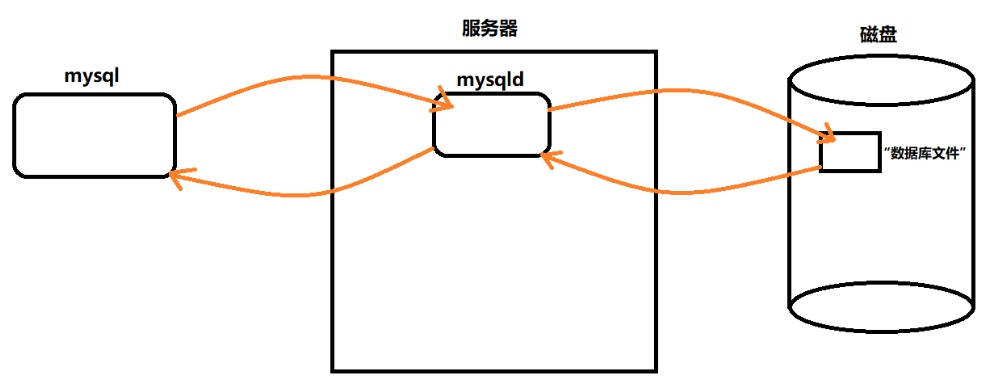

一般文件确实提供了数据的存储功能，但是文件没有提供非常好的数据管理能力（用户角度）

**数据库的本质： 对数据内容存储的一套解决方案，用户将字段或者要求交给 mysql，mysql 再将要求交给 mysqld 服务端，最后 mysqld 再将结果返回给 mysql，然后由 mysql 返回给用户。**

## 二、MySQL 的基本使用

### 连接服务器

```shell
mysql -h 127.0.0.1 -P 3306 -u root -p
```

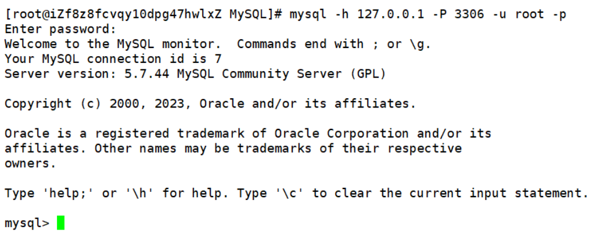

- 如果没有写 -h 127.0.0.1 默认是连接本地
- 如果没有写 -P 3306 默认是连接 3306 端口号

### 服务器管理

1. 执行 `win+r` 输入 `services.msc` 打开服务管理器
2. 通过下图左侧停止，暂停，重启动按钮进行服务管理

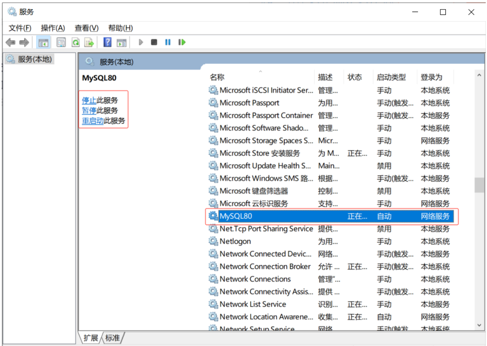

### 服务器、数据库、表关系

所谓安装数据库服务器，只是在机器上安装了一个数据库管理系统程序，这个管理程序可以管理多个数据库，一般开发人员会针对每一个应用创建一个数据库。

为保存应用中实体的数据，一般会在数据库中创建多个表，以保存程序中实体的数据。

数据库服务器、数据库和表的关系如下：

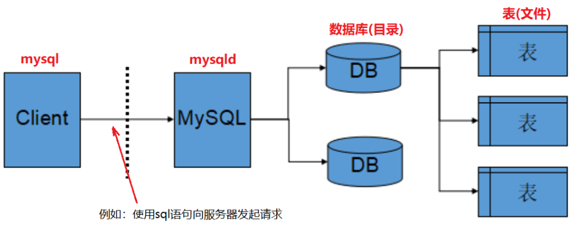

### 使用案例

创建数据库：

```sql
create database helloworld;
```

其中，helloworld 是要创建的新数据库的名称，执行该语句后，MySQL 服务器将在其文件系统上创建一个新的数据库目录，并在其中存储有关该数据库的元数据信息。然后，可以使用该数据库执行其他 SQL 操作，如创建表格、插入数据等。在创建数据库时，还可以通过可选的参数来指定其他属性，例如字符集、校对规则等。

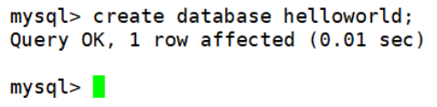

使用数据库：

```sql
use helloworld;
```

helloworld 是指要使用的数据库的名称，在 MySQL 服务器中，可以同时存在多个数据库，使用`use`语句可以让用户指定当前要使用哪个数据库，从而执行该数据库中的 SQL 操作。在使用 use 语句之前，必须先创建要使用的数据库。

显示当前使用的数据库：

```sql
select database();
```

`database()`是一个 SQL 函数，用于返回当前使用的数据库的名称。

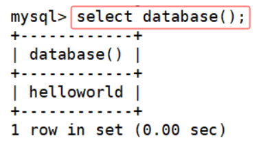

创建数据库表

`create table` 语句用于在关系型数据库中创建新的数据表。数据表是用于存储和组织数据的一种结构化对象，其由列和行组成。

以下是一个简单的 create table 语句的例子，创建一个名为 students 的数据表，该表包 含 id、name 和 age 三个列：

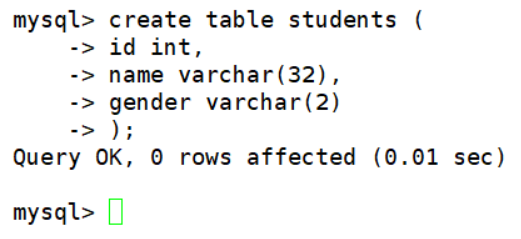

显示数据库中所有表：

```sql
show tables;
```

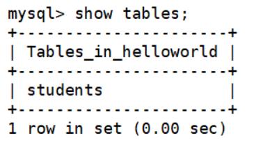

这里我们需要注意的是：**这里的 “Tables*in*数据库名” 中的数据库名表示的是当前使用的数据库名称。**

向表中插入数据：

```sql
insert into student (id, name, gender) values (1, '张三', '男');
insert into student (id, name, gender) values (2, '李四', '女');
insert into student (id, name, gender) values (3, '王五', '男');
```

插入的值必须与数据表中列的数据类型匹配，否则会出现错误，同时，如果插入的值中包含单引号等特殊字符，需要进行转义处理。

查询数据表：

```sql
select * from table_name;
```

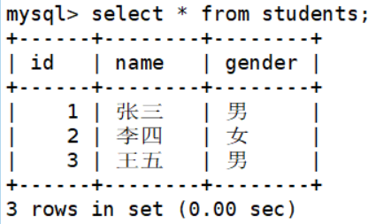

获取数据表的结构信息：

```sql
desc table_name;
```

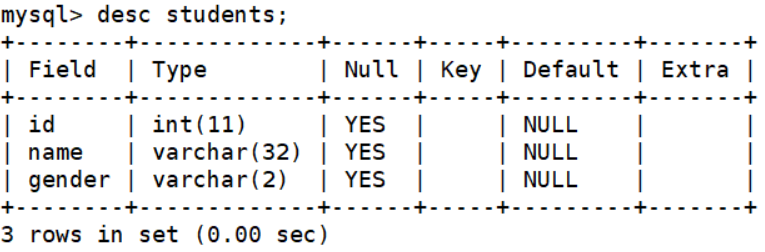

执行该语句后，将返回一个结果集，其中包含数据表的结构信息。结果集中包含以下列：Field、Type、Null、Key、Default、Extra。

- **Field**：数据表中列的名称。
- **Type**：数据表中列的数据类型。
- **Null**：列是否允许为空。
- **Key**：列是否为主键或索引。
- **Default**：列的默认值。
- **Extra**：包含有关列的其他信息。

## 数据的逻辑存储和实际存储

`逻辑存储`

数据库的数据逻辑存储是指在数据库中，如何将数据逻辑地组织和存储的问题。它是数据库设计的一个重要方面，对数据库的性能、可靠性和可扩展性等方面都有重要影响。

数据逻辑存储主要是通过表、视图、索引等方式实现的。具体来说，每个数据库包含多个数据表，每个数据表包含多个数据行和数据列，每个数据列定义了数据类型和其他属性。数据表之间可以通过关联关系进行连接，形成视图。而索引则是一种数据结构，用于快速定位和访问数据表中的数据。

`实际存储`

数据库的数据实际存储结构包括数据页和数据行。

**数据页是数据库管理系统存储数据的最小单位，通常是固定大小的二进制文件。每个数据页通常包含多个数据行和一些元数据信息。数据库会将数据表中的数据按照数据页的大小进行分割和存储，以提高数据的访问效率。**

数据行是数据表中的一条记录，也是数据库中存储数据的基本单位。每个数据行包含若干个列，每个列对应一个数据类型的值。数据行可以看作是数据库中的一个对象，它具有唯一的标识符和属性。

数据库的数据实际存储结构通常是由数据库管理系统自动维护的，用户只需要使用 SQL 语句进行操作即可。不过，在进行数据库设计时，需要考虑数据的存储方式和结构，以便提高数据库的性能和可维护性。

## MySQL 的架构

MySQL 是一个可移植的数据库，几乎能在当前所有的操作系统上运行，如 Unix/Linux、Windows、Mac 和 Solaris。各种系统在底层实现方面各有不同，但是 MySQL 基本上能保证在各个平台上的物理体系结构的一致性。

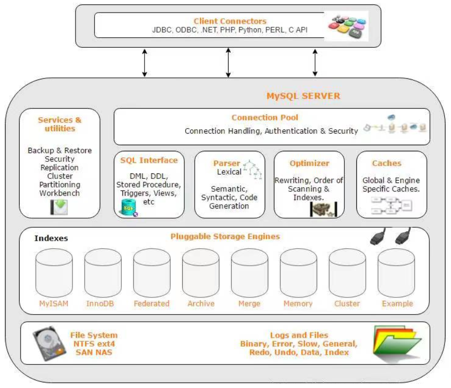

- **客户端**：客户端是 MySQL 的用户界面，它允许用户与 MySQL 服务器进行交互。MySQL 客户端可以是命令行工具，如 mysql 或 mysqladmin，也可以是可视化工具，如 MySQL Workbench。
- **服务端**：MySQL 的服务端包括连接管理器、查询分析器、查询缓存、解析器、优化器、执行器等组件。当客户端连接到 MySQL 服务器时，连接管理器接收并处理连接请求。一旦连接建立，查询分析器将解析和分析查询语句，优化器将生成执行计划，执行器将执行查询并返回结果。
- **存储引擎**：存储引擎是 MySQL 的底层数据存储和检索系统。MySQL 支持多种存储引擎，包括 MyISAM、InnoDB、MEMORY 等。每种存储引擎都有其独特的特点和适用场景。例如，MyISAM 适用于静态数据，InnoDB 适用于高并发性能。

MySQL 服务器的连接管理器负责管理客户端与服务器的连接。当客户端请求连接时，连接管理器会分配一个新的线程来处理该连接。连接管理器会监控连接的活动，当连接空闲时，会关闭它们，以释放服务器资源。

存储引擎层的主要作用包括：

- **数据的物理存储**：存储引擎负责将数据存储在磁盘上，包括表的数据、索引等。
- **数据的检索和处理**：存储引擎负责将查询语句转换成对数据的检索操作，并对结果进行处理和排序等操作。
- **事务处理**：存储引擎负责实现 MySQL 的事务特性，包括事务的开始、提交和回滚等操作。
- **并发控制**：存储引擎负责实现并发控制机制，以保证多个用户同时访问数据库时的数据一致性和完整性。

总的来说，MySQL 的架构采用了**客户端 / 服务端**模式，服务端包括多个组件，存储引擎提供底层数据存储和检索服务。这种架构的优点是可以提高 MySQL 的性能和可扩展性，同时使其更加灵活和可定制。

## SQL 分类

- **DDL【data definition language】 数据定义语言，用来维护存储数据的结构，代表指令: create, drop, alter**
- **DML【data manipulation language】 数据操纵语言，用来对数据进行操作，代表指令： insert，delete，update**
- **DML 中又单独分了一个 DQL，数据查询语言，代表指令： select**
- **DCL【Data Control Language】 数据控制语言，主要负责权限管理和事务，代表指令： grant，revoke，commit**

## 存储引擎

`存储引擎` 是数据库管理系统如何存储数据、如何为存储的数据建立索引和如何更新、查询数据等技术的实现方法。MySQL 的核心就是插件式存储引擎，支持多种存储引擎。

`InnoDB 和 MyISAM 的对比`

1. **事务支持：InnoDB 是支持事务的，而 MyISAM 不支持事务。**
2. **锁机制：InnoDB 采用行级锁，而 MyISAM 采用表级锁。**
