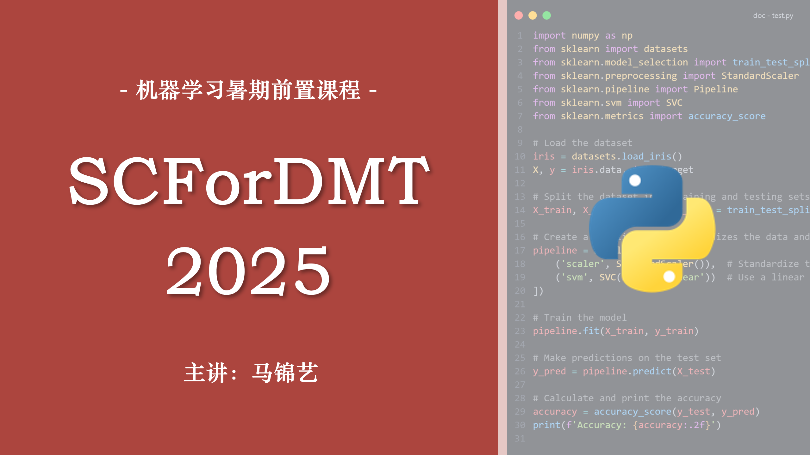

# 数媒暑期知识补充课程(2025)

> 本课程为 2025 年数字媒体技术虚拟现实方向机器学习课程前置知识补充，主要包括 Python 基础、机器学习基础、数据库基础等内容。

## 课程简介

在过去的学习中，我们通过 C 语言初步接触了编程，通过 C# 了解了面向对象语言，通过 HTML、CSS、JS 实践了系统性开发。编程语言的思维是互通的，对于机器学习领域而言，Python 语言则是新的引路石。

本套课程将从 C 语言的回顾开始，带领大家从 Hello World 一步步掌握 Python 语言基础，为后续机器学习课程做好充分准备。

- **主讲**：数媒 2102 班 马锦艺
- **时间**：2025-08-02 至 2025-08-03
- **方式**：[腾讯会议](#会议链接)
- **资料**：[课程资料](https://www.123865.com/s/7vwRjv-0nGxv) | [在线文档](./start.md)
- **复习内容**：[VSCode 安装与使用](https://www.bilibili.com/video/BV1eT421e7P8)

## 课程安排

|    日期    |    时间     |                         内容                          |
| :--------: | :---------: | :---------------------------------------------------: |
| 2025-08-02 | 08:30-11:30 |         Python 基础语法（面向过程、面向对象）         |
| 2025-08-02 | 14:00-17:00 | Python 进阶语法（语法糖、模块化）、常用模块、实战案例 |
| 2025-08-03 | 08:30-11:30 |                  Python 机器学习基础                  |
| 2025-08-03 | 14:00-17:00 |                 数据库入门、查缺补漏                  |

## 会议链接

|    日期    |    时间     |                           会议号                           |
| :--------: | :---------: | :--------------------------------------------------------: |
| 2025-08-02 | 08:30-11:30 | [192-464-187](https://meeting.tencent.com/dm/n84pXxFhwMqD) |
| 2025-08-02 | 14:00-17:00 | [649-289-705](https://meeting.tencent.com/dm/jwDSe4NAcFrr) |
| 2025-08-03 | 08:30-11:30 | [492-252-553](https://meeting.tencent.com/dm/pi6aTTN84m7E) |
| 2025-08-03 | 14:00-17:00 | [111-432-149](https://meeting.tencent.com/dm/x36v6l0sKVhx) |

> 密码见课程群通知
