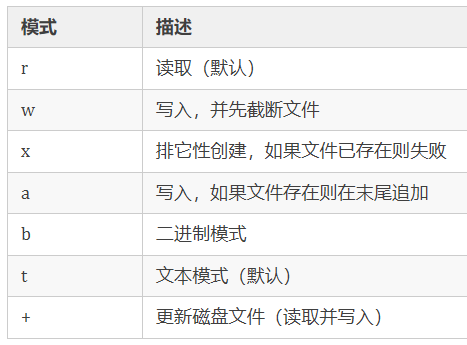
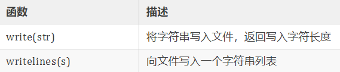
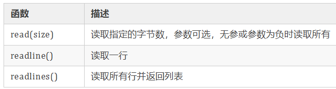

# 是神奇的 Python 魔法！

## 错误与异常处理

程序中的错误我们通常称为 bug ，工作中我们不仅需要改自己程序中的 bug ，还需要改别人程序中的 bug ，新项目有 bug 要改，老项目也有 bug 要改，可以说 bug 几乎贯穿一个程序员的职业生涯... 我们通常将 bug 分为 Error（错误） 和 Exception（异常），我们下面来具体学习下 Python 中的 错误 和 异常。

### 错误

错误 通常是指程序中的 语法错误 或 逻辑错误，来通过两个 Python 例子看一下：

语法错误示例：

```python
if True
    print("hello python")
```

我们编写程序通常使用开发工具编写，比如：我使用 vscode 工具编写 Python 程序，像这种语法错误，在编写程序时，编译器就会检测出来并提示我们，因此，我们编写好的程序几乎不会出现这种问题。

逻辑错误示例：

```python
# 0 是不能作为被除数的
a  = 5
b = 0
print(a / b)

#执行结果：ZeroDivisionError: division by zero
```

逻辑错误编译器是不会提示我们的，因此，我们编写程序时，对一些基本常识要有一定了解，从而，避免出现逻辑错误。

### 异常

即便 Python 程序的语法是正确的，在运行它的时候，也有可能发生错误，运行期检测到的错误被称为异常；大多数的异常都不会被程序处理，都以错误信息的形式展现。

#### Python 内置异常

我们先来看一下异常层次结构：

::: details 异常层次结构

```:line-numbers
BaseException
 +-- SystemExit
 +-- KeyboardInterrupt
 +-- GeneratorExit
 +-- Exception
      +-- StopIteration
      +-- StopAsyncIteration
      +-- ArithmeticError
      |    +-- FloatingPointError
      |    +-- OverflowError
      |    +-- ZeroDivisionError
      +-- AssertionError
      +-- AttributeError
      +-- BufferError
      +-- EOFError
      +-- ImportError
      |    +-- ModuleNotFoundError
      +-- LookupError
      |    +-- IndexError
      |    +-- KeyError
      +-- MemoryError
      +-- NameError
      |    +-- UnboundLocalError
      +-- OSError
      |    +-- BlockingIOError
      |    +-- ChildProcessError
      |    +-- ConnectionError
      |    |    +-- BrokenPipeError
      |    |    +-- ConnectionAbortedError
      |    |    +-- ConnectionRefusedError
      |    |    +-- ConnectionResetError
      |    +-- FileExistsError
      |    +-- FileNotFoundError
      |    +-- InterruptedError
      |    +-- IsADirectoryError
      |    +-- NotADirectoryError
      |    +-- PermissionError
      |    +-- ProcessLookupError
      |    +-- TimeoutError
      +-- ReferenceError
      +-- RuntimeError
      |    +-- NotImplementedError
      |    +-- RecursionError
      +-- SyntaxError
      |    +-- IndentationError
      |         +-- TabError
      +-- SystemError
      +-- TypeError
      +-- ValueError
      |    +-- UnicodeError
      |         +-- UnicodeDecodeError
      |         +-- UnicodeEncodeError
      |         +-- UnicodeTranslateError
      +-- Warning
           +-- DeprecationWarning
           +-- PendingDeprecationWarning
           +-- RuntimeWarning
           +-- SyntaxWarning
           +-- UserWarning
           +-- FutureWarning
           +-- ImportWarning
           +-- UnicodeWarning
           +-- BytesWarning
           +-- ResourceWarning
```

:::

通过上面的异常层次结构，我们可以清晰的看出，BaseException 为所有异常的基类，其下面分为：SystemExit、KeyboardInterrupt、GeneratorExit、Exception 四类异常，Exception 为所有非系统退出类异常的基类，Python 提倡继承 Exception 或其子类派生新的异常；Exception 下包含我们常见的多种异常如：MemoryError（内存溢出）、BlockingIOError（IO 异常）、SyntaxError（语法错误异常）等等

### 异常处理

Python 程序捕捉异常使用 try/except 语句，先看个例子：

```python
def getNum(n):
    try:
        return 10 / n
    except IOError:
        print("IOError时的错误前处理")
        print("Error: IOError argument.")
    except ZeroDivisionError:
        print("ZeroDivisionError时的错误前处理")
        print("Error: ZeroDivisionError argument.")

print(getNum(0))
```

try 语句的工作方式为：

1. 首先，执行 try 子句 （在 try 和 except 关键字之间的部分）；
2. 如果没有异常发生， except 子句 在 try 语句执行完毕后就被忽略了；
3. 如果在 try 子句执行过程中发生了异常，那么该子句其余的部分就会被忽略；
4. 如果异常匹配于 except 关键字后面指定的异常类型，就执行对应的 except 子句，然后继续执行 try 语句之后的代码；
5. 如果发生了一个异常，在 except 子句中没有与之匹配的分支，它就会传递到上一级 try 语句中；
6. 如果最终仍找不到对应的处理语句，它就成为一个 未处理异常，终止程序运行，显示提示信息。

try/except 语句还可以带有一个 else、finally 子句，示例如下：

```python
def getNum(n):
    try:
        print("try --> ", 10 / n)
    except ZeroDivisionError:
        print("except --> Error: ZeroDivisionError argument.")
    else:
        print("else -->")
    finally:
        print("finally -->")

getNum(0)
print("")
getNum(1)

"""
输出：
except --> Error: ZeroDivisionError argument.
finally -->

try -->  10.0
else -->
finally -->
"""
```

其中，else 子句只能出现在所有 except 子句之后，只有在没有出现异常时执行；finally 子句放在最后，无论是否出现异常都会执行。

### 抛出异常

使用 raise 语句允许强制抛出一个指定的异常，要抛出的异常由 raise 的唯一参数标识，它必需是一个异常实例或异常类（继承自 Exception 的类），如：

```python
raise NameError('HiThere')
```

### 自定义异常

正常来说，Python 提供的异常类型已经满足我们的使用了,但是有时候我们有定制性的需求，我们可以自定义异常类，继承自 Error 或 Exception 类就可以了，看个例子：

```python
#自定义异常类 MyExc
class MyExc(Exception):  #继承Exception类
    def __init__(self, value):
        self.value = value
    def __str__(self):
        if self.value == 0:
            return '被除数不能为0'
#自定义方法
def getNum(n):
    try:
        if n == 0:
            exc = MyExc(n)
            print(exc)
        else:
            print(10 / n)
    except:
        pass

'''
1、调用 getNum(1)，输出结果为：
10.0

2、调用 getNum(0)，输出结果为：
被除数不能为0
'''
```

在这个自定义的异常例子中，当参数 n 不为 0 时，则正常，当 n 等于 0，则抛出异常，自定义异常在实际应用中很少用到，了解即可。

## 装饰器

装饰器（decorator）也称装饰函数，是一种闭包的应用，其主要是用于某些函数需要拓展功能，但又不希望修改原函数，它就是语法糖，使用它可以简化代码、增强其可读性，当然装饰器不是必须要求被使用的，不使用也是可以的，Python 中装饰器通过 `@` 符号来进行标识。

装饰器可以基于函数实现也可基于类实现，其使用方式基本是固定的，基本步骤：

1. 定义装饰函数（类）
2. 定义业务函数
3. 在业务函数上添加`@装饰函数（类）名`

:::code-group

```python [基于函数实现]
# 装饰函数
def funA(fun):
    def funB(*args, **kw):
        print("函数 " + fun.__name__ + " 开始执行")
        fun(*args, **kw)
        print("函数 " + fun.__name__ + " 执行完成")

    return funB

@funA
# 业务函数
def funC(name):
    print("Hello", name)

funC("Jhon")

"""
输出：
函数 funC 开始执行
Hello Jhon
函数 funC 执行完成
"""
```

```python [基于类实现]
class Test(object):
    def __init__(self, func):
        print("初始化装饰器，函数名是 %s " % func.__name__)
        self.__func = func

    def __call__(self, *args, **kwargs):
        print(f"函数 {self.__func.__name__} 开始执行")
        self.__func(*args, **kwargs)
        print(f"函数 {self.__func.__name__} 结束执行")

@Test
def hello():
    print("Hello ...")

print("——" * 5)
hello()
print("——" * 5)
hello()
print("——" * 5)

"""
输出：
初始化装饰器，函数名是 hello
——————————
函数 hello 开始执行
Hello ...
函数 hello 结束执行
——————————
函数 hello 开始执行
Hello ...
函数 hello 结束执行
——————————
"""
```

:::

Python 装饰器的 `@...` 相当于将被装饰的函数（业务函数）作为参数传入装饰函数（类）

## 文件操作

在编程工作中文件操作还是比较常见的，基本文件操作包括：创建、读、写、关闭等，Python 中内置了一些文件操作函数，我们使用 Python 操作文件还是很方便的。

### 创建

Python 使用 `open()` 函数创建或打开文件，语法格式如下所示：

```python
open(file, mode='r', buffering=-1, encoding=None, errors=None, newline=None, closefd=True, opener=None)
```

- `file`：表示将要打开的文件的路径，也可以是要被封装的整数类型文件描述符。
- `mode`：是一个可选字符串，用于指定打开文件的模式，默认值是 'r'（以文本模式打开并读取）。可选模式如下：
  
- `buffering`：是一个可选的整数，用于设置缓冲策略。
- `encoding`：用于解码或编码文件的编码的名称。
- `errors`：是一个可选的字符串，用于指定如何处理编码和解码错误（不能在二进制模式下使用）。
- `newline`：区分换行符。
- `closefd`：如果 closefd 为 False 并且给出了文件描述符而不是文件名，那么当文件关闭时，底层文件描述符将保持打开状态；如果给出文件名，closefd 为 True （默认值），否则将引发
- 误。
- `opener`：可以通过传递可调用的 opener 来使用自定义开启器。

以 txt 格式文件为例，我们不手动创建文件，通过代码方式来创建，如下所示：

```python
open('test.txt', mode='w',encoding='utf-8')
```

执行完上述代码，就为我们创建好了 test.txt 文件。

### 写入

上面我们创建的文件 test.txt 没有任何内容，我们向这个文件中写入一些信息，对于写操作，Python 文件对象提供了两个函数，如下所示：



我们使用这两个函数向文件中写入一些信息，如下所示：

```python
wf = open('test.txt', 'w', encoding='utf-8')
wf.write('Tom\n')
wf.writelines(['Hello\n', 'Python'])
# 关闭
wf.close()
```

上面我们使用了 close() 函数进行关闭操作，如果打开的文件忘记了关闭，可能会对程序造成一些隐患，为了避免这个问题的出现，可以使用 `with as` 语句，通过这种方式，程序执行完成后会自动关闭已经打开的文件。如下所示：

```python
with open('test.txt', 'w', encoding='utf-8') as wf:
    wf.write('Tom\n')
    wf.writelines(['Hello\n', 'Python'])
```

### 读取

之前我们已经向文件中写入了一些内容，现在我们读取一下，对于文件的读操作，Python 文件对象提供了三个函数，如下所示：



我们使用上面三个函数读取一下之前写入的内容，如下所示：

```python
with open('test.txt', 'r', encoding='utf-8') as rf:
    print('readline-->', rf.readline())
    print('read-->', rf.read(6))
    print('readlines-->', rf.readlines())
```

## 模块化与包

在 Python 中，一个.py 文件就称之为一个模块（Module）,为了避免模块名冲突，Python 又引入了按目录来组织模块的方法，称为包（Package）。

引入了包以后，只要顶层的包名不与别人冲突，所有模块都不会与别人冲突。

### 自定义模块

我们可以自己写一个模块，但是注意模块命名的时候要注意以下几点：

- 模块名要遵循 Python 变量命名规范，不要使用中文、特殊字符
- 模块名不要和系统模块名冲突，最好先查看系统是否已存在该模块，检查方法是在 Python 交互环境执行 import abc，若成功则说明系统存在此模块

我们现在自己写了一个模块，`culculate.py`

```python
def add(a: int, b: int):
    return a + b

def sub(a: int, b: int):
    return a - b

def mul(a: int, b: int):
    return a * b

def div(a: int, b: int):
    return a / b

if __name__ == "__main__":
    print(add(1, 1))

```

这里我们要提到 `__name__` 属性。每个模块都有 `__name__` 属性。如果我们是在本模块运行的话，`__name__`属性的值为`__main__`，如果是其他模块导入该模块的话，该模块的`__name__`属性值为包名。

所以我们这里判断了`__name__=='__main__`'，如果相等的话，就测试运行代码。当其他模块导入我们模块的话，这里面的测试代码不会执行

#### 模块的内置属性

- `__doc__`：模块中用于描述的文档字符串
- `__name__`：模块名
- `__file__`：模块保存的路径

```python
"""
这里是模块的说明文档
@author: kqcoxn
"""
print(__doc__)
print(__file__)
print(__name__)
```

### 导入模块

假如我们现在要在其他模块导入我们自己写的模块的话，可以有下面几种方法。我们得把我们的包放在 python 能找到的环境变量的路径下面。然后就可以导入了

```python
import culculate  # 导入模块
from culculate import add  # 导入模块中的方法
from culculate import add, sub  # 导入多个方法
from culculate import *  # 导入所有方法
import culculate as jisuanqi  # 导入模块并起别名
```

### 安装第三方模块

我们可以打开 CMD 命令窗口：

```shell
pip install [package_name]
```

此部分我们将在下一节详细演示。

#### 查看模块的属性和方法

`dir(模块名)`

```python
import culculate
print(dir(culculate))
```
