# 梦的开始：从 C 到 Python 入门

## 什么是 Python

### Python 的诞生

1989 年，为了打发圣诞节假期，Gudio van Rossum 吉多· 范罗苏姆（龟叔）决心开发一个新的解释程序（Python 雏形）

1991 年，第一个 Python 解释器诞生

Python 这个名字，来自龟叔所挚爱的电视剧 Monty Python's Flying Circus


### 为什么学习 Python

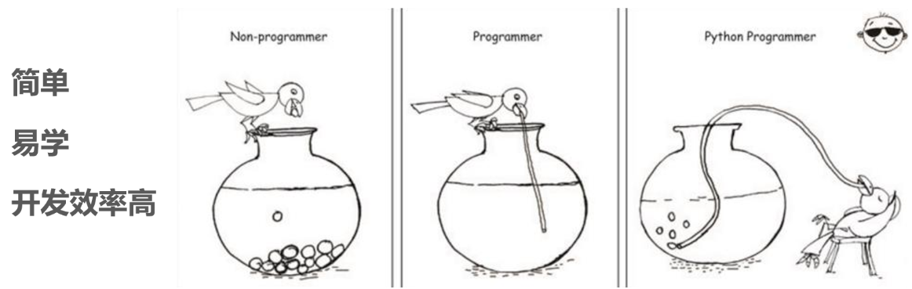

> 简单易学、全球第一、优雅、应用场景丰富

### Python 的应用场景

- **测试开发**
- **运维开发**
- 科学研究
- 大数据开发
- 后端开发
- 数据分析、可视化
- **AI 人工智能**
- ...

## Python 环境及软件的安装

- [Python 解释器环境搭建](../../sklearn/synopsis/env.md)
- [Anaconda 环境搭建](../../sklearn/synopsis/anaconda.md)

## Python 的基础语法

### 字面量

#### 什么是字面量

在代码中，被写下来的固定的值（数据），叫做字面量

```python
"abcd"
1
3.6
```

#### 字面量类型

同时也是值（数据）类型

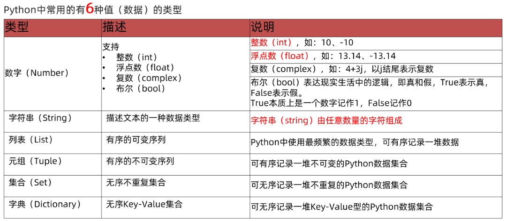

#### 什么是字符串

> 注：先简单提出概念，方便写简易的代码，后续字符串有详解

字符串（string），又称文本，是由任意数量的字符如中文、英文、各类符号、数字等组成，所以叫做字符的串。

Python 中，字符串需要用引号（"字符串内容"）包围起来

```python
"abcde"
'组一辈子的乐队'
"""
你这个人
满脑子都只想到自己呢
"""
```

> 注：实际使用字符串时，无论是单引号，双引号，还是三引号都可以
> 三引号定义法，表示在一堆三个双引号的范围内，均是字符串（可以换行）

### 基础 Python 语句

#### print

print 相当于 C 语言中的 printf ，用法些许类似

如：

::: code-group

```Python
print("abc")
print(123)
print("人类的赞歌就是勇气的赞歌")
```

```C
printf("abc\n");
printf("%d\n", 123);
printf("人类的赞歌就是勇气的赞歌\n");
```

```shell [输出]
> abc
> 123
> 人类的赞歌就是勇气的赞歌
```

:::

需要注意的是，单独输出常数和变量时，不需要使用引号

#### Python 语句格式与 C 的区别

- 行标识：python 语句不需要以分号结尾，而是以每一行作为区分，有点像每一行末尾处都加了分号（当然，实际不是，也不相同）
- 代码缩进：在 C 中，代码的缩进只影响代码的可读性和美观，不影响实际使用；而在 Python 中，代码缩进控制着不同函数相互间的嵌套和归属，Python 通过缩进判断代码块的归属关系。
- 大括号格式：Kernighan 和 Ritchie 格式 (Kb&R 格式)，当大括号内需要有多行语句，左侧的大括号与语句同行，不再另一分行

> 注：Python 语句和 C 语句之间还有很多区别，后续会逐步发掘

### 注释

在程序代码中对程序代码进行解释说明的文字。

注释不是程序，不能被执行，只是对程序代码进行解释说明，让别人可以看懂程序代码的作用，能够大大增强程序的可读性。

#### 单行注释

单行注释一般用于对一行或一小部分代码进行解释，通过`#`号定义，在 \# 号右侧的所有内容均作为注释。\#右边的所有文字当作说明，而不是真正要执行的程序，起辅助说明作用

::: code-group

```Python
# 下面这行代码的作用是输出文字，这行注释本身不影响任何运行结果
print("一旦舍弃了个性，就跟死了没区别")
```

```C
// 下面这行代码的作用是输出文字，这行注释本身不影响任何运行结果
printf("一旦舍弃了个性，就跟死了没区别\n");
```

:::

> 注：\#号和注释内容一般建议以一个空格隔开

#### 多行注释

以 一对三个双引号 引起来 """注释内容""" 来解释说明一段代码的作用使用方法

::: code-group

```Python
"""
下面这行代码的作用是输出文字
这行注释本身不影响任何运行结果
"""
print("一旦舍弃了个性，就跟死了没区别")
```

```C
/*
下面这行代码的作用是输出文字
这行注释本身不影响任何运行结果
*/
printf("一旦舍弃了个性，就跟死了没区别\n");
```

:::

> 注：多行注释可以换行

多行注释一般对：Python 文件、类或方法进行解释

### 变量

#### 什么是变量

在程序运行时，能储存计算结果或能表示值的抽象概念。

简单的说，变量就是在程序运行时，记录数据用的

#### 变量的定义格式

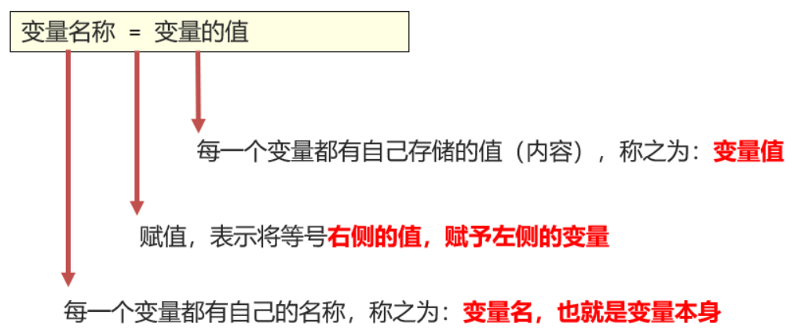

如：

::: code-group

```Python
a = 10
```

```C
int a = 10;
```

:::

### 数据类型（初识）

#### 入门款三种输入类型

目前在入门阶段，我们主要接触如下三类数据类型：

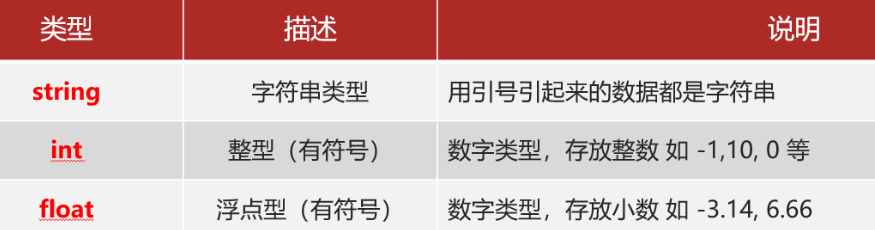

string、int、float 这三个英文单词，就是类型的标准名称。

#### type() 语句

当某个数据编写的令人迷惑时，问题来了，如何验证数据的类型呢？

我们可以通过 type()语句来得到数据的类型：`type(被查看类型的数据)`

```python
type_1 = type("哎呀这个群友怎么这么坏呀")
type_2 = type(123)
type_3 = type(114.514)
print(type_1) # 输出：<class 'str'>
print(type_2) # 输出：<class 'int'>
print(type_3) # 输出：<class 'float'>
```

#### 变量有类型么

变量无类型

我们通过 type(变量)可以输出类型，这是查看变量的类型还是数据的类型？

查看的是：变量存储的数据的类型。因为，变量无类型，但是它存储的数据有。

### 类型转换

数据类型之间，在特定的场景下，是可以相互转换的，如字符串转数字、数字转字符串等

#### 常见的转换语句

```python
x="123"
int_x = int(x)
float_x = float(x)
str_x = str(int_x)
print(int_x, type(int_x)) # 输出：123 <class 'int'>
print(float_x, type(float_x)) # 输出：123.0 <class 'float'>
print(str_x, type(str_x)) # 输出：123 <class 'str'>
```

同前面学习的 type()语句一样，这三个语句，都是带有结果的（返回值），我们可以用 print 直接输出，或用变量存储结果值

#### 类型转换注意事项

类型转换不是万能的，毕竟强扭的瓜不甜，我们需要注意：

1. 任何类型，都可以通过 str()，转换成字符串
2. 字符串内必须真的是数字，才可以将字符串转换为数字
3. 浮点数转整数会丢失精度，也就是小数部分

### 标识符

用户在编程的时候所使用的一系列名字，用于给变量、类、方法等命名。

#### 标识符命名规则

Python 中，标识符命名的规则主要有 3 类：

- 内容限定
- 大小写敏感
- 不可使用关键字

##### 内容限定

标识符命名中，只允许出现：

- 英文
- 中文
- 数字
- 下划线（\_）

这四类元素，其余任何内容都不被允许。

:::tip 注意
可以但不推荐使用中文

数字不可以开头
:::

##### 大小写敏感

以定义变量为例：

- Andy = “安迪 1”
- andy = “安迪 2”

字母 a 的大写和小写，是完全能够区分的。

##### 不可使用关键字

Python 中有一系列单词，称之为关键字，关键字在 Python 中都有特定用途，不可以使用它们作为标识符

[Python 中的关键字](https://docs.python.org/zh-cn/3.10/reference/lexical_analysis.html#keywords)

#### 变量的命名规范

变量的命名要做到：

- 明了：尽量做到，看到名字，就知道是什么意思
- 简洁：尽量在确保 “ 明了 ” 的前提下，减少名字的长度
- 规范：多个单词组合变量名，要使用下划线做分隔（下划线命名法）

```python
name="丰川祥子"
a="丰川祥子"
this_is_my_go_name="丰川祥子"
```

很明显，大多数情况下，都是第一个命名规范更合适一些

### 运算符

#### 算术运算符

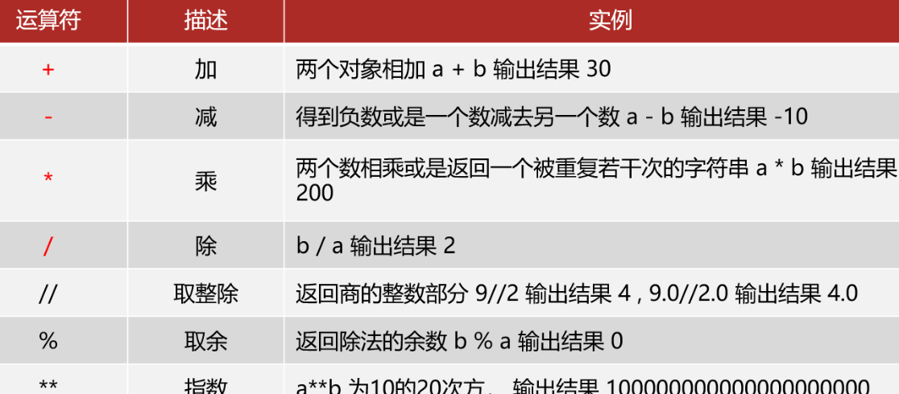

算术运算符的演示：

::: code-group

```Python
a=3
b=4
print(a + b)
print(a - b)
print(a * b)
print(a / b)
print(a // b)
print(a % b)
print(a ** b)
```

```C
int a=3, b=4;
printf("%d\n", a + b);
printf("%d\n", a - b);
printf("%d\n", a * b);
printf("%f\n", (float)a / b);
printf("%d\n", a % b);
printf("%d\n", pow(a, b)); // C语言没有 ** 运算符，需要使用 math.h 库的 pow() 函数
```

```shell [输出]
> 7
> -1
> 12
> 1.333333
> 1
> 1
> 81
```

:::

#### 赋值运算符

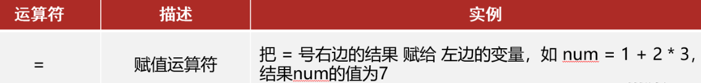

#### 复合赋值运算符

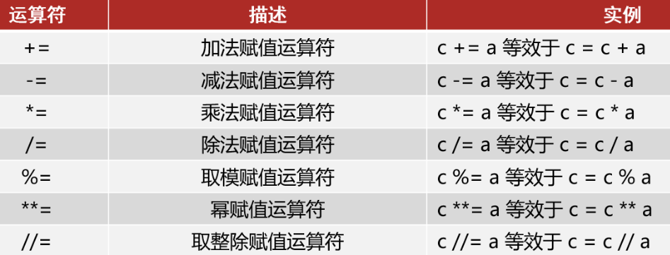

### 字符串

引号的嵌套：

可以使用转移字符（\\）来将引号解除效用，变成普通字符串

单引号内可以写双引号或双引号内可以写单引号

```python
print('\\ "我们联合！"') # 输出：\ "我们联合！"
```

#### 字符串拼接

使用“+”号连接字符串变量或字符串字面量即可

::: code-group

```Python
name = "小祥"
print("这位青年的名字叫做" + name + "，他今年18岁了")
# 输出：这位青年的名字叫做小祥，他今年18岁了
```

```C
char name[] = "小祥";
printf("这位青年的名字叫做%s，他今年%d岁了", name, 18);
// 输出：这位青年的名字叫做小祥，他今年18岁了
```

:::

字符串无法和非字符串变量进行拼接 因为类型不一致，无法接上

```python
name = "祥子"
age = 18
print("这位青年的名字叫做" + name + "年龄周岁是" + age) # 报错 // [!code error]
```

#### 字符串格式化

当变量过多时，我们会发现上述的字符串拼接并不好用，由此引出字符串格式化这个方法。

```python
first_name = "祥子"
last_name = "丰川"
say_hello = "大家好啊，我是%s%s" % (last_name, first_name)
print(say_hello) # 输出：大家好啊，我是丰川祥子
```

- %：占位符
- s：将变量变成字符串放入占位的地方

所以，综合起来的意思就是：我先占个位置，等一会有个变量过来，我把它变成字符串放到占位的位置

:::tip
数字也能用`%s`占位吗？

可以，数字将隐式转换成字符串
:::

Python 中，其实支持非常多的数据类型占位，与 C 语言基本一致。

#### 格式化的精度控制

我们可以使用辅助符号`m.n`来控制数据的宽度和精度

- `m`：控制宽度，要求是数字（很少使用）, 若设置的宽度小于数字自身不生效
- `.n`：控制小数点精度，要求是数字， 会进行小数的四舍五入

示例：

::: code-group

```Python
print("%2.2f" % 1.14514) # 输出： 1.15
```

```C
printf("%.2f", 1.14514); // 输出：1.15
```

:::

#### 声明式格式化

通过语法`f"内容{表达式}"`来快速格式化

:::tip
表达式：一条具有明确执行结果的代码语句
:::

```python
first_name = "祥子"
last_name = "丰川"
print(f"大家好啊，我是{first_name}{last_name}")
# 输出：大家好啊，我是丰川祥子
```

这种写法不做精度控制，也不理会类型，适用于快速格式化字符串

### 输入函数 input()

使用`input(prompt)`语句可以从键盘获取输入，使用一个变量接收（存储）input 语句获取的键盘输入数据即可

要注意，无论键盘输入什么类型的数据，获取到的数据永远都是字符串类型

```python
name = input("好吃吗？") # 输出：好吃吗？
# 输入：软糯小香
print(f"oi，{name}！") # 输出：oi，软糯小香！
```

## 判断语句

### 布尔类型 bool

布尔（bool）表达现实生活中的逻辑，即真和假

- `True` 表示真
- `False` 表示假

True 本质上是一个数字记作 1，False 记作 0

布尔类型也是字面量，也可以用变量存储

### 比较运算符

布尔类型的数据，不仅可以通过定义得到，也可以通过比较运算符进行内容比较得到，比较运算的表达式返回值是布尔类型

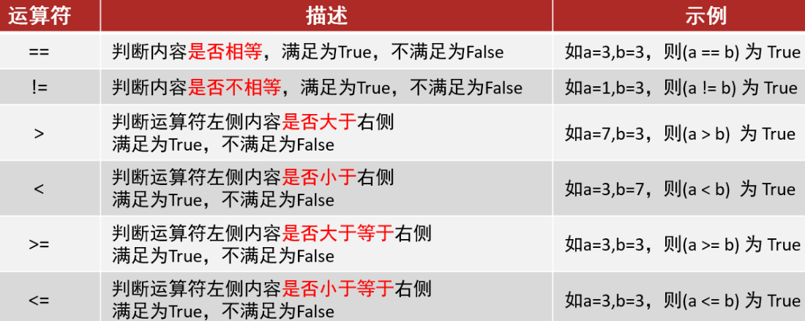

```python
result = 10 > 5
print(f"10 > 5 的结果是{result}，类型是{type(result)}")
# 输出：10 > 5 的结果是True，类型是<class 'bool'>
```

### if 语句

#### if 语句的基础语法格式

```python
if 条件：
    条件成立时执行的代码
```

Python 通过缩进判断代码块的归属关系，归属于 if 判断的代码语句块，需在前方填充 4 个空格缩进

演示代码：

::: code-group

```Python
age = int(input("请输入你的年龄：")) #将字符串转换为整型
# 输入：18
print(f"我今年已经{age}岁了") # 输出：我今年已经18岁了
if age == 18 :
    print("刚满18岁", end=None)
    print("，曼波")
    # 输出:刚满18岁，曼波
print("时间过得真快") # 输出：时间过得真快
```

```C
int age;

printf("请输入你的年龄：");
scanf("%d", &age);
printf("我今年已经%d岁了\n", age);

if (age == 18) {
    printf("刚满18岁");
    printf(", 曼波\n");
}
printf("时间过得真快\n");
```

:::

#### if 语句的注意事项

- 判断条件的结果一定要是布尔类型
- 不要忘记判断条件后的： 引号
- 归属于 if 语句的代码块，需在前方填充 4 个空格缩进

### if-else 语句

::: code-group

```Python
age = 6

if age == 18:
    print("刚满18岁")
elif age > 18:
    print("已经满18岁")
else:
    print("还没满18岁")
# 输出：还没满18岁
```

```C
int age = 6;

if (age == 18) {
    printf("刚满18岁");
} else if (age > 18) {
    printf("已经满18岁");
} else {
    printf("还没满18岁");
}
// 输出：还没满18岁
```

:::

### 判断语句的嵌套

嵌套的关键点在于空格缩进，通过空格缩进来决定语句之间的层次关系

::: code-group

```Python
age = 18
height = 175

if age >= 18:
    print("您已成年")
    if height >= 170:
        print("并且身高达标")
    else:
        print("但身高未达标")
else:
    print("您未成年")

"""
输出：
您已成年
但身高未达标
"""
```

```C
int age = 18;
int height = 175;

if (age >= 18) {
    printf("您已成年\n");
    if (height >= 170) {
        printf("并且身高达标\n");
    } else {
        printf("但身高未达标\n");
    }
} else {
    printf("您未成年\n");
}
```

:::

## 循环语句

### while 循环

#### 基础语法

```python
while(循环条件):
    循环体
```

每次进入循环后，将执行语句全部执行完毕后再次来到判断，如果条件依然成立，则继续进入循环，以此类推，直到条件不成立，跳出循环

注意事项：

- 条件需提供布尔类型结果， True 继续， False 停止
- 空格缩进
- 规划好循环终止条件，否则将无限循环

::: code-group

```Python
i = 0
while i < 5:
    print(i)
    i += 1
"""
输出：
0
1
2
3
4
"""
```

```C
int i = 0;
while (i < 5) {
    printf("%d\n", i++);
}
```

:::

#### while 循环的嵌套

和判断语句的嵌套类似，这里不再长篇介绍

- 注意条件的控制，避免无限循环
- 多层嵌套，主要空格缩进来确定层次关系

### for 循环

#### 语法格式

```python
for 临时变量 in 可迭代对象:
    循环体
```

从待处理数据集中：逐个取出数据，赋值给临时变量

演示代码：

::: code-group

```Python
name = "丰川祥子"
for c in name:
    print(c)
"""
输出：
丰
川
祥
子
"""
```

```C
const char *name = "丰川祥子";
for (int i = 0; name[i] != '\0'; i++) {
    printf("%c\n", name[i]);
}
```

:::

可以看出，for 循环是将字符串的内容依次取出，所以 for 循环也被称之为遍历循环

同 while 循环不同，for 循环是无法定义循环条件的，只能从被处理的数据集中，依次取出内容进行处理。

所以理论上讲，Python 的 for 循环无法构建无限循环（被处理的数据集不可能无限大）

#### range 语句

for 循环语句，本质上是遍历可迭代对象。

尽管除字符串外，其它可迭代类型目前没学习到，但不妨碍我们通过学习`range()`语句，获得一个简单的数字序列（可迭代类型的一种）。

```Python
print(list(range(10))) # [0, 1, 2, 3, 4]
print(list(range(5, 10))) # [5, 6, 7, 8, 9]
print(list(range(0, 10, 2))) # [0, 2, 4]
```

代码演示：

::: code-group

```Python
print("9内的偶数：")
for i in range(1, 9, 2):
    print(i, end=" ")
# 输出：2 4 6
```

```C
printf("9内的偶数：\n");
for (int i = 1; i < 9; i += 2) {
    printf("%d ", i);
}
```

:::

#### 变量的作用域

变量的作用域指变量的有效范围

for 循环中的变量叫做临时变量，其作用域限定为循环内

- 是编程规范的限定，而非强制限定
- 不遵守也能正常运行，但是不建议这样做
- 如需访问临时变量，可以预先在循环外定义它

如果在 for 循环外部访问临时变量：

- 实际上是可以访问到的
- 在编程规范上，是不允许、不建议这么做的

#### for 循环的嵌套

for 循环嵌套模式与 while 循环嵌套以及判断语句的嵌套都类似，注意事项如下：

- 需要注意缩进，嵌套 for 循环同样通过缩进确定层次关系
- for 循环和 while 循环可以相互嵌套使用

### continue 与 break

Python 提供 continue 和 break 关键字

用以对循环进行临时跳过和直接结束

和 C 语言中 continue 和 break 的用法和作用类似

#### continue

- continue 关键字用于：中断本次循环，直接进入下一次循环
- continue 可以用于： for 循环和 while 循环，效果一致
- 当 continue 出现在嵌套循环中时，continue 关键字只可以控制：它所在的循环临时中断

代码演示：

::: code-group

```Python
for i in range(1, 3):
    print(f"第{i}天：今晚的晚霞很漂亮")
    for j in range(7, 10):
        print("今天还是去咖啡店买点面包吧")
        if j == 8:
            continue
        print(f"{j}点了")
    print("")
```

```C
for (int i = 1; i < 3; i++) {
    printf("第%d天：今晚的晚霞很漂亮\n", i);
    for (int j = 7; j < 10; j++) {
        printf("今天还是去咖啡店买点面包吧\n");
        if (j == 8) {
            continue;
        }
        printf("%d点了\n", j);
    }
    printf("\n");
}
```

```shell [输出]
第1天：今晚的晚霞很漂亮
今天还是去咖啡店买点面包吧
7点了
今天还是去咖啡店买点面包吧
今天还是去咖啡店买点面包吧
9点了

第2天：今晚的晚霞很漂亮
今天还是去咖啡店买点面包吧
7点了
今天还是去咖啡店买点面包吧
今天还是去咖啡店买点面包吧
9点了
```

:::

当 `j==8` 时，下面的 print 语句始终没有执行，而是跳了过去继续循环

#### break

break 关键字用于直接结束所在循环

break 可以用于： for 循环和 while 循环，效果一致

当 break 出现在嵌套循环中时，break 关键字同样只可以控制：它所在的循环永久中断

代码演示：

::: code-group

```Python
for i in range(1, 5):
    if i == 3:
        break
    print(i)
```

```C
for (int i = 1; i < 5; i++) {
    if (i == 3) {
        break;
    }
    printf("%d\n", i);
}
```

```shell [输出]
1
2
```

:::

## 函数

函数：是组织好的，可重复使用的，用来实现特定功能的代码段。

我们使用过的：`input()`、`print()`、`str()`、`int()`等都是 Python 的内置函数

- 将功能封装在函数内，可供随时随地重复利用
- 提高代码的复用性，减少重复代码，提高开发效率

### 函数的定义

```python
# 定义函数
def 函数名(参数1, 参数2, ...):
    函数体
    return 返回值

# 调用函数
函数名(参数1, 参数2, ...)
```

- 参数如不需要，可以省略
- 返回值如不需要，可以省略
- 函数必须先定义后使用

### 函数的参数

传入参数的数量是不受限制的，可以不使用参数，也可以仅使用 任意 N 个参数

::: code-group

```Python
# 定义函数
def add(x, y):
    result = x + y
    return result

# 调用函数
result = add(5, 6)
print(result) # 输出：11
```

```C
int add(int x, int y) {
    int result = x + y;
    return result;
}

int result = add(5, 6);
printf("%d\n", result); // 输出：11
```

:::

- 函数定义中，提供的 x 和 y ，称之为：形式参数（形参），表示函数声明将要使用 2 个参数
- 参数之间使用逗号进行分隔
- 函数调用中，提供的 5 和 6 ，称之为：实际参数（实参），表示函数执行时真正使用的参数值
- 传入的时候，按照顺序传入数据，使用逗号分隔

### 函数的返回值

#### return 返回值

函数在执行完成后，返回给调用者的结果

函数体在遇到 return 后就结束了，所以写在 return 后的代码不会执行。

#### None 类型

> 思考：如果函数没有使用 return 语句返回数据，那么函数有返回值吗？
>
> 实际上是：有的。

Python 中有一个特殊的字面量：None，其类型是：`<class 'NoneType'>`，无返回值的函数，实际上就是返回了 `None` 这个字面量

`None` 表示：空的、无实际意义的意思

函数返回的 None 就表示这个函数没有返回什么有意义的内容，也就是返回了空的意思。

None 可以主动使用 return 返回，效果等同于不写 return

None 的应用场景：

- 用在函数无返回值上
- 用在 if 判断上：在 if 判断中，None 等同于 False，一般用于在函数中主动返回 None ，配合 if 判断做相关处理
- 用于声明无内容的变量上
- 定义变量，但暂时不需要变量有具体值，可以用 None 来代替

### 函数的说明文档

函数是纯代码语言，想要理解其含义，就需要一行行的去阅读理解代码，效率比较低。

我们可以给函数添加说明文档，辅助理解函数的作用。

语法如下：

```python
def 函数名(参数1, 参数2, ...):
    """
    说明文档
    :param 参数1: 参数1的含义
    :param 参数2: 参数2的含义
    :return: 返回值的含义
    """
    函数体
    return 返回值
```

- :param 用于解释参数
- :return 用于解释返回值

通过多行注释的形式，对函数进行说明解释，内容应写在函数体之前

在使用大多数现代 IDE 编写代码时，可以通过鼠标悬停，查看调用函数的说明文档

### 函数的嵌套调用

所谓函数嵌套调用指的是一个函数里面又调用了另外一个函数

```python
def func_b():
    print('func_b')
```

执行过程：

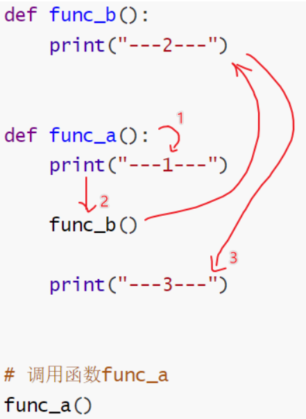

如果函数 A 中，调用了另外一个函数 B，那么先把函数 B 中的任务都执行完毕之后才会回到上次 函数 A 执行的位置

### 变量的作用域

变量作用域指的是变量的作用范围（变量在哪里可用，在哪里不可用），主要分为两类：局部变量和全局变量

#### 局部变量

所谓局部变量是定义在函数体内部的变量，即只在函数体内部生效

局部变量的作用：在函数体内部，临时保存数据，即当函数调用完成后，则销毁局部变量

演示代码：

```python
def test_a():
    num = 100
    print(num) # 输出100

test_a()
print(num) # 报错  // [!code error]
```

变量`a`是定义在`testA`函数内部的变量，在函数外部访问则立即报错.

#### 全局变量

所谓全局变量，指的是在函数体内、外都能生效的变量

> 思考：如果有一个数据，在函数 A 和函数 B 中都要使用，该怎么办？
>
> 答：将这个数据存储在一个全局变量里面

当全局变量和局部变量发生冲突时，优先使用局部变量

```python
num = 100

def test_a():
    print(num) # 输出100

def test_b():
    print(num) # 输出100

test_a()
test_b()
print(num) # 输出100
```

#### global 关键字

使用 global 关键字 可以在函数内部声明变量为全局变量, 当全局变量和局部变量发生冲突时，优先使用局部变量

```python
str = "global"

def test_a():
    global str
    str = "a"

def test_b():
    str = "b"

test_a()
test_b()
print("全局: " + str) # 输出: a
```

## 数据容器

### 数据容器是什么

一种可以存储多个元素的 Python 数据类型

Python 中的数据容器：

一种可以容纳多份数据的数据类型，容纳的每一份数据称之为 1 个元素

每一个元素，可以是任意类型的数据，如字符串、数字、布尔等。

数据容器根据特点的不同，如：

- 是否支持重复元素
- 是否可以修改
- 是否有序

分为 5 类，分别是：

列表（list）、元组（tuple）、字符串（str）、集合（set）、字典（dict）

### list 列表

#### 列表的定义

基本语法：

```python
# 字面量
[元素1,元素2,元素3,元素4, ...]

# 定义变量
变量名称 = [元素1,元素2,元素3,元素4, ...]

# 定义空变量
变量名称 = []
变量名称 = list()
```

- 列表内的每一个数据，称之为元素，以 \[ \] 作为标识
- 列表内每一个元素之间用, 逗号隔开
- 元素的数据类型没有任何限制，甚至元素也可以是列表，这样就定义了嵌套列表

演示代码：

```python
a_list = [True, False]
b_list = [1, 2, "str", ["bule", "white"], a_list]
print(b_list)  # 输出：[1, 2, 'str', ['bule', 'white'], [True, False]]
```

#### 列表的下标索引

如图，列表中的每一个元素，都有其位置下标索引，从前向后的方向，从 0 开始，依次递增

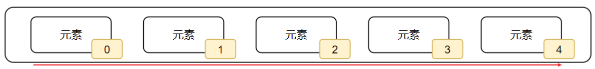

我们只需要按照下标索引，即可取得对应位置的元素。

或者，可以反向索引，如图，从后向前，下标索引为：-1、-2、-3，依次递减。

::: code-group

```Python
num_list = [1, 2, 3, 4, 5]
print(num_list[0]) # 输出：1
print(num_list[2]) # 输出：3
print(num_list[4], num_list[-1]) # 输出：5 5
print(num_list[6]) # 报错
```

```C
int num_list[] = {1, 2, 3, 4, 5};
printf("%d\n", num_list[0]);  // 输出：1
printf("%d\n", num_list[2]);  // 输出：3
printf("%d %d\n", num_list[4]);  // 输出：5 5
// C 语言不支持负数索引
```

:::

嵌套列表时，被嵌套的列表可以看作一个元素，第一个下标就是确定元素是列表\[1,2,3\],再用一个下标取出这个被嵌套的列表中的元素

#### 列表的常用操作(方法)

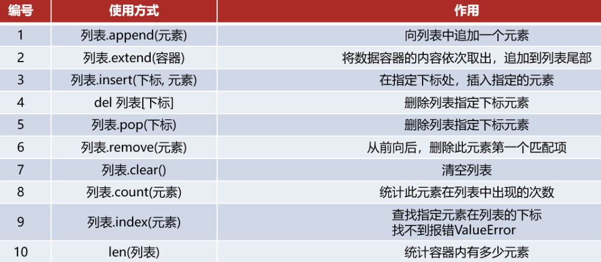

::: code-group

```Python
num_list = [1, 2, 3]
num_list.append(4)
num_list.remove(2)
print(num_list) # 输出：[1, 3, 4]
```

```C
int num_list[10] = {1, 2, 3}; // 预设容量为10，初始3个元素
int size = 3;

// append(4)
num_list[size++] = 4;

// remove(2)
for (int i = 0; i < size; i++) {
    if (num_list[i] == 2) {
        // 元素后移
        for (int j = i; j < size - 1; j++) {
            num_list[j] = num_list[j + 1];
        }
        size--;
        break; // 只移除第一个匹配的元素
    }
}

// print(num_list)
for (int i = 0; i < size; i++) {
    printf("%d ", num_list[i]);
}
// 输出：1 3 4
```

:::

#### 列表的遍历

既然数据容器可以存储多个元素，那么，就会有需求从容器内依次取出元素进行操作。

将容器内的元素依次取出进行处理的行为，称之为：遍历、迭代。

::: code-group

```Python
num_list = [1, 2, 3]
for i in num_list:
    print(i)
"""
输出：
1
2
3
"""
```

```C
int num_list[3] = {1, 2, 3};
for (int i = 0; i < 3; i++) {
    printf("%d\n", num_list[i]);
}
```

:::

### tuple 元组

元组一旦定义完成，就不可修改

#### 元组的定义

元组定义：定义元组使用小括号，且使用逗号隔开各个数据，数据可以是不同的数据类型。

```python
#定义元组字面量
(元素，元素，......，元素)

#定义元组数量
变量名称 = (元素，元素，...... ，元素)

#定义空元组
变量名称 = ()
变量名称 = tuple()
```

- 元组只有一个数据时，这个数据后面要添加逗号，否则不是元组类型！
- 元组也支持嵌套

演示代码：

```python
t2 = ("Hello",)
print(f"t2的类型是：{type(t2)}，t2的内容是：{t2}")
# 输出：t2的类型是：<class 'tuple'>，t2的内容是：('Hello',)
```

#### 元组的相关操作

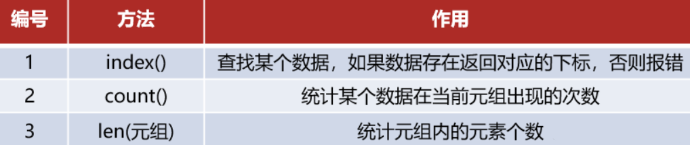

元组由于不可修改的特性，所以其操作方法非常少。

### str 字符串

字符串是字符的容器，一个字符串可以存放任意数量的字符。

同元组一样，字符串是一个无法修改的数据容器。

#### 字符串的下标索引

和其它容器如：列表、元组一样，字符串也可以通过下标进行访问

#### 字符串的常用操作（方法）

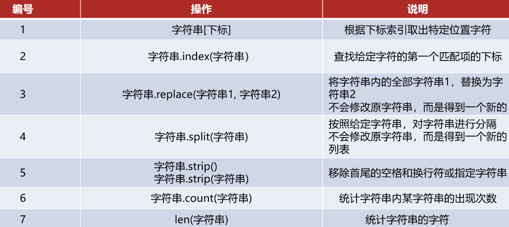

### 序列

序列是指：内容连续、有序，可使用下标索引的一类数据容器

列表、元组、字符串，均可以可以视为序列。

### set 集合

#### 集合的特点

集合内不允许重复元素（去重）

集合内元素是无序的（不支持下标索引）

#### 集合的定义

```python
empty_set = set()
print(f"my_set_empty的内容是：{empty_set}, 类型是：{type(empty_set)}")
# 输出：my_set_empty的内容是：set(), 类型是：<class 'set'>

normal_set = {
    "1",
    "2",
    "3",
    "2",
    "1",
    "3",
}
print(f"my_set的内容是：{normal_set}, 类型是：{type(normal_set)}")
# 输出：my_set的内容是：{'1', '2', '3'}, 类型是：<class 'set'>
```

#### 集合的常用操作

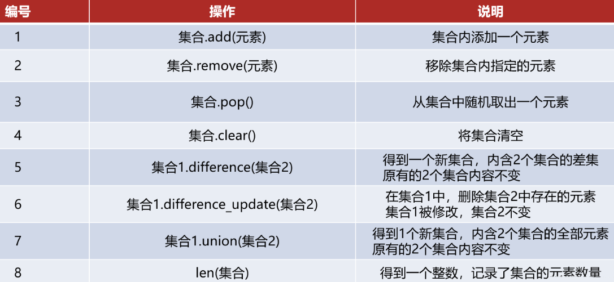

#### 集合的特点

- 可以容纳多个数据
- 可以容纳不同类型的数据（混装）
- 数据是无序存储的（不支持下标索引）
- 不允许重复数据存在
- 可以修改 （增加或删除元素等）
- 支持 for 循环

### dict 字典

#### 字典的定义

通过 key 找出对应的 value

字典的定义，同样使用`{ }`，不过存储的元素是一个个的键值对，如下语法：

- 使用`{ }`存储原始，每一个元素是一个键值对
- 每一个键值对包含 Key 和 Value （用冒号分隔）
- 键值对之间使用逗号分隔
- Key 和 Value 可以是任意类型的数据（ key 不可为字典）
- Key 不可重复，重复会对原有数据覆盖
- 字典不可用下标索引，而是通过 Key 检索 Value
- 键值对 key ：value 三者结合被称为键值对

```python
# 定义字典
dict = {"Name": "kqcoxn", "Age": 22}
# 访问字典元素
print("Name", dict["Name"])  # 输出：kqcoxn
print("Age", dict["Age"])  # 输出：22
```

#### 字典的嵌套

字典的 Key 和 Value 可以是任意数据类型（Key 不可为字典）

演示代码：

```python
stu_score_dict = {
    "堀北铃音": {"语文": 90, "数学": 96, "英语": 94},
    "绫小路清隆": {"语文": 60, "数学": 60, "英语": 60},
    "山内春树": {"语文": 32, "数学": 9, "英语": 34},
}
print(f"绫小路清隆的数学成绩是：{stu_score_dict['绫小路清隆']['语文']}")
# 输出：绫小路清隆的数学成绩是：60

```

#### 字典的常用操作

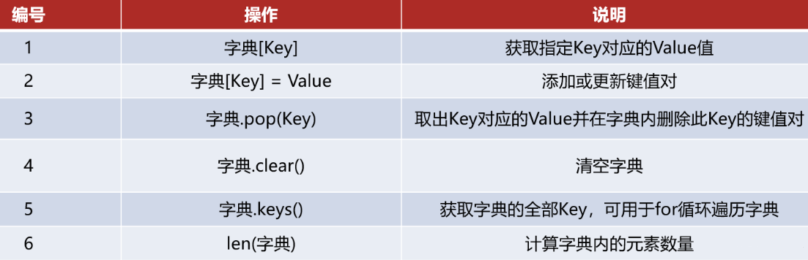
