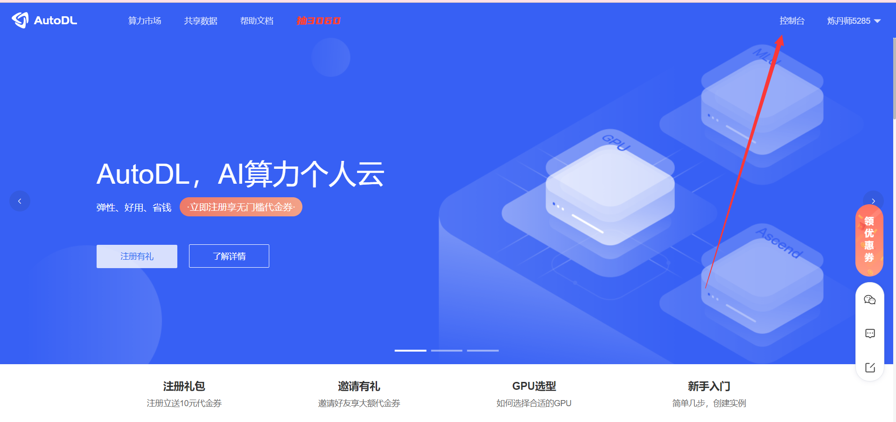
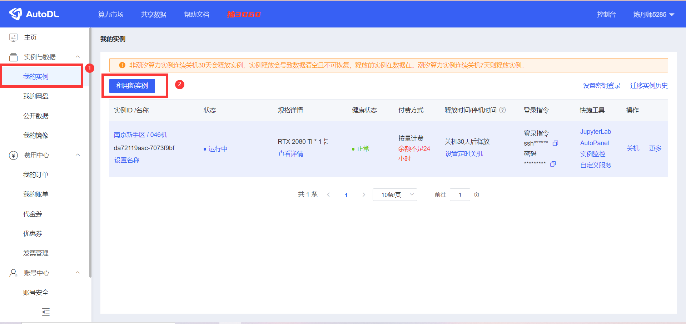
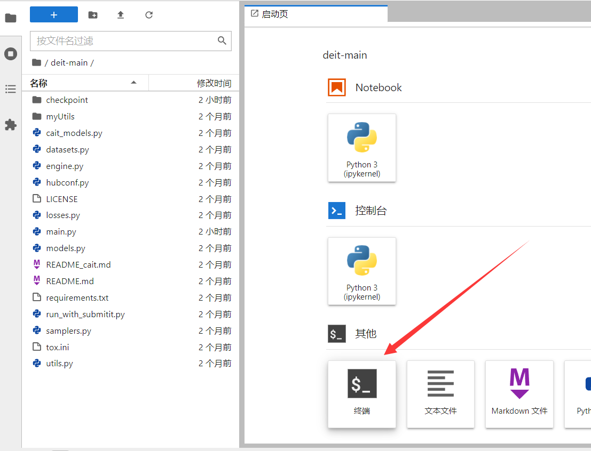
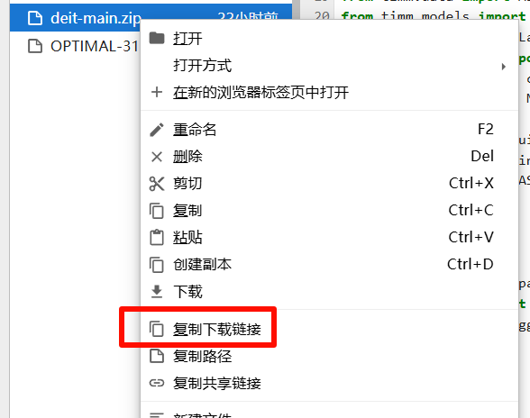

# 云平台使用（以 AutoDL 为例）

## 简介

### 什么是云平台？

云平台（Cloud Platform）是基于云计算技术的一种服务平台，提供计算、存储、网络等资源以及各种软件、工具和服务，帮助用户高效地管理和处理数据。它具有以下几个主要特点：

- **按需服**务：云平台允许用户根据自己的需求动态分配资源，不必预先购买大量硬件设备。用户只需为实际使用的资源付费，这种方式通常称为“按需付费”（Pay-as-you-go）。
- **弹性扩展**：云平台能够根据业务需求灵活调整资源，用户可以根据流量高峰或低谷动态增加或减少计算、存储资源，确保系统始终在最佳状态运行。
- **高可用性和可靠性**：云平台通常会将数据和计算任务分布在多个物理服务器上，以避免单点故障（Single Point of Failure），并通过冗余备份提高数据的安全性和平台的可靠性。
- **资源虚拟化**：云平台通过虚拟化技术，将物理服务器、存储设备、网络设备等资源抽象成虚拟资源，用户无需关心底层的硬件配置，直接使用虚拟化后的资源进行工作。
- **多租户架构**：云平台支持多个用户（租户）同时使用平台资源，而不同用户的资源和数据彼此隔离，保证数据的安全性和隐私性。
- **自动化运维**：云平台提供自动化工具，帮助用户进行资源监控、故障恢复、数据备份等运维任务，降低了企业对 IT 运维的依赖。
- **服务种类丰富**：云平台不仅提供基础的计算和存储资源，还提供各种应用服务和开发工具，如数据库服务、大数据处理、人工智能工具、物联网平台等，支持不同类型的业务需求。

通过使用云平台，企业和个人可以更高效地管理资源、降低运营成本，同时利用云计算技术获得更强大的计算能力和更多的业务创新可能。

### 云平台推荐

云平台由其服务商提供，包括阿里、腾讯、微软、谷歌等 IT 公司一般都有自己的云平台，且对外开放租赁服务，如阿里云、腾讯云、百度云、AWS、Azure 等。

对于简单的小规模训练任务，我们并不需要用到最顶尖的配置，因此很多小型的云平台，比如 AutoDL、蓝耘云 等

本文以 AutoDL 为例，介绍如何使用 AutoDL 的云平台，各个平台的使用方法大致相同。

## 云服务器的使用

在深度学习中，我们一般将云服务器作为用来训练模型的平台，使用云服务器可以高效的获取运行结果。

进入 [AutoDL](https://www.autodl.com/) 官网，注册并登录个人账户，进入控制台



在实例管理页面，点击“租用新实例”按钮，选择实例类型和规格



关键配置如下：


选择合适的实例配置（大多数云平台为按分钟计费，不用时可以直接关闭计费，因此一般无特殊需求越高越好，训练会更快），选择深度学习平台（本文以 PyTorch 为例），点击“创建”按钮。


等待几分钟后，在控制台我们能看到云服务器实例，至此我们就拥有了一个可以训练深度学习模型的云服务器。

## 数据上传

云平台没有我们本地的数据集与代码，因此我们需要进行远程上传。

刚创建好的实例若为开机状态，先关机，之后选择**无卡模式开机**


打开 **JupyterLab**


选择上传的数据集、代码文件等，受服务器系统权限限制，无法安装其他的解压命令，只能用系统自带的 zip 命令，因此上传的文件尽量压缩为 zip 文件


上传完成后打开终端进行环境配置



使用 unzip 命令解压代码文件和数据集：

```shell
unzip [filename.zip]
```

例如：

```shell
unzip ./deit-main.zip
```

注意：需要先进入到解压后的目录下，再进行解压命令

## 服务器常用操作

- 使用`cd`命令切换目录
- 使用`ls`命令可以查看当前目录下的所有文件
- 使用`pip config set global.index-url https://mirrors.aliyun.com/pypi/simple/`更改 pip 镜像源（以阿里镜像源为例）
- 使用`pip install [package_name]`命令安装 python 包，或使用`pip install -r requirements.txt`命令安装已列举的依赖包
- 使用`python main.py`命令运行 python 文件

## 数据导出

训练后我们可能需要将模型、日志、图片等内容导出，可以直接打包成`zip`文件，然后下载到本地。

使用`zip -r [filename.zip] [folder_name]`命令打包文件，例如：

```shell
zip -r ./output.zip ./output
```

右键文件列表，选择“复制下载连接”：



将下载连接粘贴到浏览器网址栏，即可下载 zip 文件。

**注意：服务器需等待下载完毕后再关机。**
