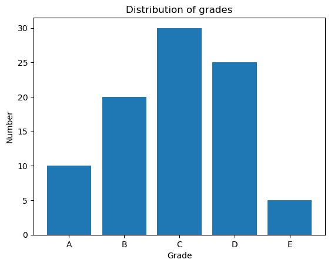

# 2024-08-02 实例练习

## 题目列表

1. 有两个列表，在列表一中删除列表二中出现的元素
2. 编写程序，生成包含 1000 个 1—100 之间的随机整数，并统计每个元素的出现次数。
3. 用户输入一个列表和两个整数作为下标，然后使用切片获取并输出列表中结余两个下标之间的元素组成的子列表。例如，用户输入 \[1,2,3,4,5,6\]和 2,5，程序输出\[3,4,5\]。
4. 将字符串中单词和单词出现的次数保存到字典中
5. 编写程序，生成包含 20 个随机数的列表，然后将前 10 个元素升序排列，后 10 个元素降序排列，并输出结果。
6. 输入若干个成绩，现在需要计算所有成绩的最高分、最低分、平均分，并查找所有最高分同学。每输入一个成绩后询问是否继续输入下一个成绩，回答“yes”就继续输入下一个成绩，回答“no”就停止输入成绩。编写程序实现上述功能
7. 编写程序，至少用两种方法求 100 以内的所有奇数的和。
8. 编写程序，生成包含 50 个随机整数的列表，删除其中最大的素数。
9. 假设有一段英文，其中单独的字母 I 误写为 i，请编写程序进行纠正
10. 编写程序，接收键盘输入字符串，删除字符串中多余的空白字符，连续多个空白字符只保留一个。
11. 用户输入一段英文，然后输出这段英文中所有长度为 5 的英文单词
12. 假设有一个英文文本文件，编写程序读取其内容，并将其中的大写字母变为小写字母，小写字母变为大写字母
13. 已知某科目学生成绩等级和对应人数分别为[A, B, C, D, E] [10, 20, 30, 25, 5]，利用 matplotlib 绘制柱状图，横坐标的文字说明为“Grade”， 纵坐标的文字说明“Number”， 标题为“Distribution of grades”

## 1.删除列表元素

> 有两个列表，在列表一中删除列表二中出现的元素

```python
# 题目没给列表，这里假设一些数据
list1 = [1, 2, 3, 4, 5]
list2 = [2, 4]

# 使用列表推导式简化代码
result = [x for x in list1 if x not in list2]
print(result)
```

输出结果：

```shell
[1, 3, 5]
```

## 2.随机整数生成及统计

> 编写程序，生成包含 1000 个 1—100 之间的随机整数，并统计每个元素的出现次数。

### 2.1 借助 collections 库

```python
import random
from collections import Counter

# 生成随机数
random_nums = [random.randint(1, 100) for i in range(1000)]
print(random_nums)

# 统计随机数出现的次数
count = Counter(random_nums)
print(count)
```

某一次的输出结果：

```shell
[21, 22, 52, 32, 3, 79, 62, 17, 29, 78, 16, 88, 72, 75, 90, 66, 38, 56, 23, 57, 3, 83, 37, 90, 88, 95, 7, 1, 91, 86, 35, 70, 96, 28, 55, 74, 63, 65, 96, 62, 72, 78, 43, 49, 94, 42, 60, 90, 35, 80, 76, 39, 62, 53, 15, 41, 15, 75, 27, 99, 6, 78, 65, 37, 98, 76, 43, 81, 14, 3, 9, 12, 61, 56, 28, 74, 66, 43, 43, 21, 2, 66, 83, 6, 34, 95, 60, 19, 63, 31, 23, 18, 35, 13, 30, 87, 99, 80, 20, 47, 91, 16, 69, 65, 42, 25, 77, 26, 27, 46, 74, 62, 62, 20, 71, 20, 43, 69, 87, 40, 10, 76, 8, 62, 15, 71, 43, 100, 60, 92, 8, 59, 18, 66, 5, 53, 95, 93, 38, 18, 58, 82, 26, 73, 33, 44, 7, 78, 56, 23, 77, 35, 93, 50, 13, 59, 37, 13, 64, 78, 91, 82, 5, 78, 17, 71, 11, 15, 60, 72, 39, 25, 63, 64, 55, 45, 48, 23, 14, 83, 35, 48, 67, 54, 81, 18, 24, 26, 48, 12, 91, 45, 56, 87, 46, 65, 20, 20, 53, 10, 99, 56, 83, 26, 78, 49, 31, 60, 45, 14, 16, 16, 56, 20, 69, 28, 49, 81, 46, 33, 59, 66, 31, 28, 97, 17, 79, 49, 69, 62, 24, 82, 61, 51, 28, 10, 2, 51, 12, 32, 59, 51, 83, 93, 71, 51, 94, 50, 87, 54, 81, 66, 51, 90, 34, 80, 47, 64, 99, 49, 61, 79, 90, 98, 32, 9, 84, 49, 41, 72, 46, 15, 20, 77, 56, 96, 43, 6, 22, 69, 60, 92, 44, 78, 70, 77, 65, 26, 34, 37, 68, 57, 37, 80, 48, 75, 18, 54, 11, 25, 75, 39, 3, 64, 80, 89, 63, 32, 68, 81, 57, 83, 1, 81, 51, 87, 48, 18, 42, 93, 1, 55, 76, 1, 49, 52, 11, 97, 75, 2, 87, 97, 100, 53, 51, 77, 46, 28, 34, 52, 2, 39, 57, 94, 71, 26, 49, 13, 89, 100, 66, 30, 4, 41, 31, 18, 62, 27, 86, 32, 80, 15, 70, 74, 76, 1, 94, 15, 56, 47, 10, 39, 90, 65, 73, 38, 48, 24, 67, 75, 11, 72, 21, 46, 5, 63, 28, 13, 73, 74, 75, 8, 65, 70, 52, 58, 91, 64, 43, 59, 24, 11, 93, 67, 42, 4, 73, 73, 100, 21, 100, 2, 45, 62, 30, 68, 82, 84, 98, 79, 94, 20, 90, 29, 30, 55, 50, 55, 28, 49, 96, 8, 81, 19, 23, 47, 68, 36, 81, 60, 50, 97, 63, 13, 76, 42, 57, 89, 45, 73, 27, 6, 32, 42, 16, 38, 32, 96, 3, 16, 75, 99, 71, 81, 36, 19, 24, 6, 41, 46, 3, 92, 83, 12, 48, 44, 13, 19, 18, 81, 53, 32, 3, 68, 20, 52, 56, 65, 9, 73, 25, 96, 4, 1, 92, 7, 37, 6, 72, 92, 80, 73, 34, 57, 83, 7, 99, 29, 10, 40, 36, 56, 29, 57, 14, 10, 46, 85, 35, 100, 67, 25, 12, 34, 89, 39, 68, 81, 21, 60, 88, 10, 88, 2, 17, 97, 12, 43, 92, 10, 63, 98, 25, 84, 90, 17, 99, 78, 39, 54, 76, 27, 39, 80, 27, 19, 72, 93, 84, 64, 70, 29, 24, 1, 48, 28, 39, 21, 78, 38, 59, 20, 14, 54, 95, 58, 64, 41, 1, 4, 9, 31, 11, 95, 37, 30, 93, 57, 100, 43, 12, 81, 29, 3, 6, 94, 59, 49, 85, 15, 59, 81, 54, 6, 86, 87, 78, 11, 100, 96, 40, 100, 33, 27, 61, 3, 17, 98, 80, 86, 70, 15, 81, 11, 89, 49, 80, 94, 75, 94, 56, 46, 39, 92, 91, 9, 55, 42, 38, 57, 92, 79, 22, 23, 87, 40, 82, 78, 49, 20, 73, 17, 25, 54, 4, 55, 35, 55, 25, 95, 59, 75, 48, 67, 72, 14, 1, 28, 7, 52, 74, 13, 96, 51, 51, 14, 29, 6, 60, 41, 43, 35, 23, 40, 31, 94, 24, 68, 45, 90, 9, 51, 34, 56, 81, 68, 60, 81, 26, 7, 1, 25, 10, 76, 10, 32, 64, 46, 41, 31, 82, 15, 57, 53, 53, 5, 35, 20, 1, 32, 2, 91, 91, 11, 63, 83, 60, 3, 91, 34, 20, 51, 16, 56, 73, 7, 52, 62, 87, 80, 3, 51, 27, 57, 13, 80, 98, 19, 23, 37, 75, 80, 9, 66, 4, 35, 39, 25, 25, 58, 59, 70, 52, 74, 59, 18, 63, 35, 96, 52, 82, 2, 89, 62, 77, 71, 37, 62, 66, 78, 33, 77, 75, 31, 2, 31, 50, 3, 71, 18, 20, 38, 64, 50, 19, 26, 67, 40, 84, 70, 94, 88, 99, 80, 41, 3, 54, 81, 96, 51, 60, 68, 68, 29, 22, 51, 29, 13, 12, 66, 57, 37, 6, 99, 8, 49, 33, 46, 44, 24, 48, 33, 61, 51, 4, 21, 34, 63, 66, 86, 53, 47, 99, 21, 34, 11, 70, 51, 29, 22, 98, 69, 15, 47, 83, 8, 27, 60, 15, 47, 100, 13, 39, 97, 54, 17, 81, 96, 29, 66, 26, 93, 66, 8, 22, 25, 73, 77, 94, 5, 22, 60, 28, 89, 31, 76, 92, 62, 1, 58, 31, 93, 60, 87, 11, 45, 47, 9, 27, 55, 78, 21, 54, 62, 12, 65, 94, 46, 30, 64, 7, 92, 39, 70, 7, 42, 63, 72, 18, 62, 38, 65, 29, 50, 18, 25, 40, 59, 27, 69, 17, 26, 32, 70, 85, 35, 28, 11, 23, 7, 24, 84, 18, 8, 67, 6, 96, 37, 11, 19, 86, 7, 68, 86, 61, 94, 30, 39, 2, 46, 41, 59, 13, 90, 68, 24, 1, 37, 62, 66, 85, 60, 90, 47, 31, 89, 38, 54, 9, 30, 77, 30, 15, 90, 12, 59, 100, 31, 56, 61, 22, 68, 80, 99, 13, 15, 13, 79, 61, 79]
Counter({81: 18, 62: 16, 60: 16, 51: 16, 80: 15, 78: 14, 66: 14, 56: 14, 39: 14, 15: 14, 13: 14, 20: 14, 59: 14, 3: 13, 1: 13, 49: 13, 94: 13, 31: 13, 18: 13, 25: 13, 46: 13, 11: 13, 68: 13, 29: 12, 75: 12, 90: 12, 57: 12, 37: 12, 35: 12, 96: 12, 28: 12, 32: 11, 7: 11, 70: 11, 63: 11, 43: 11, 27: 11, 99: 11, 6: 11, 100: 11, 73: 11, 54: 11, 83: 10, 65: 10, 12: 10, 2: 10, 34: 10, 87: 10, 26: 10, 10: 10, 92: 10, 64: 10, 48: 10, 24: 10, 21: 9, 52: 9, 17: 9, 72: 9, 38: 9, 23: 9, 91: 9, 55: 9, 76: 9, 41: 9, 9: 9, 30: 9, 47: 9, 77: 9, 93: 9, 22: 8, 42: 8, 53: 8, 61: 8, 19: 8, 71: 8, 8: 8, 89: 8, 79: 7, 16: 7, 86: 7, 74: 7, 98: 7, 14: 7, 69: 7, 40: 7, 82: 7, 50: 7, 45: 7, 67: 7, 4: 7, 95: 6, 33: 6, 97: 6, 84: 6, 88: 5, 5: 5, 58: 5, 44: 4, 85: 4, 36: 3})
```

### 2.2 手动实现统计

```python
import random

# 生成随机数
random_nums = [random.randint(1, 100) for i in range(1000)]
print(random_nums)

# 哈希统计
count_dict = {}
for num in random_nums:
    if num in count_dict:
        count_dict[num] += 1
    else:
        count_dict[num] = 1
print(count_dict)
```

某一次的输出结果：

```shell
[67, 66, 14, 63, 17, 93, 48, 50, 64, 52, 89, 16, 14, 97, 11, 37, 13, 92, 63, 27, 88, 99, 27, 28, 64, 40, 4, 45, 14, 44, 29, 74, 1, 27, 76, 65, 15, 38, 54, 33, 82, 100, 92, 34, 47, 66, 28, 1, 21, 3, 71, 92, 88, 82, 73, 76, 28, 62, 1, 16, 35, 5, 61, 13, 76, 49, 13, 75, 15, 21, 92, 91, 75, 79, 16, 39, 49, 94, 2, 59, 88, 78, 3, 66, 36, 8, 91, 40, 52, 48, 33, 9, 98, 25, 64, 68, 4, 2, 43, 30, 76, 53, 62, 35, 33, 8, 88, 35, 65, 63, 67, 100, 31, 36, 68, 36, 84, 65, 22, 90, 5, 47, 38, 89, 49, 87, 21, 41, 68, 99, 37, 1, 91, 9, 81, 12, 65, 37, 27, 51, 85, 85, 99, 27, 2, 43, 65, 82, 7, 3, 7, 71, 5, 88, 80, 46, 63, 73, 98, 58, 57, 53, 26, 7, 11, 68, 52, 73, 80, 18, 21, 39, 45, 65, 43, 76, 15, 14, 75, 75, 28, 30, 3, 21, 25, 72, 77, 23, 87, 90, 33, 95, 44, 13, 93, 24, 79, 28, 44, 1, 26, 31, 75, 89, 95, 33, 79, 6, 58, 19, 6, 96, 52, 82, 70, 80, 29, 80, 1, 43, 91, 61, 62, 76, 13, 86, 100, 7, 56, 2, 39, 31, 60, 4, 36, 68, 3, 73, 7, 1, 31, 16, 76, 15, 36, 5, 87, 41, 79, 91, 49, 83, 79, 96, 1, 44, 59, 10, 5, 95, 91, 16, 52, 75, 39, 59, 65, 35, 96, 96, 71, 5, 24, 29, 35, 24, 100, 87, 10, 9, 48, 1, 93, 98, 91, 87, 31, 23, 53, 9, 23, 47, 58, 64, 96, 96, 87, 48, 63, 35, 33, 99, 83, 48, 13, 13, 13, 97, 18, 65, 27, 20, 75, 42, 66, 13, 2, 15, 92, 79, 21, 88, 96, 14, 18, 93, 12, 12, 31, 5, 25, 34, 97, 33, 22, 91, 42, 68, 2, 20, 12, 9, 4, 55, 92, 60, 16, 91, 23, 38, 48, 37, 80, 66, 47, 94, 90, 23, 45, 77, 59, 11, 63, 15, 16, 15, 6, 3, 94, 54, 74, 81, 47, 73, 34, 33, 16, 84, 70, 12, 21, 6, 20, 85, 18, 75, 69, 65, 2, 2, 37, 28, 2, 37, 16, 82, 24, 77, 5, 51, 69, 89, 2, 6, 41, 23, 44, 9, 95, 61, 34, 48, 21, 100, 38, 22, 6, 82, 100, 4, 32, 89, 64, 91, 22, 95, 16, 58, 15, 98, 7, 66, 83, 15, 88, 67, 40, 65, 94, 82, 40, 56, 82, 65, 75, 61, 50, 96, 40, 49, 39, 45, 61, 13, 71, 23, 67, 67, 2, 28, 55, 100, 12, 8, 55, 30, 75, 1, 16, 99, 46, 66, 34, 91, 81, 95, 44, 20, 23, 65, 86, 87, 14, 11, 66, 32, 90, 71, 11, 51, 36, 56, 25, 14, 12, 93, 1, 85, 18, 17, 15, 39, 13, 31, 27, 10, 38, 64, 66, 67, 96, 2, 61, 96, 36, 37, 95, 72, 55, 20, 53, 74, 68, 26, 25, 23, 16, 16, 75, 99, 47, 76, 2, 65, 47, 49, 33, 79, 8, 64, 87, 87, 73, 4, 27, 94, 92, 55, 29, 32, 83, 39, 95, 79, 16, 79, 29, 13, 24, 9, 25, 51, 94, 93, 78, 97, 24, 35, 10, 35, 90, 33, 61, 93, 63, 38, 69, 44, 10, 20, 26, 95, 59, 70, 11, 73, 1, 10, 5, 43, 59, 43, 99, 32, 21, 14, 17, 61, 61, 56, 37, 31, 77, 83, 88, 63, 59, 53, 100, 82, 61, 19, 85, 98, 62, 90, 1, 53, 53, 96, 65, 91, 62, 6, 65, 87, 26, 90, 36, 72, 96, 19, 95, 34, 26, 57, 32, 55, 63, 22, 9, 67, 90, 38, 50, 64, 2, 40, 83, 7, 82, 7, 11, 51, 85, 32, 52, 51, 68, 51, 73, 32, 79, 77, 22, 67, 85, 60, 86, 54, 99, 73, 35, 73, 60, 10, 1, 49, 81, 59, 85, 28, 80, 55, 18, 5, 95, 93, 34, 80, 58, 69, 27, 97, 54, 36, 84, 8, 30, 62, 46, 27, 32, 86, 15, 10, 54, 22, 94, 3, 4, 52, 92, 23, 11, 26, 40, 55, 69, 81, 17, 74, 66, 56, 62, 16, 54, 97, 21, 93, 42, 6, 46, 99, 93, 2, 27, 13, 16, 27, 37, 18, 9, 32, 8, 24, 22, 94, 64, 30, 86, 88, 20, 91, 54, 63, 46, 36, 81, 33, 65, 58, 68, 42, 80, 25, 58, 97, 68, 8, 21, 6, 32, 23, 52, 14, 31, 18, 11, 7, 69, 17, 50, 3, 97, 54, 87, 95, 35, 81, 26, 23, 70, 73, 43, 58, 26, 75, 44, 22, 86, 100, 65, 42, 30, 94, 43, 97, 35, 78, 45, 11, 60, 84, 1, 29, 93, 69, 96, 50, 93, 52, 17, 12, 58, 38, 87, 31, 77, 91, 59, 6, 64, 70, 16, 88, 60, 55, 67, 1, 77, 2, 17, 38, 79, 38, 36, 10, 26, 79, 25, 63, 30, 8, 98, 28, 29, 94, 57, 57, 73, 1, 35, 100, 72, 36, 21, 75, 45, 67, 92, 62, 79, 81, 84, 87, 48, 82, 9, 10, 87, 84, 77, 64, 3, 34, 9, 80, 90, 87, 58, 67, 49, 49, 22, 7, 67, 90, 80, 100, 81, 68, 45, 44, 32, 6, 19, 10, 97, 72, 63, 98, 9, 52, 85, 77, 71, 86, 36, 78, 41, 45, 63, 54, 1, 87, 37, 73, 41, 17, 21, 89, 5, 56, 65, 45, 17, 69, 46, 100, 93, 98, 64, 38, 76, 24, 11, 96, 71, 99, 31, 90, 64, 22, 52, 96, 8, 60, 6, 50, 92, 56, 91, 29, 11, 80, 16, 7, 96, 85, 11, 77, 78, 23, 70, 12, 55, 45, 100, 70, 37, 98, 74, 73, 98, 28, 22, 39, 64, 36, 83, 94, 46, 19, 28, 15, 18, 83, 61, 27]
{67: 12, 66: 10, 14: 9, 63: 13, 17: 9, 93: 13, 48: 8, 50: 6, 64: 14, 52: 11, 89: 6, 16: 18, 97: 10, 11: 13, 37: 11, 13: 13, 92: 10, 27: 13, 88: 10, 99: 10, 28: 11, 40: 7, 4: 7, 45: 10, 44: 9, 29: 8, 74: 5, 1: 18, 76: 9, 65: 18, 15: 12, 38: 11, 54: 9, 33: 11, 82: 11, 100: 13, 34: 8, 47: 7, 21: 13, 3: 9, 71: 7, 73: 14, 62: 8, 35: 12, 5: 11, 61: 11, 49: 9, 75: 13, 91: 15, 79: 13, 39: 8, 94: 11, 2: 16, 59: 9, 78: 5, 36: 14, 8: 9, 9: 12, 98: 10, 25: 8, 68: 11, 43: 8, 30: 7, 53: 7, 31: 11, 84: 6, 22: 12, 90: 11, 87: 16, 41: 5, 81: 9, 12: 9, 51: 7, 85: 10, 7: 11, 80: 11, 46: 7, 58: 10, 57: 4, 26: 10, 18: 9, 72: 5, 77: 10, 23: 13, 95: 12, 24: 8, 6: 12, 19: 5, 96: 16, 70: 7, 86: 7, 56: 7, 60: 7, 83: 8, 10: 11, 20: 7, 42: 5, 55: 10, 69: 8, 32: 11}
```

## 3.列表切片

> 用户输入一个列表和两个整数作为下标，然后使用切片获取并输出列表中结余两个下标之间的元素组成的子列表。例如，用户输入 \[1,2,3,4,5,6\]和 2,5，程序输出\[3,4,5\]。

```python
# 获取输入
list = "1,2,3,4,5,6"  # list = input("请输入一个列表：")
list = list.replace(" ", "").split(",")  # 转化为列表
list = [int(i) for i in list]  # 转化为整数列表

indexes = "2,5"  # indexes = input("请输入两个整数作为下标：")
indexes = indexes.replace(" ", "").split(",")  # 转化为列表
indexes = [int(i) for i in indexes]  # 转化为整数列表

# 切片
list = list[indexes[0]:indexes[1]]
print(list)
```

输出结果：

```shell
[3, 4, 5]
```

## 4.字符串处理

> 将字符串中单词和单词出现的次数保存到字典中

### 4.1 借助 collections 库

```python
import re
from collections import Counter

# 题目没给列表，这里假设一些数据
text = "Hello world, this is a test."

# 统计
text = text.lower()  # 转为小写
count = Counter(re.split(r'[\s.,!?;:]', text))  # 枚举常用的标点符号进行分割，使用正则表达式优化代码
count.pop('', None)  # 去除空白符
print(count)
```

输出结果：

```shell
Counter({'hello': 1, 'world': 1, 'this': 1, 'is': 1, 'a': 1, 'test': 1})
```

### 4.2 手动实现统计

```python
import re

# 题目没给列表，这里假设一些数据
text = "Hello world, this is a test."

# 处理字符串
text = text.lower()  # 转为小写
text = re.split(r'[\s.,!?;:]', text)  # 枚举常用的标点符号进行分割，使用正则表达式优化代码

# 统计词频
count = {}
for word in text:
    if word in count:
        count[word] += 1
    else:
        count[word] = 1
print(count)
```

输出结果：

```shell
{'hello': 1, 'world': 1, '': 2, 'this': 1, 'is': 1, 'a': 1, 'test': 1}
```

## 5.列表排序

> 编写程序，生成包含 20 个随机数的列表，然后将前 10 个元素升序排列，后 10 个元素降序排列，并输出结果。

```python
import random

# 生成列表
list = [random.randint(0, 100) for i in range(20)]
print(list)

# 排序
list = sorted(list[:10]) + sorted(list[10:], reverse=True)
print(list)
```

某一次的输出结果：

```shell
[24, 50, 87, 30, 65, 59, 23, 61, 63, 57, 68, 12, 88, 61, 37, 99, 91, 78, 38, 54]
[23, 24, 30, 50, 57, 59, 61, 63, 65, 87, 99, 91, 88, 78, 68, 61, 54, 38, 37, 12]
```

## 6.年轻人的第一款 Python 打分系统

> 输入若干个成绩，现在需要计算所有成绩的最高分、最低分、平均分，并查找所有最高分同学。每输入一个成绩后询问是否继续输入下一个成绩，回答“yes”就继续输入下一个成绩，回答“no”就停止输入成绩。编写程序实现上述功能

```python
scores = []
while True:
    # 输入成绩
    score = input("请输入成绩：")
    scores.append(int(score))

    # 计算最高分、最低分、平均分
    highest_score = max(scores)
    lowest_score = min(scores)
    average_score = sum(scores) / len(scores)
    print("最高分：", highest_score, "最低分：", lowest_score, "平均分：", average_score)

    # 查找最高分同学
    highest_students = [i for i, score in enumerate(scores) if score == highest_score]  # 找出所有最高分同学的索引
    print("最高分同学索引：", highest_students)

    # 询问是否继续输入下一个成绩
    answer = input("是否继续输入下一个成绩？（yes/no）")
    if answer.lower() == "no":
        break
```

请自行尝试输入一些成绩，并观察程序的运行结果。

## 7.求奇数和

> 编写程序，至少用两种方法求 100 以内的所有奇数的和。

### 7.1 列表解析

```python
s = sum([i for i in range(1, 100) if i % 2 != 0])
print(s)
```

输出结果：

```shell
2500
```

### 7.2 range 步长

```python
s = sum(range(1, 100, 2))
print(s)
```

输出结果：

```shell
2500
```

## 8.删除最大素数

> 编写程序，生成包含 50 个随机整数的列表，删除其中最大的素数。

```python
import random


# 判断是否为素数
def is_prime(n):
    if n < 2:
        return False
    for i in range(2, int(n**0.5) + 1):
        if n % i == 0:
            return False
    return True


# 生成列表
list = [random.randint(2, 1000) for i in range(50)]
print(list)

# 筛选删除最大的素数的列表
primes = [x for x in list if is_prime(x)]
if primes:
    primes.pop()
print(primes)
```

某一次的输出结果：

```python
[381, 161, 731, 512, 379, 235, 90, 554, 748, 633, 211, 15, 938, 924, 76, 905, 907, 106, 356, 215, 140, 726, 772, 230, 268, 413, 756, 661, 568, 879, 547, 640, 925, 608, 173, 530, 478, 969, 368, 387, 75, 326, 486, 399, 954, 697, 795, 838, 289, 185]
[379, 211, 907, 661, 547]
```

## 9.大小写转换

> 假设有一段英文，其中单独的字母 I 误写为 i，请编写程序进行纠正

```python
# 题目没给列表，这里假设一些数据
text = "i am an i in the middle of a sentence."

# 将所有出现的 "i" 改为 "I"
text = text.replace(" i ", " I ")
print(text)
```

输出结果：

```shell
i am an I in the middle of a sentence.
```

## 10.删除多余空白符

> 编写程序，接收键盘输入字符串，删除字符串中多余的空白字符，连续多个空白字符只保留一个。

### 10.1 借助正则表达式

```python
import re

s = "    This   is  an example   string.  "  # s = input()

# 将多个空格替换为单个空格
s = re.sub(r'\s+', ' ', s).strip()
print(s)
```

输出结果：

```shell
This is an example string.
```

### 10.2 手动实现空白符删减

```python
s = "    This   is  an example   string.  "  # s = input()

result = ''
in_spaces = False
for char in s:
    # 如果遇到空格，且之前没有遇到空格，则添加一个空格
    if char.isspace():
        if not in_spaces:
            result += ' '
            in_spaces = True
    # 否则，添加字符，并重置空格标志
    else:
        result += char
        in_spaces = False
result = result.strip()  # 去掉开头和结尾的空格
print(result)
```

输出结果：

```shell
This is an example string.
```

## 11.匹配指定长度单词

> 用户输入一段英文，然后输出这段英文中所有长度为 5 的英文单词

### 11.1 借助正则表达式

```python
import re

text = "The quick brown fox jumps over those lazy dogs."  # text = input()
target_words = [re.findall(r'\b\w{5}\b', text)]  # 匹配5个字母的单词
print(target_words)
```

输出结果：

```shell
[['quick', 'brown', 'jumps', 'those']]
```

### 11.2 手动实现单词长度检测

```python
text = "The quick brown fox jumps over those lazy dogs."  # text = input()
target_words = [word for word in text.replace(".", "").replace(",", "").replace("!", "").replace("?", "").split() if len(word) == 5]  # 去除标点符号，分词，筛选长度为5的词
print(target_words)
```

输出结果：

```shell
[['quick', 'brown', 'jumps', 'those']]
```

## 12.读取文件内容并修改大小写

> 假设有一个英文文本文件，编写程序读取其内容，并将其中的大写字母变为小写字母，小写字母变为大写字母

```python
# 读取文档内容
with open(r'./path-to-your-file/text.txt', 'r') as file:
    text = file.read()
print(text)

# 转换大小写
swapped_text = text.swapcase()
print(swapped_text)

with open(r'./path-to-your-file/text.txt', 'w') as file:
    file.write(swapped_text)
```

## 13.绘制柱状图

> 已知某科目学生成绩等级和对应人数分别为[A, B, C, D, E] [10, 20, 30, 25, 5]，利用 matplotlib 绘制柱状图，横坐标的文字说明为“Grade”， 纵坐标的文字说明“Number”， 标题为“Distribution of grades”

```python
import matplotlib.pyplot as plt

# 初始化数据
grades = ['A', 'B', 'C', 'D', 'E']
numbers = [10, 20, 30, 25, 5]

# 绘制条形图
plt.bar(grades, numbers)
plt.xlabel('Grade')
plt.ylabel('Number')
plt.title('Distribution of grades')

# 显示图形
plt.show()
```

输出结果：


