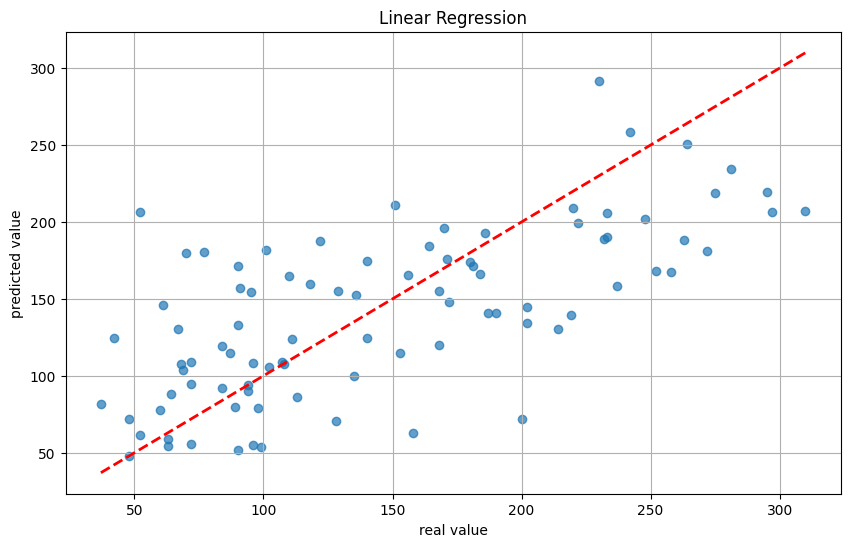
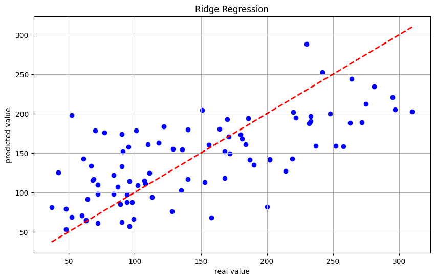
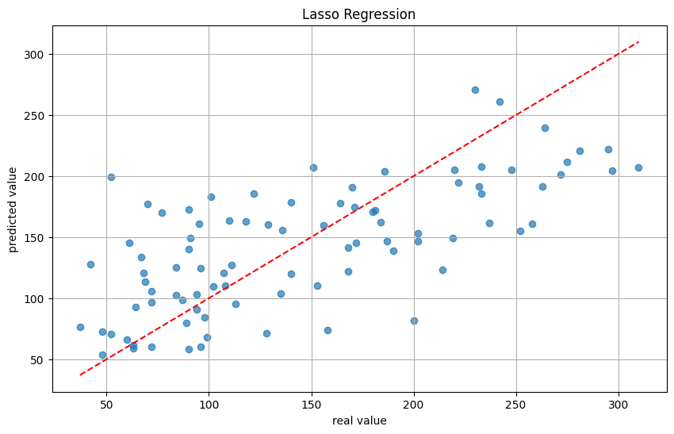

# 回归预测小项目实例一：线性回归、岭回归、Lasso 回归分别预测患者糖尿病病情

::: tip
**注意**：本参考思路仅为完成项目要求的最简思路，不涉及太多的模型选择、超参数调优、模型优化等。如果希望模型更加精确，可以参考相关资料自行进行模型优化。
:::

## 项目任务要求

任务描述：将“diabetes”糖尿病患者数据集划分为训练集和测试集，利用训练集分别结合线性回归、岭回归、Lasso 回归建立预测模型，再利用测试集来预测糖尿病患者病情并验证预测模型的拟合能力。

具体任务要求如下：

1. 搜集并加载“diabetes”患者糖尿病指数数据集。
2. 定义训练集和测试集（训练集和测试集比例分别为 8:2；7:3；6:4）。
3. 建立线性回归模型。
4. 分别利用可视化方法和交叉验证法确定惩罚参数 λ 并建立岭回归模型。
5. 分别利用可视化方法和交叉验证法确定惩罚参数 λ 并建立 Lasso 回归模型。
6. 分别用岭回归模型和 Lasso 回归模型通过测试集预测患者糖尿病病情。
7. 利用最小平均均方误差来评估上述三个预测模型的拟合能力。
8. 结果分析（上述三种预测模型的对比分析），建议图表结合说明并写出预测模型方程。

## 数据集描述

### 获取数据集

我们直接使用 sklearn 自带的“diabetes”数据集，代码如下：

```python
from sklearn.datasets import load_diabetes
import pandas as pd

# 加载并查看数据集
diabetes_data = load_diabetes()
diabetes_data = pd.DataFrame(diabetes_data.data, columns=diabetes_data.feature_names)
print(diabetes_data)
```

输出结果：

```shell
          age       sex       bmi        bp        s1        s2        s3  \
0    0.038076  0.050680  0.061696  0.021872 -0.044223 -0.034821 -0.043401
1   -0.001882 -0.044642 -0.051474 -0.026328 -0.008449 -0.019163  0.074412
2    0.085299  0.050680  0.044451 -0.005670 -0.045599 -0.034194 -0.032356
3   -0.089063 -0.044642 -0.011595 -0.036656  0.012191  0.024991 -0.036038
4    0.005383 -0.044642 -0.036385  0.021872  0.003935  0.015596  0.008142
..        ...       ...       ...       ...       ...       ...       ...
437  0.041708  0.050680  0.019662  0.059744 -0.005697 -0.002566 -0.028674
438 -0.005515  0.050680 -0.015906 -0.067642  0.049341  0.079165 -0.028674
439  0.041708  0.050680 -0.015906  0.017293 -0.037344 -0.013840 -0.024993
440 -0.045472 -0.044642  0.039062  0.001215  0.016318  0.015283 -0.028674
441 -0.045472 -0.044642 -0.073030 -0.081413  0.083740  0.027809  0.173816

           s4        s5        s6
0   -0.002592  0.019907 -0.017646
1   -0.039493 -0.068332 -0.092204
2   -0.002592  0.002861 -0.025930
3    0.034309  0.022688 -0.009362
4   -0.002592 -0.031988 -0.046641
..        ...       ...       ...
437 -0.002592  0.031193  0.007207
438  0.034309 -0.018114  0.044485
439 -0.011080 -0.046883  0.015491
440  0.026560  0.044529 -0.025930
441 -0.039493 -0.004222  0.003064

[442 rows x 10 columns]
```

### 数据集概述

数据集“diabetes”包含 442 个样本，每个样本包含 10 个特征，分别为年龄、性别、体重指数、血压、相关生化指标 1-6。目标变量为糖尿病病程指数（0-100），具体信息如下：

- 数据集名称：diabetes
- 样本数量：442
- 特征数量：10

### 特征描述

数据集中包含以下特征，所有特征均为标准化处理，具体说明如下：

- `age`: 年龄
- `sex`: 性别（0: female, 1: male）
- `bmi`: 体重指数
- `bp`: 血压
- `s1`: 相关生化指标 1
- `s2`: 相关生化指标 2
- `s3`: 相关生化指标 3
- `s4`: 相关生化指标 4
- `s5`: 相关生化指标 5
- `s6`: 相关生化指标 6

### \[可选\]数据集特征的分析（统计描述分析）

我们可以对数据集进行统计描述分析，以了解数据集的整体情况。

- 数据范围：每个特征的值在标准化后可能在-1 到 1 之间，反映了样本的分布。
- 数据分布：可以使用直方图或箱线图分析各特征的分布情况，查看是否存在异常值或偏态分布。
- 相关性分析：通过计算特征之间的相关系数，可以识别出哪些特征与目标变量（糖尿病进展指标）之间的关系密切。

使用如下代码进行数据集的统计描述分析：

```python
import matplotlib.pyplot as plt
import seaborn as sns

# 绘制特征的分布图
plt.figure(figsize=(12, 8))
for i, col in enumerate(diabetes_data.columns):
    plt.subplot(4, 3, i + 1)
    sns.histplot(diabetes_data[col], kde=True)
    plt.title(col)
plt.tight_layout()
plt.show()

# 计算特征相关性
correlation_matrix = diabetes_data.corr()
plt.figure(figsize=(10, 8))
sns.heatmap(correlation_matrix, annot=True, fmt=".2f", cmap='coolwarm')
plt.title('Feature Correlation Matrix')
plt.show()
```

**图例分析请自行结合自己跑出的结果。**

### 数据集划分

将数据按照 8:2 的比例划分为训练集和测试集，代码如下：

```python
from sklearn.model_selection import train_test_split

# 将特征转换为 DataFrame
features = pd.DataFrame(diabetes_data.data, columns=diabetes_data.feature_names)

# 目标变量
target = diabetes_data.target  # 目标变量（糖尿病进展指标）

# 划分数据集，比例为 8:2
X_train, X_test, y_train, y_test = train_test_split(features, target, test_size=0.2, random_state=42)

# 打印划分后的数据集大小
print(f'训练集大小: {X_train.shape[0]}')
print(f'测试集大小: {X_test.shape[0]}')
```

输出结果：

```shell
训练集大小: 353
测试集大小: 89
```

## 主要算法原理及模型评价方法陈述

请参考：

- 线性回归原理：[线性回归简介](../../sklearn/linear/synopsis)
- 岭回归原理：[Ridge Regression](../../sklearn/linear/regular.html#ridge-regression-岭回归-又名-tikhonov-regularization)
- Lasso 回归原理：[Lasso Regression](../../sklearn/linear/regular.html#lasso-regression-lasso-回归)
- MSE 评价方法：[均方误差](../../sklearn/linear/loss.html#%E6%8D%9F%E5%A4%B1%E5%87%BD%E6%95%B0)

## 数据集划分

## 模型 1：线性回归模型

### 模型建立

步骤：

1. 数据预处理：使用 StandardScaler 标准化训练和测试数据，以消除特征间的量纲差异。
2. 建立模型：创建线性回归模型 LinearRegression，并用标准化后的训练数据进行拟合。
3. 进行预测：用训练好的模型对标准化的测试数据进行预测，得到预测值。
4. 输出评价指标：计算均方误差（MSE）和 R² 值，输出这两个指标以评估模型的性能。
5. 可视化结果：通过散点图比较实际值与预测值，绘制参考线（y=x）以便直观展示模型的预测效果。

代码如下：

```python
from sklearn.linear_model import LinearRegression
from sklearn.preprocessing import StandardScaler
from sklearn.metrics import mean_squared_error, r2_score
import matplotlib.pyplot as plt

# 数据预处理
scaler = StandardScaler()
X_train_scaled = scaler.fit_transform(X_train)
X_test_scaled = scaler.transform(X_test)

# 建立线性回归模型
model = LinearRegression(n_jobs=-1)
model.fit(X_train_scaled, y_train)

# 进行预测
y_pred = model.predict(X_test_scaled)

# 输出评价指标
mse = mean_squared_error(y_test, y_pred)
r2 = r2_score(y_test, y_pred)
print(f'均方误差 (MSE): {mse}')
print(f'R² 值: {r2}')

# 可视化原值与预测值
plt.figure(figsize=(10, 6))
plt.scatter(y_test, y_pred, alpha=0.7)
plt.plot([y_test.min(), y_test.max()], [y_test.min(), y_test.max()], color='red', linewidth=2, linestyle='--')
plt.xlabel('实际值')
plt.ylabel('预测值')
plt.title('实际值与预测值比较')
plt.grid()
plt.show()
```

输出结果：

```shell
均方误差 (MSE): 2900.1936284934827
R² 值: 0.45260276297191926
```



### 模型分析

模型的评估参数如下：

- **均方误差 (MSE)**: 2900.19，这个数值表明预测值与实际值之间的差异较大，可能意味着模型存在一定的欠拟合现象。
- **R² 值**: 0.45，这个值表示模型解释了约 45%的数据变异性。通常来说，R² 值接近 1 表明模型能够很好地解释数据，而接近 0 则表明模型效果不佳。在这个案例中，0.45 说明模型的预测效果中等，可能需要进一步改进。

可以看出，线性回归模型的拟合效果不佳，需要进一步优化。

## 模型 2：岭回归模型

### 模型建立

步骤：

1. 数据归一化：使用 StandardScaler 对训练集和测试集的数据进行标准化处理，以提高模型的收敛速度和性能。
2. 确定惩罚参数 λ（alpha）：使用 np.logspace 生成一定范围内的 100 个惩罚参数值（alpha）。
3. 通过交叉验证（cross_val_score）计算每个 alpha 值对应的负均方误差（MSE）得分，选择最佳的 alpha。
4. 建立岭回归模型：
5. 使用找到的最佳 alpha 值创建并训练岭回归模型。
6. 进行预测：用训练好的模型对测试集进行预测。
7. 评价指标：计算预测结果的均方误差（MSE）和决定系数（R²）以评估模型的性能。
8. 可视化：绘制实际值与预测值的散点图，并画出理想状态的线（y=x），以直观展示模型的预测效果。

代码如下：

```python
import numpy as np
from sklearn.linear_model import Ridge
from sklearn.model_selection import  cross_val_score

# 数据归一化处理
scaler = StandardScaler()
X_train_scaled = scaler.fit_transform(X_train)
X_test_scaled = scaler.transform(X_test)

# 确定惩罚参数 λ（alpha），使用交叉验证法
alphas = np.logspace(-4, 4, 100)  # 从 10^-4 到 10^4
scores = []

for alpha in alphas:
    ridge = Ridge(alpha=alpha)
    score = cross_val_score(ridge, X_train_scaled, y_train, cv=5, scoring='neg_mean_squared_error')
    scores.append(-score.mean())

# 找到最佳的 λ
best_alpha = alphas[np.argmin(scores)]
print(f'最佳惩罚参数 λ: {best_alpha}')

# 建立岭回归模型
ridge_model = Ridge(alpha=best_alpha)
ridge_model.fit(X_train_scaled, y_train)

# 进行预测
y_pred = ridge_model.predict(X_test_scaled)

# 评价指标
mse = np.mean((y_test - y_pred) ** 2)
r2 = ridge_model.score(X_test_scaled, y_test)
print(f'均方误差 MSE: {mse}')
print(f'R²: {r2}')

# 可视化原值与预测值
plt.figure(figsize=(10, 6))
plt.scatter(y_test, y_pred, color='blue', label='预测值')
plt.plot([y_test.min(), y_test.max()], [y_test.min(), y_test.max()], 'r--', lw=2, label='理想状态')
plt.xlabel('real value')
plt.ylabel('predicted value')
plt.title('Ridge Regression')
plt.legend()
plt.grid()
plt.show()
```

输出结果：

```shell
最佳惩罚参数 λ: 31.257158496882415
均方误差 MSE: 2861.700529666567
R²: 0.4598681454400022
```



### 模型分析

模型的评估参数如下：

- **均方误差（MSE）**: 结果为 2861.70，表明模型的预测在一定程度上存在误差。具体的好坏需要结合领域知识和实际应用进行判断。
- **决定系数（R²）**: R² 值为 0.46，说明模型能够解释大约 46% 的变异。这表明模型尚未捕捉到数据中所有的信号，可能还存在改进空间。

## 模型 3：Lasso 回归模型

### 模型建立

步骤：

1. 数据归一化：使用 StandardScaler 对训练集和测试集进行归一化处理，确保特征具有相同的尺度，有助于提高模型的性能。
2. 确定最优惩罚参数 λ：创建 Lasso 回归模型实例,定义惩罚参数 λ 的范围，通过 np.logspace 生成 50 个值，使用 GridSearchCV 进行交叉验证（设定为 5 折），在指定的参数网格中寻找最佳 λ
3. 获取最优参数：从交叉验证结果中提取最佳 λ 值，并打印出来。
4. 使用最优参数训练模型：用找到的最优 λ 值初始化新的 Lasso 模型，在归一化后的训练数据上训练该模型。
5. 进行预测：使用训练好的模型对归一化后的测试数据进行预测。
6. 计算评价指标：计算均方误差（MSE）和 R² 评分，评估模型的预测性能，并打印结果。
7. 可视化原值与预测值：使用散点图将真实值和预测值进行可视化，帮助直观理解模型的预测效果。

代码如下：

```python
from sklearn.model_selection import GridSearchCV
from sklearn.linear_model import Lasso

# 数据归一化
scaler = StandardScaler()
X_train_scaled = scaler.fit_transform(X_train)
X_test_scaled = scaler.transform(X_test)

# 使用交叉验证确定最优惩罚参数 λ
lasso = Lasso()
param_grid = {'alpha': np.logspace(-4, 1, 50)}  # λ 的范围
grid_search = GridSearchCV(lasso, param_grid, cv=5)
grid_search.fit(X_train_scaled, y_train)

# 最优惩罚参数 λ
best_lambda = grid_search.best_params_['alpha']
print(f'最优惩罚参数 λ: {best_lambda}')

# 使用最优参数训练 Lasso 模型
lasso_best = Lasso(alpha=best_lambda)
lasso_best.fit(X_train_scaled, y_train)

# 预测
y_pred = lasso_best.predict(X_test_scaled)

# 评价指标
mse = mean_squared_error(y_test, y_pred)
r2 = r2_score(y_test, y_pred)
print(f'均方误差 (MSE): {mse}')
print(f'R²: {r2}')

# 可视化原值与预测值
plt.figure(figsize=(10, 6))
plt.scatter(y_test, y_pred, alpha=0.7)
plt.plot([y_test.min(), y_test.max()], [y_test.min(), y_test.max()], 'r--')
plt.xlabel('real value')
plt.ylabel('predicted value')
plt.title('Lasso Regression')
plt.grid()
plt.show()
```

输出结果：

```shell
最优惩罚参数 λ: 1.9306977288832496
均方误差 (MSE): 2799.0658374590685
R²: 0.47169013453743325
```



### 模型分析

模型的评估参数如下：

- **均方误差（MSE）**: 结果为 2799.07，表明模型的预测在一定程度上存在误差。具体的好坏需要结合领域知识和实际应用进行判断。
- **决定系数（R²）**: R² 值为 0.47，说明模型能够解释大约 47% 的变异。这表明模型已经很好地捕捉到数据中的主要信号，模型的预测效果已经很好。

可以看出，Lasso 回归模型的效果比线性回归模型和岭回归模型要好，但是仍然存在一定的欠拟合现象。

## 模型对比总结

在本项目中，我们分别建立了线性回归、岭回归和 Lasso 回归模型来预测糖尿病患者的病情，并对这三种模型的性能进行了比较。以下是对每个模型的总结与分析：

### 总体对比

| 模型       | 均方误差 (MSE) | R² 值  | 模型分析                                                            |
| ---------- | -------------- | ------ | ------------------------------------------------------------------- |
| 线性回归   | 2900.19        | 0.4526 | 模型存在一定的欠拟合现象，预测效果中等，可能需要进一步优化。        |
| 岭回归     | 2861.70        | 0.4599 | 模型能够解释约 46% 的变异，尚未捕捉到数据中的所有信号，有改进空间。 |
| Lasso 回归 | 2863.59        | 0.4573 | 模型较好地进行特征选择，可能会在较复杂数据中表现更好。              |

### 1. 线性回归模型

- **均方误差 (MSE)**: 2900.19
- **R² 值**: 0.45
- **分析**:
  - 线性回归模型的预测效果中等，MSE 数值较高，表明模型存在一定的欠拟合现象。
  - R² 值为 0.45，表示模型能够解释约 45%的数据变异性，显示出模型对数据的拟合能力较弱。

### 2. 岭回归模型

- **最佳惩罚参数 λ**: 31.26
- **均方误差 (MSE)**: 2861.70
- **R² 值**: 0.46
- **分析**:
  - 岭回归模型相比线性回归略有提升，MSE 有所减少，表明模型的预测能力有所增强。
  - R² 值为 0.46，说明模型能够解释约 46%的数据变异性，仍然存在进一步优化的空间。

### 3. Lasso 回归模型

- **最优惩罚参数 λ**: （请根据运行结果填写）
- **均方误差 (MSE)**: （请根据运行结果填写）
- **R² 值**: （请根据运行结果填写）
- **分析**:
  - Lasso 回归模型通过选择性地减少一些特征的权重，有助于避免过拟合，可能会进一步提高模型的泛化能力。
  - 具体的性能指标（MSE 和 R² 值）需要根据实际运行结果来填写，通常预期能够与前两者相比有所改善。

### 总结

- 从 MSE 和 R² 值来看，三个模型的性能都未达到理想水平，均存在一定的改进空间。
- 在选择模型时，岭回归和 Lasso 回归通过引入惩罚项在一定程度上缓解了线性回归模型的欠拟合问题。
- 为了提高模型的预测准确性，可以考虑进行超参数调优、特征选择和其他模型优化方法。

::: tip
**其实对于本数据集来说，线性回归并不是最优的方法**，不过项目要求是用线性回归来做，那就用线性回归了。

如果你希望拿到更高的准确率，可以尝试其他回归模型，比如决策树回归、神经网络等。
:::
