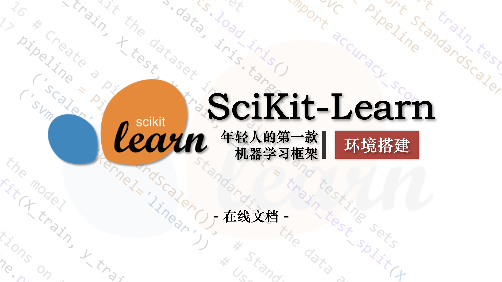
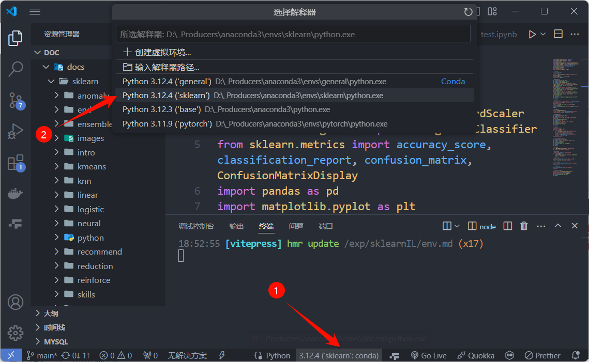
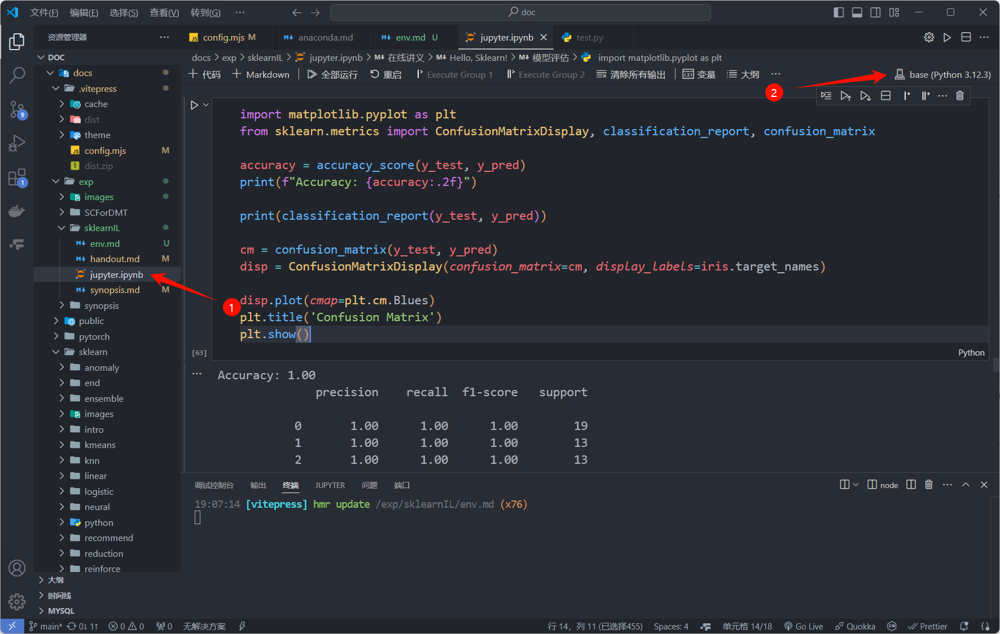

# 在线文档

> sklearn 环境搭建



## 关于 Anaconda

Anaconda 是一个强大的开源数据科学平台,它将很多好的工具整合在一起，极大地**简化了使用者的工作流程**。

下面我们就开始安装 Anaconda。

:::tip
完整版安装教程可以查看[Anaconda 环境搭建](../../sklearn/synopsis/anaconda)。
:::

## 卸载 Python

> 如果你从未安装过 Python，请忽略这一步。

Anaconda 的安装分两种情况：

- **情况一**：电脑现在没有装 python 或者现在装的可以卸载掉（装 Anaconda 前先卸载 python）
- **情况二**： 电脑目前装了 python，但想保留它 (比较复杂，请参考网上其他教程)

**如果是情况二，我强烈建议把你的情况改成情况一**！

### 验证是否安装了 Python

在开始安装 Anaconda 之前，我们需要先确认电脑上是否已经安装了 Python。

打开命令提示符（Windows，按下 `Win+R` 打开运行框，输入 `cmd`）或终端（Mac/Linux），输入以下命令：

```shell
python --version
```

如果输出 Python 的版本号，说明 Python 已经安装，我们需要卸载它。

### 卸载 Python（若已安装了 Python）

- Windows：在开始菜单中搜索 `控制面板`，然后点击 `程序`，然后点击 `卸载或更改程序`。找到（可以直接搜索`python`）并点击 `Python 3.x`，然后点击 `卸载`。
- Mac/Linux：打开终端，输入以下命令：

```shell
sudo apt-get remove python3
```

### 检查并删除环境变量（若安装过 Python）

查看用户自己设置的环境变量（使用 windows 自带的**搜索**，关键词为“**环境变量**”），也就是上面那一栏


找到 `path`，选中 path 并点击`编辑`，进入查看自己设置过的环境变量


将 python 相关的变量全部**删除**，如图中两个值，都选中，然后点击删除，**再确定**（如果卸载完 python 的时候环境变量自动删掉了就不用管）


在退出时，不要忘记**外面还有几个确认按钮，也需要点击，不要直接叉掉**，否则并没有保存设置。

## 下载 Anaconda 安装包

进入 [Anaconda 官网](https://www.anaconda.com/)，注册或登录，在 Hub 中点击 **Install Distribution**，填写信息后下载即可。

如果你的网络无法访问 Anaconda 官网或者下载速度较慢，可以从 [清华大学开源软件镜像站](https://repo.anaconda.com/archive/) 下载。

或者，直接使用本文档提供的[网盘](https://www.123pan.com/s/7vwRjv-lRpxv.html)下载。

在版本方面，可以使用最新版，但网上风评比较好的是 22 版，不过用起来其实差距不大。

## 安装 Anaconda

> 在 Anaconda 安装的过程中，比较容易出错的环节是环境变量的配置，所以大家在配置环境变量的时候，要细心一些。

双击下载好的安装包，点击 `Next`，点击 `I Agree`，选择 `Just Me`，选择安装路经（安装在 C 盘也有好处，不过与 C 盘爆炸来说不值一提，建议按在其他盘）然后 `Next`，来到如下界面：


勾选 `Register Anaconda as my default Python 3.x`，**不要**勾选 `Add Anaconda to my PATH environment variable`，我们需要后期手动添加环境变量。

点击 `Install`，安装需要等待一会儿，最后一直 `Next`，直到安装完成。

最后的页面将两个选项都取消打勾，点击 `Finish` 完成安装。


安装好后我们需要手动配置环境变量。

## 配置环境变量

`计算机`（右键）→ `属性` → `高级系统设置` →（点击）`环境变量`

在下面系统变量里，找到并点击 `Path`


在编辑环境变量里，点击`新建`


输入下面的五个环境变量。（**这里不是完全一样的！你需要将以下五条环境变量中涉及的到的"C:\ProgramData\Anaconda3"都修改为你的 Anaconda 的安装路径**）

```:line-numbers
C:\ProgramData\Anaconda3
C:\ProgramData\Anaconda3\Scripts
C:\ProgramData\Anaconda3\Library\bin
C:\ProgramData\Anaconda3\Library\mingw-w64\bin
C:\ProgramData\Anaconda3\Library\usr\bin
```

> 简要说明五条路径的用途：这五个环境变量中，1 是 Python 需要，2 是 conda 自带脚本，3 是 jupyter notebook 动态库, 4 是使用 C with python 的时候

新建完成后**点击确定**。

## 验证

打开 cmd，在弹出的命令行查看 anaconda 版本，依次输入 ：

```shell:line-numbers
conda --version
python --version
```

若各自出现版本号，即代表配置成功。

在开始菜单或桌面找到 **Anaconda Navifator** 将其打开（若桌面没有可以发一份到桌面，方便后续使用），出现 GUI 界面即为安装成功。

## 更改 conda 源

如果你没有魔法上网工具，建议更改 conda 源，这样可以加快下载包的速度。清华大学提供了 Anaconda 的镜像仓库，我们把源改为清华大学镜像源。

找到 Anaconda prompt，打开 shell 面板。


在命令行输入以下命令：

```shell:line-numbers
conda config --add channels https://mirrors.tuna.tsinghua.edu.cn/anaconda/pkgs/free/
conda config --add channels https://mirrors.tuna.tsinghua.edu.cn/anaconda/cloud/conda-forge
conda config --add channels https://mirrors.tuna.tsinghua.edu.cn/anaconda/cloud/msys2/
conda config --set show_channel_urls yes
```

查看是否修改好通道：

```shell
conda config --show channels
```

## 安装 Python 库

Anaconda 自带了一些常用的库，如 numpy、pandas、matplotlib、seaborn、scikit-learn 等。

如果需要安装其他库，可以直接在 Anaconda Navigator 里搜索安装。

## 在 vscode 中指定 conda 环境

我们一般使用 vscode 进行代码编写，vscode 也支持 conda 环境的切换。

下载 python 插件并安装，然后在 vscode 的左下角找到环境选择框，点击右边的设置按钮，选择 conda 环境。



也可以在终端中执行：

```shell
conda activate 环境名称
```

## Hello, sklearn!

至此，我们已经在本地配置好了 sklearn 的运行环境，我们可以用一个非常简单的例子来测试一下。

新建 Python 文件，输入以下代码并运行：

```python
from sklearn.datasets import load_iris
from sklearn.model_selection import train_test_split
from sklearn.preprocessing import StandardScaler
from sklearn.neighbors import KNeighborsClassifier
from sklearn.metrics import accuracy_score, classification_report, confusion_matrix, ConfusionMatrixDisplay
import pandas as pd
import matplotlib.pyplot as plt

# 导入数据集
iris = load_iris()
# print(iris)
iris_df = pd.DataFrame(iris.data, columns=iris.feature_names)
iris_df['species'] = iris.target
print(iris_df.head())

# 可视化数据集
plt.figure(figsize=(10, 6))
plt.xlabel('sepal length (cm)')
plt.ylabel('sepal width (cm)')
plt.scatter(iris_df[iris_df['species'] == 0]['sepal length (cm)'], iris_df[iris_df['species'] == 0]['sepal width (cm)'], color='red', label='Setosa')
plt.scatter(iris_df[iris_df['species'] == 1]['sepal length (cm)'], iris_df[iris_df['species'] == 1]['sepal width (cm)'], color='green', label='Versicolor')
plt.scatter(iris_df[iris_df['species'] == 2]['sepal length (cm)'], iris_df[iris_df['species'] == 2]['sepal width (cm)'], color='blue', label='Virginica')
plt.legend()
plt.title('Iris Dataset - Sepal Length vs Width')
plt.show()

# 数据预处理
scaler = StandardScaler()
x = scaler.fit_transform(iris.data)

# 对比预处理效果
plt.figure(figsize=(12, 5))
plt.subplot(1, 2, 1)
plt.hist(iris.data[:, 0], bins=20, color='blue', alpha=0.7)
plt.title('Before Scaling')
plt.subplot(1, 2, 2)
plt.hist(x[:, 0], bins=20, color='green', alpha=0.7)
plt.title('After Scaling')
plt.show()

# 切分数据集
x_train, x_test, y_train, y_test = train_test_split(x, iris.target, test_size=0.3, random_state=42)
print(f"Training set size: {x_train.shape}, {y_train.shape}")
print(f"Testing set size: {x_test.shape}, {y_test.shape}")

# 训练模型
accuracies = []
k_values = range(1, 11)
for k in k_values:
    knn = KNeighborsClassifier(n_neighbors=k)
    knn.fit(x_train, y_train)
    y_pred = knn.predict(x_test)
    accuracies.append(accuracy_score(y_test, y_pred))  # 模型的准确率
print(accuracies)

# 绘制准确率与k值的关系图
plt.figure(figsize=(10, 6))
plt.plot(k_values, accuracies, marker='o')
plt.xlabel('K Value')
plt.ylabel('Accuracy')
plt.title('K Value vs. Accuracy')
plt.grid()
plt.show()

# 确定模型
knn = KNeighborsClassifier(n_neighbors=5)
knn.fit(x_train, y_train)

# 预测测试集
y_pred = knn.predict(x_test)
for i in range(5):
    print(f"True label: {y_test[i]}, Predicted label: {y_pred[i]}")

# 计算准确率
accurancy = accuracy_score(y_test, y_pred)
print(f"Accuracy: {accurancy:.2f}")

# 计算分类报告
report = classification_report(y_test, y_pred)
print(report)

# 计算混淆矩阵
cm = confusion_matrix(y_test, y_pred)
print(cm)

# 绘制混淆矩阵热力图
cm_display = ConfusionMatrixDisplay(cm, display_labels=iris.target_names)
cm_display.plot(cmap=plt.cm.Blues)
plt.title('Confusion Matrix')
plt.show()
```

运行后便可以看到相应的结果，具体的使用方法与我们在后续的学习中会掌握。

:::tip
如果你希望以此为案例作为入门，可以参考 [完成课程 - hello-sklearn](./handout.md#hello-sklearn)
:::

## 使用 Jupyter Notebook / JupyterLab

### 使用 Anaconda 启动 jupyter 本地环境

Anaconda 自带了 jupyter notebook 与 jupyterlab，可以方便地编写和运行 Python 代码。

我们以较新的 jupyterlab 为例。打开 Anaconda Navigator，点击 jupyterlab 下面的 launch 按钮（如果没有请先点击 install），Anaconda 会自动在浏览器中打开 jupyter 界面。


关闭页面即可退出环境。

关于 jupyterlab 的使用，请参考[官方文档](https://jupyterlab.readthedocs.io/en/stable/)。

### 使用 vscode 运行 jupyter 文件

许多 vscode 插件对 jupyter 的运行都进行了支持，例如 Jupyter Extension for Visual Studio Code。

下载并安装插件，新建 `.ipynb` 文件，然后点击右上角的运行按钮，选择运行环境，选择 Anaconda 环境后使用即可。



### 使用 kaggle 在线使用 jupyter

kaggle 是一个提供数据集和竞赛的平台，我们可以直接在线使用 jupyter 进行数据分析。

官网地址：https://www.kaggle.com/

首先注册一个 kaggle 账号，然后点击左侧的 `Competitions` 进入竞赛页面，选择一个竞赛，点击 `Join Competition` 进入竞赛页面，点击 `Rules` 进入竞赛规则页面，点击 `Data` 进入数据页面，点击 `Download All` 下载数据集。

点击左侧的 `Notebooks` 进入笔记页面，点击 `New Notebook` 新建笔记，即可使用在线的仿真环境进行数据分析。

## \[附录\] Anaconda 常用命令

在没有 GUI 的情况下，以下命令比较常用：

1.查看当前环境下安装的库：

```shell
conda list
```

2.查看所有环境：

```shell
conda info --envs
```

3.创建新的环境：

```shell
conda create -n 环境名称 python=版本号
```

4.激活环境：

```shell
conda activate 环境名称
```

5.退出环境：

```shell
conda deactivate
```

6.删除环境：

```shell
conda remove -n 环境名称 --all
```

7.导出环境：

```shell
conda env export > environment.yaml
```

8.导入环境：

```shell
conda env create -f environment.yaml
```

9.列出所有可用的包：

```shell
conda search 包名
```

10.安装包：

```shell
conda install 包名
```

11.更新包：

```shell
conda update 包名
```

12.卸载包：

```shell
conda uninstall 包名
```
