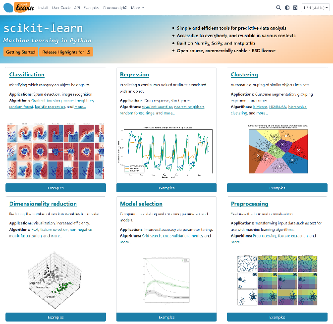
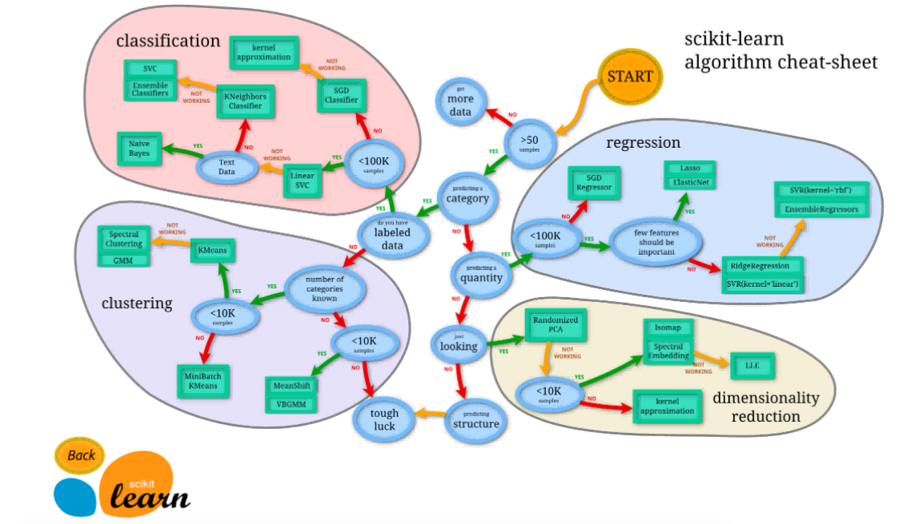
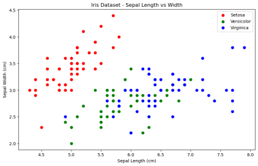
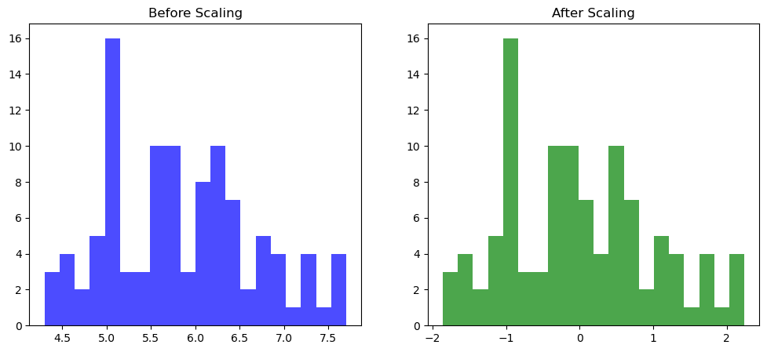
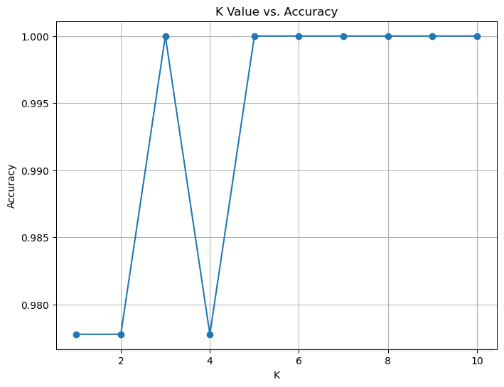
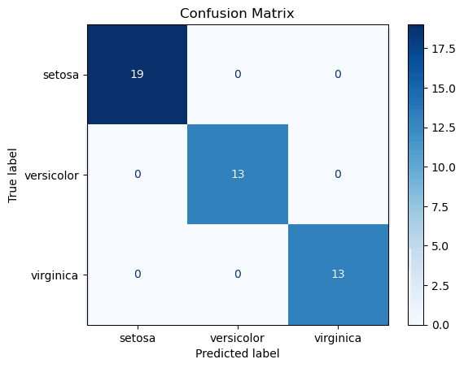
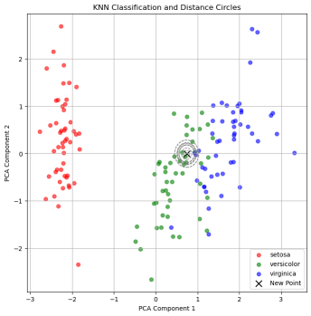

# 完整课程

## 简介

### 什么是 sklearn？

Scikit-learn（通常简称为 sklearn）是一个用于 Python 的**机器学习库**。它基于 NumPy、SciPy 和 matplotlib 构建，提供了丰富的工具集，用于**数据挖掘**和**数据分析**，特别适合进行**小规模**和**中等规模**的**机器学习**项目。

官方将 sklearn 描述为：

- **简单高效**的数据挖掘和数据分析工具
- 可供大家在**各种环境**中**重复使用**
- 建立在 NumPy ，SciPy 和 matplotlib 上
- 开源，**可商业使用** - BSD 许可证



### sklearn 的主要功能

- **分类**: 识别数据类别并预测新的数据点属于哪个类别，例如垃圾邮件检测。
- **回归**: 预测目标变量的值，例如预测房价。
- **聚类**: 自动将相似数据分组，例如客户群体划分。
- **降维**: 降低数据维度以便于可视化或减少计算量，例如 PCA（主成分分析）。
- **模型选择**: 用于选择模型参数、交叉验证等，例如网格搜索。
- **预处理**: 数据标准化、归一化等，准备数据用于机器学习。



### 为什么选择 sklearn？

- **易于使用**: API 设计直观，易于上手。
- **丰富的文档和社区支持**: 官方文档详细，社区活跃，提供了大量的学习资源。
- **与 Python 生态系统兼容**: 可以与其他 Python 库（如 Pandas、NumPy、matplotlib）无缝集成。


## 环境搭建

::: tip
详细教程：[Anaconda 环境搭建](/sklearn/synopsis/anaconda)
:::

### 安装 Anaconda

> 在 Anaconda 安装的过程中，比较容易出错的环节是环境变量的配置，所以大家在配置环境变量的时候，要细心一些。

双击下载好的安装包，点击 **Next**，点击 **I Agree**，选择 **Just Me**，选择安装路经（安装在 C 盘也有好处，不过与 C 盘爆炸来说不值一提，建议按在其他盘）然后 Next，来到如下界面：


请选择 **Register Anaconda as my default Python 3.x**，不要选 Add Anaconda to my PATH environment variable，我们需要后期手动添加环境变量。

点击 Install，安装需要等待一会儿。

最后一直 Next，直到安装完成。

对于两个“learn”，都取消打勾，不用打开去看了，耽误时间。


安装好后我们需要手动配置环境变量。

### 配置环境变量

计算机（右键）→ 属性 → 高级系统设置 →（点击）环境变量

在下面系统变量里，找到并点击 Path


在编辑环境变量里，点击新建


输入下面的五个环境变量。（**这里不是完全一样的！你需要将以下五条环境变量中涉及的到的"D:\\\_Producers\Anaconda3"都修改为你的 Anaconda 的安装路径！**）

```:line-numbers
D:\_Producers\Anaconda3
D:\_Producers\Anaconda3\Scripts
D:\_Producers\Anaconda3\Library\bin
D:\_Producers\Anaconda3\Library\mingw-w64\bin
D:\_Producers\Anaconda3\Library\usr\bin
```

> 简要说明五条路径的用途：这五个环境变量中，1 是 Python 需要，2 是 conda 自带脚本，3 是 jupyter notebook 动态库, 4 是使用 C with python 的时候

新建完成后点击确定。

### 验证

打开 cmd，在弹出的命令行查看 anaconda 版本，依次输入 ：

```shell:line-numbers
conda --version
python --version
```

若各自出现版本号，即代表配置成功。

在开始菜单或桌面找到 **Anaconda Navifator** 将其打开（若桌面没有可以发一份到桌面，方便后续使用），出现 GUI 界面即为安装成功。

### 更改 conda 源

如果你没有魔法上网工具，建议更改 conda 源，这样可以加快下载包的速度。清华大学提供了 Anaconda 的镜像仓库，我们把源改为清华大学镜像源。

找到 Anaconda prompt，打开 shell 面板。


在命令行输入以下命令：

```shell:line-numbers
conda config --add channels https://mirrors.tuna.tsinghua.edu.cn/anaconda/pkgs/free/
conda config --add channels https://mirrors.tuna.tsinghua.edu.cn/anaconda/cloud/conda-forge
conda config --add channels https://mirrors.tuna.tsinghua.edu.cn/anaconda/cloud/msys2/
conda config --set show_channel_urls yes
```

查看是否修改好通道：

```shell:line-numbers
conda config --show channels
```

### 安装相关 Python 库

Anaconda 自带了一些常用的机器学习库，如 numpy、pandas、matplotlib、seaborn、scikit-learn 等。

如果需要安装其他库，可以直接在 Anaconda Navigator 里搜索安装。

## Hello, Sklearn!

### 机器学习方法

对于任何一个问题，如果我们希望通过机器学习的方式解决，我们一般遵循以下步骤：

1. **问题分析**：我们需要清楚问题的类型、输入、输出、数据集、目标、评估指标等。
2. **数据预处理**：我们需要对数据进行清洗、转换、归一化等操作，确保数据质量。
3. **训练模型**：我们需要选择合适的机器学习算法，并训练模型。
4. **预测与评估**：我们需要使用测试集对模型进行测试，并评估模型的性能。

如果我们决定好了用哪些方法进行机器学习，我们可以在官方文档中找到相应的 API，按照接口一步步实现。

- [官方文档](https://scikit-learn.org/stable/user_guide.html)
- [中文文档（非官方）](https://sklearn.apachecn.org/)

接下来，我们从一个简单的 **KNN 模型**入手，配合经典的 **Iris 数据集**，来熟悉 sklearn 的使用。

### KNN 算法简介

> K-近邻算法是一种有监督学习、分类（也可用于回归）算法。

::: tip
可以在这里查看完整的 KNN 算法教程：[K-近邻算法(KNN)](/sklearn/knn/synopsis.html)
:::

K Nearest Neighbor 算法又叫 KNN 算法，它假设如果一个样本在特征空间中的 k 个最相似(即特征空间中最邻近)的样本中的大多数属于某一个类别，则该样本也属于这个类别。

KNN 算法的流程如下：

1. 计算已知类别数据集中的点与当前点之间的欧式距离
2. 按距离递增次序排序
3. 选取与当前点距离最小的 k 个点
4. 统计前 k 个点所在的类别出现的频率
5. 返回前 k 个点出现频率最高的类别作为当前点的预测分类

sklearn 中 KNN 算法的 API 如下：

```python
sklearn.neighbors.KNeighborsClassifier(n_neighbors=3, weights='uniform', algorithm='auto', leaf_size=30, p=2, metric='minkowski', metric_params=None, n_jobs=None)
```

其中：

- `n_neighbors`：选择最近邻的数目，默认为 `3`。
- `weights`：选择样本权重的方法，默认为 `uniform`，即所有样本权重相同。
- `algorithm`：选择计算最近邻的方法，默认为 `auto`，即自动选择。
- `leaf_size`：设置叶子节点的大小，默认为 `30`。
- `p`：选择距离度量的指数，默认为 `2`。
- `metric`：选择距离度量的方法，默认为 `minkowski`，即闵可夫斯基距离。
- `metric_params`：设置距离度量的参数，默认为 `None`。
- `n_jobs`：设置并行计算的线程数，默认为 `None`，即自动选择。

### 问题分析

假设我们有一组关于鸢尾花的特征数据，包括花萼长度、花萼宽度、花瓣长度、花瓣宽度、类别（山鸢尾、变色鸢尾、维吉尼亚鸢尾）等特征。当有一组新的数据时，我们希望通过这一组的数据预测鸢尾花的类别。

具体的数据及其引入方法如下：

```python
from sklearn.datasets import load_iris
import pandas as pd

# 导入数据集
iris = load_iris()
# print(iris)
iris_df = pd.DataFrame(iris.data, columns=iris.feature_names)
iris_df['species'] = iris.target
print(iris_df.head())
```

输出结果：

```shell:line-numbers
   sepal length (cm)  sepal width (cm)  petal length (cm)  petal width (cm)  species
0                5.1               3.5                1.4               0.2        0
1                4.9               3.0                1.4               0.2        0
2                4.7               3.2                1.3               0.2        0
3                4.6               3.1                1.5               0.2        0
4                5.0               3.6                1.4               0.2        0
```

分析：

- **输入**：鸢尾花的特征数据，包括花萼长度、花萼宽度、花瓣长度、花瓣宽度。
- **输出**：鸢尾花的类别，包括山鸢尾、变色鸢尾、维吉尼亚鸢尾。
- **目标**：预测新数据属于哪个类别。
- **评估指标**：准确率。

我们可以绘制一个图形来进一步观察数据的特征：

```python
import matplotlib.pyplot as plt

# 可视化数据集
plt.figure(figsize=(10, 6))
plt.xlabel('sepal length (cm)')
plt.ylabel('sepal width (cm)')
plt.scatter(iris_df[iris_df['species'] == 0]['sepal length (cm)'], iris_df[iris_df['species'] == 0]['sepal width (cm)'], color='red', label='Setosa')
plt.scatter(iris_df[iris_df['species'] == 1]['sepal length (cm)'], iris_df[iris_df['species'] == 1]['sepal width (cm)'], color='green', label='Versicolor')
plt.scatter(iris_df[iris_df['species'] == 2]['sepal length (cm)'], iris_df[iris_df['species'] == 2]['sepal width (cm)'], color='blue', label='Virginica')
plt.legend()
plt.title('Iris Dataset - Sepal Length vs Width')
plt.show()
```

输出结果：



从图中我们可以看出，**相同种类的鸢尾花其特征数据之间的距离较近**，而不同种类的鸢尾花，其特征数据之间的距离较远。因此，KNN 算法是一种可能解决此问题的有效方案。

### 数据预处理

通常我们获得的数据都是不完美的，需要进行数据预处理，一般使用以下方法：

- **特征工程**（Feature Engineering）：特征工程是指从原始数据中提取有用的特征，并将其转换为适合机器学习算法的形式。
- **数据清洗**（Data Cleaning）：数据清洗是指对数据进行检查、修复、过滤、转换等操作，以确保数据质量。
- **数据转换**（Data Transformation）：数据转换是指对数据进行变换，以便更好地适应机器学习算法。
- **数据集成**（Data Integration）：数据集成是指将不同来源的数据进行整合，以便更好地训练模型。

在这里，我们先仅作最简单的**标准化**处理。

::: tip
如果想了解更多关于数据预处理的方法，可以查看[特征工程-特征预处理](/sklearn/skills/preprocess)
:::

具体的标准化方法如下：

::: code-group

```python [sklearn]
from sklearn.preprocessing import StandardScaler

# 数据预处理
scaler = StandardScaler()
x = scaler.fit_transform(iris.data)
```

```python [python]
# 手动实现标准化
class MyStandardScaler:
    def __init__(self):
        self.mean_ = None
        self.scale_ = None

    def fit(self, X):
        """
        计算并存储数据的均值和标准差

        参数:
        X: 输入数据，形状为 (n_samples, n_features)

        返回:
        self: 返回自身的引用
        """
        self.mean_ = np.mean(X, axis=0)
        self.scale_ = np.std(X, axis=0)
        return self

    def transform(self, X):
        """
        根据存储的均值和标准差对数据进行标准化

        参数:
        X: 输入数据，形状为 (n_samples, n_features)

        返回:
        X_scaled: 标准化后的数据，形状为 (n_samples, n_features)
        """
        if self.mean_ is None or self.scale_ is None:
            raise ValueError("Scaler has not been fitted yet.")
        X_scaled = (X - self.mean_) / self.scale_
        return X_scaled

    def fit_transform(self, X):
        """
        计算均值和标准差，并对数据进行标准化

        参数:
        X: 输入数据，形状为 (n_samples, n_features)

        返回:
        X_scaled: 标准化后的数据，形状为 (n_samples, n_features)
        """
        return self.fit(X).transform(X)


# 数据预处理
scaler = StandardScaler()
x = scaler.fit_transform(iris.data)
```

:::

```python
# 对比预处理效果（可选）
plt.figure(figsize=(12, 5))
plt.subplot(1, 2, 1)
plt.hist(iris.data[:, 0], bins=20, color='blue', alpha=0.7)
plt.title('Before Scaling')
plt.subplot(1, 2, 2)
plt.hist(x[:, 0], bins=20, color='green', alpha=0.7)
plt.title('After Scaling')
plt.show()
```

输出结果：



从图中我们可以看出，**数据标准化** 使得数据分布变得更加均匀，更容易被模型识别。（虽然本案例中的原始数据集已经够匀称了）

### 划分数据集

机器学习是从数据的属性中学习，并将它们应用到新数据的过程。 这就是为什么机器学习中评估算法的普遍实践是把数据分割成 **训练集** （我们从中学习数据的属性）和 **测试集** （我们测试这些性质）。在这里，我们简单把数据集按 `7:3` 切分为训练集和测试集。

::: tip
如果你想了解更多关于数据集、拟合、误差等知识，可以查看[拆分原始训练集](/sklearn/skills/resolution)
:::

具体的切分方法如下：

::: code-group

```python [sklearn]
from sklearn.model_selection import train_test_split

# 切分数据集
x_train, x_test, y_train, y_test = train_test_split(x, iris.target, test_size=0.3, random_state=42)
print(f"Training set size: {x_train.shape}, {y_train.shape}")
print(f"Testing set size: {x_test.shape}, {y_test.shape}")
```

```python [python]
import numpy as np

# 手动实现数据集划分
def train_test_split(X, y, test_size=0.3, random_state=None):
    """
    将数据集划分为训练集和测试集

    参数:
    X: 样本特征，形状为 (n_samples, n_features)
    y: 样本标签，形状为 (n_samples,)
    test_size: 测试集所占比例，范围为 (0, 1) 之间
    random_state: 随机种子，确保结果可复现

    返回:
    X_train, X_test, y_train, y_test: 分别为训练集和测试集的特征和标签
    """

    # 设置随机种子以确保可复现性
    if random_state is not None:
        np.random.seed(random_state)

    # 获取样本数量
    n_samples = X.shape[0]

    # 计算测试集样本数量
    n_test_samples = int(n_samples * test_size)

    # 随机打乱索引
    shuffled_indices = np.random.permutation(n_samples)

    # 划分训练集和测试集的索引
    test_indices = shuffled_indices[:n_test_samples]
    train_indices = shuffled_indices[n_test_samples:]

    # 划分训练集和测试集
    X_train = X[train_indices]
    X_test = X[test_indices]
    y_train = y[train_indices]
    y_test = y[test_indices]

    return X_train, X_test, y_train, y_test


# 划分数据集
x_train, x_test, y_train, y_test = train_test_split(x, iris.target, test_size=0.3, random_state=42)
print(f"Training set size: {x_train.shape}, {y_train.shape}")
print(f"Testing set size: {x_test.shape}, {y_test.shape}")
```

:::

输出结果：

```shell:line-numbers
Training set size: (105, 4), (105,)
Test set size: (45, 4), (45,)
```

### 训练与预测

根据我们之前的分析，我们可以选择 KNN 算法作为模型。在实际使用 KNN 模型时，我们一般通过遍历的方法来确定最优的 K 值。

::: code-group

```python [sklearn]
from sklearn.neighbors import KNeighborsClassifier
from sklearn.metrics import accuracy_score

# 训练模型，循环遍历不同k值，训练模型并预测测试集
accuracies = []
k_values = range(1, 11)
for k in k_values:
    knn = KNeighborsClassifier(n_neighbors=k)
    knn.fit(x_train, y_train)
    y_pred = knn.predict(x_test)
    accuracies.append(accuracy_score(y_test, y_pred))  # 模型的准确率
print(accuracies)
```

```python [python]
# 手动实现 KNN 算法
class MyKNN:
    def __init__(self, n_neighbors=3):
        self.n_neighbors = n_neighbors

    def fit(self, X, y):
        """
        训练KNN模型，存储训练数据

        参数:
        X: 训练样本特征，形状为 (n_samples, n_features)
        y: 训练样本标签，形状为 (n_samples,)

        返回:
        self: 返回自身的引用
        """
        self.X_train = np.array(X)
        self.y_train = np.array(y)
        return self

    def predict(self, X):
        """
        使用KNN模型进行预测

        参数:
        X: 测试样本特征，形状为 (n_samples, n_features)

        返回:
        y_pred: 预测标签，形状为 (n_samples,)
        """
        X = np.array(X)
        y_pred = np.zeros(X.shape[0])

        for i in range(X.shape[0]):
            # 计算欧氏距离
            distances = np.sqrt(np.sum((self.X_train - X[i, :])**2, axis=1))
            # 找到最近的k个点的索引
            nearest_neighbors = np.argsort(distances)[:self.n_neighbors]
            # 找到最近邻的标签
            nearest_labels = self.y_train[nearest_neighbors]
            # 投票决定预测标签
            y_pred[i] = np.argmax(np.bincount(nearest_labels))

        return y_pred

    def score(self, X, y):
        """
        计算模型在测试集上的准确率

        参数:
        X: 测试样本特征，形状为 (n_samples, n_features)
        y: 测试样本标签，形状为 (n_samples,)

        返回:
        accuracy: 测试集上的准确率
        """
        y_pred = self.predict(X)
        accuracy = np.mean(y_pred == y)
        return accuracy

# 训练模型
accuracies = []
k_values = range(1, 11)
for k in k_values:
    knn = MyKNN(n_neighbors=k)
    knn.fit(x_train, y_train)
    accuracies.append(knn.score(x_test, y_test))  # 模型的准确率
print(accuracies)
```

:::

输出结果：

```shell:line-numbers
[0.9777777777777777, 0.9777777777777777, 1.0, 0.9777777777777777, 1.0, 1.0, 1.0, 1.0, 1.0, 1.0]
```

我们可以画一个折线图来展示 K 值与准确率之间的关系：

```python
# 绘制准确率与k值的关系图（可选）
plt.figure(figsize=(10, 6))
plt.plot(k_values, accuracies, marker='o')
plt.xlabel('K Value')
plt.ylabel('Accuracy')
plt.title('K Value vs. Accuracy')
plt.grid()
plt.show()
```

输出结果：



由于数据集质量较好，可以看到 KNN 的取值在各个值下都有较好的准确率。不过在 `K≥5` 时，准确率一直维持在较高水平，因此我们可以选择 `K=6` 作为最终的模型：

::: code-group

```python [sklearn]
# 确定模型
knn = KNeighborsClassifier(n_neighbors=5)
knn.fit(x_train, y_train)

# 预测测试集
y_pred = knn.predict(x_test)
for i in range(5):
    print(f"True label: {y_test[i]}, Predicted label: {y_pred[i]}")
```

```python [python]
# 确定模型
knn = MyKNN(n_neighbors=5)
knn.fit(x_train, y_train)

# 预测测试集
y_pred = knn.predict(x_test)
for i in range(5):
    print(f"True label: {y_test[i]}, Predicted label: {y_pred[i]}")
```

:::

输出结果：

```shell:line-numbers
True label: 1, Predicted label: 1
True label: 0, Predicted label: 0
True label: 2, Predicted label: 2
True label: 1, Predicted label: 1
True label: 1, Predicted label: 1
```

### 模型评估

我们可以通过一些指标来评估模型的性能，常用的指标有：

- **准确率**（Accuracy）：正确分类的样本数与总样本数的比值。
- **精确率**（Precision）：正确分类为正的样本数与所有正样本数的比值。
- **召回率**（Recall）：正确分类为正的样本数与所有样本中正样本的比值。
- **F1 值**（F1 Score）：精确率和召回率的调和平均值。
- **混淆矩阵**（Confusion Matrix）：用于描述分类结果的矩阵。

::: tip
如果想了解更多关于模型评估的方法，可以查看[分类评估](/sklearn/logistic/evaluation)
:::

这里我们使用准确率、评估报告（包含精确率、召回率、F1 值、支持）与混淆矩阵来进行简单评估：

::: code-group

```python [sklearn]
from sklearn.metrics import accuracy_score, classification_report, confusion_matrix

# 计算准确率
accurancy = accuracy_score(y_test, y_pred)
print(f"Accuracy: {accurancy:.2f}")

# 计算分类报告
report = classification_report(y_test, y_pred)
print(report)

# 计算混淆矩阵
cm = confusion_matrix(y_test, y_pred)
print(cm)
```

```python [python]
# 手动实现精准率
def accuracy_score(y_true, y_pred):
    """
    计算准确率

    参数:
    y_true: 真实标签，形状为 (n_samples,)
    y_pred: 预测标签，形状为 (n_samples,)

    返回:
    accuracy: 准确率（浮点数）
    """
    correct_predictions = np.sum(y_true == y_pred)
    accuracy = correct_predictions / len(y_true)
    return accuracy


# 手动实现分类报告
def classification_report(y_true, y_pred, target_names=None):
    """
    计算分类报告，包括精确率、召回率和 F1 分数

    参数:
    y_true: 真实标签，形状为 (n_samples,)
    y_pred: 预测标签，形状为 (n_samples,)
    target_names: 类别名称列表（可选）

    返回:
    report: 分类报告字符串
    """
    labels = np.unique(y_true)
    if target_names is None:
        target_names = [str(label) for label in labels]

    report = "               precision    recall  f1-score   support\n"
    report += "\n"

    for i, label in enumerate(labels):
        tp = np.sum((y_true == label) & (y_pred == label))
        fp = np.sum((y_true != label) & (y_pred == label))
        fn = np.sum((y_true == label) & (y_pred != label))

        precision = tp / (tp + fp) if (tp + fp) > 0 else 0.0
        recall = tp / (tp + fn) if (tp + fn) > 0 else 0.0
        f1 = 2 * precision * recall / (precision + recall) if (precision + recall) > 0 else 0.0
        support = np.sum(y_true == label)

        report += f"{target_names[i]:>15}   {precision:>9.2f}   {recall:>6.2f}   {f1:>8.2f}   {support:>7}\n"

    return report


# 手动实现混淆矩阵
def confusion_matrix(y_true, y_pred):
    """
    计算混淆矩阵

    参数:
    y_true: 真实标签，形状为 (n_samples,)
    y_pred: 预测标签，形状为 (n_samples,)

    返回:
    cm: 混淆矩阵，形状为 (n_classes, n_classes)
    """
    labels = np.unique(y_true)
    cm = np.zeros((len(labels), len(labels)), dtype=int)

    for i, label_true in enumerate(labels):
        for j, label_pred in enumerate(labels):
            cm[i, j] = np.sum((y_true == label_true) & (y_pred == label_pred))

    return cm


# 计算准确率
accurancy = accuracy_score(y_test, y_pred)
print(f"Accuracy: {accurancy:.2f}")

# 计算分类报告
report = classification_report(y_test, y_pred)
print(report)

# 计算混淆矩阵
cm = confusion_matrix(y_test, y_pred)
print(cm)
```

:::

输出结果：

```shell:line-numbers
Accuracy: 1.00
              precision    recall  f1-score   support

           0       1.00      1.00      1.00        19
           1       1.00      1.00      1.00        13
           2       1.00      1.00      1.00        13

    accuracy                           1.00        45
   macro avg       1.00      1.00      1.00        45
weighted avg       1.00      1.00      1.00        45

[[19  0  0]
 [ 0 13  0]
 [ 0  0 13]]
```

可以看到预测结果的准确率、精确率、召回率、F1 值都达到了 `1.0`，说明模型完全拟合测试集。

我们可以绘制一个混淆矩阵图来更直观地展示分类结果：

::: code-group

```python [sklearn]
from sklearn.metrics import ConfusionMatrixDisplay

# 绘制混淆矩阵热力图（可选）
cm_display = ConfusionMatrixDisplay(cm, display_labels=iris.target_names)
cm_display.plot(cmap=plt.cm.Blues)
plt.title('Confusion Matrix')
plt.show()
```

```python [python]
# 手动实现绘制混淆矩阵热力图
def plot_confusion_matrix(cm, target_names):
    """
    绘制混淆矩阵热力图

    参数:
    cm: 混淆矩阵，形状为 (n_classes, n_classes)
    target_names: 类别名称列表
    """
    fig, ax = plt.subplots(figsize=(8, 8))
    cax = ax.matshow(cm, cmap=plt.cm.Blues)
    plt.title('Confusion Matrix')
    fig.colorbar(cax)

    # 添加标签
    ax.set_xticks(np.arange(len(target_names)))
    ax.set_yticks(np.arange(len(target_names)))
    ax.set_xticklabels(target_names)
    ax.set_yticklabels(target_names)

    # 旋转 x 轴标签
    plt.xticks(rotation=45)

    # 添加文本标签
    for i in range(len(target_names)):
        for j in range(len(target_names)):
            ax.text(j, i, cm[i, j], ha='center', va='center', color='black')

    plt.xlabel('Predicted label')
    plt.ylabel('True label')
    plt.show()


# 绘制混淆矩阵热力图
plot_confusion_matrix(cm, iris.target_names)
```

:::

输出结果：



可以看到预测值与真实值完全吻合。

至此，我们完成了一个简单的 KNN 模型的训练与预测。

### 完整代码

::: code-group

```python:line-numbers [sklearn]
from sklearn.datasets import load_iris
from sklearn.model_selection import train_test_split
from sklearn.preprocessing import StandardScaler
from sklearn.neighbors import KNeighborsClassifier
from sklearn.metrics import accuracy_score, classification_report, confusion_matrix, ConfusionMatrixDisplay
import pandas as pd
import matplotlib.pyplot as plt

# 导入数据集
iris = load_iris()
# print(iris)
iris_df = pd.DataFrame(iris.data, columns=iris.feature_names)
iris_df['species'] = iris.target
print(iris_df.head())

# 可视化数据集
plt.figure(figsize=(10, 6))
plt.xlabel('sepal length (cm)')
plt.ylabel('sepal width (cm)')
plt.scatter(iris_df[iris_df['species'] == 0]['sepal length (cm)'], iris_df[iris_df['species'] == 0]['sepal width (cm)'], color='red', label='Setosa')
plt.scatter(iris_df[iris_df['species'] == 1]['sepal length (cm)'], iris_df[iris_df['species'] == 1]['sepal width (cm)'], color='green', label='Versicolor')
plt.scatter(iris_df[iris_df['species'] == 2]['sepal length (cm)'], iris_df[iris_df['species'] == 2]['sepal width (cm)'], color='blue', label='Virginica')
plt.legend()
plt.title('Iris Dataset - Sepal Length vs Width')
plt.show()

# 数据预处理
scaler = StandardScaler()
x = scaler.fit_transform(iris.data)

# 对比预处理效果
plt.figure(figsize=(12, 5))
plt.subplot(1, 2, 1)
plt.hist(iris.data[:, 0], bins=20, color='blue', alpha=0.7)
plt.title('Before Scaling')
plt.subplot(1, 2, 2)
plt.hist(x[:, 0], bins=20, color='green', alpha=0.7)
plt.title('After Scaling')
plt.show()

# 切分数据集
x_train, x_test, y_train, y_test = train_test_split(x, iris.target, test_size=0.3, random_state=42)
print(f"Training set size: {x_train.shape}, {y_train.shape}")
print(f"Testing set size: {x_test.shape}, {y_test.shape}")

# 训练模型
accuracies = []
k_values = range(1, 11)
for k in k_values:
    knn = KNeighborsClassifier(n_neighbors=k)
    knn.fit(x_train, y_train)
    y_pred = knn.predict(x_test)
    accuracies.append(accuracy_score(y_test, y_pred))  # 模型的准确率
print(accuracies)

# 绘制准确率与k值的关系图
plt.figure(figsize=(10, 6))
plt.plot(k_values, accuracies, marker='o')
plt.xlabel('K Value')
plt.ylabel('Accuracy')
plt.title('K Value vs. Accuracy')
plt.grid()
plt.show()

# 确定模型
knn = KNeighborsClassifier(n_neighbors=5)
knn.fit(x_train, y_train)

# 预测测试集
y_pred = knn.predict(x_test)
for i in range(5):
    print(f"True label: {y_test[i]}, Predicted label: {y_pred[i]}")

# 计算准确率
accurancy = accuracy_score(y_test, y_pred)
print(f"Accuracy: {accurancy:.2f}")

# 计算分类报告
report = classification_report(y_test, y_pred)
print(report)

# 计算混淆矩阵
cm = confusion_matrix(y_test, y_pred)
print(cm)

# 绘制混淆矩阵热力图
cm_display = ConfusionMatrixDisplay(cm, display_labels=iris.target_names)
cm_display.plot(cmap=plt.cm.Blues)
plt.title('Confusion Matrix')
plt.show()
```

```python:line-numbers [python]
# 为方便展示逻辑连贯性，函数和类的实现按顺序放在了代码中间。按照 Python 代码的习惯，在实际代码中，函数和类的实现应该放在文件开头或单独封装成模块。
from sklearn.datasets import load_iris
import pandas as pd
import matplotlib.pyplot as plt
import numpy as np

# 导入数据集
iris = load_iris()
# print(iris)
iris_df = pd.DataFrame(iris.data, columns=iris.feature_names)
iris_df['species'] = iris.target
print(iris_df.head())


# 可视化数据集
plt.figure(figsize=(10, 6))
plt.xlabel('sepal length (cm)')
plt.ylabel('sepal width (cm)')
plt.scatter(iris_df[iris_df['species'] == 0]['sepal length (cm)'], iris_df[iris_df['species'] == 0]['sepal width (cm)'], color='red', label='Setosa')
plt.scatter(iris_df[iris_df['species'] == 1]['sepal length (cm)'], iris_df[iris_df['species'] == 1]['sepal width (cm)'], color='green', label='Versicolor')
plt.scatter(iris_df[iris_df['species'] == 2]['sepal length (cm)'], iris_df[iris_df['species'] == 2]['sepal width (cm)'], color='blue', label='Virginica')
plt.legend()
plt.title('Iris Dataset - Sepal Length vs Width')
plt.show()


# 手动实现数据集划分
def train_test_split(X, y, test_size=0.3, random_state=None):
    """
    将数据集划分为训练集和测试集

    参数:
    X: 样本特征，形状为 (n_samples, n_features)
    y: 样本标签，形状为 (n_samples,)
    test_size: 测试集所占比例，范围为 (0, 1) 之间
    random_state: 随机种子，确保结果可复现

    返回:
    X_train, X_test, y_train, y_test: 分别为训练集和测试集的特征和标签
    """

    # 设置随机种子以确保可复现性
    if random_state is not None:
        np.random.seed(random_state)

    # 获取样本数量
    n_samples = X.shape[0]

    # 计算测试集样本数量
    n_test_samples = int(n_samples * test_size)

    # 随机打乱索引
    shuffled_indices = np.random.permutation(n_samples)

    # 划分训练集和测试集的索引
    test_indices = shuffled_indices[:n_test_samples]
    train_indices = shuffled_indices[n_test_samples:]

    # 划分训练集和测试集
    X_train = X[train_indices]
    X_test = X[test_indices]
    y_train = y[train_indices]
    y_test = y[test_indices]

    return X_train, X_test, y_train, y_test


# 划分数据集
x_train, x_test, y_train, y_test = train_test_split(iris.data, iris.target, test_size=0.3, random_state=42)
print(f"Training set size: {x_train.shape}, {y_train.shape}")
print(f"Testing set size: {x_test.shape}, {y_test.shape}")


# 手动实现标准化
class MyStandardScaler:
    def __init__(self):
        self.mean_ = None
        self.scale_ = None

    def fit(self, X):
        """
        计算并存储数据的均值和标准差

        参数:
        X: 输入数据，形状为 (n_samples, n_features)

        返回:
        self: 返回自身的引用
        """
        self.mean_ = np.mean(X, axis=0)
        self.scale_ = np.std(X, axis=0)
        return self

    def transform(self, X):
        """
        根据存储的均值和标准差对数据进行标准化

        参数:
        X: 输入数据，形状为 (n_samples, n_features)

        返回:
        X_scaled: 标准化后的数据，形状为 (n_samples, n_features)
        """
        if self.mean_ is None or self.scale_ is None:
            raise ValueError("Scaler has not been fitted yet.")
        X_scaled = (X - self.mean_) / self.scale_
        return X_scaled

    def fit_transform(self, X):
        """
        计算均值和标准差，并对数据进行标准化

        参数:
        X: 输入数据，形状为 (n_samples, n_features)

        返回:
        X_scaled: 标准化后的数据，形状为 (n_samples, n_features)
        """
        return self.fit(X).transform(X)


# 数据预处理
scaler = MyStandardScaler()
x_train_scaled = scaler.fit_transform(x_train)
x_test_scaled = scaler.transform(x_test)


# 手动实现 KNN 算法
class MyKNN:
    def __init__(self, n_neighbors=3):
        self.n_neighbors = n_neighbors

    def fit(self, X, y):
        """
        训练KNN模型，存储训练数据

        参数:
        X: 训练样本特征，形状为 (n_samples, n_features)
        y: 训练样本标签，形状为 (n_samples,)

        返回:
        self: 返回自身的引用
        """
        self.X_train = np.array(X)
        self.y_train = np.array(y)
        return self

    def predict(self, X):
        """
        使用KNN模型进行预测

        参数:
        X: 测试样本特征，形状为 (n_samples, n_features)

        返回:
        y_pred: 预测标签，形状为 (n_samples,)
        """
        X = np.array(X)
        y_pred = np.zeros(X.shape[0])

        for i in range(X.shape[0]):
            # 计算欧氏距离
            distances = np.sqrt(np.sum((self.X_train - X[i, :])**2, axis=1))
            # 找到最近的k个点的索引
            nearest_neighbors = np.argsort(distances)[:self.n_neighbors]
            # 找到最近邻的标签
            nearest_labels = self.y_train[nearest_neighbors]
            # 投票决定预测标签
            y_pred[i] = np.argmax(np.bincount(nearest_labels))

        return y_pred

    def score(self, X, y):
        """
        计算模型在测试集上的准确率

        参数:
        X: 测试样本特征，形状为 (n_samples, n_features)
        y: 测试样本标签，形状为 (n_samples,)

        返回:
        accuracy: 测试集上的准确率
        """
        y_pred = self.predict(X)
        accuracy = np.mean(y_pred == y)
        return accuracy


# 训练模型
accuracies = []
k_values = range(1, 11)
for k in k_values:
    knn = MyKNN(n_neighbors=k)
    knn.fit(x_train_scaled, y_train)
    accuracies.append(knn.score(x_test_scaled, y_test))  # 模型的准确率
print(accuracies)

# 绘制准确率与k值的关系图（可选）
plt.figure(figsize=(10, 6))
plt.plot(k_values, accuracies, marker='o')
plt.xlabel('K Value')
plt.ylabel('Accuracy')
plt.title('K Value vs. Accuracy')
plt.grid()
plt.show()

# 确定模型
knn = MyKNN(n_neighbors=5)
knn.fit(x_train_scaled, y_train)

# 预测测试集
y_pred = knn.predict(x_test_scaled)
for i in range(5):
    print(f"True label: {y_test[i]}, Predicted label: {y_pred[i]}")


# 手动实现精准率
def accuracy_score(y_true, y_pred):
    """
    计算准确率

    参数:
    y_true: 真实标签，形状为 (n_samples,)
    y_pred: 预测标签，形状为 (n_samples,)

    返回:
    accuracy: 准确率（浮点数）
    """
    correct_predictions = np.sum(y_true == y_pred)
    accuracy = correct_predictions / len(y_true)
    return accuracy


# 手动实现分类报告
def classification_report(y_true, y_pred, target_names=None):
    """
    计算分类报告，包括精确率、召回率和 F1 分数

    参数:
    y_true: 真实标签，形状为 (n_samples,)
    y_pred: 预测标签，形状为 (n_samples,)
    target_names: 类别名称列表（可选）

    返回:
    report: 分类报告字符串
    """
    labels = np.unique(y_true)
    if target_names is None:
        target_names = [str(label) for label in labels]

    report = "               precision    recall  f1-score   support\n"
    report += "\n"

    for i, label in enumerate(labels):
        tp = np.sum((y_true == label) & (y_pred == label))
        fp = np.sum((y_true != label) & (y_pred == label))
        fn = np.sum((y_true == label) & (y_pred != label))

        precision = tp / (tp + fp) if (tp + fp) > 0 else 0.0
        recall = tp / (tp + fn) if (tp + fn) > 0 else 0.0
        f1 = 2 * precision * recall / (precision + recall) if (precision + recall) > 0 else 0.0
        support = np.sum(y_true == label)

        report += f"{target_names[i]:>15}   {precision:>9.2f}   {recall:>6.2f}   {f1:>8.2f}   {support:>7}\n"

    return report


# 手动实现混淆矩阵
def confusion_matrix(y_true, y_pred):
    """
    计算混淆矩阵

    参数:
    y_true: 真实标签，形状为 (n_samples,)
    y_pred: 预测标签，形状为 (n_samples,)

    返回:
    cm: 混淆矩阵，形状为 (n_classes, n_classes)
    """
    labels = np.unique(y_true)
    cm = np.zeros((len(labels), len(labels)), dtype=int)

    for i, label_true in enumerate(labels):
        for j, label_pred in enumerate(labels):
            cm[i, j] = np.sum((y_true == label_true) & (y_pred == label_pred))

    return cm


# 计算准确率
accurancy = accuracy_score(y_test, y_pred)
print(f"Accuracy: {accurancy:.2f}")

# 计算分类报告
report = classification_report(y_test, y_pred)
print(report)

# 计算混淆矩阵
cm = confusion_matrix(y_test, y_pred)
print(cm)


# 手动实现绘制混淆矩阵热力图
def plot_confusion_matrix(cm, target_names):
    """
    绘制混淆矩阵热力图

    参数:
    cm: 混淆矩阵，形状为 (n_classes, n_classes)
    target_names: 类别名称列表
    """
    fig, ax = plt.subplots(figsize=(8, 8))
    cax = ax.matshow(cm, cmap=plt.cm.Blues)
    plt.title('Confusion Matrix')
    fig.colorbar(cax)

    # 添加标签
    ax.set_xticks(np.arange(len(target_names)))
    ax.set_yticks(np.arange(len(target_names)))
    ax.set_xticklabels(target_names)
    ax.set_yticklabels(target_names)

    # 旋转 x 轴标签
    plt.xticks(rotation=45)

    # 添加文本标签
    for i in range(len(target_names)):
        for j in range(len(target_names)):
            ax.text(j, i, cm[i, j], ha='center', va='center', color='black')

    plt.xlabel('Predicted label')
    plt.ylabel('True label')
    plt.show()


# 绘制混淆矩阵热力图
plot_confusion_matrix(cm, iris.target_names)
```

:::

可以看到，使用 sklearn 可以帮助我们极大的减小代码量，提高效率。

> 如果有兴趣，可以自己尝试实现封装一个 KNN 算法（签到题难度），以加深对于 sklearn 的理解。

### \[选读\]可视化 KNN

在本案例中，我们使用 KNN 算法来解决鸢尾花分类问题。KNN 算法是一个简单而有效的分类算法，它通过计算样本之间的距离来确定新样本的类别。KNN 算法的优点是简单、易于理解、易于实现、无参数调整，缺点是容易受到样本扰动的影响。

我们可以对某一次预测的过程进行可视化，来更直观地理解 KNN 算法的工作原理：

```python:line-numbers
import numpy as np
import matplotlib.pyplot as plt
from sklearn.datasets import load_iris
from sklearn.neighbors import KNeighborsClassifier
from sklearn.preprocessing import StandardScaler
from sklearn.decomposition import PCA

# 加载Iris数据集并标准化
iris = load_iris()
X = iris.data
y = iris.target

scaler = StandardScaler()
X_scaled = scaler.fit_transform(X)

# 使用PCA将数据降维到2D，便于可视化
pca = PCA(n_components=2)
X_pca = pca.fit_transform(X_scaled)

# 训练KNN模型
knn = KNeighborsClassifier(n_neighbors=10)
knn.fit(X_pca, y)

# 选择一个新点进行预测
new_point = np.array([[4.9, 3.2, 5.6, 2.3]])
new_point_scaled = scaler.transform(new_point)
new_point_pca = pca.transform(new_point_scaled)
predicted_class = knn.predict(new_point_pca)

# 可视化训练数据
plt.figure(figsize=(8, 8))
colors = ['red', 'green', 'blue']

for i in range(3):
    plt.scatter(X_pca[y == i, 0], X_pca[y == i, 1],
                color=colors[i], label=iris.target_names[i], alpha=0.6)

# 可视化新点
plt.scatter(new_point_pca[0, 0], new_point_pca[0, 1],
            color='black', label='New Point', marker='x', s=100)

# 画出距离圆
distances, indices = knn.kneighbors(new_point_pca)
for i in range(len(indices[0])):
    neighbor_index = indices[0][i]
    distance = distances[0][i]
    neighbor_point = X_pca[neighbor_index]

    circle = plt.Circle((new_point_pca[0, 0], new_point_pca[0, 1]),
                        distance, color='gray', fill=False, linestyle='--')
    plt.gca().add_patch(circle)

# 图例和标题
plt.legend()
plt.xlabel('PCA Component 1')
plt.ylabel('PCA Component 2')
plt.title('KNN Classification and Distance Circles')
plt.grid(True)
plt.show()
```

输出结果：



## \[选读\]自己动手 - 实现一个简单的线性回归模型

::: tip
线性回归基础知识：[线性回归简介](/sklearn/linear/synopsis)
:::

案例：[波士顿放假预测](https://www.kaggle.com/c/boston-housing)

```python:line-numbers
from sklearn.linear_model import LinearRegression
from sklearn.datasets import fetch_california_housing
from sklearn.model_selection import train_test_split
from sklearn.preprocessing import StandardScaler
from sklearn.metrics import mean_squared_error

# 1.获取数据
data = fetch_california_housing()

# 2.数据集划分
x_train, x_test, y_train, y_test = train_test_split(data.data, data.target, random_state=22)

# 3.特征工程-标准化
transfer = StandardScaler()
x_train = transfer.fit_transform(x_train)
x_test = transfer.transform(x_test)

# 4.机器学习-线性回归(正规方程)
estimator = LinearRegression()
estimator.fit(x_train, y_train)

# 5.模型评估
# 5.1 获取系数等值
y_predict = estimator.predict(x_test)
print("预测值为:\n", y_predict)
print("模型中的系数为:\n", estimator.coef_)
print("模型中的偏置为:\n", estimator.intercept_)
# 5.2 评价(均方误差)
error = mean_squared_error(y_test, y_predict)
print("误差为:\n", error)
```

某一次的输出：

```shell:line-numbers
预测值为:
 [1.41601135 2.00797685 1.02613188 ... 2.1971023  1.91659415 3.03593177]
模型中的系数为:
 [ 0.82591102  0.11445311 -0.26118374  0.30345645 -0.00706501 -0.04153221
 -0.9107612  -0.88255758]
模型中的偏置为:
 2.069981627260431
误差为:
 0.4918267761529808
```

<!-- ## Q&A -->
