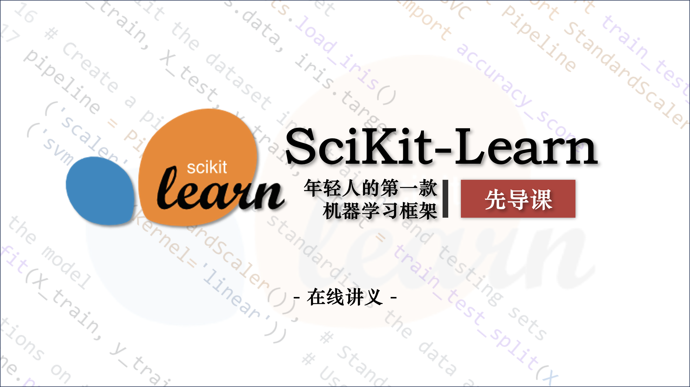

# 在线讲义

> SciKit-Learn 先导课



## 简介

### 什么是 sklearn？

Scikit-learn（通常简称为 sklearn）是一个用于 Python 的**机器学习库**。它基于 NumPy、SciPy 和 matplotlib 构建，提供了丰富的工具集，用于**数据挖掘**和**数据分析**，特别适合进行**小规模**和**中等规模**的**机器学习**项目。

官方将 sklearn 描述为：

- **简单高效**的数据挖掘和数据分析工具
- 可供大家在**各种环境**中**重复使用**
- 建立在 NumPy ，SciPy 和 matplotlib 上
- 开源，**可商业使用** - BSD 许可证


### sklearn 的主要功能

- **分类**: 识别数据类别并预测新的数据点属于哪个类别，例如垃圾邮件检测。
- **回归**: 预测目标变量的值，例如预测房价。
- **聚类**: 自动将相似数据分组，例如客户群体划分。
- **降维**: 降低数据维度以便于可视化或减少计算量，例如 PCA（主成分分析）。
- **模型选择**: 用于选择模型参数、交叉验证等，例如网格搜索。
- **预处理**: 数据标准化、归一化等，准备数据用于机器学习。


### 为什么选择 sklearn？

- **易于使用**: API 设计直观，易于上手。
- **丰富的文档和社区支持**: 官方文档详细，社区活跃，提供了大量的学习资源。
- **与 Python 生态系统兼容**: 可以与其他 Python 库（如 Pandas、NumPy、matplotlib）无缝集成。


## 环境搭建

::: tip
详细教程：[Anaconda 环境搭建](/sklearn/synopsis/anaconda)
:::

### 安装 Anaconda

> 在 Anaconda 安装的过程中，比较容易出错的环节是环境变量的配置，所以大家在配置环境变量的时候，要细心一些。

双击下载好的安装包，点击 **Next**，点击 **I Agree**，选择 **Just Me**，选择安装路经（安装在 C 盘也有好处，不过与 C 盘爆炸来说不值一提，建议按在其他盘）然后 Next，来到如下界面：


请选择 **Register Anaconda as my default Python 3.x**，不要选 Add Anaconda to my PATH environment variable，我们需要后期手动添加环境变量。

点击 Install，安装需要等待一会儿。

最后一直 Next，直到安装完成。

对于两个“learn”，都取消打勾，不用打开去看了，耽误时间。


安装好后我们需要手动配置环境变量。

### 配置环境变量

计算机（右键）→ 属性 → 高级系统设置 →（点击）环境变量

在下面系统变量里，找到并点击 Path


在编辑环境变量里，点击新建


输入下面的五个环境变量。（**这里不是完全一样的！你需要将以下五条环境变量中涉及的到的"D:\\\_Producers\Anaconda3"都修改为你的 Anaconda 的安装路径！**）

```
D:\_Producers\Anaconda3
D:\_Producers\Anaconda3\Scripts
D:\_Producers\Anaconda3\Library\bin
D:\_Producers\Anaconda3\Library\mingw-w64\bin
D:\_Producers\Anaconda3\Library\usr\bin
```

> 简要说明五条路径的用途：这五个环境变量中，1 是 Python 需要，2 是 conda 自带脚本，3 是 jupyter notebook 动态库, 4 是使用 C with python 的时候

新建完成后点击确定。

### 验证

打开 cmd，在弹出的命令行查看 anaconda 版本，依次输入 ：

```shell
conda --version
python --version
```

若各自出现版本号，即代表配置成功。

在开始菜单或桌面找到 **Anaconda Navifator** 将其打开（若桌面没有可以发一份到桌面，方便后续使用），出现 GUI 界面即为安装成功。

### 更改 conda 源

如果你没有魔法上网工具，建议更改 conda 源，这样可以加快下载包的速度。清华大学提供了 Anaconda 的镜像仓库，我们把源改为清华大学镜像源。

找到 Anaconda prompt，打开 shell 面板。


在命令行输入以下命令：

```shell
conda config --add channels https://mirrors.tuna.tsinghua.edu.cn/anaconda/pkgs/free/
conda config --add channels https://mirrors.tuna.tsinghua.edu.cn/anaconda/cloud/conda-forge
conda config --add channels https://mirrors.tuna.tsinghua.edu.cn/anaconda/cloud/msys2/
conda config --set show_channel_urls yes
```

查看是否修改好通道：

```shell
conda config --show channels
```

### 安装相关 Python 库

Anaconda 自带了一些常用的机器学习库，如 numpy、pandas、matplotlib、seaborn、scikit-learn 等。

如果需要安装其他库，可以直接在 Anaconda Navigator 里搜索安装。

## Hello, Sklearn!

### 机器学习方法

对于任何一个问题，如果我们希望通过机器学习的方式解决，我们一般遵循以下步骤：

1. **问题分析**：我们需要清楚问题的类型、输入、输出、数据集、目标、评估指标等。
2. **数据预处理**：我们需要对数据进行清洗、转换、归一化等操作，确保数据质量。
3. **训练模型**：我们需要选择合适的机器学习算法，并训练模型。
4. **预测与评估**：我们需要使用测试集对模型进行测试，并评估模型的性能。

如果我们决定好了用哪些方法进行机器学习，我们可以在官方文档中找到相应的 API，按照接口一步步实现。

- [官方文档](https://scikit-learn.org/stable/user_guide.html)
- [中文文档（非官方）](https://sklearn.apachecn.org/)

接下来，我们从一个简单的 **KNN 模型**入手，配合经典的 **Iris 数据集**，来熟悉 sklearn 的使用。

### KNN 算法简介

> K-近邻算法是一种有监督学习、分类（也可用于回归）算法。

::: tip
可以在这里查看完整的 KNN 算法教程：[K-近邻算法(KNN)](/sklearn/knn/synopsis.html)
:::

K Nearest Neighbor 算法又叫 KNN 算法，它假设如果一个样本在特征空间中的 k 个最相似(即特征空间中最邻近)的样本中的大多数属于某一个类别，则该样本也属于这个类别。

KNN 算法的流程如下：

1. 计算已知类别数据集中的点与当前点之间的欧式距离
2. 按距离递增次序排序
3. 选取与当前点距离最小的 k 个点
4. 统计前 k 个点所在的类别出现的频率
5. 返回前 k 个点出现频率最高的类别作为当前点的预测分类

### 问题分析

假设我们有一组关于鸢尾花的特征数据，包括花萼长度、花萼宽度、花瓣长度、花瓣宽度、类别（山鸢尾、变色鸢尾、维吉尼亚鸢尾）等特征。当有一组新的数据时，我们希望通过这一组的数据预测鸢尾花的类别。

具体的数据及其引入方法如下：

```python
from sklearn.datasets import load_iris
import pandas as pd
import matplotlib.pyplot as plt

# 导入数据集
iris = load_iris()
iris_df = pd.DataFrame(iris.data, columns=iris.feature_names)
iris_df['species'] = iris.target

print(iris_df.head())
```

输出结果：

```shell
   sepal length (cm)  sepal width (cm)  petal length (cm)  petal width (cm)  \
0                5.1               3.5                1.4               0.2
1                4.9               3.0                1.4               0.2
2                4.7               3.2                1.3               0.2
3                4.6               3.1                1.5               0.2
4                5.0               3.6                1.4               0.2

   species
0        0
1        0
2        0
3        0
4        0
```

分析：

- **输入**：鸢尾花的特征数据，包括花萼长度、花萼宽度、花瓣长度、花瓣宽度。
- **输出**：鸢尾花的类别，包括山鸢尾、变色鸢尾、维吉尼亚鸢尾。
- **目标**：预测新数据属于哪个类别。
- **评估指标**：准确率。

我们可以绘制一个图形来进一步观察数据的特征：

```python
# 绘制散点图
plt.figure(figsize=(10, 6))
plt.scatter(iris_df[iris_df['species'] == 0]['sepal length (cm)'], iris_df[iris_df['species'] == 0]['sepal width (cm)'], color='red', label='Setosa')
plt.scatter(iris_df[iris_df['species'] == 1]['sepal length (cm)'], iris_df[iris_df['species'] == 1]['sepal width (cm)'], color='green', label='Versicolor')
plt.scatter(iris_df[iris_df['species'] == 2]['sepal length (cm)'], iris_df[iris_df['species'] == 2]['sepal width (cm)'], color='blue', label='Virginica')
plt.xlabel('Sepal Length (cm)')
plt.ylabel('Sepal Width (cm)')
plt.legend()
plt.title('Iris Dataset - Sepal Length vs Width')
plt.show()
```

输出结果：


从图中我们可以看出，**相同种类的鸢尾花其特征数据之间的距离较近**，而不同种类的鸢尾花，其特征数据之间的距离较远。因此，KNN 算法是一种可能解决此问题的有效方案。

### 训练集和测试集

机器学习是从数据的属性中学习，并将它们应用到新数据的过程。 这就是为什么机器学习中评估算法的普遍实践是把数据分割成 **训练集** （我们从中学习数据的属性）和 **测试集** （我们测试这些性质）。在这里，我们简单把数据集按 `7:3` 切分为训练集和测试集。

::: tip
如果你想了解更多关于数据集、拟合、误差等知识，可以查看[拆分原始训练集](/sklearn/skills/resolution)
:::

具体的切分方法如下：

```python
from sklearn.model_selection import train_test_split

X_train, X_test, y_train, y_test = train_test_split(iris.data, iris.target, test_size=0.3, random_state=42)

print(f"Training set size: {X_train.shape}, {y_train.shape}")
print(f"Test set size: {X_test.shape}, {y_test.shape}")
```

输出结果：

```shell
Training set size: (105, 4), (105,)
Test set size: (45, 4), (45,)
```

### 数据预处理

通常我们获得的数据都是不完美的，需要进行数据预处理，一般使用以下方法：

- **特征工程**（Feature Engineering）：特征工程是指从原始数据中提取有用的特征，并将其转换为适合机器学习算法的形式。
- **数据清洗**（Data Cleaning）：数据清洗是指对数据进行检查、修复、过滤、转换等操作，以确保数据质量。
- **数据转换**（Data Transformation）：数据转换是指对数据进行变换，以便更好地适应机器学习算法。
- **数据集成**（Data Integration）：数据集成是指将不同来源的数据进行整合，以便更好地训练模型。

在这里，我们先仅作最简单的**标准化**处理。

::: tip
如果想了解更多关于数据预处理的方法，可以查看[特征工程-特征预处理](/sklearn/skills/preprocess)
:::

具体的标准化方法如下：

```python
from sklearn.preprocessing import StandardScaler

# 标准化
scaler = StandardScaler()
X_train_scaled = scaler.fit_transform(X_train)
X_test_scaled = scaler.transform(X_test)

# 对比标准化前后的数据分布
plt.figure(figsize=(12, 5))

plt.subplot(1, 2, 1)
plt.hist(X_train[:, 0], bins=20, color='blue', alpha=0.7)
plt.title('Before Scaling')

plt.subplot(1, 2, 2)
plt.hist(X_train_scaled[:, 0], bins=20, color='green', alpha=0.7)
plt.title('After Scaling')

plt.show()
```

输出结果：


从图中我们可以看出，**数据标准化** 使得数据分布变得更加均匀，更容易被模型识别。（虽然本案例中的原始数据集已经够匀称了）

### 训练与预测

根据我们之前的分析，我们可以选择 KNN 算法作为模型。在实际使用 KNN 模型时，我们一般通过遍历的方法来确定最优的 K 值。

```python
from sklearn.neighbors import KNeighborsClassifier
from sklearn.metrics import accuracy_score, classification_report, confusion_matrix

# 循环遍历不同k值，训练模型并预测测试集
accuracies = []
k_values = range(1, 11)
for k in k_values:
    knn = KNeighborsClassifier(n_neighbors=k)
    knn.fit(X_train_scaled, y_train)
    y_pred = knn.predict(X_test_scaled)
    accuracies.append(accuracy_score(y_test, y_pred))

plt.figure(figsize=(8, 6))
plt.plot(k_values, accuracies, marker='o')
plt.title('K Value vs. Accuracy')
plt.xlabel('K')
plt.ylabel('Accuracy')
plt.grid(True)
plt.show()
```

输出结果：


由于数据集质量较好，可以看到 KNN 的取值在各个值下都有较好的准确率。不过在 K≥5 时，准确率一直维持在较高水平，因此我们可以选择 K=6 作为最终的模型：

```python
knn = KNeighborsClassifier(n_neighbors=6)
knn.fit(X_train_scaled, y_train)
y_pred = knn.predict(X_test_scaled)

for i in range(5):
    print(f"True label: {y_test[i]}, Predicted label: {y_pred[i]}")
```

输出结果：

```shell
True label: 1, Predicted label: 1
True label: 0, Predicted label: 0
True label: 2, Predicted label: 2
True label: 1, Predicted label: 1
True label: 1, Predicted label: 1
```

### 模型评估

我们可以通过一些指标来评估模型的性能，常用的指标有：

- **准确率**（Accuracy）：正确分类的样本数与总样本数的比值。
- **精确率**（Precision）：正确分类为正的样本数与所有正样本数的比值。
- **召回率**（Recall）：正确分类为正的样本数与所有样本中正样本的比值。
- **F1 值**（F1 Score）：精确率和召回率的调和平均值。
- **混淆矩阵**（Confusion Matrix）：用于描述分类结果的矩阵。

::: tip
如果想了解更多关于模型评估的方法，可以查看[分类评估](/sklearn/logistic/evaluation)
:::

这里我们使用准确率与混淆矩阵对模型进行简单评估：

```python
import matplotlib.pyplot as plt
from sklearn.metrics import ConfusionMatrixDisplay, classification_report, confusion_matrix

accuracy = accuracy_score(y_test, y_pred)
print(f"Accuracy: {accuracy:.2f}")

print(classification_report(y_test, y_pred))

cm = confusion_matrix(y_test, y_pred)
disp = ConfusionMatrixDisplay(confusion_matrix=cm, display_labels=iris.target_names)

disp.plot(cmap=plt.cm.Blues)
plt.title('Confusion Matrix')
plt.show()
```

输出结果：

```shell
Accuracy: 1.00
              precision    recall  f1-score   support

           0       1.00      1.00      1.00        19
           1       1.00      1.00      1.00        13
           2       1.00      1.00      1.00        13

    accuracy                           1.00        45
   macro avg       1.00      1.00      1.00        45
weighted avg       1.00      1.00      1.00        45
```


可以看到，准确率为 `1.00`，说明模型预测的结果与实际情况完全一致。

至此，我们完成了一个简单的 KNN 模型的训练与预测。

### \[选读\]可视化 KNN

在本案例中，我们使用 KNN 算法来解决鸢尾花分类问题。KNN 算法是一个简单而有效的分类算法，它通过计算样本之间的距离来确定新样本的类别。KNN 算法的优点是简单、易于理解、易于实现、无参数调整，缺点是容易受到样本扰动的影响。

我们可以对某一次预测的过程进行可视化，来更直观地理解 KNN 算法的工作原理：

```python
import numpy as np
import matplotlib.pyplot as plt
from sklearn.datasets import load_iris
from sklearn.neighbors import KNeighborsClassifier
from sklearn.preprocessing import StandardScaler
from sklearn.decomposition import PCA

# 加载Iris数据集并标准化
iris = load_iris()
X = iris.data
y = iris.target

scaler = StandardScaler()
X_scaled = scaler.fit_transform(X)

# 使用PCA将数据降维到2D，便于可视化
pca = PCA(n_components=2)
X_pca = pca.fit_transform(X_scaled)

# 训练KNN模型
knn = KNeighborsClassifier(n_neighbors=10)
knn.fit(X_pca, y)

# 选择一个新点进行预测
new_point = np.array([[4.9, 3.2, 5.6, 2.3]])
new_point_scaled = scaler.transform(new_point)
new_point_pca = pca.transform(new_point_scaled)
predicted_class = knn.predict(new_point_pca)

# 可视化训练数据
plt.figure(figsize=(8, 8))
colors = ['red', 'green', 'blue']

for i in range(3):
    plt.scatter(X_pca[y == i, 0], X_pca[y == i, 1],
                color=colors[i], label=iris.target_names[i], alpha=0.6)

# 可视化新点
plt.scatter(new_point_pca[0, 0], new_point_pca[0, 1],
            color='black', label='New Point', marker='x', s=100)

# 画出距离圆
distances, indices = knn.kneighbors(new_point_pca)
for i in range(len(indices[0])):
    neighbor_index = indices[0][i]
    distance = distances[0][i]
    neighbor_point = X_pca[neighbor_index]

    circle = plt.Circle((new_point_pca[0, 0], new_point_pca[0, 1]),
                        distance, color='gray', fill=False, linestyle='--')
    plt.gca().add_patch(circle)

# 图例和标题
plt.legend()
plt.xlabel('PCA Component 1')
plt.ylabel('PCA Component 2')
plt.title('KNN Classification and Distance Circles')
plt.grid(True)
plt.show()
```

输出结果：


## \[选读\]自己动手 - 实现一个简单的线性回归模型

::: tip
线性回归基础知识：[线性回归简介](/sklearn/linear/synopsis)
:::

案例：[波士顿放假预测](https://www.kaggle.com/c/boston-housing)

```python
from sklearn.linear_model import LinearRegression
from sklearn.datasets import fetch_california_housing
from sklearn.model_selection import train_test_split
from sklearn.preprocessing import StandardScaler
from sklearn.metrics import mean_squared_error

# 1.获取数据
data = fetch_california_housing()

# 2.数据集划分
x_train, x_test, y_train, y_test = train_test_split(data.data, data.target, random_state=22)

# 3.特征工程-标准化
transfer = StandardScaler()
x_train = transfer.fit_transform(x_train)
x_test = transfer.transform(x_test)

# 4.机器学习-线性回归(正规方程)
estimator = LinearRegression()
estimator.fit(x_train, y_train)

# 5.模型评估
# 5.1 获取系数等值
y_predict = estimator.predict(x_test)
print("预测值为:\n", y_predict)
print("模型中的系数为:\n", estimator.coef_)
print("模型中的偏置为:\n", estimator.intercept_)
# 5.2 评价(均方误差)
error = mean_squared_error(y_test, y_predict)
print("误差为:\n", error)
```

某一次的输出：

```shell
预测值为:
 [1.41601135 2.00797685 1.02613188 ... 2.1971023  1.91659415 3.03593177]
模型中的系数为:
 [ 0.82591102  0.11445311 -0.26118374  0.30345645 -0.00706501 -0.04153221
 -0.9107612  -0.88255758]
模型中的偏置为:
 2.069981627260431
误差为:
 0.4918267761529808
```

<!-- ## Q&A -->
