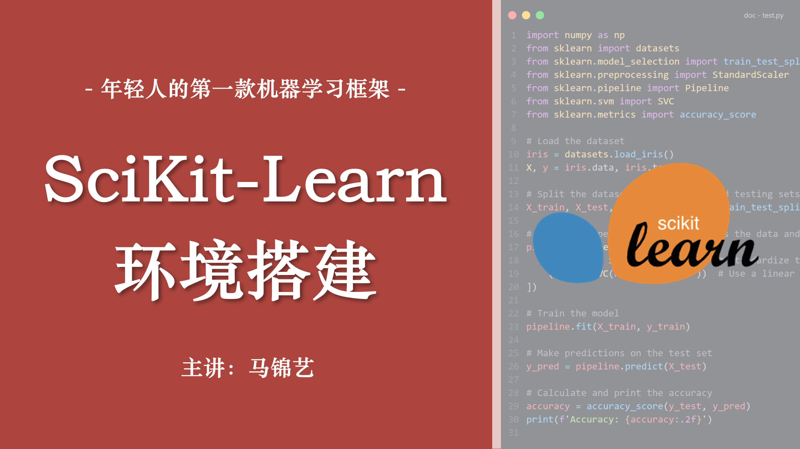

# sklearn 环境搭建

> 年轻人的第一款机器学习框架

## 课程简介

本课程为 2024 年数字媒体技术虚拟现实方向机器学习课程 sklearn 环境搭建课程，主要包括 Anaconda 介绍、环境搭建、vscode 配合、jupyter 使用等内容。

- **主讲**：数媒 2102 班 马锦艺
- **时间**：2024-08-30
- **方式**：线下课堂 | [在线会议](https://meeting.tencent.com/dm/n5tY3W5WDNC9) | [课程回放](https://www.123pan.com/s/7vwRjv-eHfxv.html)
- **资料**： [安装包](https://www.123pan.com/s/7vwRjv-9dfxv) | [在线文档](./env.md)
- **预习内容**：[从这里开始你的 ML 与 SciKit-Learn 学习之旅！](../../sklearn/synopsis/synopsis.md)

## 适用人群

- 对机器学习有一定的概念
- 需要安装 sklearn 环境

## 课程大纲

- 关于 Anaconda
- 卸载 Python
  - 验证是否安装了 Python
  - 卸载 Python（若已安装了 Python）
  - 删除环境变量（若安装过 Python）
- 下载 Anaconda 安装包
- 安装 Anaconda
- 配置环境变量
- 验证
- 更改 conda 源
- 安装 Python 库
- Hello, sklearn!
- 在 vscode 中指定 conda 环境
- 使用 Jupyter Notebook / JupyterLab
  - 使用 Anaconda 运行 jupyter 本地环境
  - 使用 vscode 运行 jupyter 文件
- \[附录\] Anaconda 常用命令
