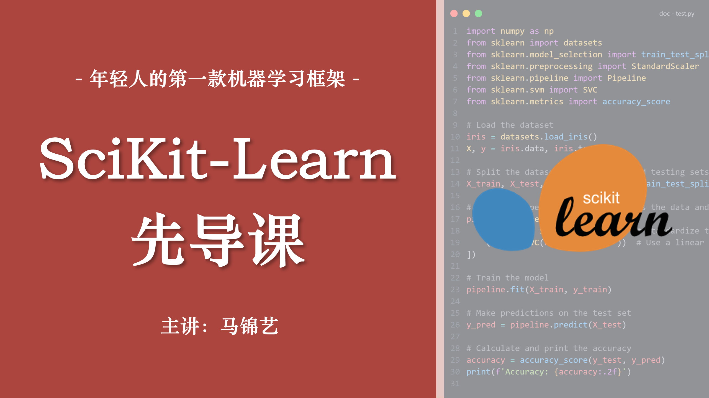

# SciKit-Learn 先导课

> 年轻人的第一款机器学习框架

## 课程简介

本课程为 2024 年数字媒体技术虚拟现实方向机器学习课程 Sklearn 框架先导课，主要包括环境搭建、sklearn 的基本概念、机器学习工程化介绍等内容。

- **主讲**：数媒 2102 班 马锦艺
- **时间**：2024-08-30
- **方式**：线下课堂 | [在线文档](../../sklearn/synopsis/synopsis.md) | [资料](https://www.123pan.com/s/7vwRjv-lRpxv.html)
- **预习内容**：[从这里开始你的 ML 与 SciKit-Learn 学习之旅！](../../sklearn/synopsis/synopsis.md)

## 适用人群

- 对机器学习有一定的概念
- 无 sklearn 基础

## 课程大纲

- 简介
- 环境搭建
- Hello, Sklearn!
- Q&A
