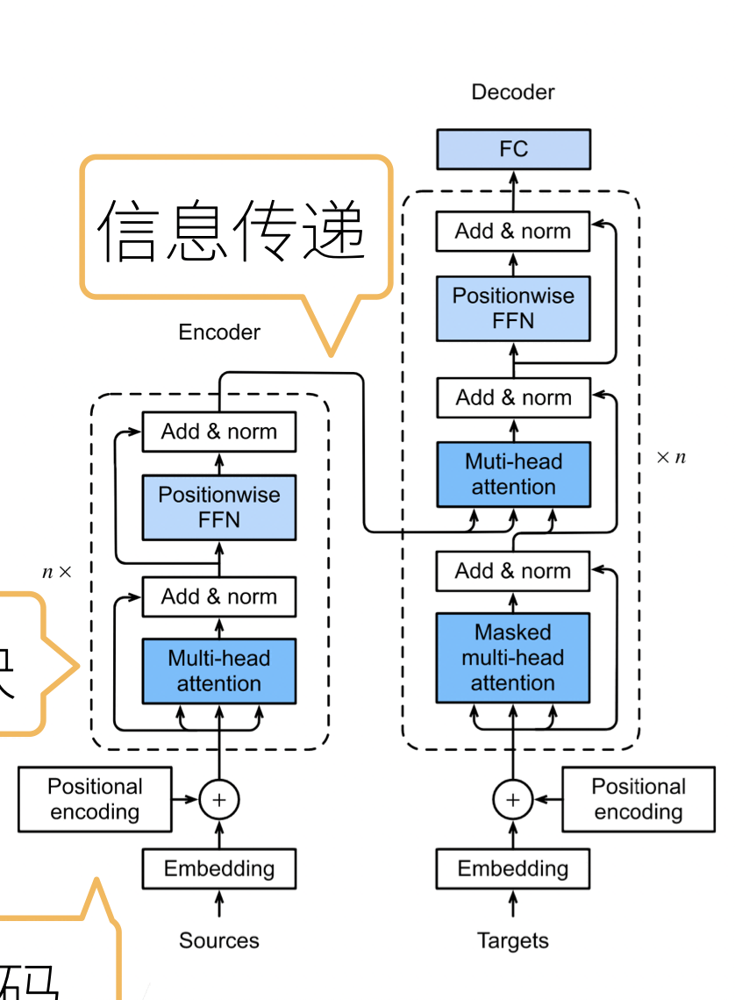
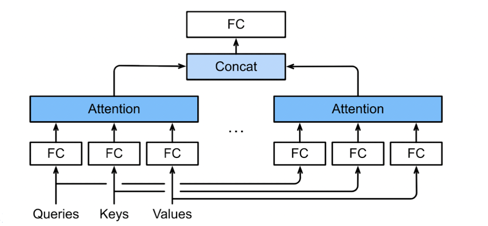

# Transformer

## transformer 架构

- 基于 encoder-decoder 架构来处理序列对
- 跟使用注意力的 seq2seq 不同，transformer 是纯基于注意力

## 多头注意力

- 对同一 key，value，query，希望抽取不同的信息
  - 例如短距离关系和长距离关系
- 多头注意力使用 h 个独立的注意力池化
  - 合并各个头（head）输出得到最终输出

## 有掩码的多头注意力

- 解码器对序列中一个元素输出的时候，不应该考虑该元素之后的元素
- 可以用掩码来实现，也就是计算$x_i$输出的时候，假装当前序列长度为 i

## 基于位置的前馈网络

- 将输入形状变化（b,n,d）变换成（bn，d）；输出形状由（bn，d）变成（b，n，d）
- 作用两个全连接层
- 等价于两层核窗口为 1 的一维卷积层（全连接）

## 层归一化

- 批量归一化对每个特征/通道里元素进行归一化
  - 不适合序列长度会变的 nlp 应用
- 层归一化对每个样本里面的元素进行归一化（ layer norm ）

## 信息传递

- 将编码器输出作为解码中第 i 个 transformer 块中多头注意力的 key 和 value
  - query 来自目标序列
- 意味着编码器和解码器中块的个数，输出维度都是一样的

## 预测

- 预测第 t+1 个输出时
- 解码器中输入前 t 个预测值（顺序）
  - 在自注意力中，前 t 个预测值作为 key 和 value，第 t 个预测值还作为 query
