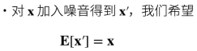
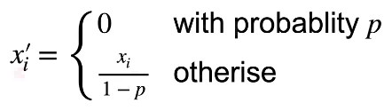
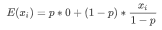
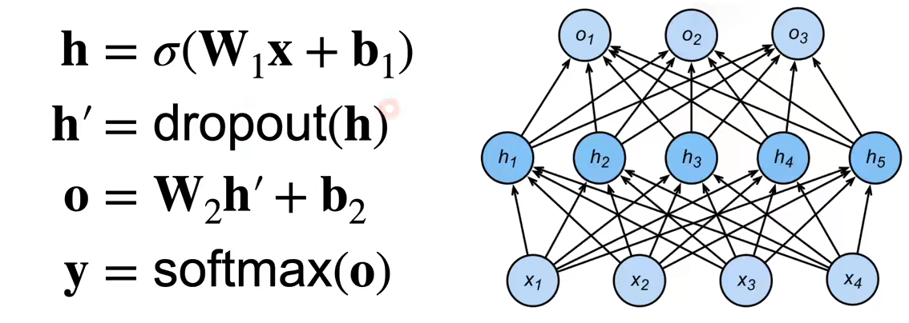
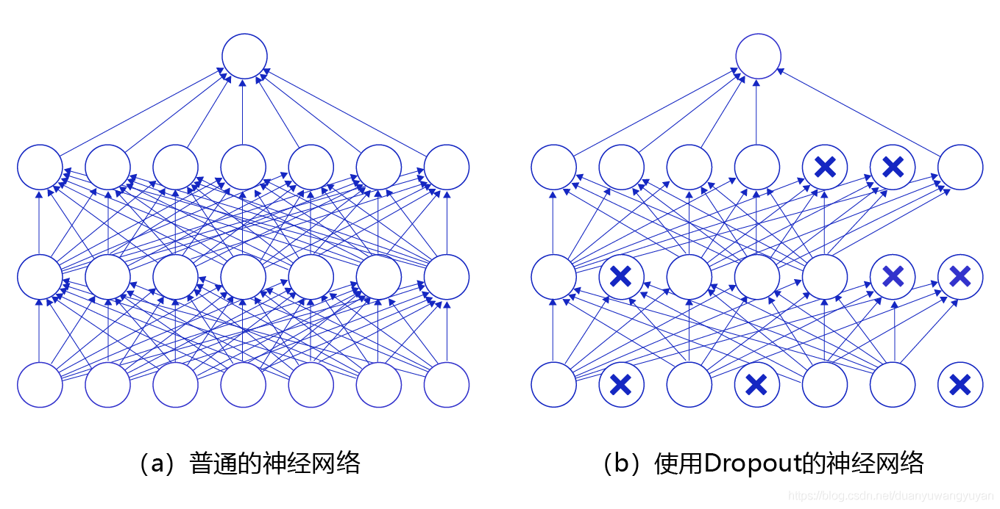

# 丢弃法

## 丢弃法动机、实现及原则

一个好的模型需要对输入数据的扰动鲁棒（健壮性）

如何实现模型的这一能力？

- 使用有噪音的数据。
- 丢弃法：在层之间加入噪音。

加入噪音的原则：

例如模型的功能是识别猫猫，加入噪音可以是输入模糊的猫猫图片，但尽量不要是狗狗的图片。

## 丢弃法内容

丢弃法对每个元素作如下扰动：

能够满足加入噪音的期望相同原则

## 丢弃法的使用

### 使用位置

通常将丢弃法作用在隐藏全连接层的输出上

随机选中某些神经元将其输出置位 0，因此模型不会过分依赖某些神经元

### 训练中的丢弃法

正则项（丢弃法）仅在训练中使用：影响模型参数的更新，预测的时候便不再使用
