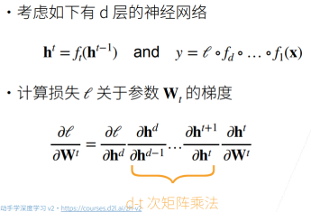
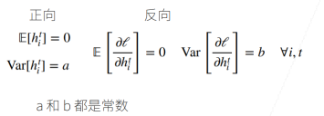

# 数值稳定性

数值稳定性是深度学习中比较重要的点，特别是当神经网络变得很深的时候，数值通常很容易变得不稳定。

## 神经网络的梯度

### 梯度爆炸

假设梯度都是一些比 1 大的数，比如 1.5，做 100 次乘积之后得到 $4 \times 10^{17}$，这个数字很容易带来一些浮点数上限的问题（需了解更多请参考计算机系统 - 计算机中浮点数的存储方式）。

- 值超出值域（infinity）
  - 对于 16 位浮点数尤为严重（数值区间 [6e-5 , 6e4]），GPU 用 16 位浮点数更快
- 对学习率敏感
  - 如果学习率太大 → 大参数值 → 更大的梯度，如此循环几次，容易导致梯度爆炸
  - 如果学习率太小 → 训练无进展
  - 我们可能需要在训练过程中不断调整学习率

### 梯度消失

假设梯度都是一些比 1 小的数，比如 0.8，做 100 次乘积之后得到 $2 \times 10^{-10}$，也可能会带来浮点数下溢的问题。

- 梯度值变为 0
  - 对 16 位浮点数尤为严重
- 训练没有进展
  - 不管如何选择学习率，由于梯度已经为 0 了，学习率 x 梯度=0
- 对于底部层尤为严重
  - 仅仅顶部层训练得较好。第 t 层导数包含 d-t 个矩阵乘积，越往底层走，t 越小，乘得越多，梯度消失越严重，所以底部层效果更差。
  - 无法让神经网络更深。只能把顶部层训练得比较好，底部层跑不动，这和给一个浅的神经网络没有什么区别。

## 模型初始化和激活函数

### 让训练更加稳定

我们的一个核心目标是如何让训练更稳定，梯度值不要太大也不要太小

- 目标：让梯度值在合理的范围内
  - 例如 [1e-6, 1e3]
- 常用方法：
  - 将乘法变加法：
    - ResNet（跳跃连接，如果很多层，加入加法进去）
    - LSTM（引入记忆细胞，更新门，遗忘门，通过门权重求和，控制下一步是否更新）
  - 归一化：
    - 梯度归一化（归一化均值，方差）
    - 梯度裁剪(clipping)：比如大于/小于一个固定的阈值，就让梯度等于这个阈值，将梯度限制在一个范围中。（可以缓解梯度爆炸）
  - 合理的权重初始和激活函数

下面我们重点探讨最后一种方法：合理的权重初始和激活函数

### 基本假设

让每层的均值/方差是一个常数

- 将每层的输出和梯度都看做随机变量：比如第 i 层有 100 维，就将输出和梯度分别看成 100 个随机变量
- 让它们的均值和方差都保持一致：我们的目标，这样不管神经网络多深，最后一层总与第一层差不多，从而不会梯度爆炸和消失

根据我们的假设，可以列出如下方程式：

### 权重初始化

- 在合理值区间里随机初始参数
- 训练开始的时候更容易有数值不稳定
  - 远离最优解的地方损失函数表面可能很复杂
  - 最优解附近表面会比较平
- 使用 N(0, 0.01)分布来初始可能对小网络没问题，但不能保证深度神经网络
