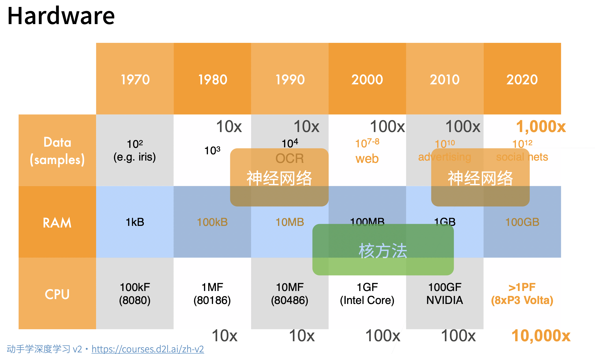
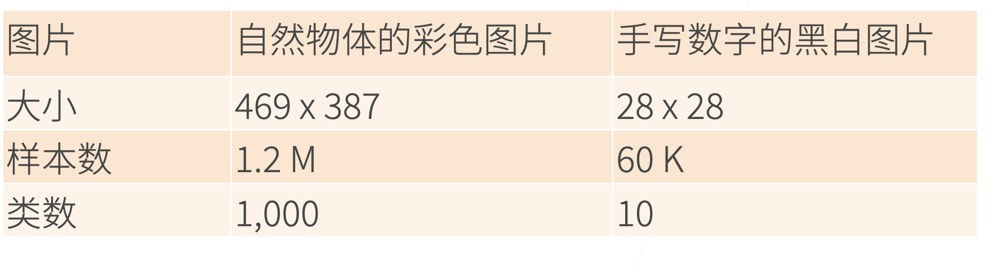
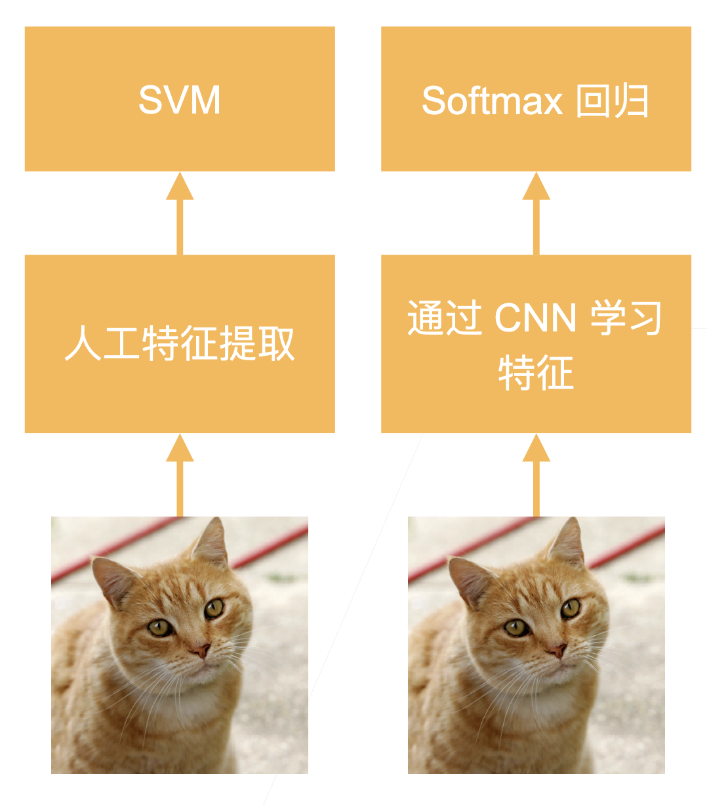
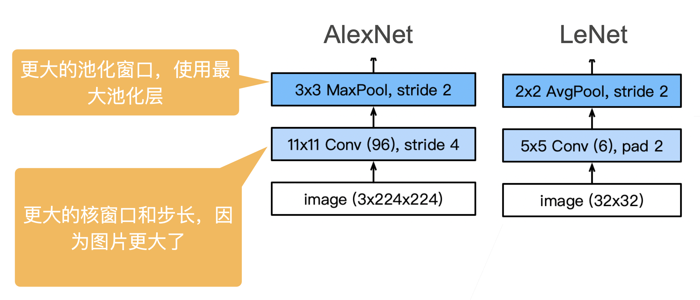
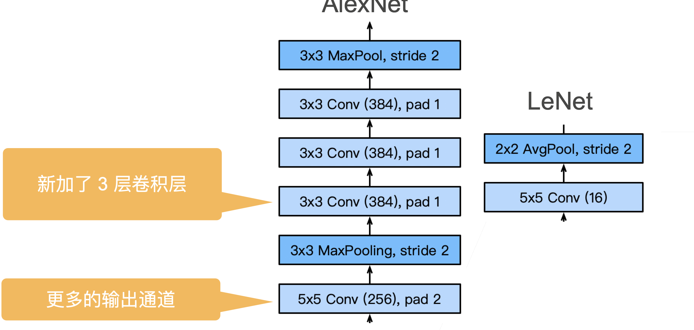
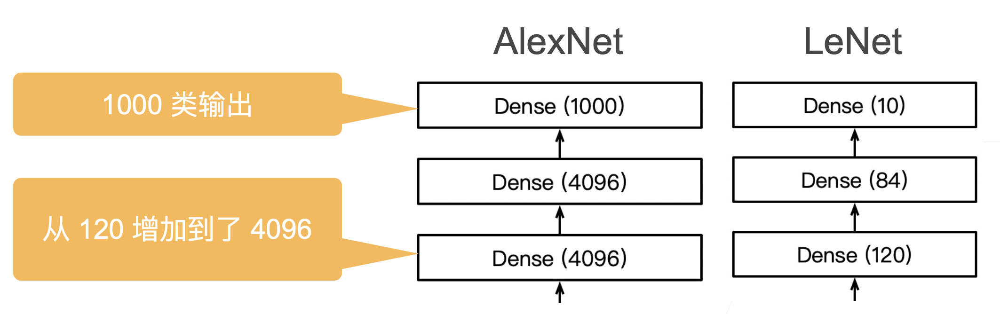
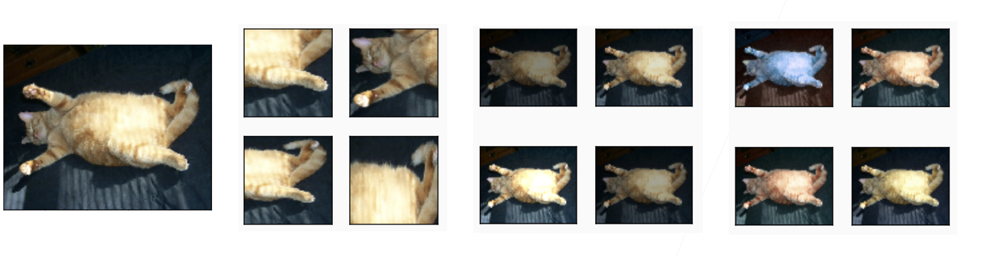
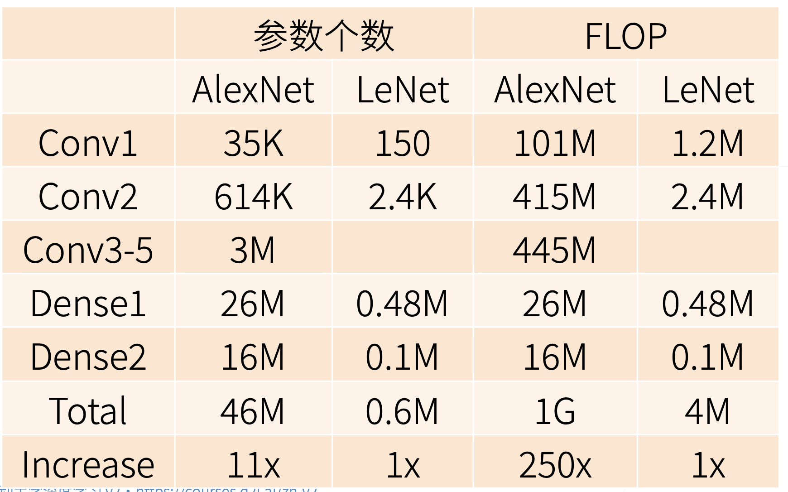

# AlexNet

## \[选读\]历史

**2000 流行的机器学习方法——SVM，核方法**

- 核方法替代了之前的神经网络网络方法，SVM 对于调参不敏感，现在也有一些应用
- 本质上是特征提取，具体的方法是选择核函数来计算，把特征映射到高纬空间，使得他们线性可分
- 经过核函数计算之后，原问题可以转化为凸优化问题，这是 2006 年左右的研究热点
- 核方法有很多漂亮的定理，有很好的数学解释性
- 2010 年左右，深度学习才兴起

**2000 计算机视觉主要方法——几何学**

- 首先还是对图片进行特征抽取
- 希望把计算机视觉问题描述成几何问题，建立（非）凸优化模型，可以得到很多漂亮的定理。
- 可以假设这是一个几何问题，假设这个假设被满足了，可以推出很好的效果

**2010 计算机视觉的热点问题——特征工程**

- 特征工程就是怎么抽取一张图片的特征，因为直接输入一张图片效果非常的差
- 特征描述子：SIFT,SURF

**硬件的发展奠定了深度学习的兴起**

数据的增长，硬件的计算能力奠定了人们对于方法的选择



**ImageNet（2010）**



- AlexNet 赢得了 2012 年 ImageNet 竞赛冠军
- 本质上是一个加强版的 LeNet，更深更大
- AlexNet 主要改进措施：
  - dropout（正则）
  - ReLu（梯度更大）
  - MaxPooling（取最大值，梯度相对增大）
- 影响：计算机视觉方法论的改变，从人工提取特征过渡到 CNN 学习特征



## AlexNet 架构







### 网络代码

```python
net = nn.Sequential(
这里，我们使用一个11*11的更大窗口来捕捉对象。
    # 同时，步幅为4，以减少输出的高度和宽度。
    # 另外，输出通道的数目远大于LeNet
    nn.Conv2d(1, 96, kernel_size=11, stride=4, padding=1), nn.ReLU(),
    nn.MaxPool2d(kernel_size=3, stride=2),
    # 减小卷积窗口，使用填充为2来使得输入与输出的高和宽一致，且增大输出通道数
    nn.Conv2d(96, 256, kernel_size=5, padding=2), nn.ReLU(),
    nn.MaxPool2d(kernel_size=3, stride=2),
    # 使用三个连续的卷积层和较小的卷积窗口。
    # 除了最后的卷积层，输出通道的数量进一步增加。
    # 在前两个卷积层之后，汇聚层不用于减少输入的高度和宽度
    nn.Conv2d(256, 384, kernel_size=3, padding=1), nn.ReLU(),
    nn.Conv2d(384, 384, kernel_size=3, padding=1), nn.ReLU(),
    nn.Conv2d(384, 256, kernel_size=3, padding=1), nn.ReLU(),
    nn.MaxPool2d(kernel_size=3, stride=2),
    nn.Flatten(),
    # 这里，全连接层的输出数量是LeNet中的好几倍。使用dropout层来减轻过拟合
    nn.Linear(6400, 4096), nn.ReLU(),
    nn.Dropout(p=0.5),
    nn.Linear(4096, 4096), nn.ReLU(),
    nn.Dropout(p=0.5),
    # 最后是输出层。由于这里使用Fashion-MNIST，所以用类别数为10，而非论文中的1000
    nn.Linear(4096, 10))
```

### 更多细节

- 激活函数从 sigmoid 变成 Relu，减缓梯度消失
- 隐藏全连接层后加入了丢弃层（2 个 4096 之后加入了 dropout）
- 数据增强，将一张图片进行变化，选取多个位置、光照之类的。



### 复杂度对比

参数个数增加，每次更新数据增加


