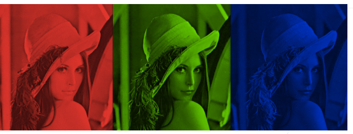
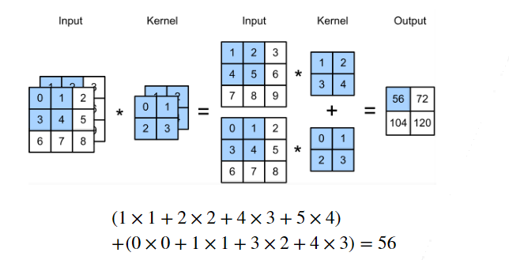
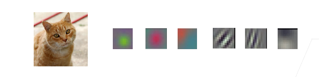
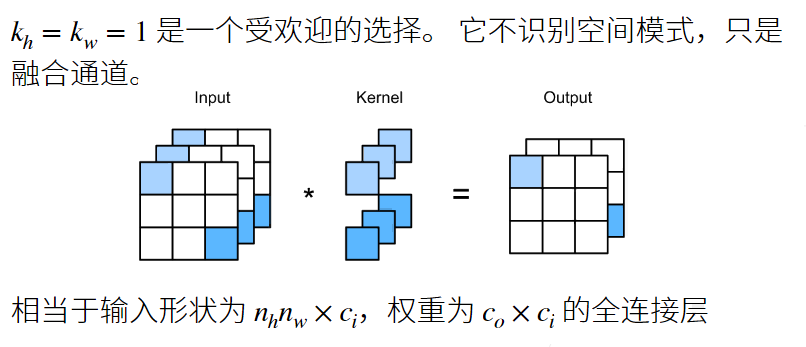
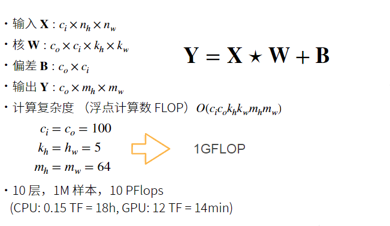

# 多个输入和输出通道

## 多个输入通道

彩色图像可能有 RGB 三个通道，转换为灰度会丢失信息



每个通道都有一个卷积和，结果是所有通道卷积结果的和



输入 $X$: $c_{i} \times n_{h} \times n_{w}$  
核 $W$: $c_{i} \times k_{h} \times k_{w}$  
输出 $Y$: $m_{h} \times m_{w}$

```python
import torch
from d2l import torch as d2l

def corr2d_multi_in(X, K):
    return sum(d2l.corr2d(x, k) for x, k in zip(X, K))
```

## 多个输出通道

- 无论有多少输入通道，到目前为止我们只得到单输出通道。
- 我们可以有多个三维卷积核，每个核生成一个输出通道。
- 输入 $X$: $c_{i} \times k_{h} \times k_{w}$
- 核 $W$: $c_{o} \times c_{i} \times k_{h} \times k_{w}$
- 输出 $Y$: $c_{o} \times m_{h} \times m_{w}$

```python
def corr2d_multi_in_out(X, K):
    return torch.stack([corr2d_multi_in(X, k) for k in K], 0)
```

## 多个输入和输出通道

每个通道可以识别特定的模式



输入通道核识别并组合输入中的模式

## 1X1 卷积层



```python
def corr2d_multi_in_out_1x1(X, K):
    c_i, h, w = X.shape
    c_o = K.shape[0]
    X = X.reshape((c_i, h * w))
    K = K.reshape((c_o, c_i))
    Y = torch.matmul(K, X)
    return Y.reshape((c_o, h, w))
```

## 二维卷积层


