# 卷积层

## 从全连接到卷积

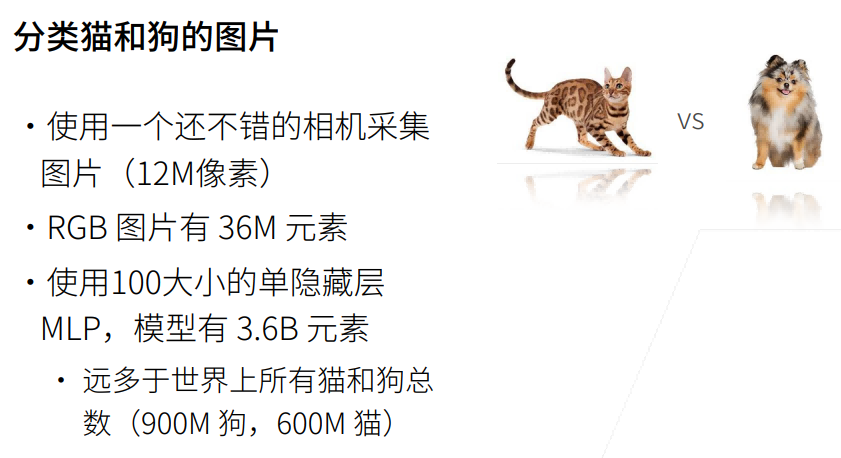

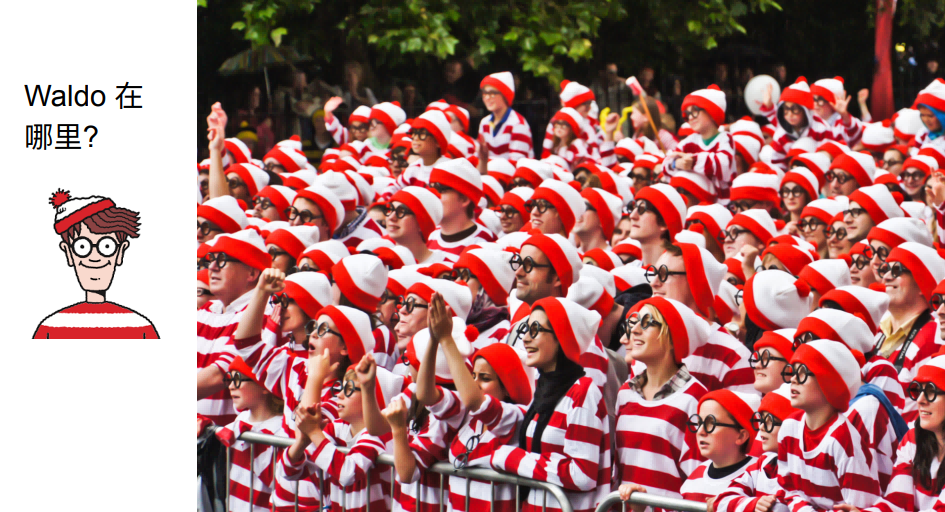

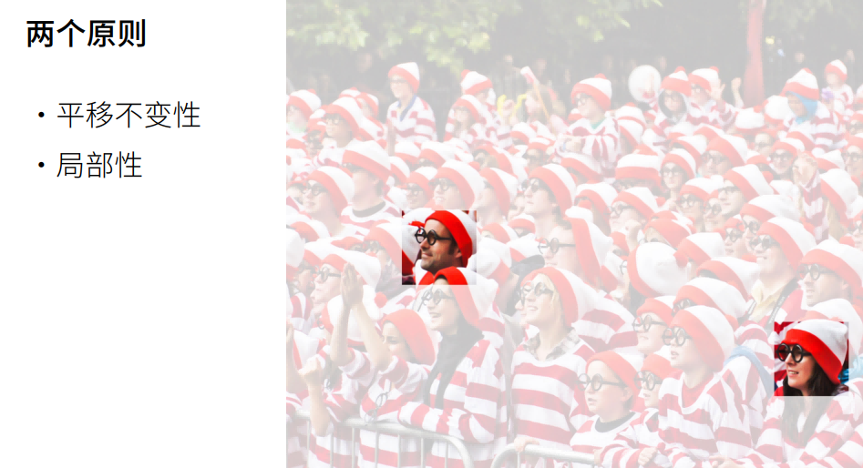

- k、l 表示图片的第 k 行、第 l 列个像素，它相当于全连接层的$x_i$，$x_i$乘以一个权重值，得到全连接层中一层神经元中一个神经元的一条线的值。
- 有一个四维的 W，里面有很多个 w，例如前图的全连接层有 100 个 w。i，j 表示此 w 的坐标，即遍历所有的 i、j 合为 100。每个 w 又是一个矩阵，每个 w 连接所有像素，对应矩阵宽高为 k 和 l。因此下图中的$h_{i,j}$为全连接层中一个神经元的输出。
- 原来的 k,l 是基于图片的绝对位置，ab 是根据 ij 的相对位置，这里就省略绝对位置，只需要一个原点加相对原点的相对位置，就可以表示位置信息。

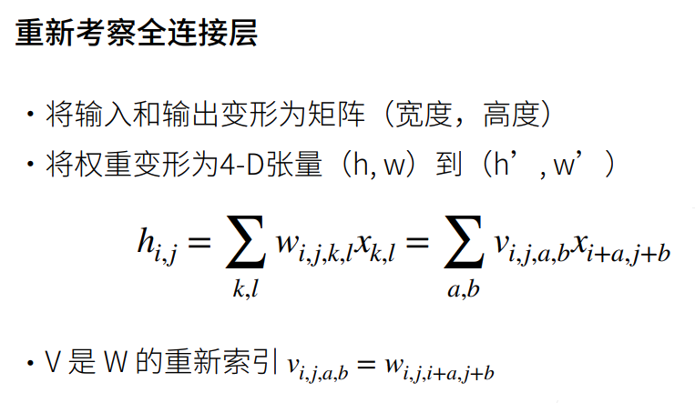

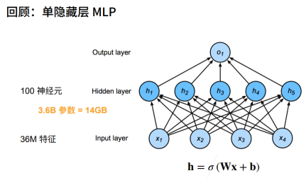

- 当在图片中形成一个识别器后，在一定像素大小的范围内，它都有自己的权重，当这个识别器在图片上换位置之后，它的权重应该不变。
- 理解成用同一张卷积核遍历整张图片。卷积核不会随着位置变化而变化。
- 权重就是特征提取器，不应该随位置而发生变化。

简而言之卷积核就是个框，在图片上不断扫描，无论扫在图上的哪个位置，卷积核都是不变的。对于一张图片应该有多个卷积核，但是每个卷积核要识别的东西不同，一个卷积核就是一个分类器。

- 卷积确实是 weight shared，但不是全联接，每个神经元是对应卷积核大小个输入。
- 卷积是 weight shared 全连接。

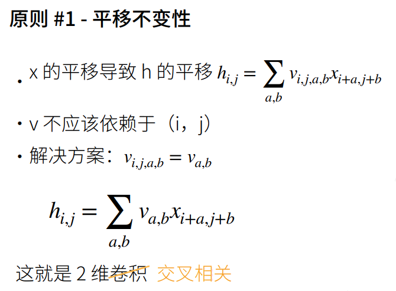

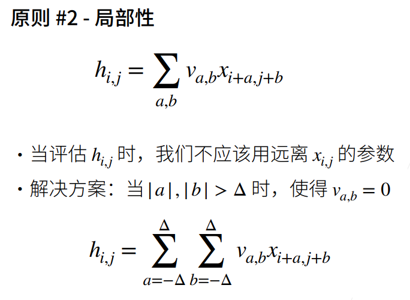

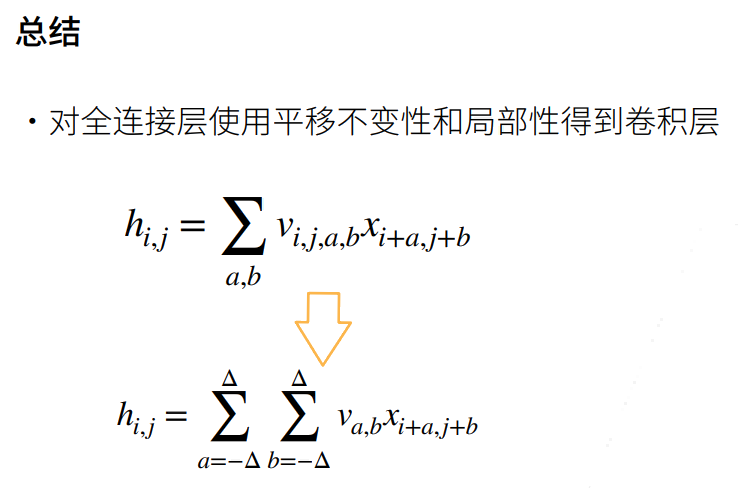

## 卷积层

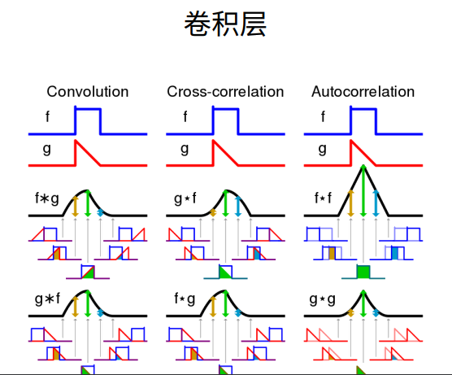

- 卷积核遇到和自己相似的，会极度膨胀，遇到和自己不一样的，会极度缩小。
- 提取图像特征，卷积层越深，提取的是语义的特征。

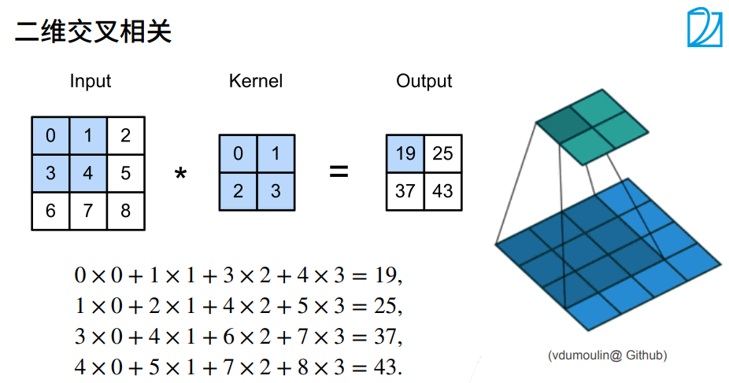

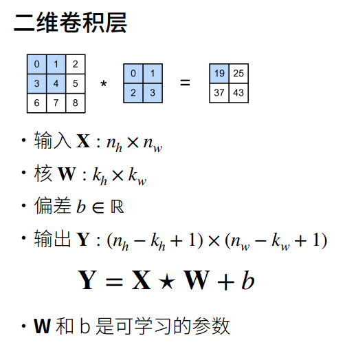

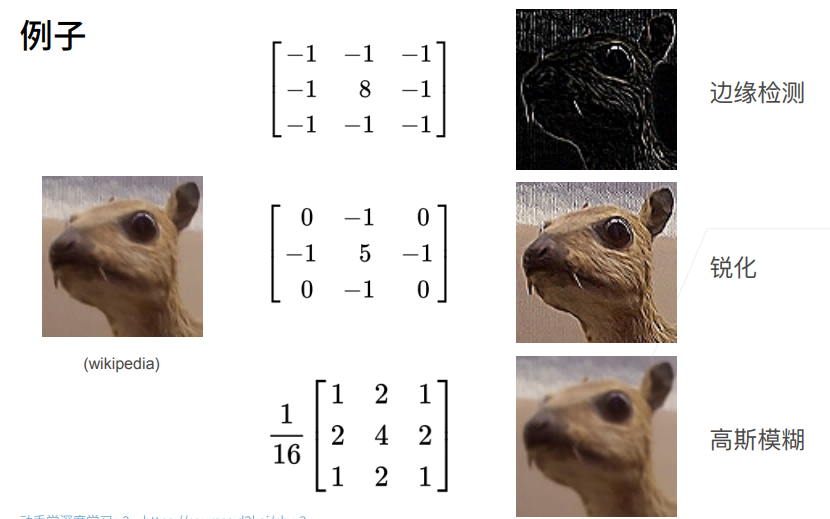

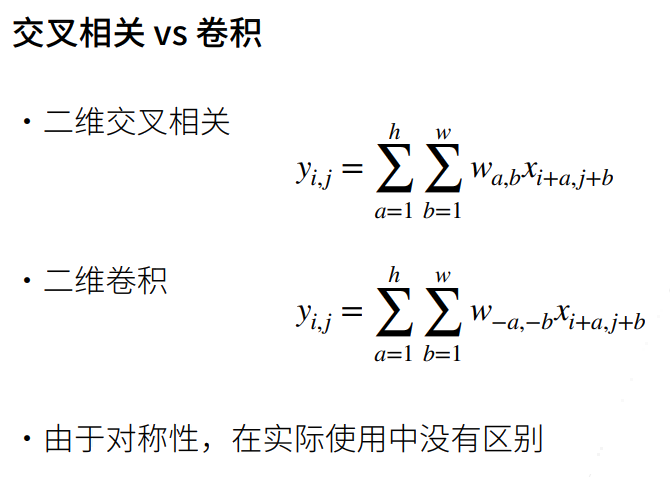

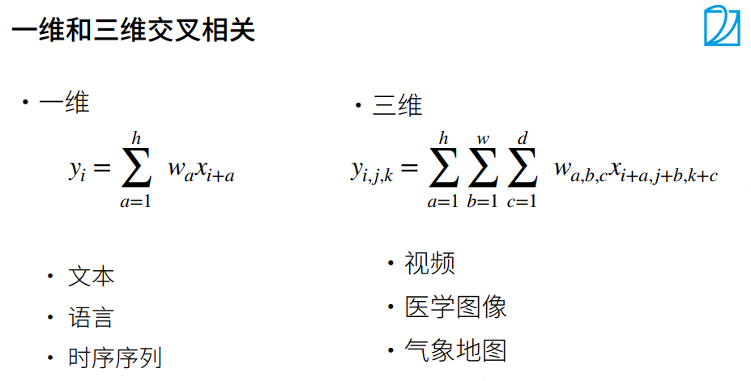
