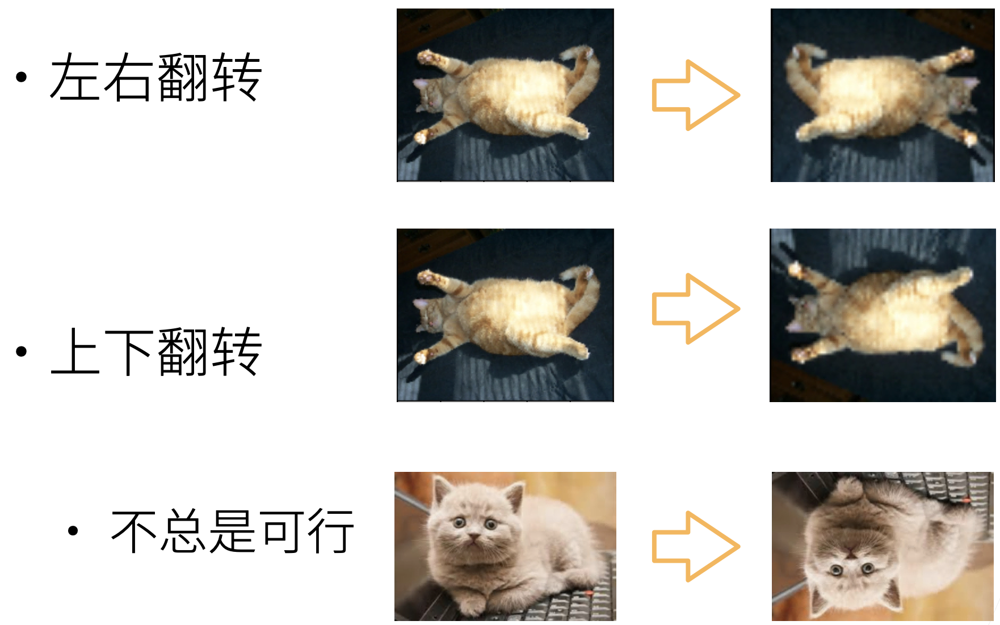
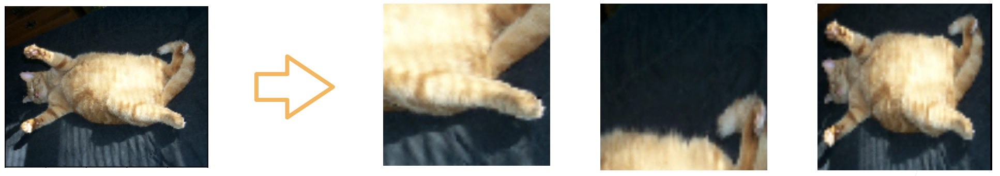
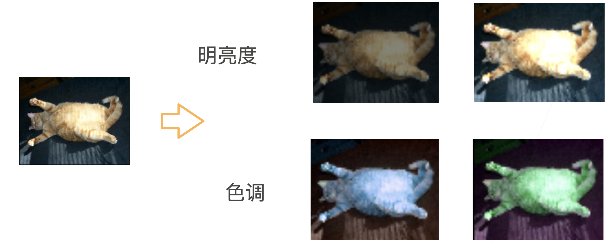
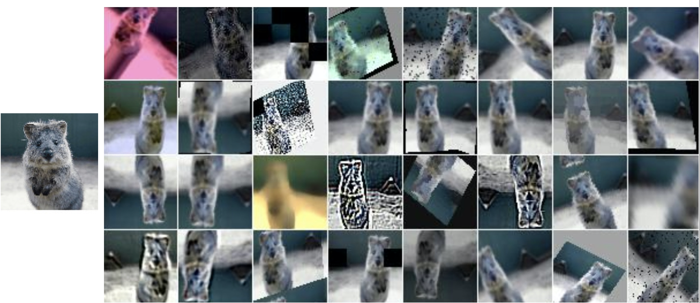

# 数据增广

数据增广不仅用于处理图片，也可用于文本和语音，这里只涉及到图片。

## 使用增强数据训练

采集数据得到的训练场景与实际部署场景不同是常见的问题，这种变化有时会显著影响模型表现。在训练集中尽可能模拟部署时可能遇到的场景对模型的泛化性十分重要。

数据增强是指在一个已有数据集上操作使其有更多的多样性。对语音来说可以加入不同的背景噪音，对图片而言可以改变其颜色，形状等。

一般来说不会先将数据集做增广后存下来再用于训练；而是直接在线生成，从原始数据中读图片并随机做数据增强，再进入模型训练。通常只在训练时做数据增强而测试时不用。可以将数据增强理解为一个正则项。

## 增强手段

### 翻转

一些例子：左右翻转，上下翻转

要注意不是所有增强策略都总是可行，如建筑图片上下翻转就不太合适，而之前的树叶分类竞赛中的树叶图片就没关系。

### 切割

从图片中切割一块然后变形到固定形状。一般做法是随机取一个高宽比，随机取图片大小（切下部分占原图的百分数），随机取位置。

### 颜色

改变色调，饱和度，明亮度。

### 其他

还可以有很多种不同的方法，如高斯模糊，部分像素变黑，图片变形，锐化等等。理论上讲 Photoshop 能做到的都可以用作图片数据增强，但效果好坏另当别论。如果测试集中有类似的效果那么相应的数据增广手段会更有效。

