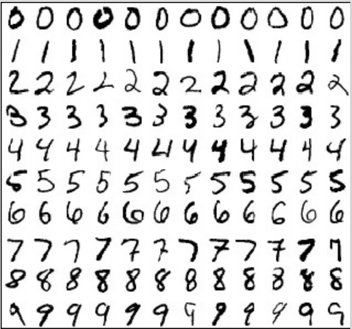
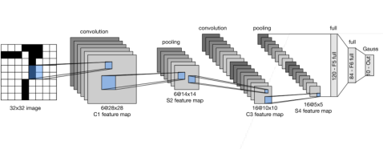
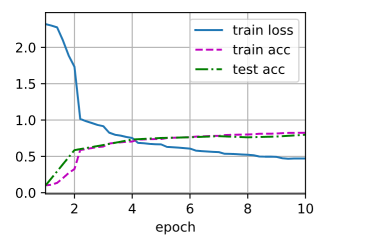

# LeNet 卷积神经网络

## 手写数字识别

- LeNet 网络最早是为了应用于手写数字的识别应用。
- 应用背景：
  - 邮政局希望可以自动读出信件上的邮政编码
  - 人们希望可以用支票自动取钱
- 该模型在 80 年代末的银行被真正的部署


## MNIST 数据集

- LeNet 所使用的数据集
- 50，000 个训练数据
- 10，000 个测试数据
- 图像大小为 28\*28
- 10 类



## LeNet 的具体模型



## API

- 定义网络结构和准备工作

```python
#导入所需的库
import torch
from torch import nn
from d2l import torch as d2l

#定义网络结构
net = nn.Sequential(
    nn.Conv2d(1, 6, kernel_size=5, padding=2), nn.Sigmoid(),
    nn.AvgPool2d(kernel_size=2, stride=2),
    nn.Conv2d(6, 16, kernel_size=5), nn.Sigmoid(),
    nn.AvgPool2d(kernel_size=2, stride=2),
    nn.Flatten(),
    nn.Linear(16 * 5 * 5, 120), nn.Sigmoid(),
    nn.Linear(120, 84), nn.Sigmoid(),
    nn.Linear(84, 10))

#把每一层数据的shape给打印出来
X = torch.rand(size=(1, 1, 28, 28), dtype=torch.float32)#创建符合要求的张量
for layer in net:
    X = layer(X)#通过每一层
    print(layer.__class__.__name__,'output shape: \t',X.shape)#打印
```

- 模型训练

```python
# 下载数据集
batch_size = 256#批量大小
train_iter, test_iter = d2l.load_data_fashion_mnist(batch_size=batch_size)#下载或加载数据集，得到训练和测试集的迭代对象


# 使用GPU计算模型在数据集上的精度
def evaluate_accuracy_gpu(net, data_iter, device=None): #@save
    """使用GPU计算模型在数据集上的精度"""
    if isinstance(net, nn.Module):
        net.eval()  # 设置为评估模式
        if not device:
            device = next(iter(net.parameters())).device
    # 正确预测的数量，总预测的数量
    metric = d2l.Accumulator(2)#创建一个累加器，包含2个要累加的元素
    with torch.no_grad():
        for X, y in data_iter:
            if isinstance(X, list):
                # BERT微调所需的（之后将介绍）
                X = [x.to(device) for x in X]
            else:
                X = X.to(device)
            y = y.to(device)
            metric.add(d2l.accuracy(net(X), y), y.numel())#把每一组数据预测结果正确的个数和长度累加
    return metric[0] / metric[1]


# 定义训练函数
def train_ch6(net, train_iter, test_iter, num_epochs, lr, device):
    """用GPU训练模型(在第六章定义)"""
    def init_weights(m):
        if type(m) == nn.Linear or type(m) == nn.Conv2d:
            nn.init.xavier_uniform_(m.weight)#对linear类型的层用xavier初始化
    net.apply(init_weights)
    print('training on', device)
    net.to(device)
    optimizer = torch.optim.SGD(net.parameters(), lr=lr)
    loss = nn.CrossEntropyLoss()
    animator = d2l.Animator(xlabel='epoch', xlim=[1, num_epochs],
                            legend=['train loss', 'train acc', 'test acc'])#动画需要
    timer, num_batches = d2l.Timer(), len(train_iter)
    for epoch in range(num_epochs):
        # 训练损失之和，训练准确率之和，范例数
        metric = d2l.Accumulator(3)
        net.train()
        for i, (X, y) in enumerate(train_iter):
            timer.start()
            optimizer.zero_grad()#梯度清零
            X, y = X.to(device), y.to(device)
            y_hat = net(X)#正向传播
            l = loss(y_hat, y)#计算损失
            l.backward()#反向传播
            optimizer.step()#梯度下降
            with torch.no_grad():
                metric.add(l * X.shape[0], d2l.accuracy(y_hat, y), X.shape[0])#训练损失之和，训练准确率之和，范例数
            timer.stop()
            train_l = metric[0] / metric[2]
            train_acc = metric[1] / metric[2]
            if (i + 1) % (num_batches // 5) == 0 or i == num_batches - 1:
                animator.add(epoch + (i + 1) / num_batches,
                             (train_l, train_acc, None))
        test_acc = evaluate_accuracy_gpu(net, test_iter)#评估测试集的精度
        animator.add(epoch + 1, (None, None, test_acc))
    print(f'loss {train_l:.3f}, train acc {train_acc:.3f}, '
          f'test acc {test_acc:.3f}')
    print(f'{metric[2] * num_epochs / timer.sum():.1f} examples/sec '
          f'on {str(device)}')


# 运行
lr, num_epochs = 0.9, 10
train_ch6(net, train_iter, test_iter, num_epochs, lr, d2l.try_gpu())
```

某一次的输出结果：


