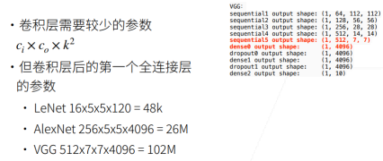
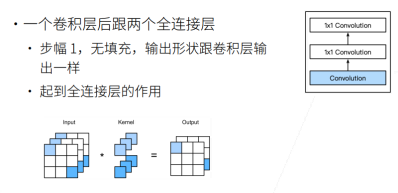
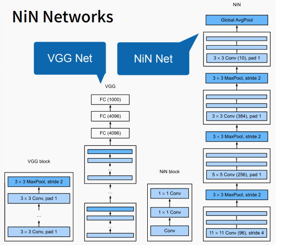

# 网络中的网络（NiN）

## 动机

全连接层的问题：

- 卷积层需要的参数较少
- 而卷积层后的第一个全连接层的参数较多



以 VGG 为例(图示)，全连接层需要先 Flatten，输入维度为 512x7x7，输出维度为 4096，则需要参数个数为 512x7x7x4096=102M。

## NiN 块

核心思想：一个卷积层后面跟两个 1x1 的卷积层，后两层起到全连接层的作用。



## NiN 架构

- 无全连接层
- 交替使用 NiN 块和步幅为 2 的最大池化层
  - 逐步减小高宽和增大通道数
- 最后使用全局平均池化得到输出
  - 其输入通道是类别数

## NiN Networks



NiN 架构如上图右边所示，若干个 NiN 块(图示中为 4 个块)+池化层；前 3 个块后接最大池化层，最后一块连接一个全局平均池化层。

## API

- NiN 块

```python
import torch
from torch import nn
from d2l import torch as d2l

# 定义NiN块
def nin_block(in_channels, out_channels, kernel_size, strides, padding):
    return nn.Sequential(
        nn.Conv2d(in_channels, out_channels, kernel_size, strides, padding),
        nn.ReLU(), nn.Conv2d(out_channels, out_channels, kernel_size=1),
        nn.ReLU(), nn.Conv2d(out_channels, out_channels, kernel_size=1),
        nn.ReLU())
```

- NiN 模型

```python
net = nn.Sequential(
    nin_block(1, 96, kernel_size=11, strides=4, padding=0),
    nn.MaxPool2d(3, stride=2),
    nin_block(96, 256, kernel_size=5, strides=1, padding=2),
    nn.MaxPool2d(3, stride=2),
    nin_block(256, 384, kernel_size=3, strides=1, padding=1),
    nn.MaxPool2d(3, stride=2), nn.Dropout(0.5),
    # 标签类别数是10
    nin_block(384, 10, kernel_size=3, strides=1, padding=1),
    nn.AdaptiveAvgPool2d((1, 1)),          #全局平均池化，高宽都变成1
    nn.Flatten())             #消掉最后两个维度, 变成(batch_size, 10)
```

- 查看每个块的输出情况

```python
X = torch.rand(size=(1, 1, 224, 224))
for layer in net:
    X = layer(X)
    print(layer.__class__.__name__, 'output shape:\t', X.shape)
```

- 训练模型

```python
lr, num_epochs, batch_size = 0.1, 10, 128
train_iter, test_iter = d2l.load_data_fashion_mnist(batch_size, resize=224)
d2l.train_ch6(net, train_iter, test_iter, num_epochs, lr, d2l.try_gpu())
```
