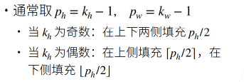

# 填充和步幅

## 填充

填充(Padding)指的是在输入周围添加额外的行/列


**维度变化**：


两种不同的卷积方式：

1. **Valid 卷积**：不进行填充，卷积运算过后得到的矩阵形状为(n-f+1)×(n-f+1)。
2. **Same 卷积**：先对矩阵进行填充，然后再进行卷积运算，使得运算前后矩阵大小不变。



## 步幅

想法来源：如果按照原来的操作(卷积步长为 1)，那么给定输入大小为 224x224，在使用 5x5 卷积核的情况下，需要 55 层才能将输出降低到 4x4，也就是说，需要大量的计算才能得到维度较小的输出。

步幅是指行/列的滑动步长


维度变化:


注意：第三点可以当做结论来记(Same 卷积或 Valid 卷积(且 s≥k 时))。一般来说，如果 n 是偶数，s 取 2，池化层做 Valid 卷积(不填充)且 k=2，此时输出维度直接可以写成 n/2 x n/2。如果怕搞混，直接记第一个公式每次现推也可。

## API

```python
nn.Conv2d(in_channels, out_channels, kernel_size, stride=1, padding=0, dilation=1, groups=1, bias=True)
```

- `in_channels`：输入通道数
- `out_channels`：输出通道数
- `kernel_size`：卷积核大小
- `stride`：步幅
- `padding`：填充
- `dilation`：膨胀率
- `groups`：组数
- `bias`：是否使用偏置
