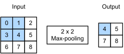

# 池化层

本节将介绍池化（pooling）层

目的：类似于数据增强，降低卷积层对位置的敏感性；一定程度减少计算。

## 最大池化层和平均池化层

与卷积层类似，池化层运算符由一个固定形状的窗口组成，该窗口根据其步幅大小在输入的所有区域上滑动，为固定形状窗口遍历的每个位置计算一个输出。 然而，不同于卷积层中的输入与卷积核之间的互相关计算，池化层不包含参数。 相反，池运算符是确定性的，我们通常计算池化窗口中所有元素的最大值或平均值。这些操作分别称为最大池化层（maximum pooling）和平均池化层（average pooling）。

在这两种情况下，与互相关运算符一样，池化窗口从输入张量的左上角开始，从左往右、从上往下的在输入张量内滑动。在池化窗口到达的每个位置，它计算该窗口中输入子张量的最大值或平均值。计算最大值或平均值是取决于使用了最大池化层还是平均池化层。



上图中的输出张量的高度为 $2$，宽度为 $2$。这四个元素为每个池化窗口中的最大值：

$$
\max(0, 1, 3, 4) = 4,\quad \max(1, 2, 4, 5) = 5,\quad \max(3, 4, 6, 7) = 7,\quad \max(4, 5, 7, 8) = 8.
$$

池化窗口形状为 $p \times q$ 的池化层称为 $p \times q$ 池化层，池化操作称为 $p \times q$ 池化。

回到本节开头提到的对象边缘检测示例，现在我们将使用卷积层的输出作为 $2 \times 2$ 最大池化的输入。设置卷积层输入为 $X$，池化层输出为 $Y$。无论 $X[i, j]$ 和 $X[i, j + 1]$ 的值是否不同，或 $X[i, j + 1]$ 和 $X[i, j + 2]$ 的值是否不同，池化层始终输出 $Y[i, j] = 1$。也就是说，使用 $2 \times 2$ 最大池化层，即使在高度或宽度上移动一个元素，卷积层仍然可以识别到模式。

在下面的代码中的 `pool2d` 函数中，我们实现了池化层的前向传播。然而，这里我们没有卷积核，输出为输入中每个区域的最大值或平均值。

```python
import torch
from torch import nn
from d2l import torch as d2l


def pool2d(X, pool_size, mode='max'):
    p_h, p_w = pool_size
    Y = torch.zeros((X.shape[0] - p_h + 1, X.shape[1] - p_w + 1))
    for i in range(Y.shape[0]):
        for j in range(Y.shape[1]):  # 枚举输出的每个位置，[i,j]对应输入的位置[i至i+p_h,j至j+p_w]
            if mode == 'max':  # 最大池化
                Y[i, j] = X[i: i + p_h, j: j + p_w].max()  # max函数返回最大值
            elif mode == 'avg':  # 平均池化
                Y[i, j] = X[i: i + p_h, j: j + p_w].mean()  # mean函数返回平均值
    return Y
```

我们可以构建上图中的输入张量 X，验证二维最大池化层的输出：

```python
X = torch.tensor([[0.0, 1.0, 2.0], [3.0, 4.0, 5.0], [6.0, 7.0, 8.0]])
pool2d(X, (2, 2))
```

此外，我们还可以(验证平均池化层)：

```python
pool2d(X, (2, 2), 'avg')
```

## 填充和步幅

与卷积层一样，池化层也可以改变输出形状。和以前一样，我们可以通过填充和步幅以获得所需的输出形状。 下面，我们用深度学习框架中内置的二维最大池化层，来演示池化层中填充和步幅的使用。 我们首先构造了一个输入张量 X，它有四个维度，其中样本数和通道数都是 1。

```python
X = torch.arange(16, dtype=torch.float32).reshape(
    (1, 1, 4, 4))  # 维度[batch_size，通道数，H，W]
```

默认情况下，(深度学习框架中的步幅与池化窗口的大小相同)。 因此，如果我们使用形状为(3, 3)的池化窗口，那么默认情况下，我们得到的步幅形状为(3, 3)：

```python
pool2d = nn.MaxPool2d(3)
```

当然，我们可以设定一个任意大小的矩形池化窗口，并分别设定填充和步幅的高度和宽度：

```python
pool2d = nn.MaxPool2d((2, 3), stride=(2, 3), padding=(0, 1))
```

## 多个通道

在处理多通道输入数据时，池化层在每个输入通道上单独运算，而不是像卷积层一样在通道上对输入进行汇总。 这意味着池化层的输出通道数与输入通道数相同。 下面，我们将在通道维度上连结张量 X 和 X + 1，以构建具有 2 个通道的输入：

```python
X = torch.cat((X, X + 1), 1)  # 在第一个维度也就是通道维度拼接
```

如下所示，池化后输出通道的数量仍然是 2：

```python
pool2d = nn.MaxPool2d(3, padding=1, stride=2)
```
