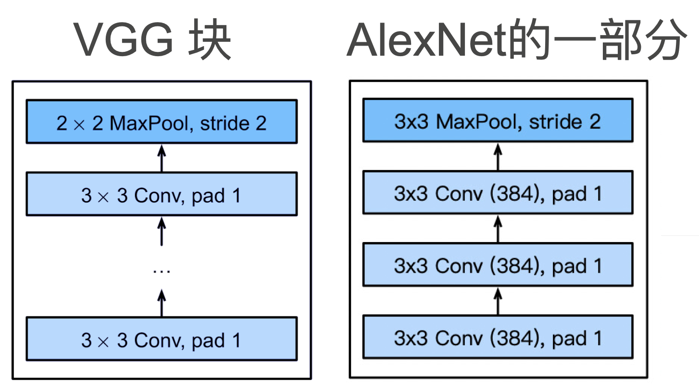
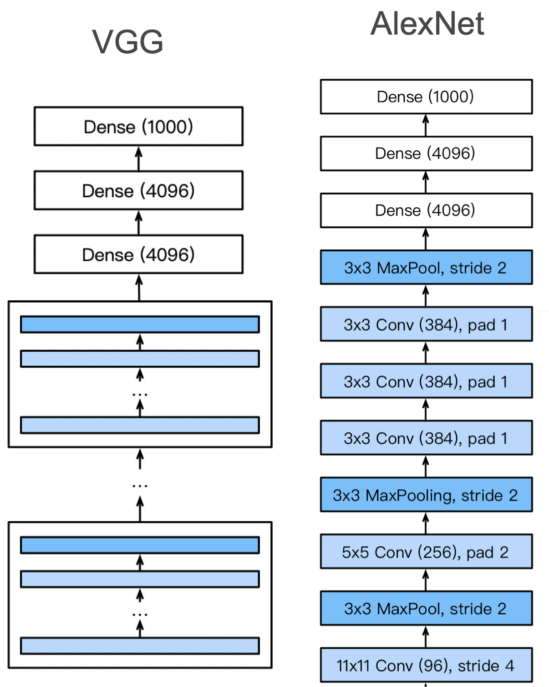

# 使用块的网络 VGG

Alexnet 最大的问题在于长得不规则，结构不甚清晰，也不便于调整。想要把网络做的更深更大需要更好的设计思想和标准框架。

## VGG 块

直到现在更深更大的模型也是我们努力的方向，在当时 AlexNet 比 LeNet 更深更大得到了更好的精度，大家也希望把网络做的更深更大。选择之一是使用更多的全连接层，但全连接层的成本很高；第二个选择是使用更多的卷积层，但缺乏好的指导思想来说明在哪加，加多少。最终 VGG 采取了将卷积层组合成块，再把卷积块组合到一起的思路。

VGG 块可以看作是 AlexNet 思路的拓展，AlexNet 中将三个相同的卷积层放在一起再加上一个池化层，而 VGG 将其拓展成可以使用任意个 3x3，不改变输入大小的的卷积层，最后加上一个 2x2 的最大池化层。

为什么选择 3x3 卷积呢？在计算量相同的情况下选用更大的卷积核涉及对网络会越浅，VGG 作者经过实验发现用 3x3 卷积的效果要比 5x5 好，也就是说神经网络库深且窄的效果会更好。

## VGG 架构

多个 VGG 块后接全连接层，不同次数的重复块得到不同的架构，如 VGG-16, VGG-19 等，后面的数字取决于网络层数。

可以讲 VGG 看作是将 AlexNet 中连续卷积的部分取出加以推广和复制，并删去了 AlexNet 中不那么规整的前几层。

VGG 较 AlexNet 相比性能有很大的提升，而代价是处理样本速度的降低和内存占用的增加。
