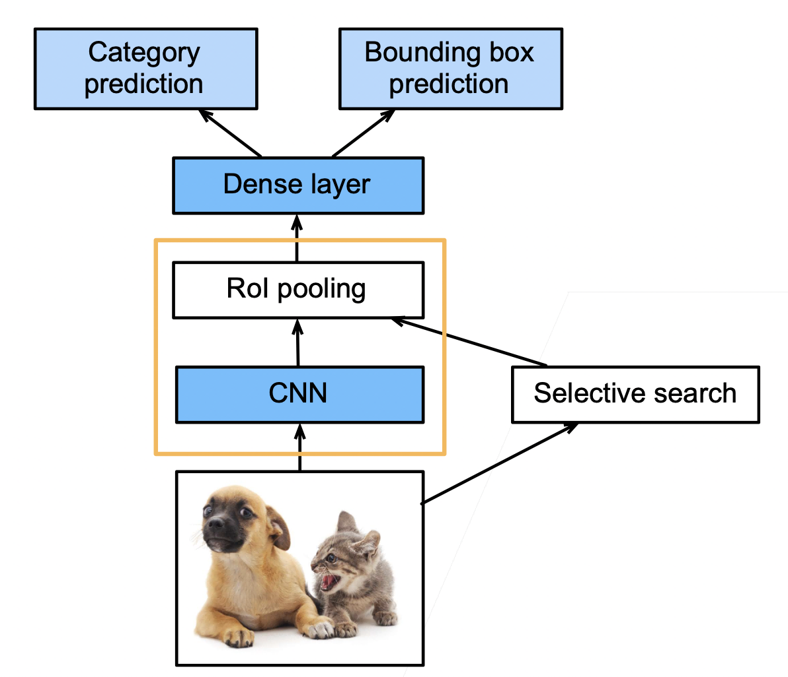
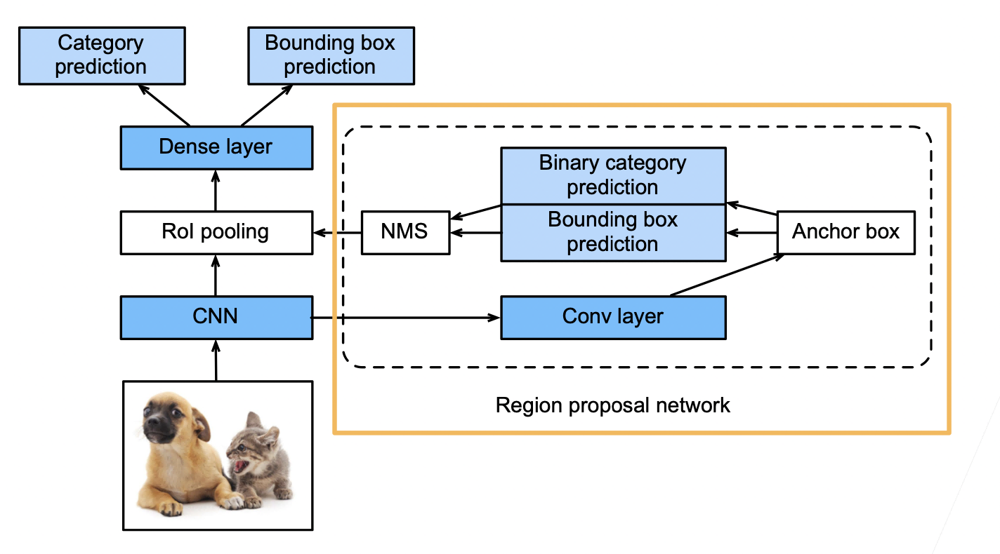
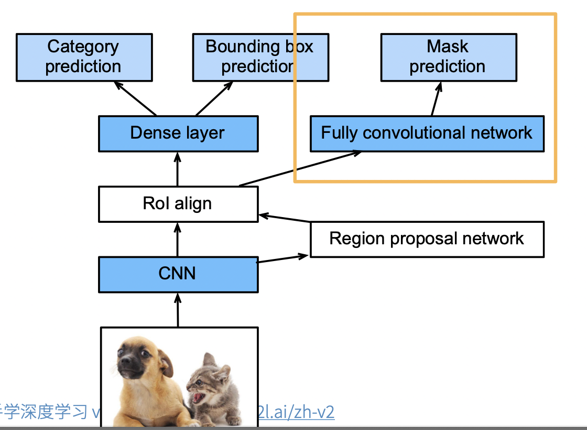

# 物体检测

## 介绍

目标检测（Object Detection）是计算机视觉领域的一个重要任务，其任务是从一张或多张图像中检测出感兴趣的目标，并给出其位置信息。目标检测的主要任务有两个：

1. 目标分类：识别出图像中所有感兴趣的目标类别，如人、车、狗等。
2. 目标定位：确定目标的位置信息，如目标的中心点、边缘框、关键点等。

图片分类和目标检测在任务上的区别：图片分类已知有一个确定目标，任务是识别该目标属于何种分类，而目标检测不仅需要检测出图片中所有感兴趣的目标类别，并确定其位置，所以目标检测要比图片分类更复杂应用场景更广。

图片分类和目标检测在数据集上的区别：由于目标检测中每一张图片可能存在多个目标，每个目标我们不仅需要分类，还需要确定边缘框以给出目标位置信息，因此目标检测数据集的标注成本要显著高于图片分类，也就导致了目标检测数据集较小。

边缘框：用一个尽量小矩形框将目标物体大体框起来，边框的位置信息就可以表示目标位置在图片中的位置信息，常见的边缘框有两种表示方法：

- （左上 x，左上 y，右下 x，右下 y）
- （左上 x，左上 y，宽，高）

目标检测数据集的常见表示：每一行表示一个物体，对于每一个物体而言，用“图片文件名，物体类别，边缘框”表示，由于边缘框用 4 个数值表示，因此对于每一行的那一个物体而言，需要用 6 个数值表示。

目标检测领域常用数据集：COCO（80 类物体，330K 图片，所有图片共标注 1.5M 物体）

## 初步实现

我们通过一个例子来看看边缘框的实现。

### 目标的位置

在图像分类任务中，我们假设图像中只有一个主要物体对象，我们只关注如何识别其类别。 然而，很多时候图像里有多个我们感兴趣的目标，我们不仅想知道它们的类别，还想得到它们在图像中的具体位置。 在计算机视觉里，我们将这类任务称为目标检测（object detection）或目标识别（object recognition）。目标检测在多个领域中被广泛使用。 例如，在无人驾驶里，我们需要通过识别拍摄到的视频图像里的车辆、行人、道路和障碍物的位置来规划行进线路。 机器人也常通过该任务来检测感兴趣的目标。安防领域则需要检测异常目标，如歹徒或者炸弹。

```python
%matplotlib inline
import torch
from d2l import torch as d2l

d2l.set_figsize()
img = d2l.plt.imread('../img/catdog.jpg')
d2l.plt.imshow(img);
```

### 边界框

在目标检测中，我们通常使用边界框（bounding box）来描述对象的空间位置。 边界框是矩形的，由矩形左上角的以及右下角的 x 和 y 坐标决定。 另一种常用的边界框表示方法是边界框中心的(x,y)轴坐标以及框的宽度和高度。

在这里，我们定义在这两种表示法之间进行转换的函数：`box_corner_to_center` 从两角表示法转换为中心宽度表示法，而 `box_center_to_corner` 反之亦然。 输入参数 boxes 可以是长度为 4 的张量，也可以是形状为（n，4）的二维张量，其中 n 是边界框的数量。

```python
def box_corner_to_center(boxes):
    """从（左上，右下）转换到（中间，宽度，高度）"""
    x1, y1, x2, y2 = boxes[:, 0], boxes[:, 1], boxes[:, 2], boxes[:, 3]
    cx = (x1 + x2) / 2
    cy = (y1 + y2) / 2
    w = x2 - x1
    h = y2 - y1
    boxes = torch.stack((cx, cy, w, h), axis=-1)
    return boxes


def box_center_to_corner(boxes):
    """从（中间，宽度，高度）转换到（左上，右下）"""
    cx, cy, w, h = boxes[:, 0], boxes[:, 1], boxes[:, 2], boxes[:, 3]
    x1 = cx - 0.5 * w
    y1 = cy - 0.5 * h
    x2 = cx + 0.5 * w
    y2 = cy + 0.5 * h
    boxes = torch.stack((x1, y1, x2, y2), axis=-1)
    return boxes
```

我们将根据坐标信息定义图像中狗和猫的边界框。 图像中坐标的原点是图像的左上角，向右的方向为 x 轴的正方向，向下的方向为 y 轴的正方向。

```python
# bbox是边界框的英文缩写
dog_bbox, cat_bbox = [60.0, 45.0, 378.0, 516.0], [400.0, 112.0, 655.0, 493.0]
```

我们可以将边界框在图中画出，以检查其是否准确。 画之前，我们定义一个辅助函数`bbox_to_rect`。 它将边界框表示成 matplotlib 的边界框格式。

```python
def bbox_to_rect(bbox, color):
    # 将边界框(左上x,左上y,右下x,右下y)格式转换成matplotlib格式：
    # ((左上x,左上y),宽,高)
    return d2l.plt.Rectangle(
        xy=(bbox[0], bbox[1]), width=bbox[2]-bbox[0], height=bbox[3]-bbox[1],
        fill=False, edgecolor=color, linewidth=2)
```

在图像上添加边界框之后，我们可以看到两个物体的主要轮廓基本上在两个框内。

```python
fig = d2l.plt.imshow(img)
fig.axes.add_patch(bbox_to_rect(dog_bbox, 'blue'))
fig.axes.add_patch(bbox_to_rect(cat_bbox, 'red'));
```

## 物体检测算法

### 区域卷积神经网络

区域卷积神经网络（Region Convolutional Neural Networks，R-CNN）是目标检测领域的开山之作。 它是基于深度学习的卷积神经网络，并提出了一种全新的区域提议网络（Region Proposal Network，RPN）来生成候选区域。 然后，通过卷积神经网络对这些候选区域进行分类和回归预测，从而检测出图像中所有感兴趣的目标。

#### R-CNN

- 使用启发式搜索算法来选择锚框
- 使用预训练模型来对每个锚框抽取特征（每个锚框当作一个图片，用 CNN）
- 训练一个 SVM 来类别分类（神经网络之前，category prediction）
- 训练一个线性回归模型来预测边缘框偏移（bounding box prediction）
- 兴趣区域（Rol）池化层
  - 给定一个锚框，均匀分割（如果没法均匀分割，取整）成 n x m 块，输出每块的最大值（max pooling）
  - 不管锚框多大，总是输出 nm 个值
  - 目的：每个锚框都可以变成想要的形状

#### Fast RCNN

- RCNN 需要对每个锚框进行 CNN 运算，这些特征抽取计算有重复，并且锚框数量大，特征抽取的计算量也大。Fast RCNN 改进了这种计算量大的问题
- 使用 CNN 对整张图片抽取特征（快的关键）
- 使用 Rol 池化层对每个锚框（将在原图片中搜索到的锚框，映射到 CNN 得到的结果上），生成固定长度的特征



#### Faster RCNN

- 在 Fast RCNN 基础上变得更快
- 使用一个 区域提议网络来替代启发式搜索获得更好的锚框
- 如下图所示，将 CNN 结果输入到卷积层，然后用锚框去圈区域，这些锚框很多有好有坏，然后进行预测，binary 预测是预测这个锚框的好坏，即有没有有效的圈住物体，bounding box prediction 预测是对锚框进行一些改进，最后用 NMS（非极大值抑制）对锚框进行合并。
- 具体来说，区域提议网络的计算步骤如下：
  1. 使用填充为 1 的 3×3 的卷积层变换卷积神经网络的输出，并将输出通道数记为 c。这样，卷积神经网络为图像抽取的特征图中的每个单元均得到一个长度为 c 的新特征。
  2. 以特征图的每个像素为中心，生成多个不同大小和宽高比的锚框并标注它们。
  3. 使用锚框中心单元长度为 c 的特征，分别预测该锚框的二元类别（含目标还是背景）和边界框。
  4. 使用非极大值抑制，从预测类别为目标的预测边界框中移除相似的结果。最终输出的预测边界框即是兴趣区域汇聚层所需的提议区域。



#### Mask RCNN

- 如果有像素级别的标号，使用 FCN（fully convolutional network）利用这些信息。可以提升 CNN 的性能
- Rol align。之前的 Rol 进行池化的时候，如果没法整除，可以直接取整。但是像素级别的标号预测的时候，会造成偏差的累积，导致边界预测不准确。未来避免这种情况，使用 Rol align，也就是当没法整除，对每个像素值进行按比例分配。

具体来说，Mask R-CNN 将兴趣区域汇聚层替换为了兴趣区域对齐层，使用双线性插值（bilinear interpolation）来保留特征图上的空间信息，从而更适于像素级预测。 兴趣区域对齐层的输出包含了所有与兴趣区域的形状相同的特征图。 它们不仅被用于预测每个兴趣区域的类别和边界框，还通过额外的全卷积网络预测目标的像素级位置。



### 单发多框检测（SSD single shot detection）

**生成锚框**

对每个像素，生成多个以它为中心的锚框。给定 $n$ 个大小 $s_1,...,s_n$ 和 $m$ 个高宽比，生成 $n + m - 1$ 个锚框，其大小和高宽比分别为：$(s_1, r_1), (s_2, r_1), ..., (s_n, r_1), (s_1, r_2), ..., (s_1, r_m)$。

**SSD 模型**

对多个分辨率下的卷积特征，生成锚框并进行预测。具体步骤如下：

- 使用一个基础网络抽取特征，然后用多个卷积层来减半高宽。
- 在每段卷积特征上都生成锚框。
- 底部段适合拟合小物体，顶部段适合拟合大物体。
- 对每个锚框预测类别和边缘框。

### YOLO（you only look once）

- SSD 中锚框大量重复，因此浪费了很多计算资源
- YOLO 将图片均分为 S X S 个锚框
- 每个锚框预测 B 个边缘框（防止多个物体出现在一个锚框里面）
- 后续版本 v2 v3 v4 有持续改进
- 非锚框算法
