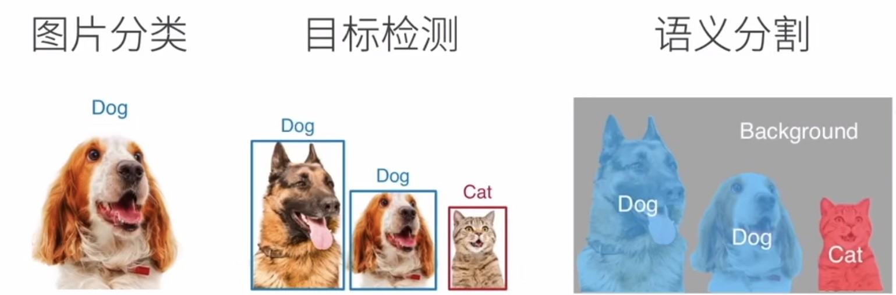
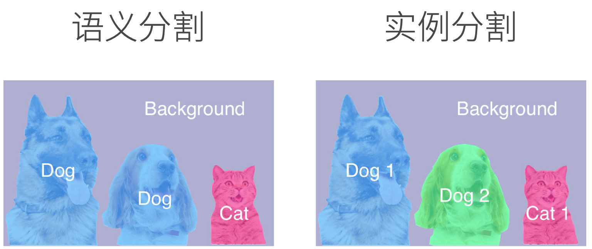

# 语义分割

## 介绍

有时只能实现框选的目标检测还是太粗糙了，无法得到更精细的信息。语义分割将图片中的每个像素分类到对应的类别。

分割这一概念在计算机视觉中由来已久。最早的图片分割对给定图片使用聚类等方法把语义上比较像的像素放在一起，但通常不会告诉我们这些像素到底是什么。而语义分割可以告诉我们每个像素对应的 label 是什么。

这也意味着我们需要对图片的每一个像素都做 label，使得语义分割成为了一个比较精细且大的任务。语义分割的数据集成本也较高，往往规模小像素高。常用的数据集之一是 Pascal VOC2012。

## 应用

背景虚化：传统的背景替换往往采用绿幕。在没有绿幕的情况下传统相机可以通过光圈来实现背景虚化，对于手机等设备而言背景虚化通常使用的都是语义分割或结合图像景深信息。

路面分割：如无人驾驶时用于实时识别周围物体，实现找路的功能。

## 实例分割

语义分割只关心像素属于哪一类，而实例分割则更进一步，如图片里有两只狗，则需要得出哪个像素属于哪一只狗。可以将其理解为目标检测的进化版本。

