# 自动求导与梯度计算

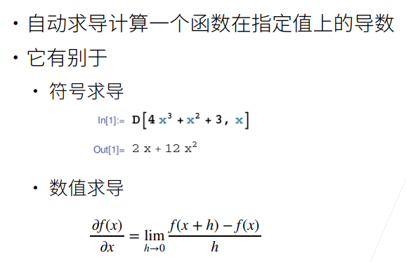

## 计算图

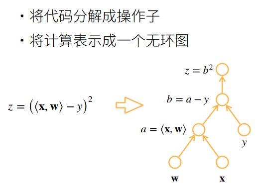

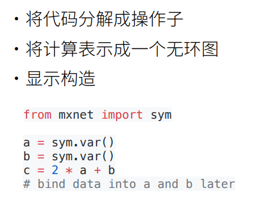

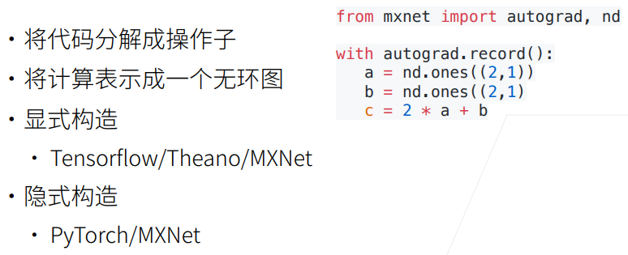

## 求导模型

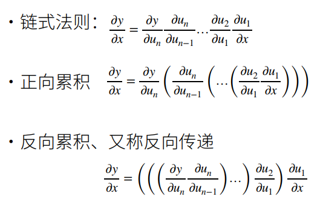

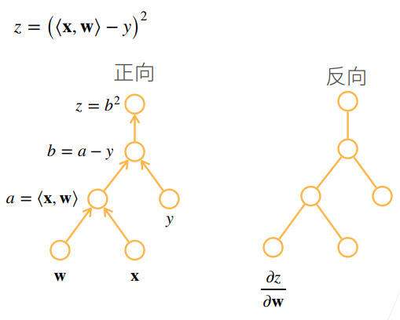

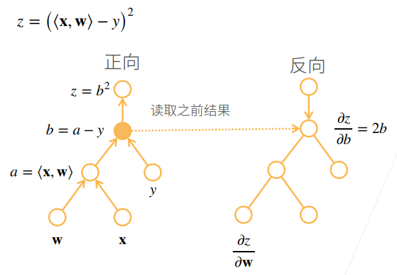

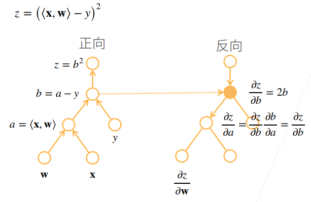

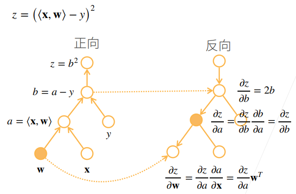

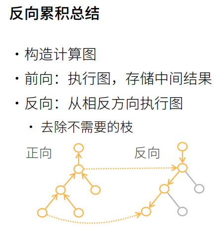

## 复杂度

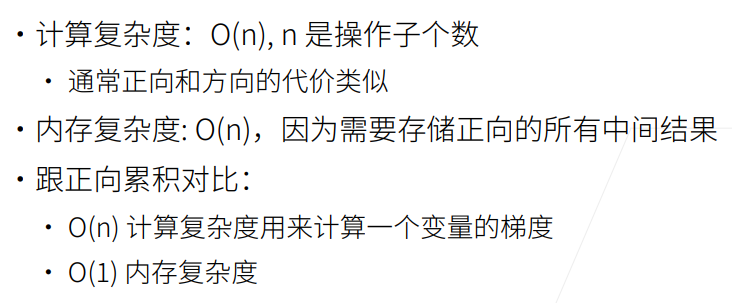

## 代码实现

```python
import torch

# 定义张量
x = torch.arange(4.0, requires_grad=True)  # requires_grad=True表示需要求导
print(x)
print(x.grad)  # x的梯度

# 表示函数
y = 2 * torch.dot(x, x)
print(y)

# 通过调用反向传播函数来自动计算y关于x每个分量的梯度
y.backward()  # 反向传播
print(x.grad)  # x的梯度
print(x.grad == 4 * x)  # 验证梯度是否正确
```

输出结果：

```python
tensor([0., 1., 2., 3.], requires_grad=True)
None
tensor(28., grad_fn=<MulBackward0>)
tensor([ 0.,  4.,  8., 12.])
tensor([True, True, True, True])
```

如果要重新调用反向传播函数，则需要将之前的梯度清零：

```python
x.grad.zero_()  # 清零梯度
y.backward()  # 再次反向传播
print(x.grad)  # x的梯度
```
