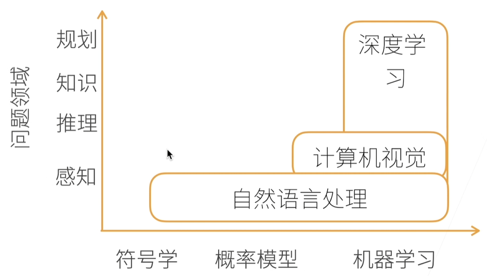
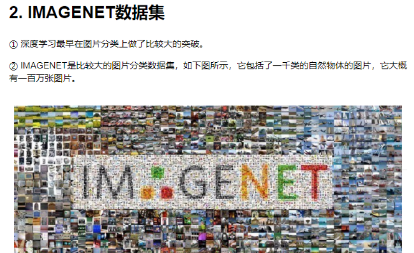
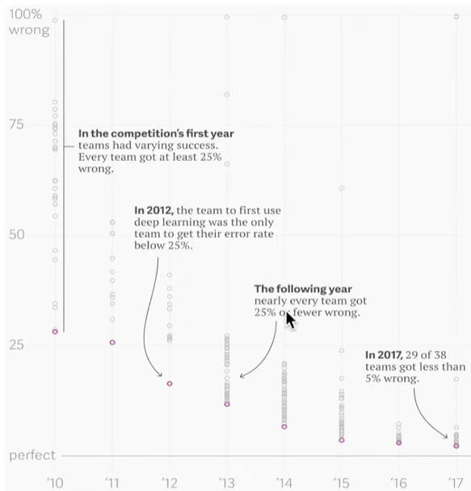
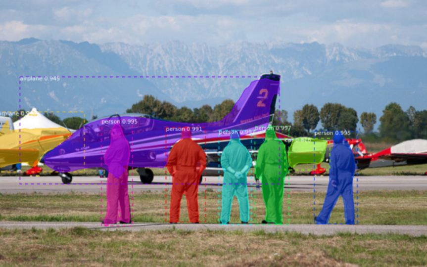
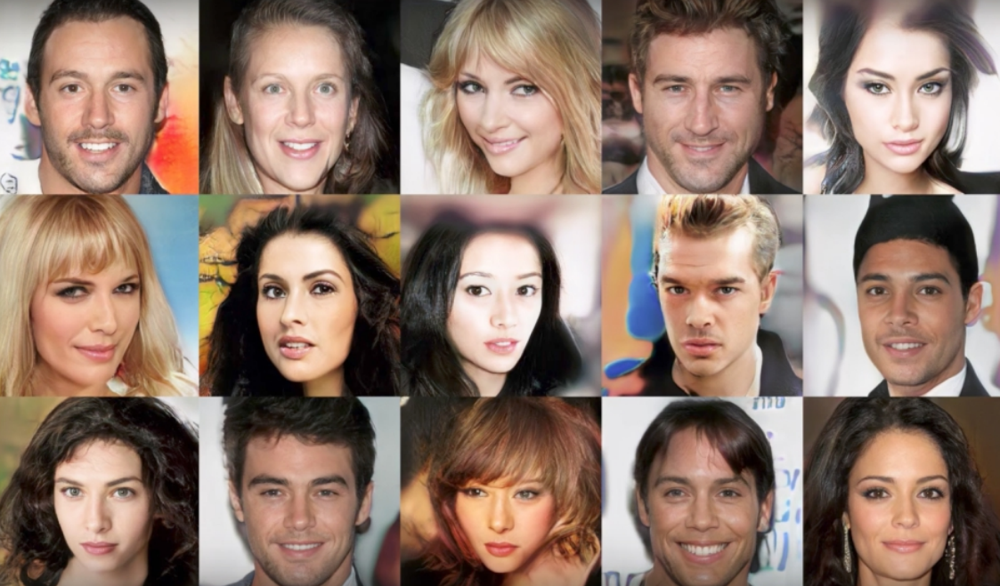
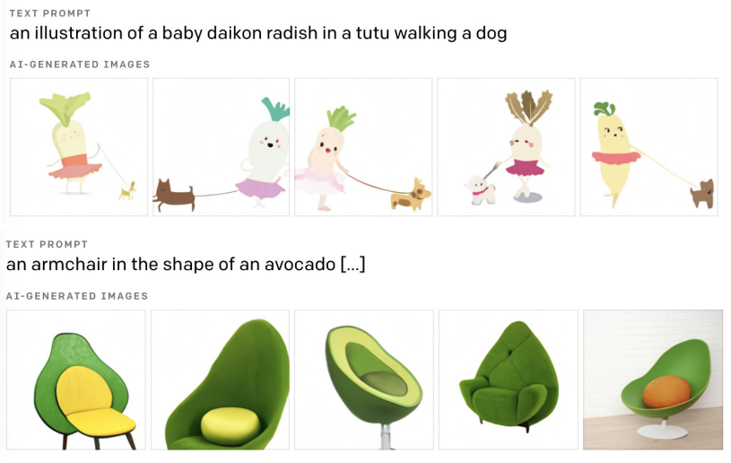
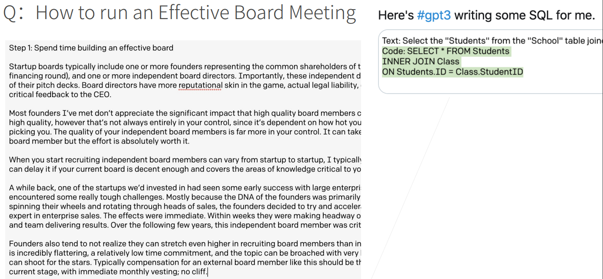
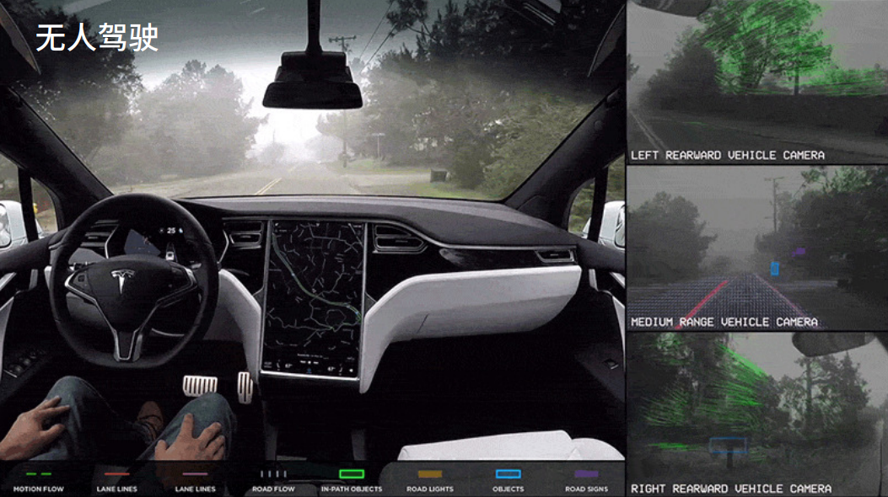
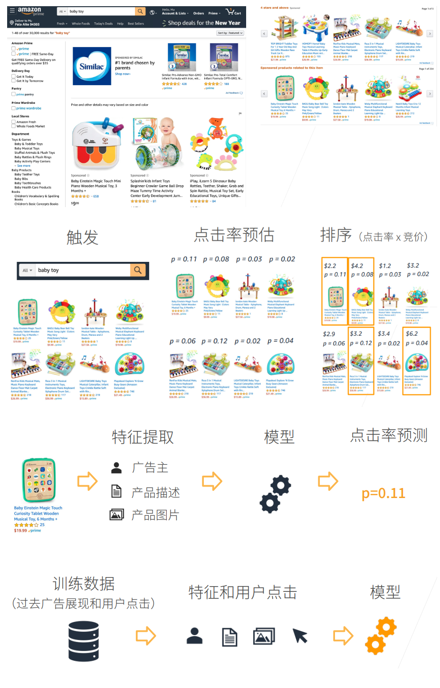
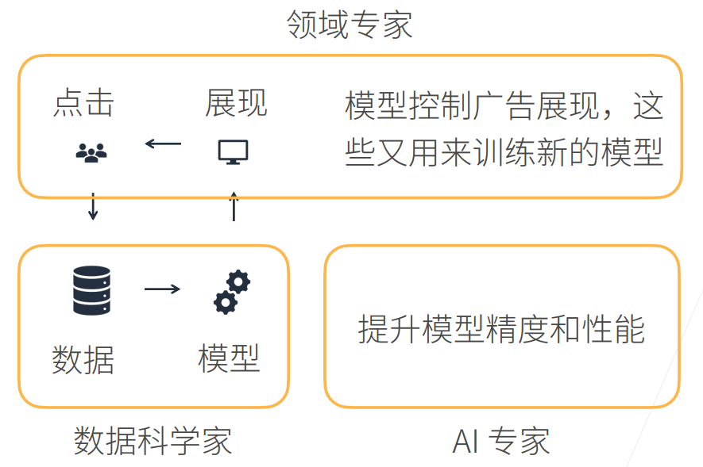

# 深度学习简介

## AI 地图

如上图所示，X 轴是不同的模式，最早的是符号学，然后概率模型、机器学习。Y 轴是我们想做什么东西，感知是我了解这是什么东西，推理形成自己的知识，然后做规划。

感知类似我能看到前面有个屏幕，推理是基于我看到的东西想象未来会发生什么事，根据看到的现象、数据，形成自己的知识，知道所有知识后能进行长远的规划，未来怎么做

1. 自然语言处理目前还是停留在感知上，人几秒钟能反应过来的东西都属于感知范围，即使像中文翻译成英文，英文翻译成中文那种。
2. 计算机视觉可以在图片里面可以做一些推理。
3. 自然语言处理里面有符号，所以有符号学，并且还可以用概率模型、机器学习。计算机视觉面对的是图片，图片里面都是一个个像素，像素很难用符号学来解释，所以计算机视觉大部分用概率模型、机器学习来解释。
4. 深度学习是计算机视觉中的一种方法，它还有其他应用方法。

## 深度学习的应用发展

我们通过一些简单的例子，来了解一下深度学习在当前的进展。

### IMAGENET 数据集

深度学习最早在图片分类上做了比较大的突破。MAGENET 是比较大的图片分类数据集，它包括了一千类的自然物体的图片，它大概有一百万张图片。

### 图片分类错误率

可以看到从 12 年开始，图片分类错误率开始有一个比较大的下降，12 年就是深度学习引入图片分类的开始。

17 年的时候，几乎所有的团队都可以做到 5%以内的错误率，基本上可以达到人类在图片识别上的精度了。可以说在图片分类上，深度学习已经做的很好了

### 物体检测和分割

知道图片是内容，在什么地方，这就是物体检测。

物体分割是指每个像素它到底是飞机还是人。

### 样式迁移

内容图片结合样式图片(滤镜)，可以把内容图片映射到其他风格。

### 人脸合成

下面的所有图都为算法合成的假人脸：

### 文生图

下面的图片都是由上面的文字生成出来的：

### 文生文

下左图为算法会根据人问的问题，机器生成回答，右图为机器根据人的需求，给我们写代码。

### 无人驾驶

下图为计算机视觉的无人驾驶领域的应用。

### 推荐系统

根据用户的点击，看给怎么样的广告

## 领域专家、数据科学家、AI 专家

## 神经网络初步

我们在[机器学习部分](../../sklearn/neural/synopsis.md)已经简要介绍了神经网络的一些基本概念，如果跳过或忘记可以再次查阅（只需阅读第一节）。
