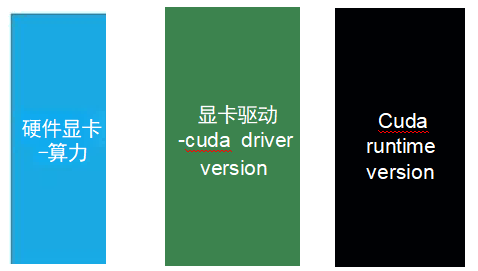
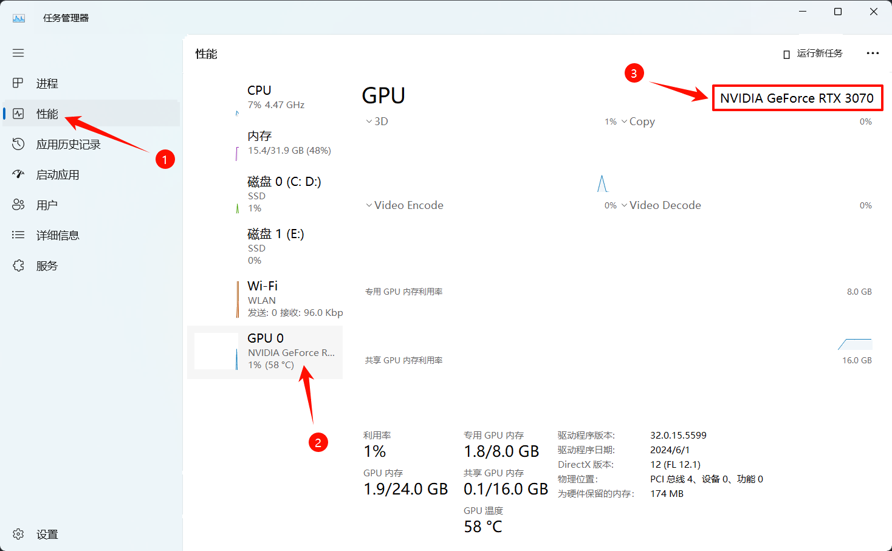
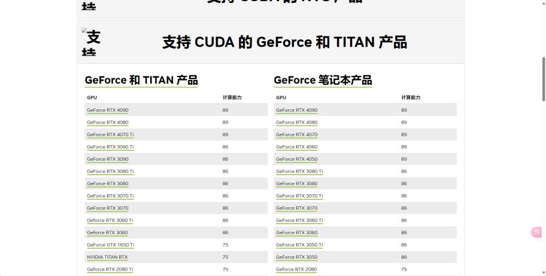
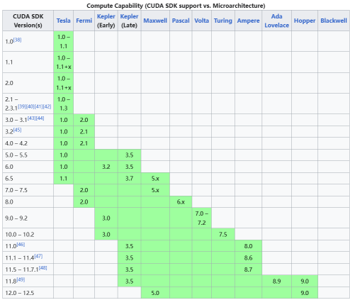
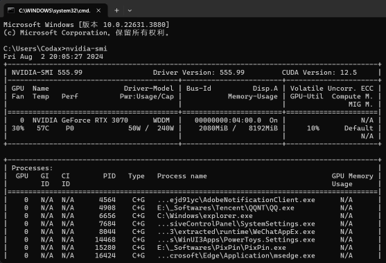
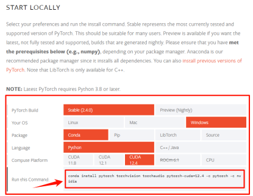
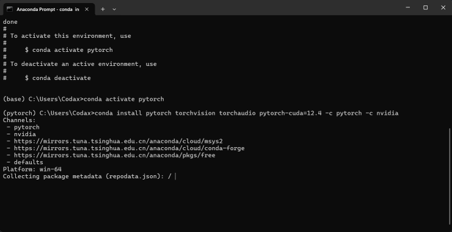
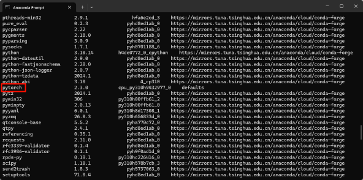

# GPU 版 Pytorch 搭建

## 挑选合适的 Pytorch 版本

在大多数时候，我们安装一个 Python 的包都是直接 pip/conda install。但是在 Pytorch 的 GPU 版本中，为了取得最佳的兼容性与优化效果，我们需要手动选择安装的版本。

### 什么决定了我的 Pytorch 效率？

我们在安装驱动时，一般会同时安装 **CUDA** 和 **cuDNN**。CUDA 是 NVIDIA 公司推出的基于 GPU 的并行计算平台，而 cuDNN 是 CUDA 的深度神经网络库。

在显卡的主动调动外，如果我们希望 Pytorch 等外部应用调用 CUDA 加速，我们还需要安装 **CUDA Runtime**。



所以，我们的**显卡**、**显卡驱动**、**CUDA 运行时**三者与 **Pytorch** 需要保持版本的兼容，这里的兼容性决定了我们的 Pytorch 运行效率。

我们需要确保：

- 确定自己的显卡算力（型号）
- 确定自己的可选择 CUDA 运行时版本
- 确保显卡驱动版本 >= CUDA 运行时版本

### 确定显卡算力

首先我们先确定好自己的显卡型号。

还是打开任务管理器，我们在 **图形处理器** 标签下可以看到显卡型号。



比如这里我的显卡型号是 **NVIDIA GeForce RTX 3070**。

接着，我们访问[英伟达官网](https://developer.nvidia.cn/cuda-gpus)查询我们的计算能力：



在图中，RTX 3070 对应的计算能力是 `86` (8.6 TFLOPS)。

### 确定 CUDA 运行时版本

我们可以访问[CUDA wiki](https://en.wikipedia.org/wiki/CUDA#GPUs_supported)查询当前算力对应的 CUDA 运行时版本。



按照区间对应表，`8.6 TFLOPS`(计算能力/10) 对应的 CUDA 运行时版本是 `8.0-12.5`

### 对照 CUDA 驱动版本

打开任意命令行窗口，输入：

```shell
nvidia-smi
```

我们会看到 CUDA 驱动的版本信息，例如：



在右上角标注了我的 CUDA 驱动版本是 `12.5`，也就是说我们需要挑选一个 `8.0-12.5` 之间，且不高于 `12.5` 版本的 Pytorch 版本。两者取交集，我这里可以选择 `8.0-12.5` 的版本。

### 更新显卡驱动

我们可以在[NVIDIA 官网](https://www.nvidia.cn/drivers/lookup/)上下载驱动更新程序，一般点击自动安装即可（推荐选择 GeForce Experience，如果真的用到了工作站版本优化那自己的电脑也不一定能跑的很快）。

### 生成相应版本的 Pytorch 安装命令

进入 [Pytorch 官网](https://pytorch.org/get-started/locally/#start-locally)，在 START LOCALLY 部分我们可以看到一堆选项卡。结合我们刚才的一通操作得到的信息与电脑环境实际，我们可以选择出最适合的安装命令。



一般来说，我们选择范围内提供的最高版本即可。

在选择结束后，最后一行就提供了我们电脑相应版本的 Pytorch GPU 版本安装命令。

## 安装

复制命令到命令行窗口，等待安装结束即可。



## 验证

### 验证安装成功

输入列表命令查看安装的包：

```shell
conda list
```

若含有 `torch` 或 `pytorch`，则说明安装成功。



### 验证版本正确

新建 Python 脚本（注意环境要正确），输入以下代码：

```python
import torch
print(torch.cuda.is_available())
```

运行脚本，如果输出 `True`，则说明版本正确。

## Hello, Pytorch!

至此，我们已经在本地配置好了 pytorch 的运行环境，我们可以用一个非常简单的例子来测试一下。

新建 Python 文件，输入以下代码并运行：

```python
import torch
from torch import nn
from torch.utils.data import DataLoader
from torchvision import datasets, transforms


# 定义模型
class SimpleNN(nn.Module):
    def __init__(self):
        super(SimpleNN, self).__init__()
        self.flatten = nn.Flatten()
        self.linear_relu_stack = nn.Sequential(
            nn.Linear(28 * 28, 512),
            nn.ReLU(),
            nn.Linear(512, 512),
            nn.ReLU(),
            nn.Linear(512, 10)
        )

    def forward(self, x):
        x = self.flatten(x)
        logits = self.linear_relu_stack(x)
        return logits


# 数据预处理
transform = transforms.Compose([
    transforms.ToTensor(),
    transforms.Normalize((0.1307,), (0.3081,))
])

# 加载数据集
train_dataset = datasets.MNIST(
    root='data',
    train=True,
    transform=transform,
    download=True
)

test_dataset = datasets.MNIST(
    root='data',
    train=False,
    transform=transform,
    download=True
)

train_dataloader = DataLoader(train_dataset, batch_size=64, shuffle=True)
test_dataloader = DataLoader(test_dataset, batch_size=64, shuffle=False)

# 初始化模型、损失函数和优化器
model = SimpleNN()
loss_fn = nn.CrossEntropyLoss()
optimizer = torch.optim.Adam(model.parameters(), lr=1e-3)


# 训练函数
def train(dataloader, model, loss_fn, optimizer):
    size = len(dataloader.dataset)
    model.train()
    for batch, (X, y) in enumerate(dataloader):
        pred = model(X)
        loss = loss_fn(pred, y)

        optimizer.zero_grad()
        loss.backward()
        optimizer.step()

        if batch % 100 == 0:
            loss, current = loss.item(), batch * len(X)
            print(f"loss: {loss:>7f}  [{current:>5d}/{size:>5d}]")


# 测试函数
def test(dataloader, model, loss_fn):
    size = len(dataloader.dataset)
    num_batches = len(dataloader)
    model.eval()
    test_loss, correct = 0, 0
    with torch.no_grad():
        for X, y in dataloader:
            pred = model(X)
            test_loss += loss_fn(pred, y).item()
            correct += (pred.argmax(1) == y).type(torch.float).sum().item()
    test_loss /= num_batches
    correct /= size
    print(f"Test Error: \n Accuracy: {(100 * correct):>0.1f}%, Avg loss: {test_loss:>8f} \n")


# 训练和测试循环
epochs = 5
for t in range(epochs):
    print(f"Epoch {t + 1}\n-------------------------------")
    train(train_dataloader, model, loss_fn, optimizer)
    test(test_dataloader, model, loss_fn)
print("Done!")
```

本实验是一个经典的图像分类任务，使用 MNIST 数据集。

某一次的输出结果：

```shell
...download...
Epoch 1
-------------------------------
-------------------------------
loss: 2.303259  [    0/60000]
loss: 0.321771  [ 6400/60000]
loss: 0.284574  [12800/60000]
loss: 0.143558  [19200/60000]
loss: 0.179455  [25600/60000]
loss: 0.083053  [32000/60000]
loss: 0.077281  [38400/60000]
loss: 0.192293  [44800/60000]
loss: 0.245124  [51200/60000]
loss: 0.097205  [57600/60000]
Test Error:
 Accuracy: 95.9%, Avg loss: 0.135484

Epoch 2
-------------------------------
loss: 0.054234  [    0/60000]
loss: 0.022712  [ 6400/60000]
loss: 0.118848  [12800/60000]
loss: 0.217346  [19200/60000]
loss: 0.008908  [25600/60000]
loss: 0.057995  [32000/60000]
loss: 0.014693  [38400/60000]
loss: 0.108268  [44800/60000]
loss: 0.036962  [51200/60000]
loss: 0.005383  [57600/60000]
Test Error:
 Accuracy: 97.5%, Avg loss: 0.085913

Epoch 3
-------------------------------
loss: 0.053525  [    0/60000]
loss: 0.029178  [ 6400/60000]
loss: 0.024918  [12800/60000]
loss: 0.130732  [19200/60000]
loss: 0.064231  [25600/60000]
loss: 0.237406  [32000/60000]
loss: 0.007683  [38400/60000]
loss: 0.099810  [44800/60000]
loss: 0.022878  [51200/60000]
loss: 0.135068  [57600/60000]
Test Error:
 Accuracy: 97.9%, Avg loss: 0.064616

Epoch 4
-------------------------------
loss: 0.013132  [    0/60000]
loss: 0.067574  [ 6400/60000]
loss: 0.010052  [12800/60000]
loss: 0.119668  [19200/60000]
loss: 0.027585  [25600/60000]
loss: 0.011971  [32000/60000]
loss: 0.028623  [38400/60000]
loss: 0.016923  [44800/60000]
loss: 0.052886  [51200/60000]
loss: 0.020813  [57600/60000]
Test Error:
 Accuracy: 97.4%, Avg loss: 0.082522

Epoch 5
-------------------------------
loss: 0.023991  [    0/60000]
loss: 0.046045  [ 6400/60000]
loss: 0.085636  [12800/60000]
loss: 0.045211  [19200/60000]
loss: 0.040690  [25600/60000]
loss: 0.068656  [32000/60000]
loss: 0.018653  [38400/60000]
loss: 0.049514  [44800/60000]
loss: 0.011071  [51200/60000]
loss: 0.003726  [57600/60000]
Test Error:
 Accuracy: 97.3%, Avg loss: 0.093066
```

如果你的 CPU 不是顶级的，你可以明显的感觉到 GPU 的训练速度要高于 CPU 的训练速度。

如果报错，可以尝试依次运行：

```shell
conda uninstall numpy
conda install numpy==1.26.4
```
