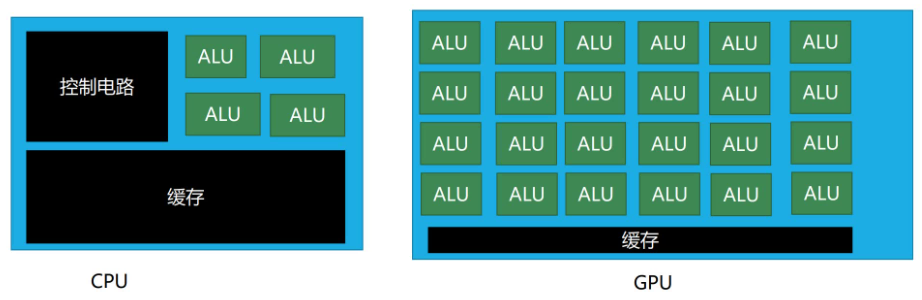
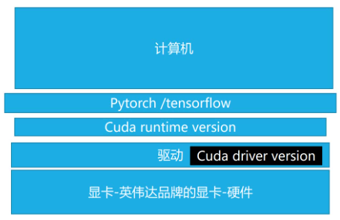
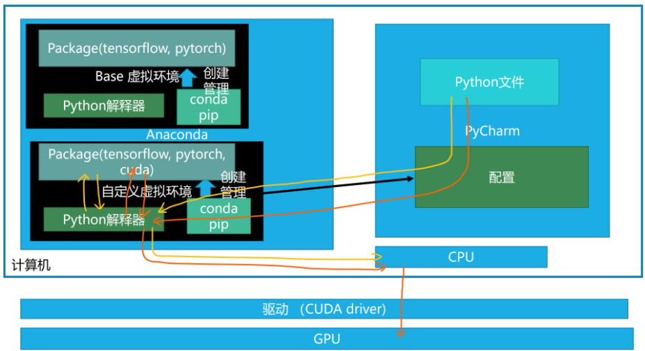
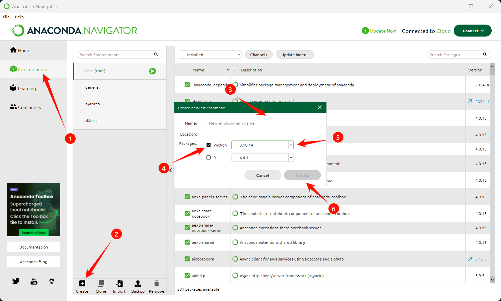
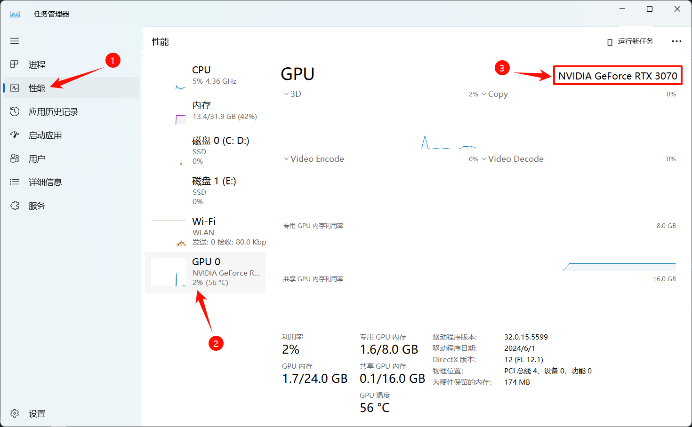
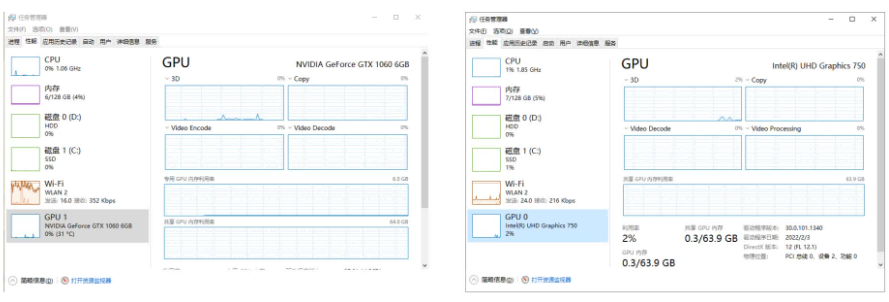

# Pytorch 环境搭建指南

不像 sklearn，Pytorch 的安装过程比较复杂，我们甚至需要从挑选合适的版本开始。

本章大部分内容参考与图片来源自：[最详细的 Windows 下 PyTorch 入门深度学习环境安装与配置 CPU GPU 版 | 土堆教程 - Bilibili](https://www.bilibili.com/video/BV1S5411X7FY?p=1)。原视频非常详细，本文主要主要进行了简化，如果希望了解更多深层的内容可以观看原视频。

## \[选读\]为什么要选择不同的版本？

Pytorch 官方提供了 CPU 与 GPU 两个大类版本，对应了不同的计算硬件。

- CPU 版本适用于没有 NVIDIA 显卡的机器，可以快速进行模型训练与推理。
- GPU 版本适用于有 NVIDIA 显卡的机器，可以加速模型训练与推理。



一般来说，我们推荐使用 GPU 版本，因为其在训练和推理的速度上都有显著提升，但并不是所有电脑都配备了支持 CUDA 加速的 NVIDIA 显卡，因此我们需要根据自己的机器选择合适的版本。





当然，如果你懒得选或者并不在意速度，那么直接无脑选 CPU 版本也是可以的。

## 新建虚拟环境

### Anaconda

首先，我们需要一个 Anaconda。

在文档的机器学习部分中，我提到过我们没有必要使用 Anaconda 安装 sklearn。但是在深度学习阶段，不论是为了开发、迁移还是部署，安装 Anaconda 无疑是最方便的选择。

安装方式可以参考[ML&Sklearn - Anaconda 环境搭建](../../sklearn/synopsis/anaconda.md)

接着我们新建一个 conda 环境用于专门进行 Pytorch 的安装与应用。

### [选项 1] GUI 方式安装

如果你的 Anaconda 版本支持 Anaconda Navigator 可视化界面，那么你可以直接在 Navigator 中新建一个环境。



### [选项 2] 命令行方式安装

如果你的 Anaconda 版本不支持 Anaconda Navigator 可视化界面，那么你可以使用命令行的方式新建一个环境。

打开 Anaconda Prompt（使用系统的搜索功能），输入以下命令新建一个环境：

```shell
conda create -n pytorch python=3.10.14
```

注：其中的“pytorch”可以替换成你想要的环境名称，python 版本根据实际情况进行调整。

等待安装完毕，切换至该环境：

```shell
conda activate pytorch
```

> 无论在此步使用哪种方式，后续步骤为了统一我们都使用命令行进行操作

## 判断设备是否有 NVIDIA GPU

:::tip
本操作只在 Windows 系统下，Linux 系统请参考[手把手教你在 linux 上安装 pytorch 与 cuda - CSDN](https://blog.csdn.net/qq_46699596/article/details/134552021)

Mac 系统就不用管了，直接安装 CPU 版本即可。
:::

我们需要确认是否有 NVIDIA GPU，如果有，我们需要安装 CUDA 以及相应的驱动。





在上图中，左图是有 NVidia GPU 的情况，右图是没有 NVidia GPU 的情况。

- 如果含有 NVidia 字样， 那么说明你的电脑有 NVIDIA GPU，下一步请参考[GPU 版 Pytorch 搭建](./gpu.md)。
- 如果没有， 那么说明你的电脑没有 NVIDIA GPU，下一步请参考[CPU 版 Pytorch 搭建](./cpu.md)。

::: tip
如果你记得在购买设备时买的是带有 NVIDIA GPU 的电脑，但任务管理器没有显示，可以检查一下是否安装了正确的驱动，具体请参考[如何安装 NVIDIA 显卡驱动？ - 知乎](https://www.zhihu.com/question/303574354/answer/3461112656)。
:::
