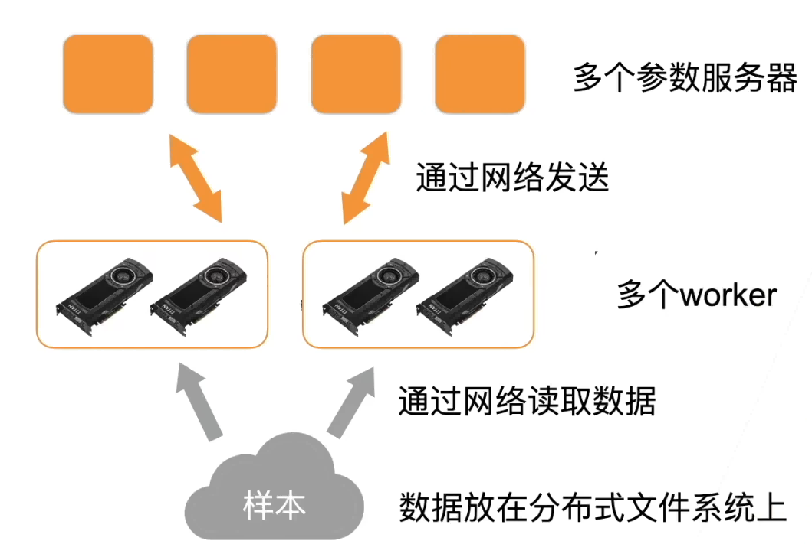
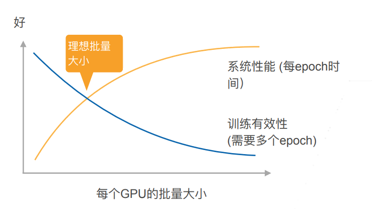

# 分布式训练

## 分布式计算

本质上来说和之前讲的单机多卡并行没有区别。二者之间的区别是分布式计算是通过网络把数据从一台机器搬到另一台机器

## GPU 机器架构

总的来说，gpu 到 gpu 的通讯是很快的，gpu 到 cpu 慢一点。机器到机器更慢。因而总体性能的关键就是尽量在本地做通讯而少在机器之间做通讯

样例：计算一个小批量

- 每个 worker 从参数服务器那里获取模型参数：首先把样本复制到机器的内存，然后把样本分到每个 gpu 上
- 复制参数到每个 gpu 上：同样，先把每一次的参数放到内存里，然后再复制到每个 gpu 上
- 每个 gpu 计算梯度
- 再主内存上把所有 gpu 上的梯度加起来
- 梯度从主内存传回服务器
- 每个服务器对梯度求和，并更新参数

## 关于性能

### 同步 SGD

- 这里每个 worker 都是同步计算一个批量，称为同步 SGD
- 假设有 n 个 ggpu，每个 gpu 每次处理 b 个样本，那么同步 SGD 等价于再单 gpu 运行批量大小为 nb 的 SGD
- 再理想情况下，n 个 gpu 可以得到相对单 gpu 的 n 倍加速

### 性能

- t1 = 在单 gpu 上计算 b 个样本梯度时间
- 假设有 m 个参数，一个 worker 每次发送和接受 m 个参数、梯度
  - t2 = 发送和接受所用时间
- 每个批量的计算时间为 max（t1，t2）
  - 选取足够大的 b 使 t1>t2
  - 增加 b 或 n 导致更大的批量 大小，当值需要更多计算来得到给定的模型精度

### 性能的权衡

### 实践时的建议

- 使用一个大数据集
- 需要好的 gpu-gpu 和机器-机器带宽
- 高效的数据读取和预处理
- 模型需要有好的计算和通讯比
  - Inception>ResNet>AlexNet
- 使用足够大的批量大小来得到更好的系统性能
- 使用高效的优化算法对应大批量大小
