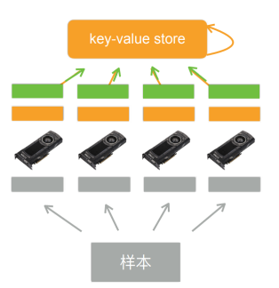

# 单机多卡并行

一台机器可以安装多个 GPU（一般为 1-16 个），在训练和预测时可以将一个小批量计算切分到多个 GPU 上来达到加速目的，常用的切分方案有数据并行，模型并行，通道并行。

## 数据并行

将小批量的数据分为 n 块，每个 GPU 拿到完整的参数，对这一块的数据进行前向传播与反向传播，计算梯度。

数据并行通常性能比模型并行更好，因为对数据进行划分使得各个 GPU 的计算内容更加均匀。

主要分为五步：

1. 每个 GPU 读取一个数据块（灰色部分）
2. 每个 GPU 读取当前模型的参数（橙色部分）
3. 每个 GPU 计算自己拿到数据块的梯度（绿色部分）
4. GPU 将计算得到的梯度传给内存（CPU）（绿色箭头）
5. 利用梯度对模型参数进行更新（橙色箭头）

数据并行并行性较好，主要因为当每个 GPU 拿到的数据量相同时计算量也相似，各个 GPU 的运算时间相近，性能较好

## 模型并行

将整个模型分为 n 个部分，每个 GPU 拿到这个部分的参数和负责上一个部分的 GPU 的输出作为输入来进行计算，反向传播同理。

模型并行通常用于模型十分巨大，参数众多，即使在每个 mini-batch 只有一个样本的情况下单个 GPU 的显存仍然不够的情况，但并行性较差，可能有时会有 GPU 处于等待状态。

## 通道并行

通道并行是数据并行和模型并行同时进行
