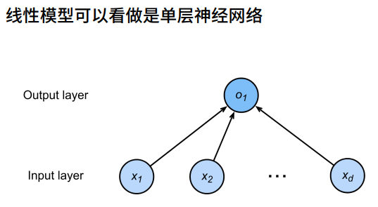

# 线性神经网络

线性回归它可以用来预测一个连续变量的输出，比如预测房屋价格或者销售额。线性回归的假设是输入变量和输出变量之间存在线性关系，即$y=wx+b$，其中$w$和$b$是模型参数。

线性回归可以看作是神经网络的一种简化模型之一。

## 再看线性回归

例如我们要预测房屋价格，假设房屋的面积和卧室数量作为输入变量，价格作为输出变量。我们可以用线性回归来拟合房屋价格与面积和卧室数量的关系。

- 输入：$x=[x_1,x_2,...,x_n]^T$
- 线性模型需要确定一个 n 维权重和一个标量偏差$\omega=[\omega_1,\omega_2,...,\omega_n]^T,b$
- 输出 ：$y=\omega_1x_1+\omega_2x_2+...+\omega_nx_n+b$

