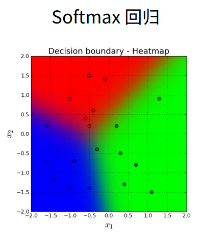
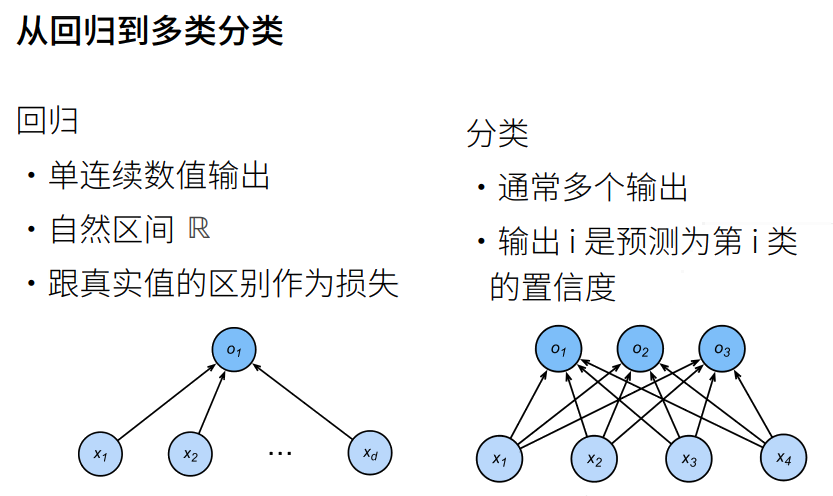
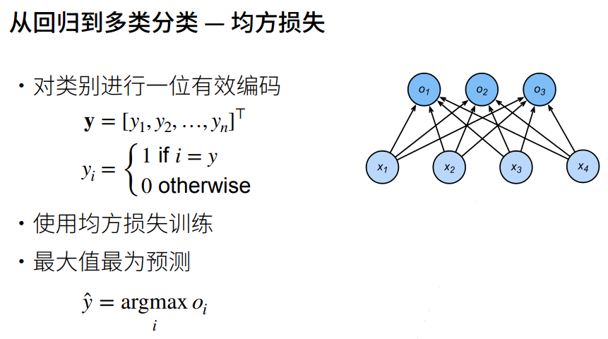
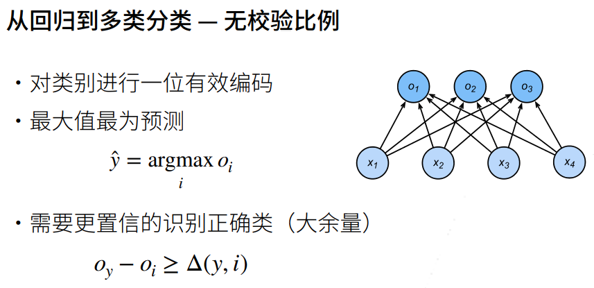
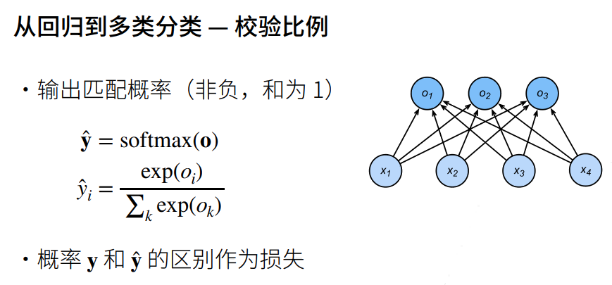
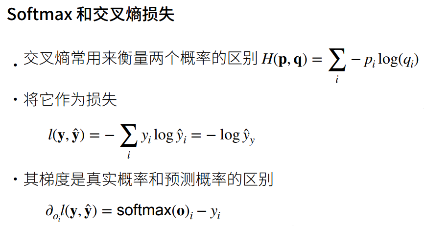
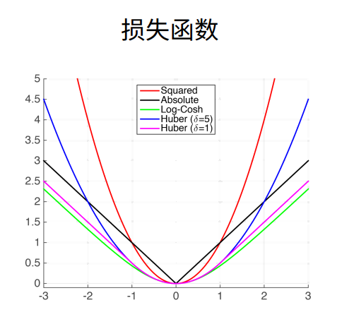
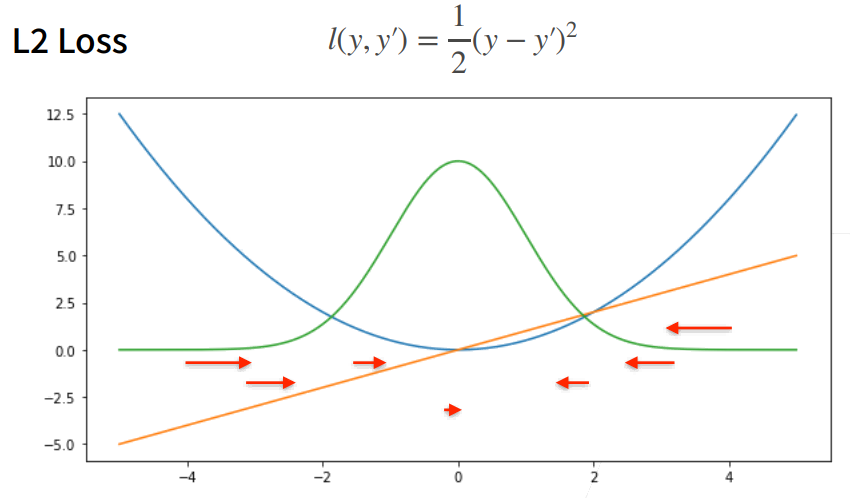
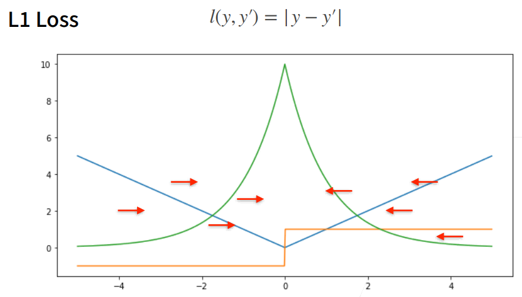
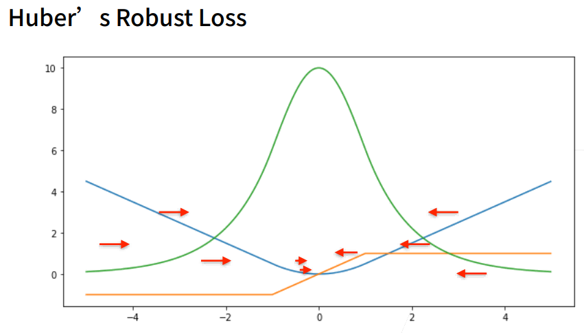

# softmax 回归

线性回归模型适用于输出为连续值的情景。在另一类情景中，模型输出可以是一个像图像类别这样的离散值。对于这样的离散值预测问题，我们可以使用诸如 softmax 回归在内的分类模型。和线性回归不同，softmax 回归的输出单元从一个变成了多个，且引入了 softmax 运算使输出更适合离散值的预测和训练。本节以 softmax 回归模型为例，介绍神经网络中的分类模型。

Softmax 回归虽然它的名字是回归，其实它是一个**分类**问题。

## 回归 VS 分类

## 回归到分类

## 交叉熵损失

## 损失函数

三个常用的损失函数： L2 loss、L1 loss、Huber's Robust loss。

### L2 Loss

- 蓝色曲线为当 y=0 时，变换 y'所获得的曲线。
- 绿色曲线为当 y=0 时，变换 y'所获得的曲线的似然函数，似然函数呈高斯分布。最小化损失函数就是最大化似然函数。
- 橙色曲线为损失函数的梯度，梯度是一次函数，所以穿过原点。
- 当预测值 y'跟真实值 y 隔的比较远的时候，(真实值 y 为 0，预测值就是下面的曲线里的 x 轴)，梯度比较大，所以参数更新比较多。
- 随着预测值靠近真实值是，梯度越来越小，参数的更新越来越小。

### L1 Loss

- 相对 L2 loss，L1 loss 的梯度就是距离原点时，梯度也不是特别大，权重的更新也不是特别大。会带来很多稳定性的好处。
- 他的缺点是在零点处不可导，并在零点处左右有 ±1 的变化，这个不平滑性导致预测值与真实值靠的比较近的时候，优化到末期的时候，可能会不那么稳定。

### Huber's Robust Loss

结合 L1 loss 和 L2 loss 损失。

