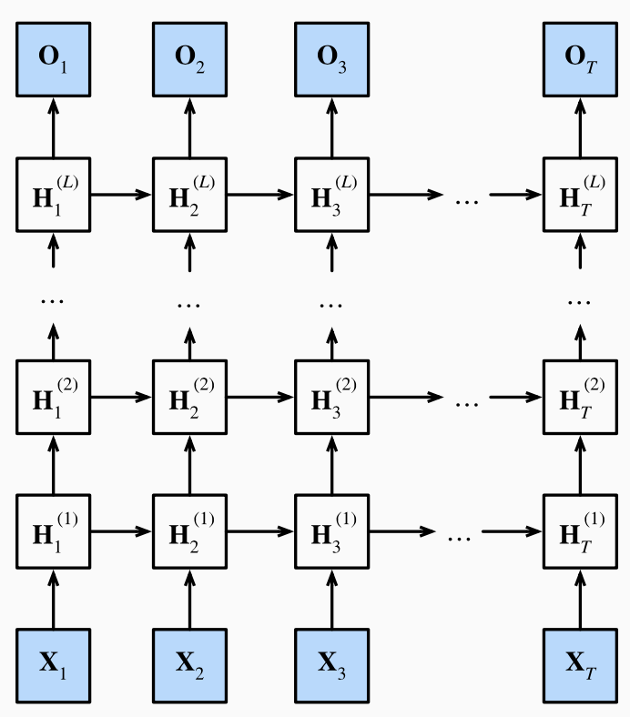

# 深层循环神经网络

## 介绍

之前讲的 RNN 都只有一个隐藏层（序列变长不算是深度），而一个隐藏层的 RNN 一旦做的很宽就容易出现过拟合。因此我们考虑将网络做的更深而非更宽，每层都只做一点非线性，靠层数叠加得到更加非线性的模型。

浅 RNN：输入-隐层-输出

深 RNN：输入-隐层-隐层-...-输出

（课程视频中的图片有错误，最后输出层后一时间步是不受前一步影响的，即没有箭头）

## 公式

第一层的第 t 步状态是关于第一层第 t-1 步状态和第 t 步输入的函数

第 j 层的第 t 步状态是关于当前层上一步步状态和上一层当前步的函数

由最后一个隐藏层得到输出
