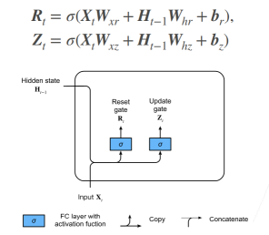

# 门控循环单元(GRU)

## 动机：如何关注一个序列

不是每个观察值都是同等重要

比如上图中的序列，若干个猫中出现了一个鼠，那么我们应该重点关注这个鼠，而中间重复出现的猫则减少关注。文本序列同理，通常长文本我们需要关注的是几个关键词，关键句。

想只记住相关的观察需要：

- 能关注的机制（更新门）：顾名思义，是否需要根据我的输入，更新隐藏状态
- 能遗忘的机制（重置门）：更新候选项时，是否要考虑前一隐藏状态。

## 门的概念

- 更新门 Zt，重置门 Rt 的公式大体相同，唯一不同的是学习到的参数。
- 需要注意的是，计算门的方式和原来 RNN 的实现中计算新的隐状态相似，只是激活函数改成了 sigmoid。
- 门本来是电路中的一个概念，0,1 代表不同的电平，可以用于控制电路的通断。此处 sigmoid 将门的数值归一化到 0 到 1 之间，是一种"软更新"方式。而从后面的公式上可以看出，本讲课程采用的是低电平有效（越靠近 0，门的作用越明显）的方式控制。

## 候选隐状态

候选隐状态，如果抛开公式中的 $R_{t}$ 遗忘门来说，这个和之前 RNN 中计算当前步的隐状态没有差别。

但是这里引入了遗忘门，如果 $R_{t}$ 无限接近于 0，那么此时候选隐状态将不再考虑前一隐状态的影响，也就是和 MLP 没有区别，起到“遗忘”的作用；

反之，如果 $R_{t}$ 无限接近于 1，那么与 RNN 计算隐状态的过程没有差别，不进行遗忘。

公式中的 ⊙ 表示逐元素乘积。

> 为什么叫候选隐状态？
>
> 在 RNN 中，这个所谓的候选隐状态就是当前步的隐状态（$R_{t}$无限接近 1 时）。但是由于引入了更新门，我们需要考虑是直接沿用上一步的隐藏状态，还是像 RNN 一样使用当前步计算的隐状态。所以这个结合了当前输入计算的隐状态，不能立马变成当前的$H_{t}$，而是需要用更新门和前一隐状态$H_{t-1}$做一个加权，所以它是一个候选项。

## 隐状态

用更新门对候选隐状态和前一隐状态做加权，得到当前步隐状态的值。

如果$Z_{t}$无限接近于 0，更新起作用，候选隐状态“转正”，变为当前隐状态。

如果$Z_{t}$无限接近于 1，更新不起作用，当前隐状态还是沿用前一隐状态。
