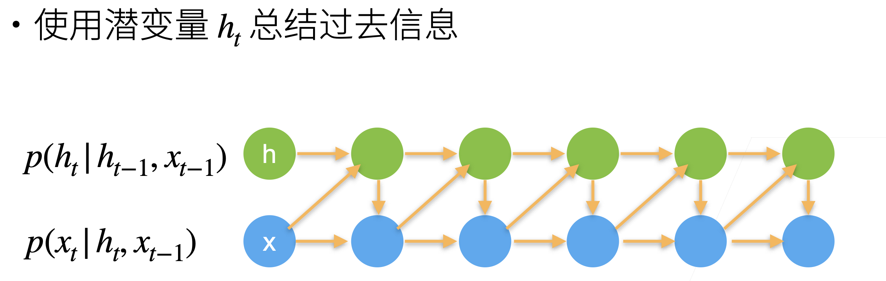
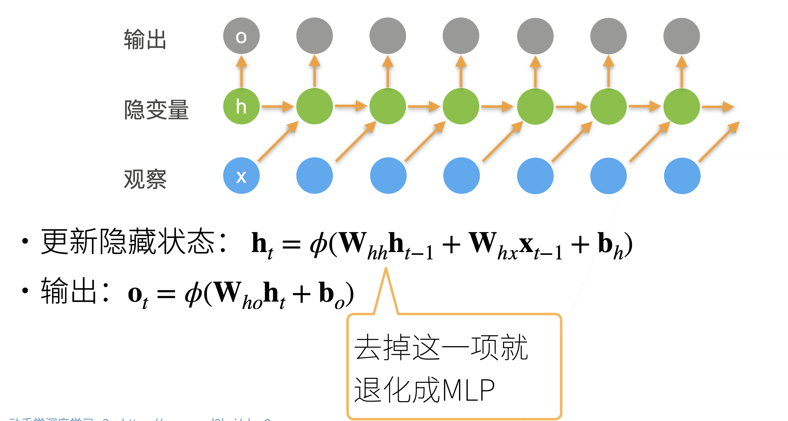
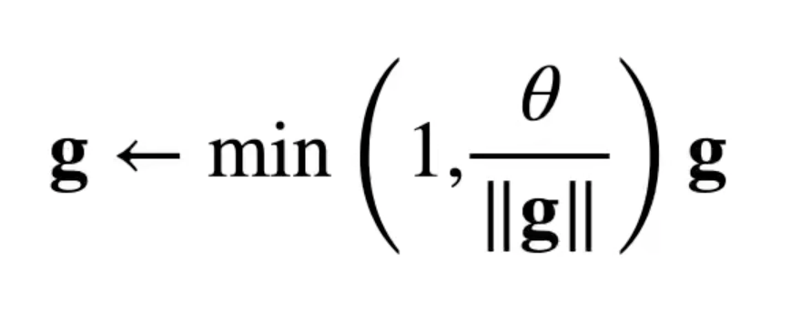
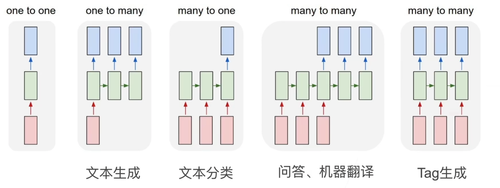

# 循环神经网络 RNN

## 使用潜变量

RNN 使用了隐藏层来记录过去发生的所有事件的信息，从而引入时许的特性，并且避免常规序列模型每次都要重新计算前面所有已发生的事件而带来的巨大计算量。

## RNN

流程如下，首先有一个输入序列，对于时刻 t，我们用 t-1 时刻的输入 xt-1 和潜变量 ht-1 来计算新的潜变量 ht。同时，对于 t 时刻的输出 ot，则直接使用 ht 来计算得到。注意，计算第一个潜变量只需要输入即可（因为前面并不存在以往的潜变量）。

值得注意的是，RNN 本质上也是一种 MLP，尤其是将 $h_{t-1}$ 这一项去掉时就完全退化成了 MLP。RNN 的核心其实也就是 $h_{t-1}$ 这一项，它使得模型可以和前面的信息联系起来，将时序信息储存起来。可以把 RNN 理解为是包含时序信息的 MLP。

## 困惑度

为了衡量一个语言模型的好坏，例如分类模型，可以使用平均交叉熵来衡量，就是将预测概率的负对数值求和之后再去平均，即常用的交叉熵损失。但是由于某些历史原因，NLP 往往不是用这种方式，而是在这种方式的基础上最后再取指数，即 exp，这样得到的结果如果是 1，说明完美；如果是无穷大，说明结果很差。

## 梯度裁剪

在 T 个时间步中进行反向传播，会由于产生 O(T)长度的梯度乘法链，导致导数数值不稳定，这里使用一个限制 θ，通常为 5 到 10，来控制梯度乘法链的长度。使用如下的公式：

在这个公式中，如果梯度长度大于 $\theta$，梯度 $g$ 会变为

$$
\frac{\theta}{\Vert g \Vert} g
$$

这样再对 $g$ 求 2 范式就变成了 $\theta$，所以可以把梯度限制在 $\theta$ 以下。

## 更多的应用 RNNs

