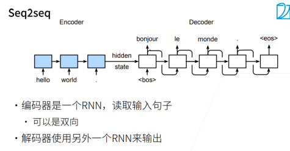
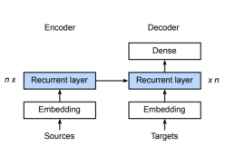
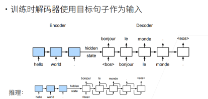
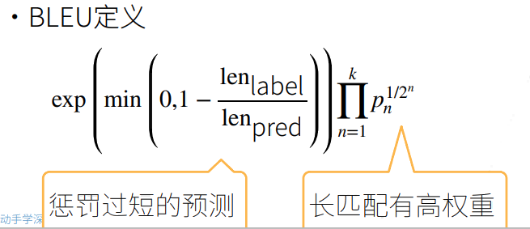
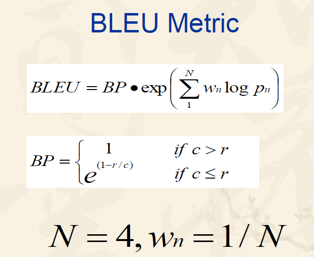
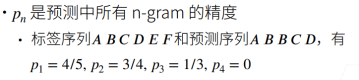

# 序列到序列学习

## 应用举例：机器翻译

- 给定一个源语言的句子，自动翻译成目标语言
- 这两个句子可以有不同的长度

## 模型架构：Seq2seq

- 序列到序列模型由编码器-解码器构成。
- 编码器 RNN 可以是双向，由于输入的句子是完整地，可以正着看，也可以反着看；而解码器只能是单向，由于预测时，只能正着去预测。
- 编码器，解码器采用不同的 RNN，此 RNN 也可以是 GRU，LSTM 等。

## 编码器-解码器细节

- 编码器的 RNN 没有连接输出层
- 编码器的最后时间步的隐状态用作解码器的初始隐状态（图中箭头的传递）

## 训练和推理

- 之前提到编码器没有输出层，只有解码器有，于是损失函数的计算只关注解码器的输出层。
- 训练和预测（推理）有区别的，训练时解码器使用目标句子（真值）作为输入，以指导模型训练；而推理时无法提前得知真值，需要一步一步进行预测。

## 衡量生成序列的好坏：BLEU

### BLUE 值定义

宗成庆老师《统计自然语言处理》（第二版）一书中关于 BLEU 的定义：

同时，吴恩达深度学习课程中也是使用这一方式定义。但观察两种方式，BP 惩罚因子的计算是一致的，pn 也是使用了几何平均的方式，只是对于 wn 这一加权值的选择有所不同。

### 定义式解析

BLEU 值衡量的是精确率，而且对不同 n-gram 进行集成打分。

- BP 惩罚因子：为了惩罚过短的句子，由于过短的句子基数小，精确率容易提升，所以加上一个 BP 乘子，当预测句子长度<参考句子长度，则 BP<1。
- wn 的选择：李沐老师课程中是采用了$\frac{1}{2^n}$​ 作为加权因子，n 越大，加权因子越小，但由于 pn<1，赋予的权重越大，即长匹配具有更高的权重。而宗老师的书中所述：在 BLEU 的基线系统中取 N ＝ 4，wn ＝ 1/N，也可以参考。
