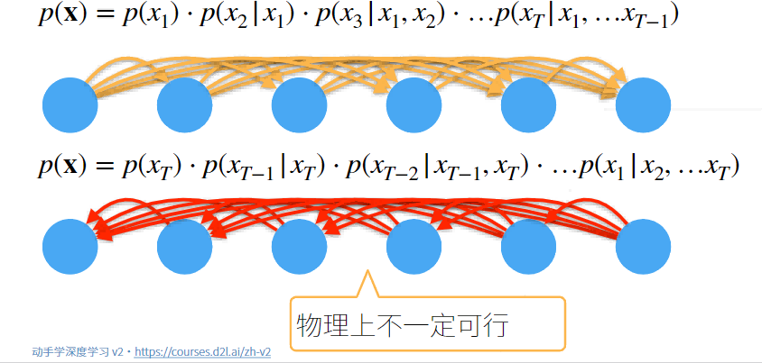
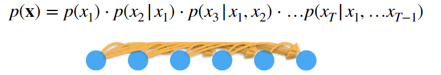
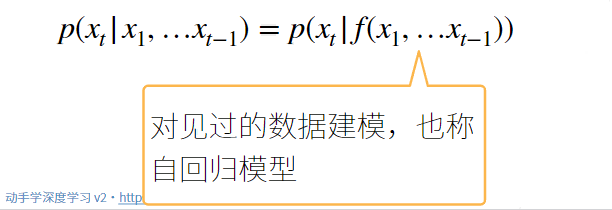
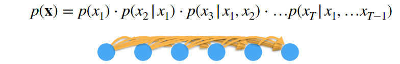
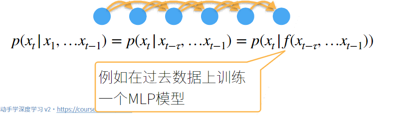
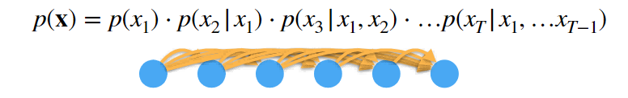
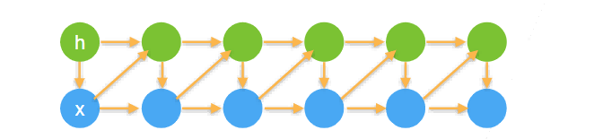

# 序列模型

## 序列数据

实际中很多数据是有时序的，例如：

- 电影的评价随时间变化而变化：
  - 拿了奖后评分上升，直到奖项被遗忘
  - 看了很多好电影后，人们的期望变高
  - 季节性：贺岁片，暑期档
  - 导演、演员的负面报道导致评分变低
- 音乐、文本、语言和视频都是连续的
  - 标题“狗咬人”远没有“人咬狗”那么令人惊讶
- 大地震发生后，很有可能会有几次较小的余震
- 人的互动是连续的，从网上吵架可以看出
- 预测明天的股价要比填补昨天遗失的股价更困难

## 统计工具

在时间 $t$ 观察到 $X_{t}$，那么得到 $T$ 个不独立的随机变量 $(X_{1}, ..., X_{t}) \sim p(X)$。

使用条件概率展开：

$$
p(a, b) = p(a)p(b|a) = p(b)p(a|b)
$$

## 序列模型

对条件概率建模：

### 方案 A:马尔科夫假设

假设当前数据只跟 τ 个过去数据点相关，则：

### 方案 B:潜变量模型

引入潜变量 $h_{t}$ 来表示过去信息：  
$$h_{t} = f(x_{1}, ..., x_{t-1})$$

这样 $x_{t} = p(x_{t} | h_{t})$

