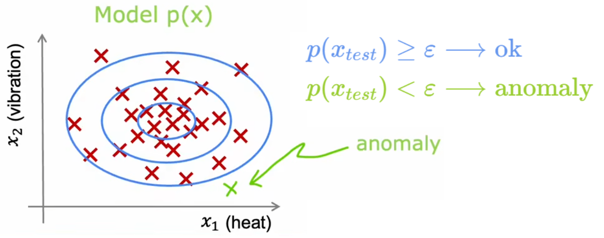

# 异常检测

异常检测算法是一种在商业场景中非常常用的技术。它可以帮助企业发现异常数据，并对其进行处理或报警。

异常监测是一种**无监督学习**、**聚类**算法。

## 异常检测的直观理解

我们举几个例子：

**【问题 1】“飞机引擎检测”：根据输入特征，检测新制造的引擎是否有问题。**

- 输入特征：“发动机温度”、“振动强度”。实际显然会有更多的特征，这里做出了简化。
- 输出：是否异常。
- 训练集：m 个正常引擎的特征。

**【问题 2】“金融欺诈监测”：持续监测用户特征，判断是否有可能的欺诈行为。**

- 输入特征：正常用户的登录频率、单次访问网页数量、单次交易数量、单次发帖数量、打字速度等。
- 输出：查看某个新用户是否具有欺诈行为。

**【问题 3】“服务器监测”：监测数据中心的服务器是否正常运行。**

- 输入特征：内存使用量、磁盘读写次数、CPU 负载、网络流量等。
- 输出：判断服务器是否出现异常行为，比如被黑客攻击等。

“异常检测”通常使用“**(概率)密度估计**(density estimation)”的方法。也就是，“异常检测”算法首先使用未标记的正常事件数据集进行训练(下图红叉)，学习正常样本的概率分布，然后计算新样本$x_{test}$出现的概率，若其出现的概率小于设定好的阈值$p(x_{test})<ε$，显然就可以认为这是一个异常事件：



## 高斯分布

由于几乎所有从自然界采集的数据都服从高斯分布，所以我们使用高斯分布进行概率密度估计。


对于高斯分布的细节本文不再展开，有兴趣可以补充概率论相关知识。

## 异常检测算法

“异常检测”算法的完整步骤：

1. 定义训练集，注意全部为正常样本。假设样本总数为 m 、特征总数为 n
2. 对每个特征分别进行统计分析，然后将其相乘得到某样本的综合概率分布。这里假设所有特征都服从高斯分布，并且相互独立。（实际上，就算不独立，算法表现依旧良好）
3. 对于新的输入$\overrightarrow{x}_{new}$，代入$p(\overrightarrow{x})$计算其概率。若$p(\overrightarrow{x}_{new})<ε$，则认为是异常事件。


那么，如何选取合适的阈值 ε 呢？

## 选取判断阈值 ε

显然在开发系统时，如果有一个具体的评估系统性能的指标，就很容易帮助我们改进系统，这就是“实数评估(real-number evaluation)”。由于 ε 也是“异常检测”的模型参数，于是这启示我们借鉴“有监督学习”中的“验证集”这一概念，来选择最合适的模型参数 ε 。我们可以将“是否异常”看成是一种标签，来进行如下拆分，注意“训练集”是全部都为正常样本的无标签数据：

1. 【异常样本足够】三拆分：训练集、验证集、测试集。
   - 原始训练集：10000 正常样本 + 20 异常样本。
   - 训练集：6000 正常样本。用于拟合正常样本的概率分布。
   - 验证集：2000 正常样本+10 异常样本。用于挑选最合适的 ε 或者改进特征。
   - 测试集：2000 正常样本+10 异常样本。用于最后评估系统性能。
2. 【异常样本极少】二拆分：训练集、验证集。
   - 原始训练集：10000 正常样本 + 2 异常样本。
   - 训练集：6000 正常样本。用于拟合正常样本的概率分布。
   - 验证集：4000 正常样本+2 异常样本。用于挑选最合适的 ε 或者改进特征。

进行上述拆分后，注意到上述“验证集”、“训练集”都属于之前提到的“倾斜数据集”，于是就可以使用“准确率/召回率”、“F1 score”来评判系统在“验证集”、“测试集”上的性能。一个可行的代码思路是：

```
# 1. 训练结束后，计算验证集中所有样本对应的概率p_cv(0~1)。
# 2. 计算每个步长所对应的“F1 score”：
step = (max(p_cv) - min(p_cv)) / 1000
for epsilon in numpy.arange(min(p_cv), max(p_cv), step):
    # 计算当前 epsilon 下的“F1 score”
# 3. 找出最大的“F1 score”所对应的epsilon即可。
```
