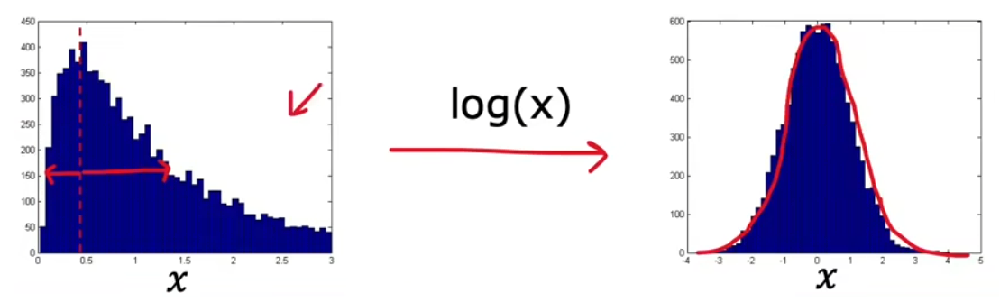
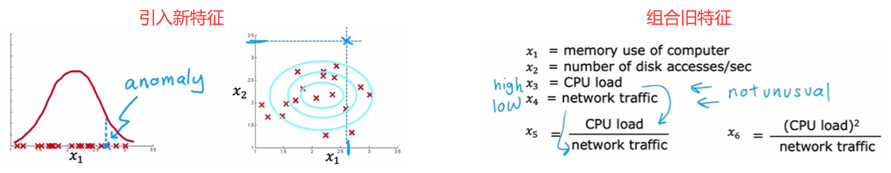

# 特征选择

## 选择恰当的特征

在“有监督学习”中，即使选取的特征没那么恰当也没关系，因为算法可以从数据集的标签中学到如何重新缩放特征。但“无监督学习”的训练集没有标签，这就意味着 相比于“有监督学习”，选择恰当的特征对于“无监督学习”来说更重要。和前面类似，改进特征的方法主要有“特征变换”、“误差分析”：

特征变换：寻找更合适的概率分布

若原始特征不是高斯分布，那显然会引入很大的误差，于是：

1. 进行特征变换(如下图)：通过数学变换将其变换成高斯分布。
2. 使用其他分布进行拟合。如下图左侧就是“对数正态分布”，其他的还有“瑞利分布”、“指数分布”等。

## 误差分析

如果在“验证集”上表现不佳，那么也可以进行“误差分析”，分析出现错误的原因，对症下药进行改进：

1. 引入新特征：比如在“金融欺诈监测”中，检查某个被遗漏的异常样本，发现指标“交易次数”略高但在正常范围内，但是打字速度非常快，那么就可以添加新的特征“打字速度”
2. 组合旧特征：比如在“服务器监测”中，检查某个被遗漏的异常样本，所有指标都在合理范围内，只是“CPU 负载”略高且“网络流量”略低，那么就可以组合这两个特征“CPU 负载/网络流量”

