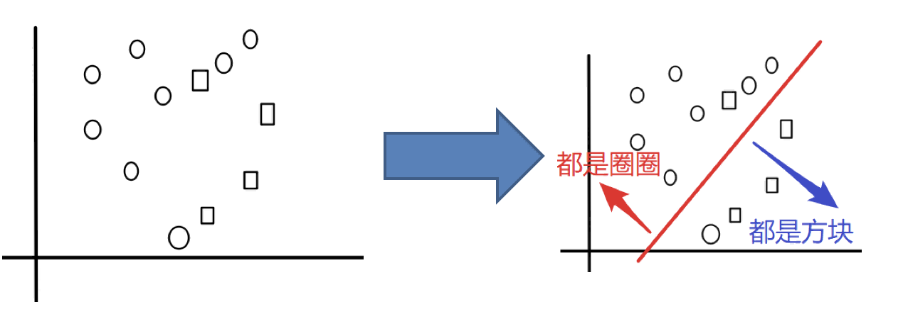
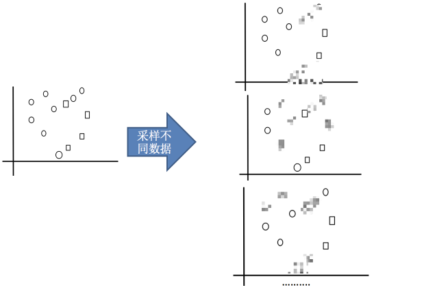
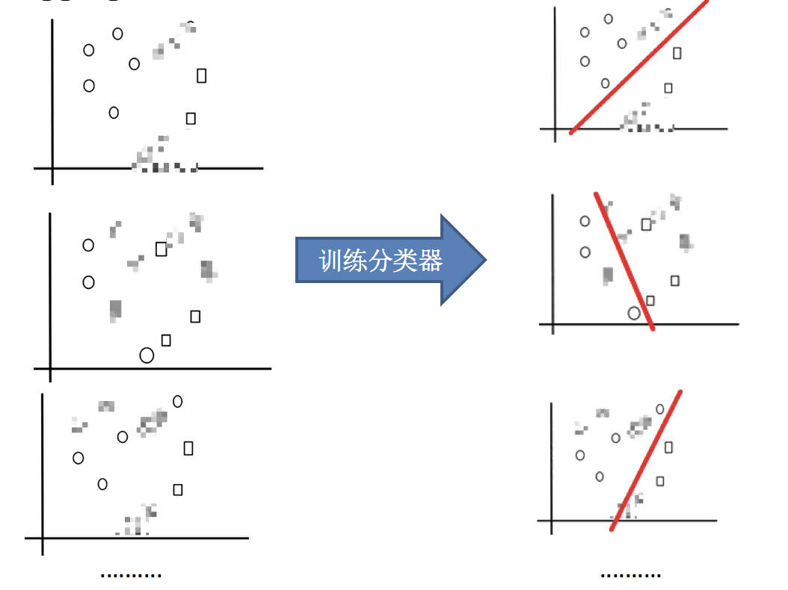
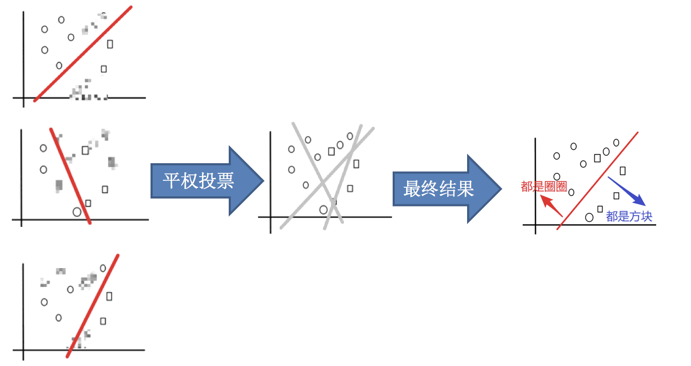
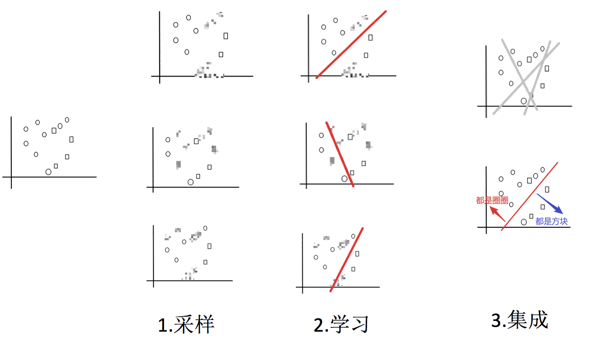
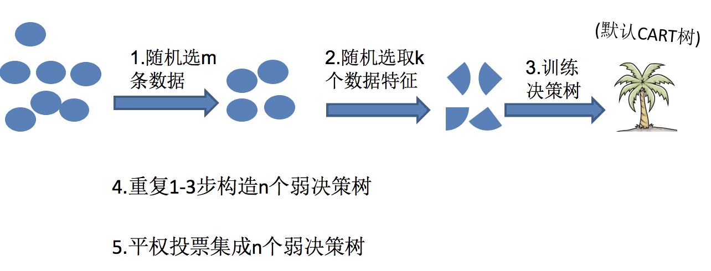

# Bagging

## Bagging 集成原理

假如，我们要把下面的圈和方块进行分类：

Bagging 集成方法的基本思路是：

1.采样不同数据集

2.训练分类器

3.平权投票，获取最终结果

合起来看就是：

这就是 Bagging 集成方法的基本思路。

## 随机森林

在机器学习中，随机森林是一个**包含多个决策树的分类器**，并且其输出的类别是由个别树输出的类别的众数而定。

**随机森林 = Bagging + 决策树**

例如, 如果你训练了 5 个树, 其中有 4 个树的结果是 True, 1 个树的结果是 False, 那么最终投票结果就是 True

随机森林够造过程中的关键步骤（M 表示特征数目）：

1. 一次随机选出一个样本，有放回的抽样，重复 N 次（有可能出现重复的样本）
2. 随机选出 m 个特征, m << M，建立决策树

> 为什么要随机抽样训练集？

如果不进行随机抽样，每棵树的训练集都一样，那么最终训练出的树分类结果也是完全一样的

> 为什么要有放回地抽样？

如果不是有放回的抽样，那么每棵树的训练样本都是不同的，都是没有交集的，这样每棵树都是“有偏的”，都是绝对“片面的”（当然这样说可能不对），也就是说每棵树训练出来都是有很大的差异的；而随机森林最后分类取决于多棵树（弱分类器）的投票表决。

## 优点

​ Bagging + 决策树/线性回归/逻辑回归/深度学习… = bagging 集成学习方法

经过上面方式组成的集成学习方法:

1. 均可在原有算法上提高约 2% 左右的泛化正确率
2. 简单, 方便, 通用
