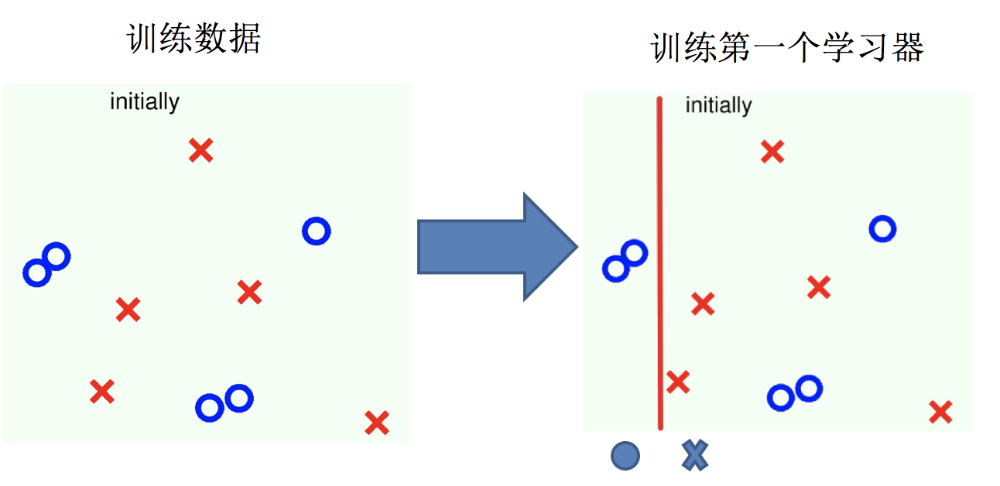
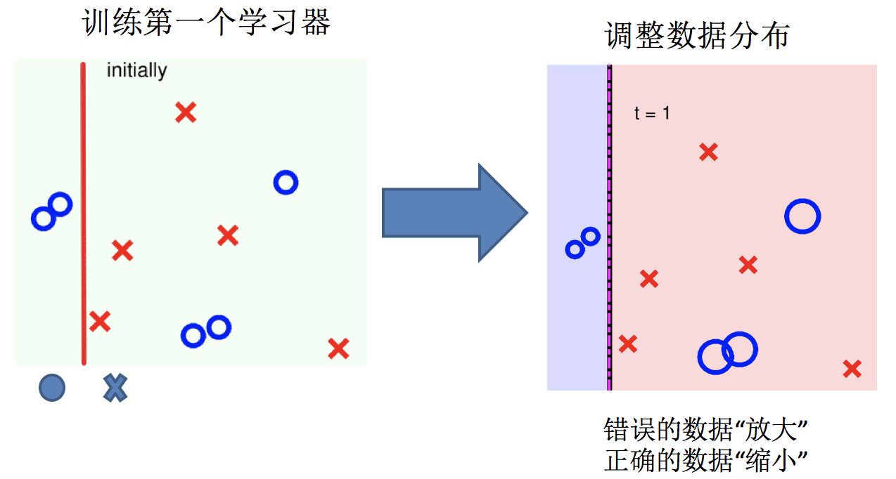
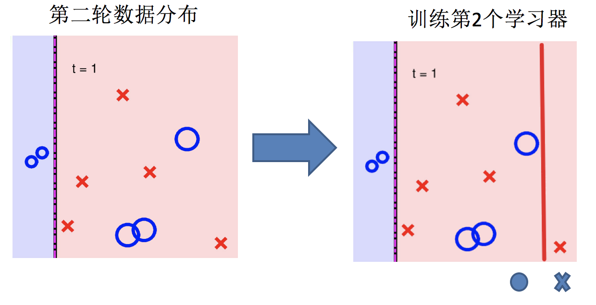
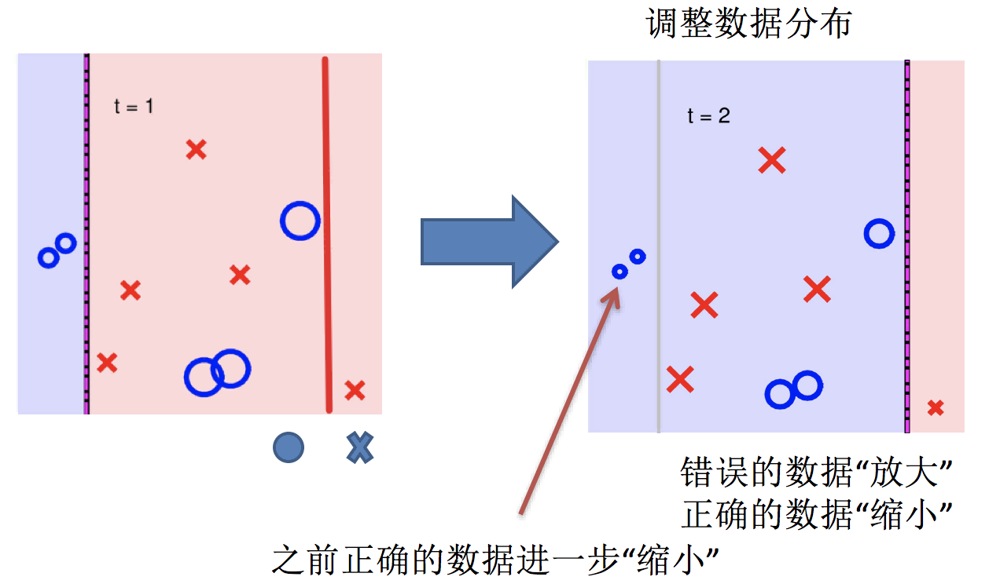
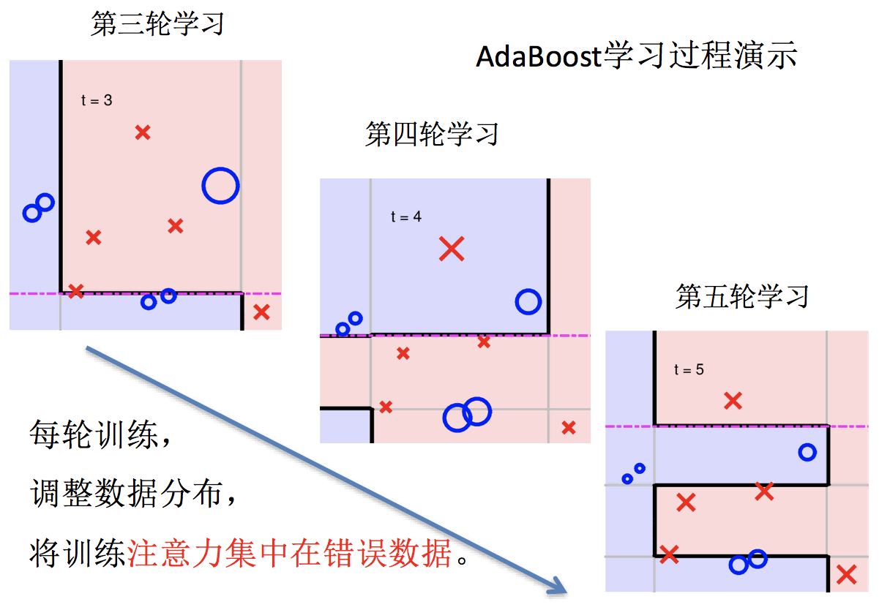
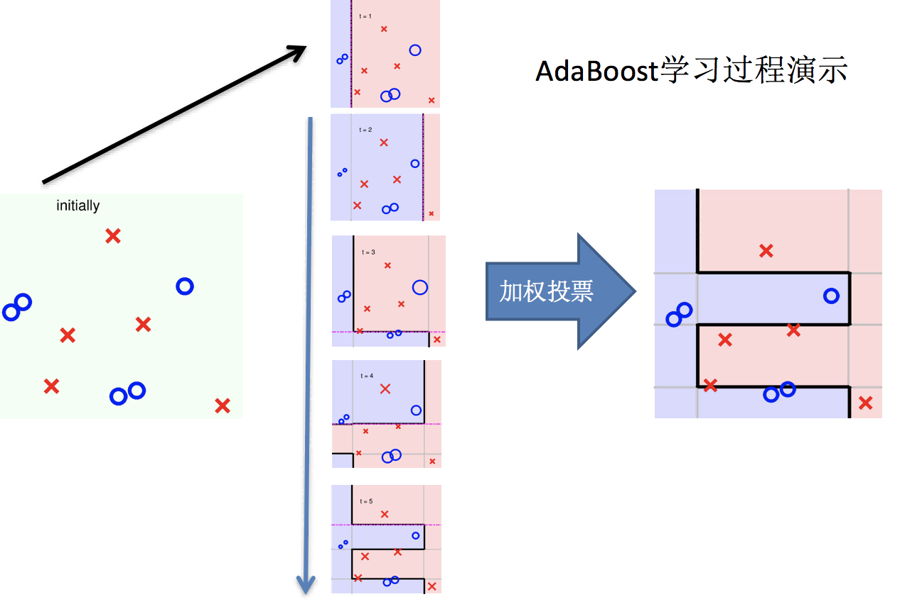
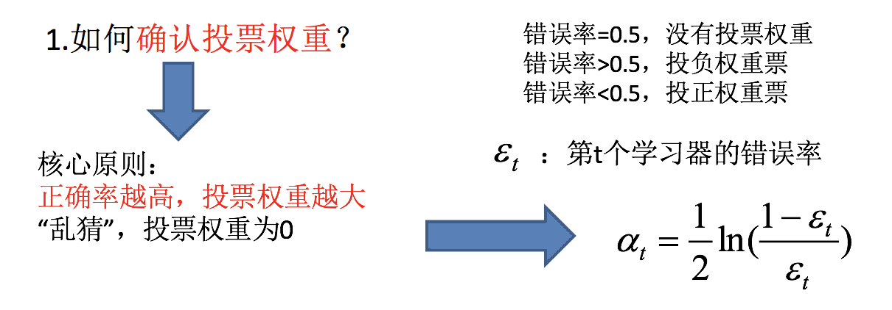
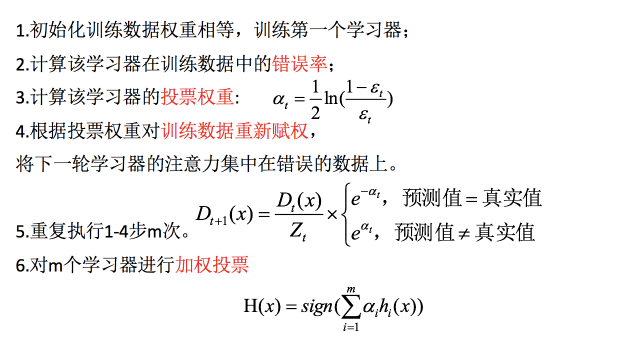
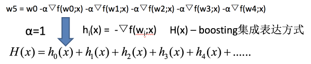

# Boosting

## 什么是 boosting

boosting 是一种集成学习方法，它通过串行训练一系列弱学习器来产生一个强学习器。每一个弱学习器都有较高的准确率，但是它们之间存在着强依赖关系，随着学习的积累从弱到强。简而言之：**每新加入一个弱学习器，整体能力就会得到提升**

代表算法：Adaboost，GBDT，XGBoost

其中，XGBoost 是目前最流行的 boosting 算法。

## 实现过程

1.训练第一个学习器

2.调整数据分布

3.训练第二个学习器

4.再次调整数据分布

5.依次训练学习器，调整数据分布

我们再来看一下整体过程：

那么如何如何确认投票权重？如何调整数据分布呢？

这就是经典的 Adaboost 算法。

## \[选读\]GBDT

梯度提升决策树(GBDT Gradient Boosting Decision Tree) 是一种迭代的决策树算法，该算法由多棵决策树组成，所有树的结论累加起来做最终答案。它在被提出之初就被认为是泛化能力(generalization)较强的算法。近些年更因为被用于搜索排序的机器学习模型而引起大家关注。

GBDT = 梯度下降 + Boosting + 决策树

GBDT 的执行流程如下：

如果上式中的 $h_i(x)$ 为决策树模型，则上式就变为:

**GBDT = 梯度下降 + Boosting + 决策树**

其思路为：

1. 使用梯度下降法优化代价函数；
2. 使用一层决策树作为弱学习器，负梯度作为目标值；
3. 利用 boosting 思想进行集成。

## \[选读\]XGBoost

**XGBoost = 二阶泰勒展开 + boosting + 决策树 + 正则化**

在各个步骤中：

- **Boosting**：XGBoost 使用 Boosting 提升思想对多个弱学习器进行迭代式学习
- **二阶泰勒展开**：每一轮学习中，XGBoost 对损失函数进行二阶泰勒展开，使用一阶和二阶梯度进行优化。
- **决策树**：在每一轮学习中，XGBoost 使用决策树算法作为弱学习进行优化。
- **正则化**：在优化过程中 XGBoost 为防止过拟合，在损失函数中加入惩罚项，限制决策树的叶子节点个数以及决策树叶子节点的值。

XGBoost 是一个开源的算法，其有一套单独的 API，在此不再展开。
