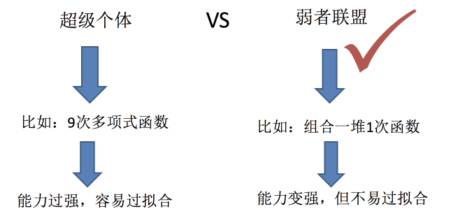
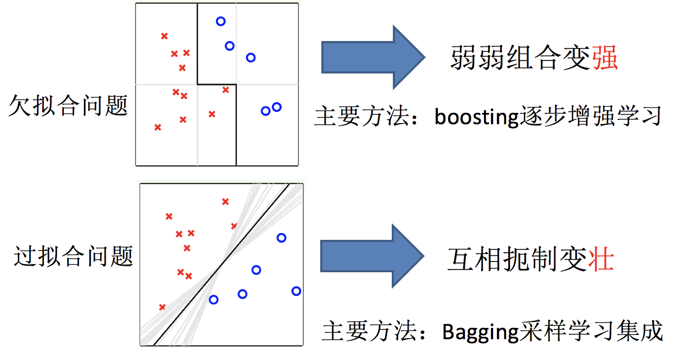

# 集成学习

集成学习是一种机器学习方法，它通过构建并结合多个学习器来完成学习任务。集成学习的目的是为了提升模型的性能，减少模型的方差，并提高模型的鲁棒性。

如今，集成学习的模式已经变得非常成熟，在很多场景下他的性能已经超过了单一学习器。特别是在各类机器学习比赛中，性能领先的队伍往往都是使用了集成学习方法。

::: tip
集成学习是一种方法，一种思路。事实上，集成学习的内容涵盖非常广泛，在本章我们只是简单介绍一下集成学习的概念。
:::

## 什么是集成学习

集成学习通过建立几个模型来解决单一预测问题。它的工作原理是生成多个分类器/模型，各自独立地学习和作出预测。**这些预测最后结合成组合预测，因此优于任何一个单分类的做出预测**，类似于多个学习其进行投票。

## boosting 与 Bagging

复习：机器学习的两个核心任务

- 任务一：如何优化训练数据 —> 主要用于解决欠拟合问题
- 任务二：如何提升泛化性能 —> 主要用于解决过拟合问题

只要单分类器的表现不太差，集成学习的结果总是要好于单分类器的
