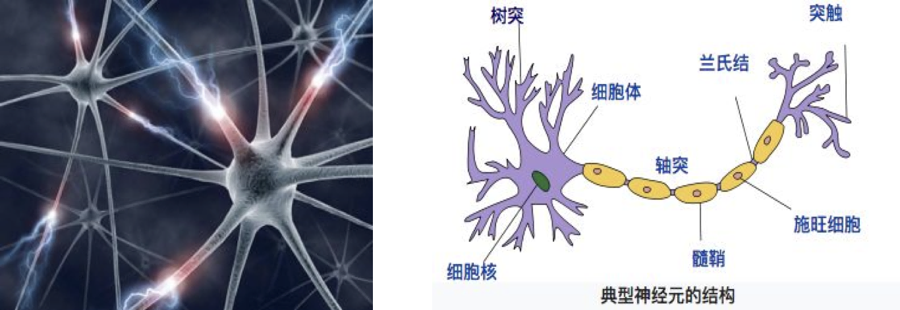
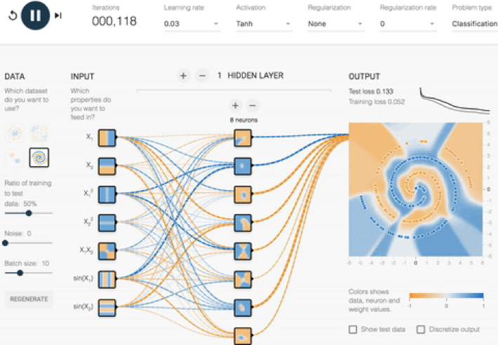
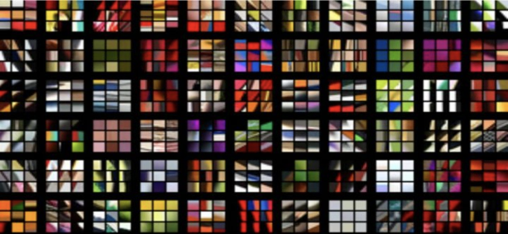
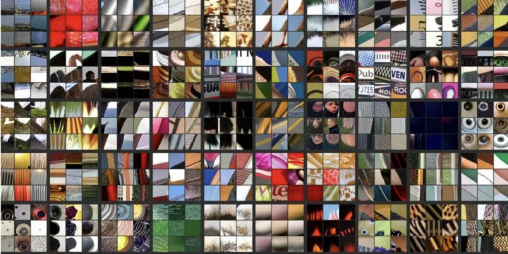
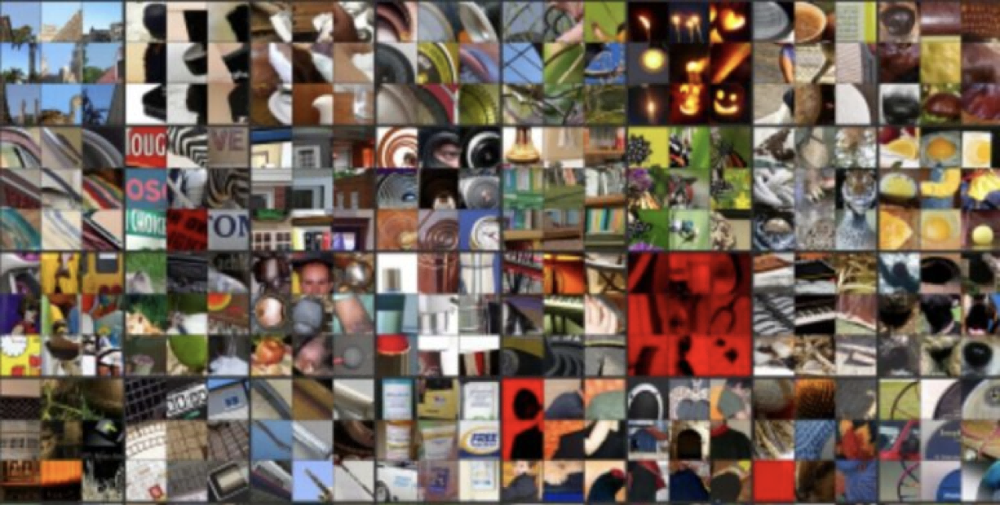
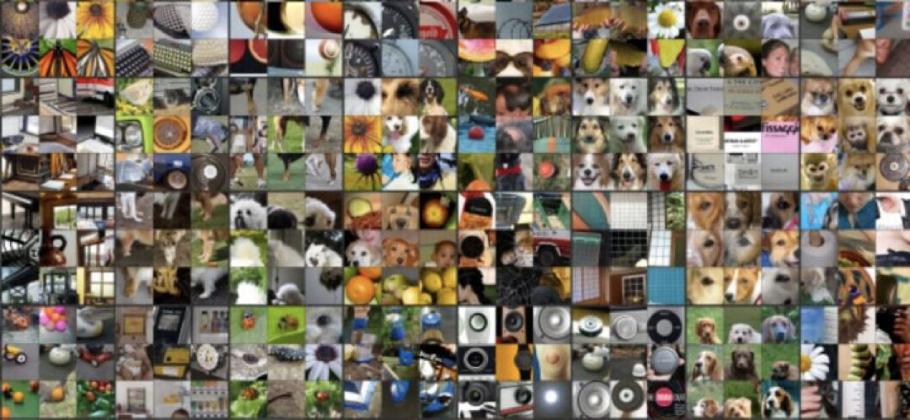
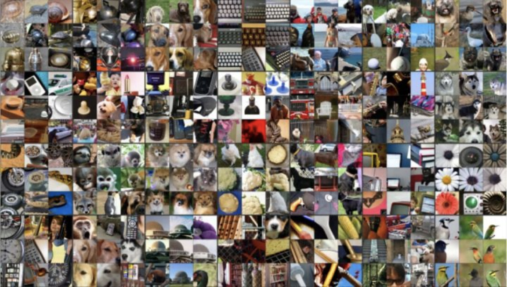

# 深度学习简介

## 深度学习 —— 神经网络简介

深度学习（Deep Learning）（也称为深度结构学习【Deep Structured Learning】、层次学习【Hierarchical Learning】或者是深度机器学习【Deep Machine Learning】）是一类算法集合，是机器学习的一个分支。

这是神经元的生物结构，神经网络就是以此为基础构建的：

深度学习方法近年来，在会话识别、图像识别和对象侦测等领域表现出了惊人的准确性。

但是，“深度学习”这个词语很古老，它在 1986 年由 Dechter 在机器学习领域提出，然后在 2000 年有 Aizenberg 等人引入到人工神经网络中。而现在，由于 Alex Krizhevsky 在 2012 年使用卷积网络结构赢得了 ImageNet 比赛之后受到大家的瞩目。

深度学习的过程看起来可能是这样的：

## 深度学习各层负责内容

经典的神经网络各层负责内容：

1 层：负责识别颜色及简单纹理

2 层：一些神经元可以识别更加细化的纹理，布纹，刻纹，叶纹等

3 层：一些神经元负责感受黑夜里的黄色烛光，高光，萤火，鸡蛋黄色等。

4 层：一些神经元识别萌狗的脸，宠物形貌，圆柱体事物，七星瓢虫等的存在。

5 层：一些神经元负责识别花，黑眼圈动物，鸟，键盘，原型屋顶等。

