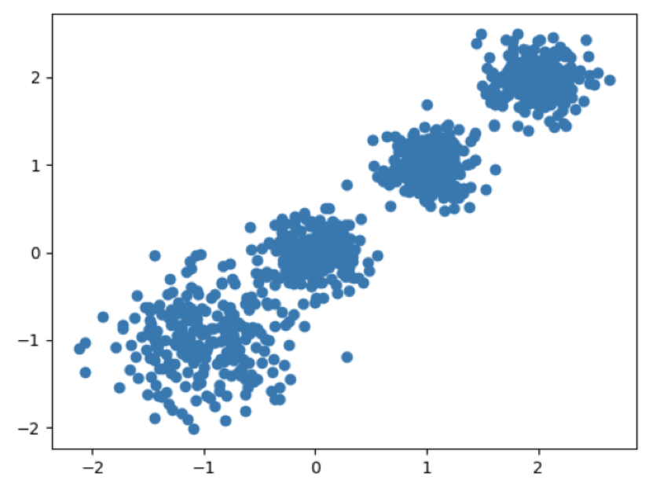
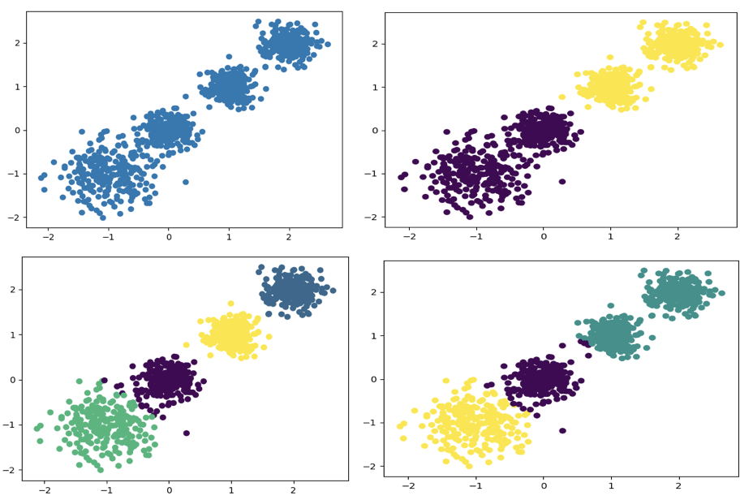

# 聚类算法 API

## API

```python
sklearn.cluster.KMeans(n_clusters=8, init='k-means++', max_iter=300, n_init=10,algorithm='auto', tol=0.0001, precompute_distances='auto',verbose=0, random_state=None, copy_x=True, n_jobs=None)
```

其中：

- `n_clusters`：指定聚类数量，默认为 8。
- `init`：初始化方法，默认为 `k-means++`。
- `max_iter`：最大迭代次数，默认为 300。
- `n_init`：初始化次数，默认为 10。
- `algorithm`：指定算法，默认为 `auto`。
- `tol`：容忍度，默认为 0.0001。
- `precompute_distances`：是否预先计算距离，默认为 `auto`。
- `verbose`：日志级别，默认为 0。
- `random_state`：随机数种子，默认为 `None`。
- `copy_x`：是否复制数据，默认为 `True`。
- `n_jobs`：并行数，默认为 `None`。

其实我们用到最多的只有 `n_clusters` 参数。

常用的方法：

- `fit(X, y=None)`：训练模型。
- `fit_predict(X, y=None)`：训练模型并返回聚类标签。
- `fit_transform(X, y=None)`：训练模型并返回聚类结果。
- `predict(X)`：预测数据属于哪个类。
- `transform(X)`：将数据转换为聚类结果。
- `score(X, y=None)`：评估模型效果。

## 案例

随机创建不同二维数据集作为训练集，并结合 k-means 算法将其聚类，你可以尝试分别聚类不同数量的簇，并观察聚类效果：



聚类参数 n_cluster 传值不同，得到的聚类结果不同：



代码如下：

```python
import matplotlib.pyplot as plt
from sklearn.datasets._samples_generator import make_blobs
from sklearn.cluster import KMeans
from sklearn.metrics import calinski_harabasz_score

# 创建数据集
# X为样本特征，Y为样本簇类别， 共1000个样本，每个样本4个特征，共4个簇，
# 簇中心在[-1,-1], [0,0],[1,1], [2,2]， 簇方差分别为[0.4, 0.2, 0.2, 0.2]
X, y = make_blobs(n_samples=1000, n_features=2, centers=[[-1, -1], [0, 0], [1, 1], [2, 2]],
                  cluster_std=[0.4, 0.2, 0.2, 0.2],
                  random_state=9)

# 数据集可视化
plt.scatter(X[:, 0], X[:, 1], marker='o')
plt.show()

y_pred = KMeans(n_clusters=2, random_state=9).fit_predict(X)
# 分别尝试n_cluses=2\3\4,然后查看聚类效果
plt.scatter(X[:, 0], X[:, 1], c=y_pred)
plt.show()

# 用Calinski-Harabasz Index评估的聚类分数
print(calinski_harabasz_score(X, y_pred))
```

某一次的输出结果（图略）：

```shell
3116.1706763322227
```
